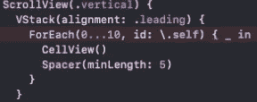
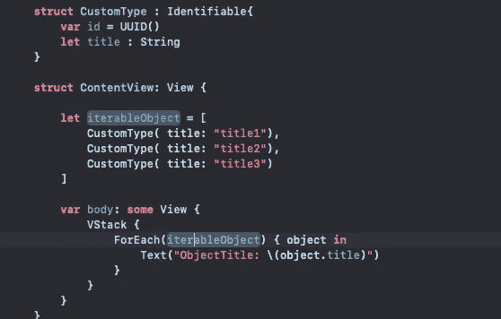

# 什么是\。SwiftUI 中 ForEach 关键路径中的 self

> 原文：<https://blog.devgenius.io/what-is-self-in-foreach-key-paths-in-swiftui-8418dbdac505?source=collection_archive---------2----------------------->

当我尝试学习 swiftui 时，我想知道什么是。在 ForEach 中自我部分。我相信很多初学者也想知道这个。所以我寻找它，并把我的发现汇集在一起。

ForEach \。自我示范

所以实际上" \ "表示关键路径。键路径引用属性本身，而不是该属性的值。那么我们如何利用这一点呢？如果我们想在多个地方引用同一个属性并决定更改它，只需在一个地方更改它。不需要实例。
那么\的作用是什么。自我在 ForEach。ForEach 处理枚举。它不像普通的那样有整数值。它有当前值，下一个值将对象保存在其中。但是我们需要识别这些对象来迭代一次。id : \。self 就是识别 iterable 对象中的每一个元素。例如，iterable 对象上的自定义类型和这个自定义类型都有 UUID() init。所以我们确定每个对象都是唯一的，我们不放 id : \。自我在我们的前方。

不带\的 ForEach 示例。自己

总之，ForEach 必须有唯一的对象来迭代。如果您的自定义类型符合可识别的协议，则不应将 id :\。自我在你的前方。

你好，如果你需要，我制作 ios 应用程序；你可以从[这里](https://apps.apple.com/developer/halis-bilal-kara/id1537304083)查看我的应用