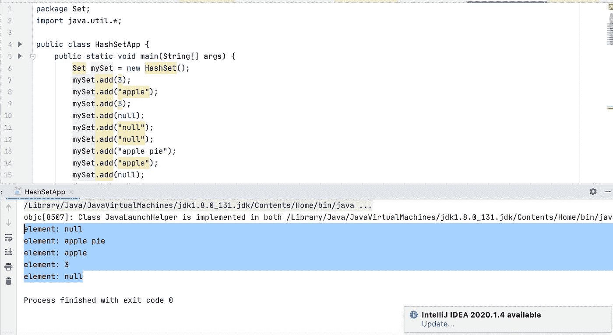

# Java 里设置的是什么？

> 原文：<https://blog.devgenius.io/what-is-set-in-java-5d8f8b6f35da?source=collection_archive---------2----------------------->

照片由[乔·格林](https://unsplash.com/@jg?utm_source=medium&utm_medium=referral)在 [Unsplash](https://unsplash.com?utm_source=medium&utm_medium=referral) 拍摄

要理解什么是集合，我们先来理解什么是集合。

集合是捆绑到一个实例中的一组元素。这可以是集合、数组列表、链接列表或映射。每一种都代表了处理所有这些元素的不同方式

集合是不能包含重复元素的集合。

嗯…那是什么意思？听起来很简单，但是从某种意义上说，所有的元素不都是独一无二的吗？

这意味着在一个集合中，在同一个集合中永远不会存在两个值。

我们以这个数组为例:[1，3，3，4，2，5]。如果我们将这个数组插入到集合中，集合将包含[1，3，4，2，5]作为它的值。

以下是如何实例化和迭代集合以获取其所有值的示例:

请注意这里的一些有趣的事情:

*   我将 mySet 实例化为 HashSet，而不是常规集。
*   我在集合中添加了两次 null 字符串和 null 本身。

首先，set 是一个接口，因此不能直接实例化。您必须将它实例化为 HashSet 或 LinkedHashSet，一个集合的有序和无序版本。我稍后会谈到两者的不同之处。

现在谈第二点。注意，我两次将 null 作为字符串添加，并且两次添加了 null 值本身。实际上，值 null 和字符串 null 将在集合中出现一次:

如果您还记得，我确实提到过 HashSet 是无序的。这到底意味着什么？

这意味着我添加项目的顺序不会被持久化。

当我创建迭代器来遍历上面的条目时，条目没有按照我们添加的顺序被访问或打印(我们添加 3，然后是“apple”，但实际上我们得到的是 null，然后是“apple pie”)。

如果不是实例化一个 hashset，而是将 mySet 设置为一个新的 LinkedHashSet 实例，迭代顺序将改为如下:3，apple，null 作为值，null 作为字符串，然后是 apple pie。它被输入到 LinkedHashSet 中的顺序将被保持。

这就是集合的基本内容，但我还想介绍一些其他内容:如何将集合转换为列表，以及如何将列表转换为集合，反之亦然？

以下是如何将集合转换为列表，反之亦然:

如有任何问题或意见，请在下方评论。

编码快乐！