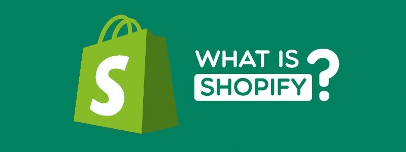
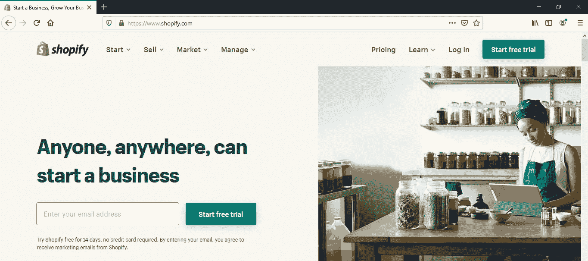
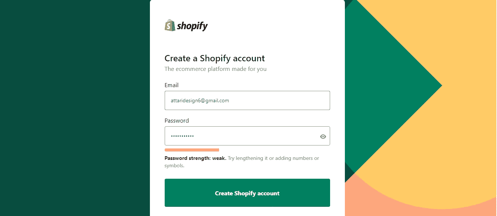
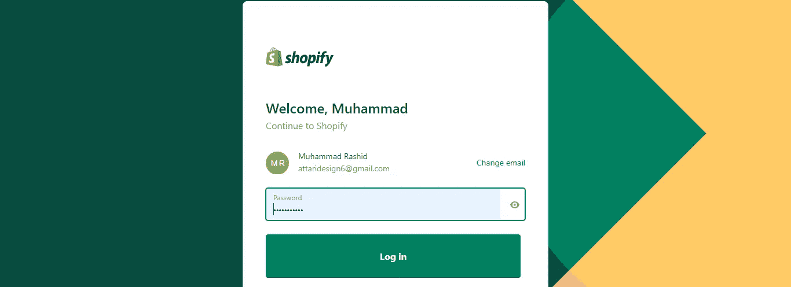
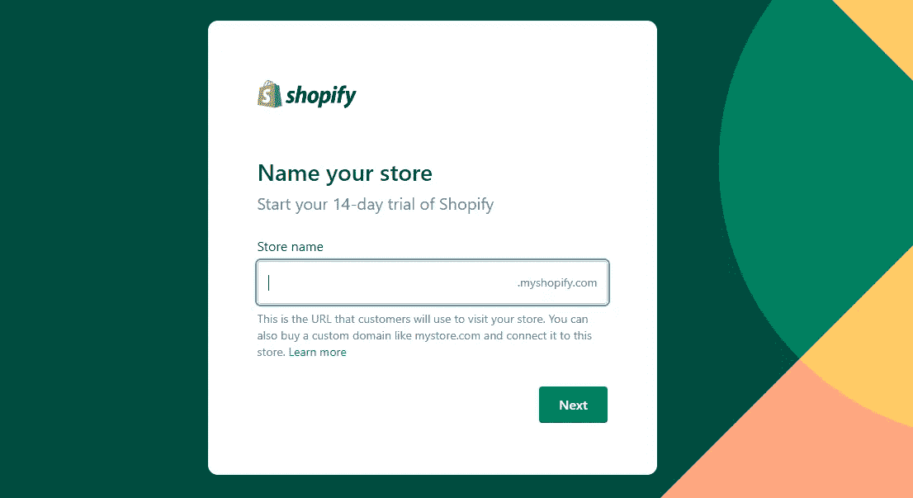
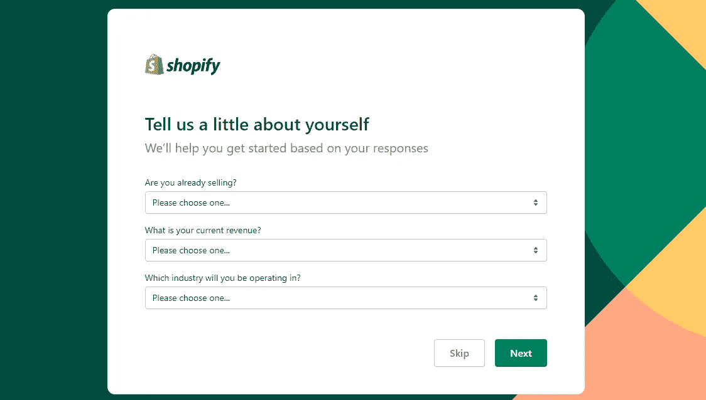
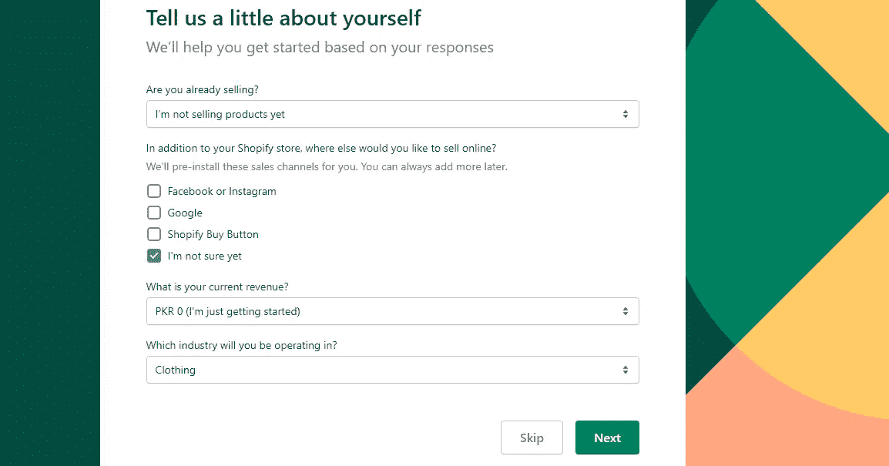
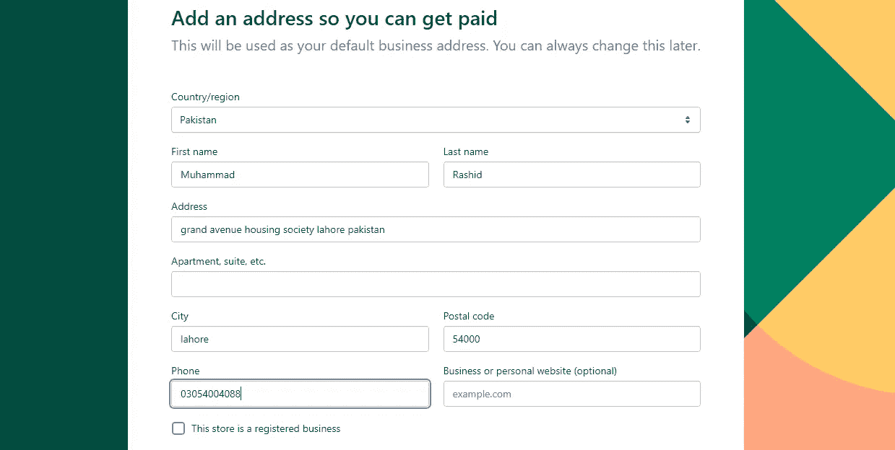
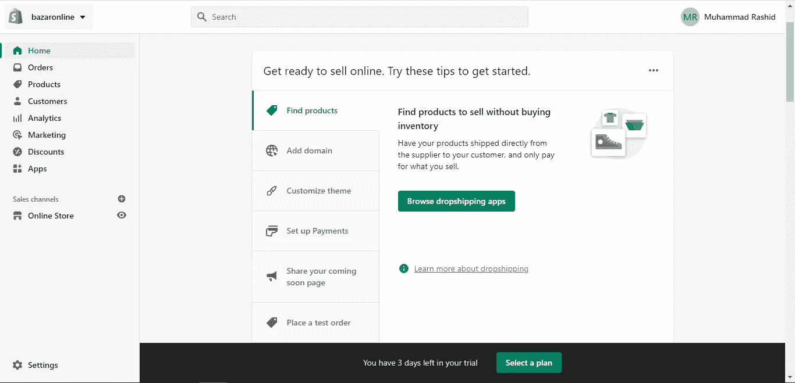

# 什么是 Shopify？如何开始在 Shopify 上销售(2022)

> 原文：<https://blog.devgenius.io/what-is-shopify-how-to-start-selling-on-shopify-2022-f9486df227d7?source=collection_archive---------6----------------------->

Shopify 是一个基于订阅的软件，允许任何人建立网上商店并销售他们的产品。Shopify 店主还可以使用我们的销售点应用程序 **Shopify POS** 和配套硬件在实体场所销售。如果你是一个在线和实体的 Shopify 商家，你的库存和存货会同步，所以你可以在任何设备上通过一个帐户管理你的商店。

# Shopify 多少钱？

*   **Shopify Lite:**$ 9/月，包含 Shopify **购买按钮**，非在线商店建设者
*   **基本 Shopify:**$ 29/月，包括购买按钮、当面销售和拥有两个员工账户的在线商店，最多四个库存地点(当面商店、仓库等。)
*   **Shopify:**$ 79/月，包括所有销售渠道、五个员工账户、最多五个库存地点、折扣信用卡利率和折扣交易费
*   **Advanced Shopify:**$ 299/月，包括所有销售渠道、15 个员工账户、多达 8 个库存点、进一步打折的信用卡和交易费、关税和进口托收、定制国际产品定价/变体
*   **Shopify Plus:** 询问定价

# **什么是 Shopify Lite？**

Shopify Lite 是一项负担得起的计划，允许您在现有网站上销售产品。如果你有一个不在 Shopify 上托管的网站，在没有 Shopify 托管的情况下，使用购买按钮进行销售。您还可以使用 Messenger 聊天，在线和离线销售，并发送 9 美元计划的发票。

# 什么是 Shopify Plus？

Shopify Plus 是 Shopify 的企业电子商务平台，面向大型企业或希望扩大规模的企业。它提供了高级报告功能、更高优先级的客户支持、处理更大订单量的能力等等。

# 我可以在 Shopify 上卖什么？

Shopify 的用户几乎可以销售任何实体产品、数码产品或直运产品。Shopify 的商家出售各种各样的产品，包括:

手工艺品

美容用品

家居用品

户外装备

衣服

数码产品

在线课程

事件

礼品卡

电子书

使用 Shopify 只有硬性规定。你不能卖任何非法的东西。你也不能出售电子商务平台禁止的任何东西，包括:酒精、烟草和电子烟、烟花、毒品、视频游戏货币或信用、枪支和武器。

此排除产品列表可能会发生变化。例如，在过去一年中，更新了关于生物多样性产品的政策，Shopify 现在允许销售合法提取自大麻的生物多样性产品。

在开始建立您的 Shopify 商店之前，请查看有关限制的最新消息。

# **我不能在 Shopify 上销售什么？**

Shopify 不适用于某些类型的企业，例如:

投资、信贷、货币或法律服务。

虚拟货币服务。

成人内容。

赌博。

吸毒用具。

精神服务。

旅游服务。

电话服务。

延长保修。

多层次营销。

做出未经证实的健康声明的产品。

大麻、烟草、电子烟和网上药店。

烟花。

# Shopify 是如何工作的？

Shopify 的工作原理是将所有的商务活动统一到一个中央指挥中心。如果你是一个在线和实体的 Shopify 商家，你的库存和存货会同步，所以你可以在任何设备上通过一个帐户管理你的商店。

通过 Shopify，商家可以建立和定制在线商店，并在多个地方销售，包括网络、移动、社交媒体、在线市场、实体商店和弹出式商店。Shopify 还具有管理产品、库存、支付和运输的功能。

Shopify 完全基于云并托管，这意味着您可以从任何连接的兼容设备访问它，我们将为您处理软件和服务器升级和维护。这为您提供了从任何有互联网连接的地方访问和运营业务的灵活性。

# 如何安装 Shopify

**第一步:注册一个 Shopify 账户**

第一部分不会花很长时间，但填写所有正确的信息并告诉 Shopify 你的新业务是非常重要的。通过这种方式，Shopify 能够定制您的界面，并在您前进的过程中让您的体验更加轻松。

首先进入 [Shopify](https://ecommerce-platforms.com/go/TryShopify) 主页。单击开始免费试用按钮。这要求您键入您的电子邮件地址。所有的 Shopify 计划都有 [14 天的免费试用期](https://ecommerce-platforms.com/go/TryShopify)，你可以在不输入信用卡号码的情况下体验这个界面。

下一页要求您输入您的电子邮件地址、密码和商店名称。使用你想与商店关联的任何电子邮件地址，然后创建一个强密码登录，但也保护它免受黑客攻击。商店名称以后可以更改，但它会添加到您的临时域名中，因此您可能希望尽可能接近最终的商店名称。

点击“创建商店”按钮继续。

现在决定你的商店名称

现在填写一些基本信息

填充信息

添加您的个人信息

现在，您将进入 Shopify 仪表盘。它有一个时尚和现代的界面，在左侧菜单上有你需要的大多数功能。一些菜单项包括订单、产品、客户和分析。请随意点击这些项目，定制您的商店并激活活动。

您可以在免费试用中获得 Shopify 提供的大多数功能。但是，除非您选择付款计划，否则您将无法处理付款或让没有密码的人访问您的网站。我们建议在购买产品之前，先测试一下你的网站的设计特点和大部分结构。但是，当您准备启动时,“选择计划”按钮总是在那里。

在我们建商店之前。我们必须了解我们商店的基本设置让我们开始总测试，我们的商店**在线集市**