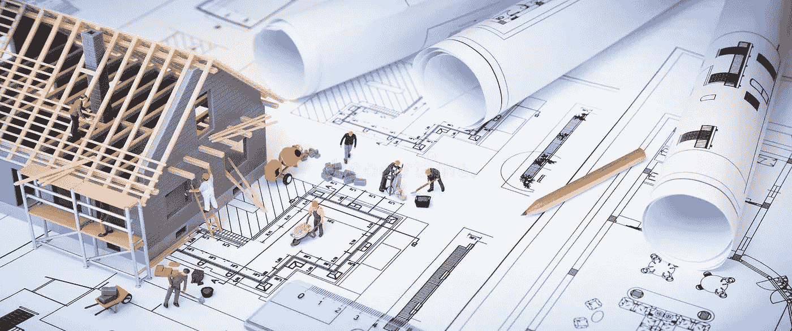

# “用简单的英语说”什么是现场可靠性工程

> 原文：<https://blog.devgenius.io/what-is-site-reliability-engineering-in-simple-english-3d7164b82b6b?source=collection_archive---------0----------------------->

> **SRE 现场可靠性工程简介**

因此，在我们给出术语定义和解释之前，我希望大家花点时间做以下事情:

> 把它想象成建筑——想象一个 IT 团队正在建造一个应用程序、软件、IT 平台、服务等等。同样的方式，一个建筑团队将建造一所房子，一栋大楼，一个社区，摩天大楼，或一个全新的城市。

现在，请记住这一点，为了本文的目的，请记住这个类比，因为我们将探索这个类比的不同方面。当我想到这一点时，我非常着迷，它的结构是如此惊人的相似。

图片来源:【pschwabe.com 

所以当想到一个建设项目的时候；可以肯定地说， ***基础设施和架构*** 的复杂性取决于我们正在构建的东西。规划、财务、团队、预算、时间安排、资源、维护等需要投入多少，将因项目而异。想想在一个新社区建造一栋两居室的独栋房屋——豪宅——公寓——住宅项目——10 个仓库——哈利法塔——建造一座全新的城市需要多少钱。

现在，从团队的角度来看，您有不同的构建方面，需要不同的技能集或专业领域。建筑工地上的许多角色包括:

*   施工经理—建筑师—内部和外部设计师—工程师—油漆工—管道工—建筑工人—电工—等等。

图片来源:[dreamstime.com](https://www.dreamstime.com/stock-photo-house-under-construction-blueprints-building-project-image53360048)

IT 团队与施工团队有着非常相似的设置，甚至对他们的角色使用了相似的术语，例如:

*   IT 经理—架构师—图形设计师—软件工程师—前端、后端或全栈开发人员—程序员—系统管理员和工程师—数据库管理员—云架构师— DevOps 工程师—等等。

# **IT 基础设施**

IT 基础设施可以简单地定义为整个组织共享的所有硬件系统、软件、设施、网络资源和服务，以支持业务系统和其他 IT 支持流程的交付。

> **以同样的方式或在建筑基础设施和架构的相同上下文中思考 IT 基础设施和架构。**

*   当我们开始构建复杂的 IT 基础架构和软件应用程序时，我们需要一种快速构建这些基础架构的方法，因此我们提出了各种编程语言、框架和新技术，如通向数据中心的虚拟化。
*   — ***云只是根据需要从互联网访问其他人的数据中心*** —在那里我们有实际的物理硬件，所有的虚拟资源都在其中运行。
*   虚拟化也有其自身的局限性，因此我们提出了容器化、流程编排、配置管理、供应、监控、基础架构即代码等。
*   还有工具，很多很多！！

图片来源:【levanture.com/Infrastructure-Services 

简而言之，你可以阅读更多关于 IT 基础设施发展的五个阶段:大型机时代、个人电脑时代、客户机/服务器时代、企业计算时代以及云和移动计算时代。—来源: [wps.pearsoned.ca](https://wps.pearsoned.ca/ca_ph_laudon_MIS_6/230/58989/15101282.cw/content/index.html)

# ***角色&团队***

为了能够正确地管理和维护 IT 基础架构，IT 组织中需要具有特定专业领域和技能集的不同团队和角色。

> **开发团队**

这个团队负责构建应用程序，并负责 IT 基础设施的软件方面。这个团队中有许多角色，如软件开发人员、软件工程师、前端-后端-全栈开发人员、UX 和 UI 设计师等。大多数(如果不是全部的话)开发团队可能在[敏捷软件开发方法](https://softwarehut.com/blog/it-project-management/introduction-to-agile-software-development-methodology)环境中工作。

> **作业团队**

运营团队负责设计和构建基础设施的其他方面，如架构、网络、设置硬件、安全、工程、IT 支持等。然而，有些组织会将 ***安全*** 归入 ***工程*** 或成为自己的团队，反之亦然。这同样适用于 IT 支持和架构。这在大多数组织中也可以是他们自己的团队。

其中的一些常见角色包括网络管理员、系统工程师、架构师、云架构师、应用和系统分析师、数据库管理员、系统工程师、开发运维工程师等。

> **工程团队**

在软件开发中，工程团队是负责给定产品或服务的实际生产和构建的一组开发人员和管理人员。他们执行所有的冲刺，并致力于新的或必要的功能、更新和修复。根据工程团队的结构和具体需求，在工程团队中有几种不同类型和级别的团队领导和管理角色。——来源:[pagerduty.com](https://www.pagerduty.com/resources/learn/how-to-build-an-engineering-team/)

所有这些角色都需要计算机科学、IT 和工程、管理以及其他专业高技能方面的优秀知识。举例来说，以下是承担开发运维工程师角色的 IT 专业人员应具备的技能和专业领域:

**想了解更多关于其他 IT 专业人士技能路线图的信息，请点击** [**roadmap.sh**](https://roadmap.sh/)

# SRE 可靠性工程简介

现在，用我们的比喻来说，为一家餐馆或花店建立一个网站就像建造一所房子——建造一个像网飞或脸书这样的应用程序就像建造迪拜塔或雅加达标志塔；这是一个非常复杂的系统，有太多的部分 ***相互连接，必须完全按照预期工作*** 才能让应用程序正常工作并提供更好的用户体验。

简而言之，企业级软件需要投入大量资金，就像建造摩天大楼需要投入大量资金一样。让我们以大多数人日常使用的东西为例，网飞:

图片来源:[nextbridge.com/technology-stack](https://nextbridge.com/technology-stack-of-billion-dollar-companies/)

> 网飞已经将其所有后端迁移到亚马逊网络服务(AWS)提供的云服务，并使用:
> 
> 用于内容存储的 S3—用于内部认证/授权的 IAM 用于数据流的 Kinesis 和 Kafka 用于内容缓存/交付的 CloudFront 用于视频转码的 AWS 弹性转码器—用于托管的 EC2 用于无服务器功能和状态机的 Lambda 用于数据存储的几种类型的 NoSQL 数据库—用于数据聚合和仓储的 Hadoop 用于任务和项目管理的吉拉—用于文档管理的 Confluence 用于构建和部署管道的 Jenkins 其他第三方技术。

管理这些高度复杂的 IT 基础架构非常具有挑战性，也非常重要。

软件应用程序的中断会对公司和用户体验造成巨大的负面影响；至少可以说，能够维持所有这些技术堆栈的正常运行时间是一项挑战，需要大量的知识、技能和专业领域。因此，我们必须采用不同的 it 运营方法。这就是 ***站点可靠性工程——SRE***的用武之地。

## 什么是 SRE？

本·特雷诺·斯洛斯在[谷歌](https://en.wikipedia.org/wiki/Google)开创了网站可靠性工程领域。在 2003 年起源于谷歌之后，SRE 概念在 2010 年传播开来，并在更广泛的软件开发和 IT 行业中流行起来。其他公司随后开始雇佣现场可靠性工程师。到 2016 年，谷歌雇佣了超过 1000 名网站可靠性工程师。

**这张图表很好地概括了 SRE**

SRE 正好处于 IT 运营、软件开发和工程的十字路口。它填补了与集成、系统工程、测试和开发运维工程相关的一些空白。

大多数人会把德沃普斯和 SRE 搞混——简单地说，他们相似但不相同:

*DevOps 工程师是专注于 Ops 的工程师，解决开发问题；站点可靠性工程师是* ***专注于开发的工程师，他们使用软件开发、DevOps 和工程实践来解决 IT 运营/可伸缩性/可靠性问题。*** 你可以在这篇发表在[***space lift . io***](https://spacelift.io/blog/sre-vs-devops)上的文章中找到关于 DevOps 和 SREs 之间的关键差异的更详细全面的概述

> 有人可能会说——但是为什么是 SRE 呢？

回到我们的构建类比，现在想一想，如果您在每个构建步骤、阶段或阶段进行所有检查和安全检查，而不是在所有工作完成之后(在软件开发中)，这将是不同的事情，这就是我们所说的 [*DevSecOps*](/devsecops-using-gitlab-secure-6cc9bd736d40) 。

DevSecOps 包括将 IT 安全实践集成到应用程序的整个生命周期中。简而言之，这意味着从一开始就考虑应用程序和基础设施的安全性。而不是在开发的最后阶段孤立安全团队的角色。安全性被认为是一项从始至终都需要整合的共同责任。

现在使用我们的构建类比，想象创建一个团队，该团队对所有事物是如何构建的，所有部分是如何相互连接的有一个整体的坚实的理解。该团队还拥有出色的知识，能够管理、维护、确保基础架构的所有不同功能和架构的所有方面都按照预期的方式工作，也就是说，这些东西是**——在 it 中，这就是 SRE 团队***为 IT 基础架构* ***所做的事情。*****

> **站点可靠性工程是一套原则和实践，它结合了软件工程的各个方面，并将它们应用于基础设施和操作问题。主要目标是创建可伸缩和高度可靠的软件系统。—来源:[维基百科](https://en.wikipedia.org/wiki/Site_reliability_engineering)**

**如果有什么不同的话，你为什么需要 SRE 的主要原因是 SRE 的角色和职责对你组织中的人员、流程和技术的持续改进至关重要。如果你想获得更多关于 DevOps 和 SRE 团队解决的问题以及两个团队使用的工具的见解和背景；你可能有兴趣看看这个关于 [SRE vs. DevOps 的帖子:他们有什么不同](https://spacelift.io/blog/sre-vs-devops)。**

> **如果你喜欢这篇文章，你可能也会喜欢“ [***什么是 DevOps？用简单的英语***](https://yannmjl.medium.com/what-is-devops-in-simple-english-6550fbb129bd)**

> ***干杯！！***