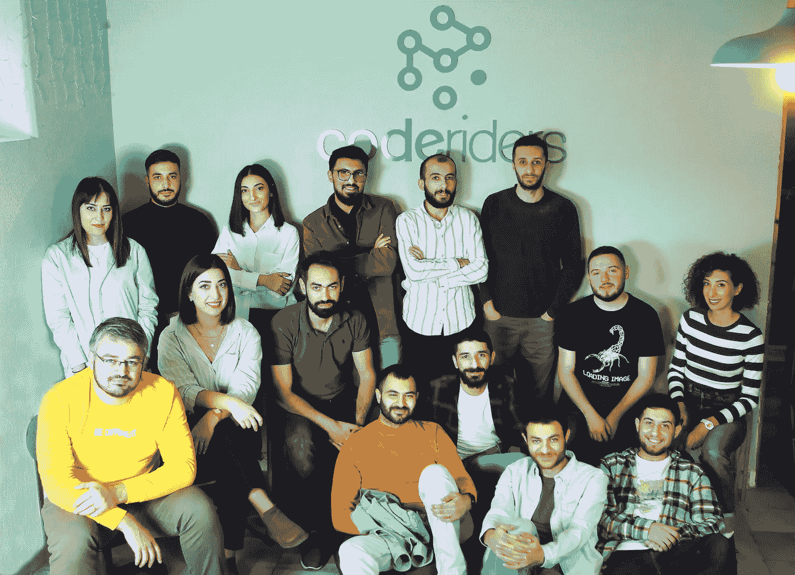

# 什么是软件开发生命周期？阶段和重要性

> 原文：<https://blog.devgenius.io/what-is-software-development-lifecycle-stages-importance-34809c75b48a?source=collection_archive---------9----------------------->

全球企业雇佣远程软件工程师或软件外包公司的关键驱动因素是什么？

降低[定制软件开发成本](https://www.coderiders.am/blog/how-to-calculate-best-software-development-cost-coderiders)，

获得世界一流的能力和[软件开发服务](https://www.coderiders.am/services)，

节省远程软件开发人员招聘过程的时间和金钱，

节省管理内部软件开发团队的时间和金钱，

增加扩展项目的灵活性，

扩展的软件开发生命周期(SDLC)。

与软件开发团队合作不需要成为一个技术人员。然而，我们建议在与软件公司合作之前，对软件开发过程或软件开发生命周期有所了解。作为一家在国际 IT 市场运营了 9 年的软件外包公司，我们决定分享一个有益的软件外包流程是如何工作的。

**什么是 SDLC？**

SDLC(软件开发生命周期)是公司如何构建软件解决方案的结构和逐步指南。它将软件开发过程分解成一些小的阶段。

在 [CodeRiders](https://www.coderiders.am/) ，我们与处于 SDLC 不同阶段的公司合作，例如，我们的客户希望:

从头开始构建软件，

要继续向现有软件添加新功能，

为了完成特定的软件开发服务，

为了维护他们软件的支持，

重建不成功的软件项目等。

因此，软件开发伙伴关系高度依赖于特定的情况。对完整的 SDLC 有一个基本的了解可以确保与您的软件供应商进行清晰透明的沟通，并加快软件开发过程。

**SDLC 的主要阶段有哪些？**

**#1 规划**

这是软件外包过程的基本阶段。规划阶段应明确定义工作范围和项目目标。

这个阶段通常是与软件供应商的“预联系”阶段。在这个阶段，你应该首先弄清楚你想要什么，然后描绘出你能做这项工作的顶级软件开发公司。建议您准备一份软件需求列表，与您的技术合作伙伴分享。

顶级软件开发公司如果至少有一些关于问题的基本信息，就会给出估计或解决方案。我们 CodeRiders 用一个真实的例子编写了一个简单易用的 SOW 文档指南。你可以在下面免费下载。

 [## 如何撰写可靠的工作范围| code riders 白皮书

### 里面是什么？

www.coderiders.am](https://www.coderiders.am/white-papers/how-to-write-a-solid-scope-of-work) 

在弄清楚你的目的和期望后，你继续:

识别和收集你当前的问题，

发现目标市场和顾客的期望，

定义你想在你的定制软件开发项目中包括谁(后端，前端，全栈远程软件工程师，UI/UX 设计师，项目经理，产品经理，QA 专家)。

识别[员工的层级结构](https://www.coderiders.am/blog/top-5-organizational-structures-of-software-firms-pros-and-cons)和职责，

定义你的[大概预算](https://www.coderiders.am/blog/4-simple-software-development-pricing-models-worth-knowing)。

**第二阶段设计和原型制作**

这个阶段模拟软件应用程序将如何工作。设计和原型制作阶段包括:

软件架构:这是一个系统的组织。在这一阶段，无论有没有软件供应商的帮助，企业都要选择技术堆栈、项目的总体设计概念、最佳实践、模板的使用、用于设计软件的原则、它们运行的环境等。

**用户界面(UI)** : UI 显示客户与软件的交互以及软件的反应。UI 包括显示屏、键盘和桌面外观。

**操作系统或平台**:这些是特定应用程序运行的地方，例如，Android、iOS、Linux、Windows，可能还有游戏机等。

**编程**:这不仅包括特定软件的技术堆栈，还包括解决问题的方法(如有必要)和应用特性。

**通信**:这定义了软件与其他资产的通信方法，例如，中央服务器或应用程序的其他实例。

**安全和控制**:安全定义了软件工程师采取什么措施来保护应用程序。它通常包括 SSL 流量加密和安全数据存储。

原型从研究和头脑风暴转移到行动。在软件文档和设计阶段，公司开始写下他们对软件外包合作伙伴的需求和期望。

公司记录他们需要什么，并开始寻找合适的候选人来完成他们的项目。

CodeRiders 是一个软件开发团队，提供软件开发和设计解决方案

例如，一个运输和物流组织可能需要一个 PHP 开发公司来构建软件，该软件将:

加速和促进员工和合作伙伴之间的沟通过程，

包括用于客户的跟踪平台，在该平台上他们将看到关于装运的更新信息，

拥有一个私人的 CRM 和库存管理系统，供员工联系客户和来自不同部门的同事，

拥有一个在线支付平台。

在这个阶段，一家公司将所有需求归档在一个文档中，并开始寻找提供类似软件开发服务的软件供应商。寻找合格的供应商是另一个重要的话题。为了选择最合适的软件开发合作伙伴，公司有时会写下最重要的问题来询问软件公司。如果你对如何找到一个合格的软件外包公司更感兴趣，你可以查看我们的文章[这里](https://www.coderiders.am/blog/where-and-how-to-find-high-quality-software-vendor)。

咨询潜在的软件开发团队并交换意见在这个阶段是非常有用的。来回磋商是成功沟通的一扇敞开的窗户。例如，一家物流公司可能会向其潜在的软件供应商咨询技术堆栈和所需的专业人员。

在 CodeRiders，我们确保在开始实际的[软件开发过程](https://www.coderiders.am/software-development-process)之前，一切都很清楚。如果需要，我们可以坐下来进行长时间的视频通话，或者通过电子邮件保持联系。这取决于客户需要多少帮助。如果软件外包伙伴关系对客户来说是新事物，我们确保他们理解这种合作模式的所有核心价值和细节。例如，如果客户不知道选择哪种技术组合，我们会继续进行详细的对话，了解他们的需求，并相应地提供技术组合。如果客户的要求与我们的能力和技术不匹配，我们会通知他们，并停止项目。

**第三阶段编码和实现**

在就软件开发过程中涉及的资源、时间和成本估计以及软件开发约定模型达成一致后，双方最终开始编码和实现过程。这个阶段的主要焦点是保持清晰透明的沟通，交付高质量的软件解决方案和成功的软件实现。编码和实现阶段是整个协议中最长的阶段，因为这是构建实际软件的阶段。

在 CodeRiders，我们的首要任务是不浪费时间地交付清晰的代码。比如，虽然我们所有的[软件工程师](https://www.coderiders.am/company-why-us)都能自如地用英语交流，但我们特别关注那些没有项目经理的项目。对于这样的项目，我们选择那些英语最流利的软件工程师。

在 CodeRiders 的博客上查看 SDLC 的其他两个阶段。单击下面的链接:

 [## 什么是软件开发生命周期？阶段和重要性

### 访问世界一流的功能和软件开发服务，不需要成为技术人员…

www.coderiders.am](https://www.coderiders.am/blog/what-is-software-development-lifecycle-stages-and-importance) 

现在请留言。

 [## 定制软件开发公司博客| CodeRiders

### CodeRiders 软件公司 2021 年的 15 大成就距离 2021 年正式关闭还有几天，而…

www.coderiders.am](https://www.coderiders.am/blog)