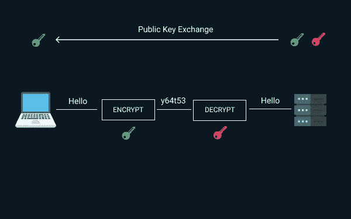

# 什么是 SSL 证书:这里是初学者指南

> 原文：<https://blog.devgenius.io/what-is-ssl-certificate-here-is-the-beginners-guide-55d5d0094019?source=collection_archive---------7----------------------->

SSL 证书

我需要 SSL 证书吗？

这是每个网站所有者都会想到的一个常见问题。但是，每个网站所有者都需要 SSL 证书吗？

一切都始于 2018 年 7 月，谷歌 Chrome 开始将非 SSL 网站标记为不安全。大约 43 %- 62%的互联网流量通过谷歌 Chrome ,这一标记网站的步骤被认为是网络安全的必要推动。

谷歌认为拥有 SSL 证书或 HTTPS 应该是网站的默认设置，因此它也删除了 SSL 网站的安全标签。

HTTPS 是一个网址，表示可以安全浏览的网站。此外，没有 HTTPS 的网站可能会遇到黑客窃听等问题，黑客可以拦截网站与其用户之间的通信。因此，将非 SSL 网站标记为不安全的步骤是有意义的。

我们希望您已经对 SSL 证书有了一个简要的了解。现在让我们更深入地研究一下，并阐明拥有 SSL 证书的不同方面。

我们开始吧！

## 什么是 SSL 证书？

SSL 代表安全套接字层(Secure Socket Layer)，是一种专注于通过加密服务器和用户浏览器之间的连接来增强网站安全性的技术。

我们可以说它是一种加密互联网流量和验证服务器身份的协议。另一方面，SSL 证书是一种数字证书，用于验证网站的安全性，并使其能够从 HTTP 迁移到 HTTPS。

从技术上讲，SSL 证书是一个数据文件，它托管在网站的源服务器上，包含网站的公钥和身份以及一些关键信息。

因此，与源服务器通信的设备将参考 SSL 证书来获取公钥并验证服务器的身份。此外，私钥始终是安全的。

## SSL 证书的内容是什么？

SSL 证书包括以下组件:

*   为其颁发证书的网站的域名
*   向其颁发证书的个人、设备或组织的名称
*   颁发证书的证书颁发机构的名称
*   颁发机构的数字签名
*   关联子域
*   证书颁发的日期
*   SSL 证书的到期日期
*   公钥

很多人不知道 SSL 证书中的公钥和私钥是什么。这些是用于加密或解密数据的长字符串。

这里需要注意的重要一点是，任何用公钥加密的数据都只能在私钥的帮助下才能解密，反之亦然。

> **阅读也:** [渗透测试指南](https://securetriad.io/penetration-testing/)

## SSL 证书是如何工作的？

SSL 证书在传输超级机密信息时起到挡风玻璃的作用。如上所述，这些是小数据文件，并且这些文件以数字方式将密钥绑定到组织的细节。

一旦安装到网络浏览器上，它就会激活挂锁和 HTTPS 协议，从而在服务器和用户的网络浏览器之间建立安全连接。

现在，这种加密连接利用了公钥和私钥的力量。公钥在公共域中可用，并且为您的服务器所知，用于加密。

假设，在用公钥锁定消息后，A 向 B 发送消息，唯一可以解密的方法是用 B 的私钥。

所以，B 有私钥，只能解锁 a 发送的消息，如果黑客在 B 解锁之前介入连接并拦截消息，黑客只会得到一个密码。这种密码就像一扇挡风玻璃，黑客无法打破。

我们试图用上面的例子解释的这种特定的通信发生在用户和网站之间，其中密钥被绑定到网站。

## SSL 证书的目的是什么？

SSL 证书基于三个关键要素，包括:加密、认证和 HTTPS。从用户的角度来看，所有这些因素使得任何网站都是可信和值得信赖的。

直到 2018 年 7 月，人们都分不清 HTTP 和 HTTPS 网站的区别。但是现在浏览器已经开始将网站标记为不安全，这使得这些网站更加引人注目。因此，如果他们想获得公众的信任，他们必须从 HTTP 转向 HTTPS。

我们可以说，获得 SSL 证书的主要目的是保护交易和客户的私人信息。

除了保证数据安全，网站所有者必须获得 SSL 证书还有其他原因。它们包括验证网站的所有权，获得用户信任，以及防止黑客干扰通信和创建网站的假冒版本。

> **另请参阅:**[AWS 渗透测试指南](https://securetriad.io/essential-guide-to-aws-penetration-testing/)

## 哪些网站特别需要 SSL 证书？

现在您已经知道了 SSL 证书是如何工作的，让我们看看您是否需要一个证书。SSL 证书有助于保护您的数据，确认您的身份，并提高客户信任度；每个网站所有者必须投资获得一个。

嗯，需要注意的重要一点是，关键要素是 SSL 证书附带的安全性。因此，任何处理敏感信息(如信用卡信息、用户名或密码)的网站都需要 SSL 证书。它不仅保护了数据，还提高了信任度。

您必须考虑第三方获取您的数据的情况。你知道意图从来都不是好的。

当网络罪犯用各种类型的病毒和恶意软件轰炸您时，防病毒软件和防火墙是不够的。

## SSL 证书有什么好处？

SSL 加密具有以下优势:

*   SSL 通过确保从开始到结束的安全性，提供了多个安全检查点。这最适合重视匿名或身份的人。
*   它保护网站免受各种攻击，降低网络犯罪和黑客攻击、窃听和中间人攻击的风险。
*   SSL 证书提供了对您的网站的全面监控，降低了您的网站被轻易拦截的可能性。
*   它提供强大的加密功能，保护敏感信息免受网络钓鱼诈骗的侵害。
*   SSL 在用户眼中建立了信任和可信度，因为 SSL 是他们的信息不会与任何其他方共享的标志。
*   SSL 证书也可以成为明智的营销策略，因为 SSL 证书的存在增加了更高排名的可能性。
*   它为接受在线支付的网站用户提供了安全的购物体验。此外，它认证你的企业，这提高了你的品牌声誉。
*   SSL 证书验证来自可信证书颁发机构(CA)的业务，并显示绿色地址栏以及组织名称。所有这些都将对收入产生积极影响，并提高转化率。

既然您已经知道了 SSL 证书如何能够将您从安全漏洞和损害客户数据安全性的混乱中解救出来，那么让我们来看看您如何获得一个证书。

> **同时阅读:**[Web 应用渗透测试指南](https://securetriad.io/web-applications-penetration-testing/)

## 如何获得 SSL 证书？

您需要联系可信的证书颁发机构(CA ),因为他们是发布 SSL 证书的人。如果您仔细观察，就会发现浏览器、移动设备和操作系统都有可信的 CA 根证书。

这些根证书在最终用户的机器上是强制性的，如果没有这些证书，浏览器将向最终用户显示不可信的错误消息。

如果你有一个电子商务网站，这样的错误信息会产生负面影响，人们会对网站缺乏信心。

有许多受信任的组织被认为是证书颁发机构(CA ),网站所有者依靠它们来颁发 SSL 证书。

如果你期待为你的网站获得一个 SSL 证书，考虑检查一个 CA。他们将使用自己的私钥对证书进行数字签名。此外，他们将处理激活，以便您可以加载您的网站安全。

同时，如果您担心您的网络安全需求并在寻找**安全测试服务**，请考虑查看[安全三元组](https://securetriad.io/)。

我们希望您认为该博客内容丰富。更多此类更新请继续关注我们！

*原载于 2021 年 5 月 21 日*[*https://securetriad . io*](https://securetriad.io/ssl-certificate/)*。*