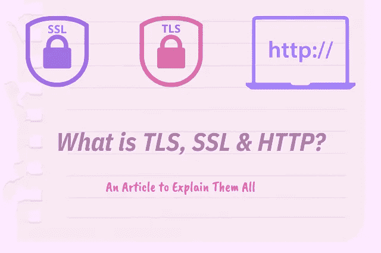
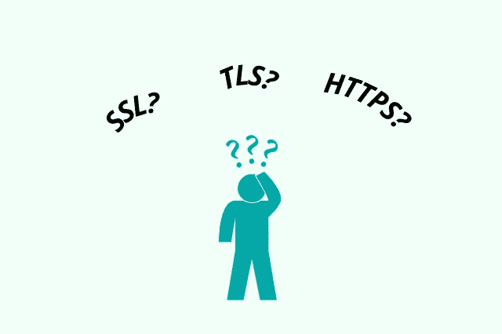
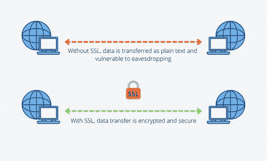
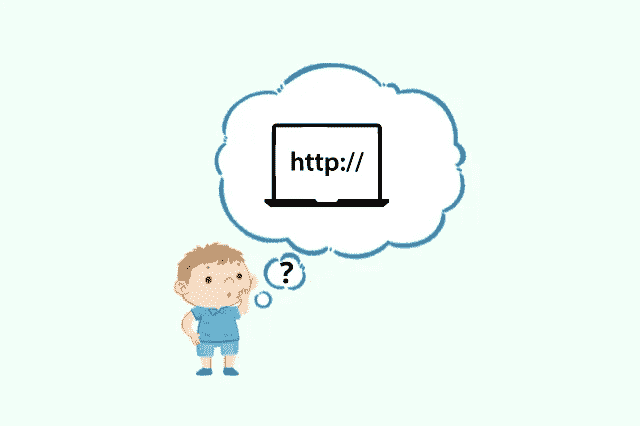

# 什么是 SSL、TLS 和 HTTPS？

> 原文：<https://blog.devgenius.io/what-is-ssl-tls-https-2d0a877b0d02?source=collection_archive---------7----------------------->

> 当我们谈论安全性时，TLS、SSL 和 HTTPS 是当今非常常见的术语。不幸的是，许多人并不完全理解这些术语的真正含义，只是把它们贴上安全类的标签。

# 简介—什么是 TLS、SSL 和 HTTPS？

*什么是 TLS，SSL & HTTPS？* —在本文中，我们将尝试理解 SSL、TLS 和 HTTPS 到底是什么。这不是一篇介绍性的文章。我们将深入细节并试图完全理解这些概念。

# 了解 SSL

**安全套接字层**或 SSL 是一种安全协议，通过保持通信信道的安全，允许通信双方的真实性和完整性。

听起来很简单是吗？相信我，SSL 的基本概念要复杂得多。

现在，让我们把它分解成细节。

# 安全协议是什么意思？

首先，什么是 ***协议*** ？协议是确定在给定情况下如何行动的一组规则或指令。

一个 ***安全协议*** ，或也称为 ***密码协议*** 是两个或多个通信方之间约定的动作或操作序列。

简而言之，当两方或多方想要相互通信时，他们必须遵循该动作/操作或安全协议来确保通信的安全性。

# 那么，SSL/Security 协议是如何保持通信安全的呢？

SSL 或安全协议通过为通信提供安全通道来保持两方或多方/设备/计算机之间的通信安全。

另外，请记住我们所说的交流，它不像你和你的朋友在电话里交谈。这里的通信是通信方之间的数据传输流。

安全协议会在数据传输到接收方之前对其进行加密。通过能够确定接收方是正确的一方，它还有助于保持事物的安全性。

# 了解什么是 TLS

**传输层安全**或 TLS 是**安全套接字层**的*进化而来的更好版本*。

由于 TLS 是安全套接字层的演进版本，因此与 SSL 相比，逻辑上 TLS 提供了更安全的协议。

另外值得注意的是，由于 TLS 来自 SSL，这两个术语可以互换使用(SSL/TLS)。然而，这两个术语并不相同，它们可能相似但不相同。

# TLS 版本

第一版 **TLS (TLS 1.0)** 发布于 1999 年。此后，TLS 发布了 3 个更新版本， **1.1** 、 **1.2** 和 **1.3** 。1.2 版本是目前广泛使用的版本。

# TLS 和 SSL 有什么不同？

**传输层安全性**在`handshake`流程方面不同于 SSL，也称为`SSL/TLS handshake`。

除此之外，TLS 在加密算法、加密强度、消息认证、密码套件、警报消息、记录协议等方面都不同于 SSL。

不幸的是，我们不会在本文中讨论这些区别，但是我们将讨论一下 ***SSL/TLS 握手*** 过程。

# SSL/TLS 握手过程

在我们进一步讨论之前，我们只想澄清一件事。

在有 TLS 之前，我们首先有 SSL。它以前被称为 SSL 握手过程，但自从 TLS 出现后，它被改为 TLS 握手。然而,“SSL”这个名称仍然被广泛使用。

在高级别的 SSL/TLS 握手上。

*   当双方试图通过使用 TLS 加密的会话相互通信时，SSL/TLS 握手开始或启动。例如，**网络浏览器**试图与**网络服务器**建立通信。(类似于你打开你的 Chrome 浏览器(网络浏览器)并进入[rasyue.com](https://rasyue.com/)(网络服务器))
*   在握手的开始阶段，早期阶段包括双方交换消息以相互验证，确定使用哪个 TLS 版本，确定使用哪个密码套件，进行身份验证并最终生成会话密钥。

让我们来详细了解一下这个`handshake process`。

# SSL/TLS 握手过程中的步骤

1.  ***客户端 Hello*** —例如，web 浏览器向 web 浏览器发送 as Hello 消息。此消息包含浏览器支持的密码套件和 TLS。
2.  ***服务器 Hello***—web 服务器回复其 Hello 消息，该消息包含 SSL 证书、选择的密码组和一个称为服务器随机的随机字节串。
3.  ***客户端密钥交换*** —当客户端/浏览器收到 SSL 证书时，浏览器会对证书进行认证。然后，客户端发送用证书公钥编码的另一条消息。
4.  服务器读取消息，服务器使用其私钥解码该消息。
5.  创建会话密钥，客户端和服务器发送用会话密钥编码的“完成”消息。
6.  TLS 握手过程已完成。双方继续使用会话密钥进行安全通信。

这差不多就是 SSL/TLS 握手过程中发生的情况。表面上没什么太疯狂的。

# 了解 HTTP 和 HTTPS

在我们谈论 HTTPS 之前，让我们先谈谈 HTTP。

***超文本传输协议*** 或 **HTTP** 是分布式、协作式、超媒体信息系统的应用层协议。这是我们今天所知的万维网或互联网通信的基础。

HTTP 允许在 web 服务器和计算机之间传输多种形式的数据或信息，如纯文本、图像、HTML 等。

# HTTP 是什么类型的协议？

HTTP 是 OSI ( ***开放系统互连*** )模型的应用层协议或第 7 层。

# HTTP 是如何工作的？

HTTP**也被称为请求-响应协议，因为 HTTP **在 web 浏览器和 web 服务器之间传输超文本消息。****

**HTTP** 利用 TCP 或 ***传输控制协议*** 在 web 浏览器/客户端和 web 服务器之间传输信息。

不幸的是，我们不会讨论 TCP，因为它不在本文的上下文中。稍后，我们将单独撰写一篇关于 TCP 的文章。

# 那么，HTTPS 是什么？

**HTTPS** 或 ***超文本传输协议安全*** 简单来说就是 HTTP 的安全版本，利用 SSL/TLS 协议进行加密和认证。

HTTPS 允许我们通过互联网安全地传输敏感数据，如个人数据、银行凭证、信用卡信息等。这是因为数据在传输过程中会被加密。

简单易懂？这只是表面现象。关于 HTTP/HTTPS 还有很多东西要学，但是我们认为我们应该就此打住，改天再谈。

# 结束了

我们希望这篇文章能够为你提供你今天正在寻找的答案。

此外，如果你正在寻找便宜但好的 SSL 证书提供商，请阅读我在[***name cheap***](https://rasyue.com/namecheap-review/)上的评论。

下一篇文章再见！