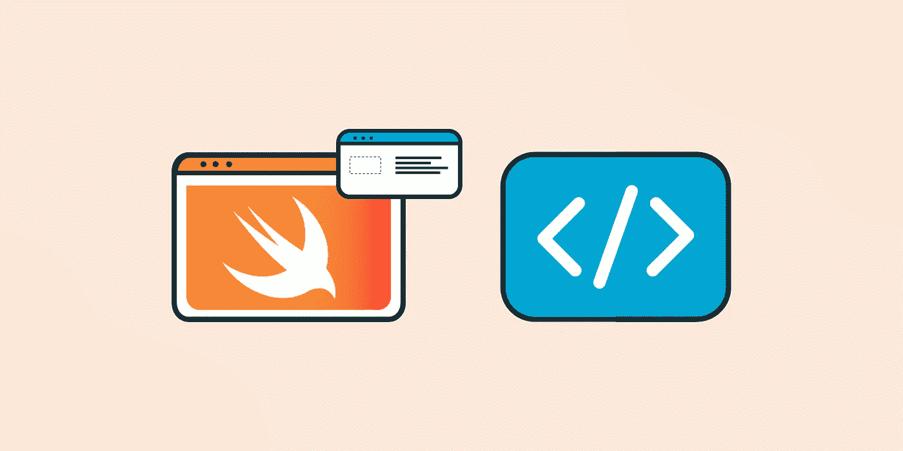

# 什么是 Swift？特性、优点和语法基础

> 原文：<https://blog.devgenius.io/what-is-swift-features-advantages-and-syntax-basics-ec73f4edf028?source=collection_archive---------0----------------------->



我们离新年只有几个月了，这意味着是时候开始展望将在 2022 年主导软件行业的技术趋势了。随着新年的临近，我们希望帮助您熟悉即将到来的趋势，以便您可以做好准备，并开始将您的技能提升到一个新的水平。今天我们就来讨论一下 ***雨燕*** 。

Swift 编程语言是苹果公司设计的通用开源编程语言。这种语言受到 Python 的影响，变得快速而直观。Swift 主要用于原生 iOS 和 macOS 开发。包括 LinkedIn、Lyft 和 WordPress 在内的许多流行应用程序都是用 Swift 编写的。如果你对 iOS 开发感兴趣，Swift 是一门很好的学习语言。让我们进一步了解这种流行语言吧！

**我们将介绍**:

*   什么是 Swift？
*   我为什么要学 Swift？
*   Swift 与 Objective-C
*   Swift 语法介绍
*   总结和后续步骤

# 什么是 Swift？

Swift 是一种多范式、通用的开源编程语言，适用于 iPadOS、macOS、tvOS、watchOS 和 **iOS 开发**。它是由苹果公司在 2014 年创建的，旨在为开发者提供一种强大的语言来开发 iOS 应用程序。根据 swift.org 的说法，这种语言被设计成安全、快速和富于表现力。它旨在取代基于 C 的语言。Swift 语言在不断发展，社区也在不断壮大。在 GitHub 上可以找到 Swift 源代码，任何人都可以很容易地访问这些代码。

# Swift 功能

*   **强大的泛型**:泛型允许你编写灵活的、可重用的函数和类型，可以和任何类型一起工作。
*   **本地错误处理** : Swift 支持在运行时抛出、捕捉、传播和操作错误。
*   **结构和类** : Swift 允许您在单个文件中定义一个结构或类，外部接口可供其他代码使用。
*   **协议扩展** : Swift 允许您定义协议本身的行为，而不是在全局功能或单个一致性中。
*   **内存安全** : Swift 自动管理内存，防止不安全行为在您的代码中发生。
*   **内存管理**:通过自动引用计数(ARC)，Swift 跟踪并管理我们应用的内存使用情况。这意味着我们自己不需要担心内存管理。
*   **灵活枚举** : Swift 枚举支持模式匹配，可以有有效载荷。
*   **包管理器**:Swift 包管理器是一个跨平台工具，我们可以使用它来构建、运行、测试和打包 Swift 库和可执行文件。
*   **调试** : Swift 使用 LLDB 调试器，它为您提供了一个 REPL 和调试器来实现集成调试、一致的格式、故障恢复和表达式求值。
*   **源代码和二进制兼容性**:最新版本的 Swift 对应用程序具有二进制兼容性。Swift 库包含在每个操作系统版本中，因此您的应用将使用操作系统中最新版本的库，并且您的代码无需重新编译即可运行。
*   元组允许我们创建和共享值分组。我们可以使用元组将多个值作为单个值返回。
*   **闭包语法** : Swift 有一个轻量级的闭包语法，它进行了优化，以实现整洁的语法和清晰的风格。

# 我为什么要学 Swift？

Swift 被设计成易于学习和使用。苹果公司创造这种语言时考虑到了新的编码者。无论你还在上学，探索新的职业道路，还是想学习如何编码，Swift 都是一门简单而直观的第一语言。如果你是编码新手，Swift Playgrounds 是一款 iPad 应用，可以让你轻松开始 Swift 编码。

一旦你学会了 Swift，你将成为潜在雇主的一个有吸引力的候选人。Swift 开发人员需求旺盛。据苹果公司称，该公司已经在美国创造了大约 200 万个工作岗位。根据 Indeed 的数据，美国 iOS 开发人员的平均工资为 116，804 美元。如果你想从事应用程序开发，Swift 是一门值得学习的智能语言。

让我们来看看 Swift 编程语言的一些优点和缺点。

# 迅捷的专业人士

*   **快速强大** : Swift 采用 LLVM 编译器技术，其标准库使得编写代码直观高效。
*   **现代**:Swift API 易于阅读和维护。推断类型使您的代码更整洁，更不容易出错。模块消除了头并提供了名称空间。
*   简单易学:Swift 是为初学者设计的。您可以使用 Swift Playgrounds for iPad 来开始使用 Swift 代码，并且可以访问课程来学习如何构建 Xcode 应用程序。
*   安全:Swift 有多种安全特性，比如自动内存管理、值类型和变量初始化。在 Swift 中，对象永远不能是`nil`，如果你试图使用一个`nil`对象，Swift 编译器会阻止你。这些特性有助于防止运行时崩溃。
*   **跨平台** : Swift 支持所有苹果平台、Linux、Windows 和 Ubuntu。
*   **动态库**:动态库存在于你的代码之外，在需要的时候被上传。库被集成到每个设备版本中。
*   **大型社区** : Swift 拥有最活跃、最丰富的开源社区之一。此外，还有很多资源可以帮助你学习这门语言。

# 快速诈骗

*   **相对较新的语言** : Swift 还是一门年轻的语言。这意味着它的一些功能和资源不如其他编程语言强大。
*   **弱跨平台支持**:虽然 Swift 支持所有苹果平台、Linux 和 Windows，但它最适合本地 iOS 开发。
*   **频繁更新** : Swift 是较新的语言，更新频繁。这使得很难找到合适的工具来帮助完成某些任务。
*   **IDE 支持**:苹果官方 IDE Xcode 在某些支持领域有所欠缺，包括语法高亮、自动完成、重构和编译。

# Swift 与 Objective-C

Objective-C 是一种通用的、面向对象的编程语言。在 2014 年 Swift 出现之前，它是用于 OS X 和 iOS 开发的主要编程语言。它结合了 C 语言的**特性和 Smalltalk 的**特性。在 Swift 创建之后，Objective-C 的使用和受欢迎程度开始下降，尽管用 Objective-C 编写的现有应用程序仍将需要维护。

*那么，是什么让 Swift 成为更好的选择呢？*

首先，需要注意的是，Swift 不是 Objective-C 的直接继承者。两种语言具有不同的功能，可以一起用于移动应用程序开发。让我们来比较一下这两种语言。

# 迅速发生的

*   使用 Swift，您可以在 Xcode、Swift Playgrounds、Cocoa Touch 等平台上进行开发。
*   截至目前，Swift 要求至少 iOS 7。这意味着 2014 年之前开发的 iPhones 和 iPads 将无法与您的应用程序兼容。
*   Swift 是一种现代的、对人类友好的语言，语法简单，这意味着编码速度更快。
*   据苹果公司称，Swift 比 Objective-C 快 2.6 倍。
*   Swift 拥有不断更新的丰富文档。
*   对 Swift 开发人员的需求正在增加。

# 目标-C

*   用 Objective-C，你主要用 Xcode 开发。
*   您的应用程序可以在任何可用的 iOS 版本上运行。
*   使用 Objective-C 通常会降低编码速度，因为这种语言不够直观和人性化。
*   Objective-C 比 Swift 慢 2.6 倍，由于语法更复杂，编写时间更长。
*   Objective-C 有丰富的文档，不经常更新。
*   对 Objective-C 开发人员的需求正在减少。

总的来说，Swift 是一种更值得选择的语言，因为它更安全、更快速、更直观、更具交互性。Swift 拥有 **Objective-C 互操作性**，这意味着 Swift 代码可以与现有的 Objective-C 文件共存。借助 Swift，您还可以完全访问 Objective-C API。

# Swift 语法介绍

Swift 以其简单直观的语法而闻名。让我们来看看 Swift 的一些语法基础:

# 你好世界

在 Swift 中，`Hello World!`程序很简单。它可以在一行中完成，并且您不需要导入任何库或附加功能。Swift 也不要求在语句结尾使用分号。

```
print("Hello World!)

=> Hello World!
```

# 变量和常数

在 Swift 中，您使用`var`生成一个变量，使用`let`生成一个常量。变量和常量的类型必须与您要赋予它们的值相同。

```
var myVariable = 10

let myConstant = 10
```

您不必显式地编写类型。如果在创建变量或常数时提供一个值，编译器可以推断出它是什么类型。比如，编译器会推断出`ourVariable`是一个整数，因为它的值被设置为整数。

```
ourVariable = 25
```

如果要将值转换为不同的类型，请创建所需类型的显式实例。

```
let age = 3

let myCatIs = "My cat is " + String(age)

print(myCatIs)

=> My cat is 3
```

在字符串中包含整数有一种更简单的方法。您将值放在括号中，然后在括号前放一个反斜杠。

```
let cats = 5

let dogs = 10

let catsAmount = "I have \(cats) cats."

let dogsAmount = "I have \(dogs) dogs."

let petsAmount = "I have \(cats + dogs) pets."

print(petsAmount)

=> I have 15 pets.
```

# 数组和字典

您可以使用括号创建数组和字典。您可以通过将索引或键放在括号中来访问元素。您的数组将随着您添加新元素而自动增长。

```
var groceryList = ["eggs", "yogurt", "cheese"]

groceryList[1] = "bread"

groceryList.append("coffee")

print(groceryList)

=> ["eggs", "bread", "cheese", "coffee"]
```

# 总结和后续步骤

恭喜你迈出了与 Swift 的第一步！Swift 是一种通用的开源编程语言，主要用于原生 iOS 和 macOS 开发。app store 上的很多应用都是用 Swift 编写的。Swift 越来越受欢迎，所以现在是学习这种语言的好时机。我们今天介绍了一些基础知识，但关于 Swift 编程还有很多东西需要学习，例如:

*   属性包装
*   常数
*   斯威夫特伊

*快乐学习！*