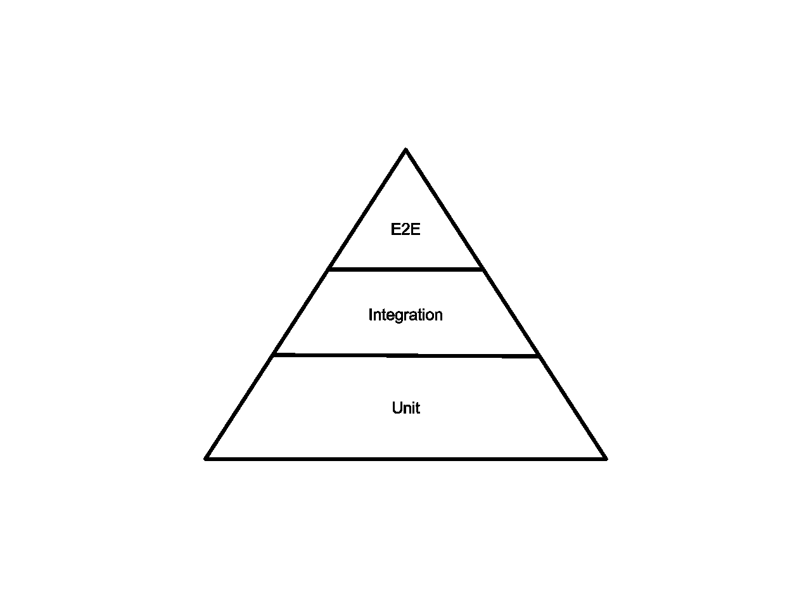

# 什么是测试代码？

> 原文：<https://blog.devgenius.io/what-is-testing-code-56b82d329fea?source=collection_archive---------0----------------------->

## 它是如何让你少花钱的？

[国立癌症研究所](https://unsplash.com/@nci?utm_source=medium&utm_medium=referral)在 [Unsplash](https://unsplash.com?utm_source=medium&utm_medium=referral) 上拍摄的照片

**TL；博士**

测试代码为您和随后的开发人员节省了时间和精力。

本文将涉及:

*   测试是什么，用一些琐碎的例子来阐明这个问题
*   为什么你应该(邻居，需要！)来测试您的代码
*   示例测试方法，以及它们如何优于选项

如果您想跳到任何部分，或者需要稍后快速访问它们，下面是详细信息:

1.[那么……什么是测试？](#04c2)
2。[测试类型](#0913)
3。[为什么测试有用？](#84c1)
4。[保持测试清洁](#5d1a)
5。[强大的测试工具](#8970)
6。[概述](#7008)

# 序💃

任何有价值的计算机科学程序都会向你介绍测试代码的概念。不，我不是说用`console.log(‘asdf’)`乱丢你的代码，或者在你的任务前的早上 5 点一遍又一遍地运行你的程序。

当我在学校的时候，*最后*提到测试代码意味着什么的课程直到我在那里的第二年才开始。这一整年都在为被遗忘的边缘案例哭泣，或者在终端上寻找以前的运行。

如果你正在学习在线编写代码，你可能会听说过代码测试。您可能会发现许多教程实现了一个流行的测试框架。也许你会发现关于为什么你应该测试代码的长篇大论和你几乎不理解的词语。在真正理解什么是测试以及幕后发生了什么之前。

无论你是通过大学学习编程，还是仅仅为了饼干而冒险，完全在网上学习，都有太多的信息需要处理。为什么要浪费时间在测试上？？？为什么要把时间浪费在那些感觉不到进步、不会产生恶心的`hax0r`终端输出、也不会在“前端”产生性感像素的东西上呢？

这有点像学习正确使用 IDE，已经有成千上万的东西要学了，为什么还要花时间高效地做事呢？

> 高效的(特别是指系统或机器)以最少的努力或花费获得最大的生产力。

# 那么……什么是测试？

测试代码意味着使用受控输入运行您的代码，并检查
的预期输出。前言中提供的例子演示了一个非常基本的“测试代码”的例子，用户使用各种参数运行他们的 python 文件`divide.py`。

这通常是一种有缺陷的方法，用于测试任何您期望更改的程序，或者超出几行代码范围的程序。

## 怎么了，亲爱的？

1.  您需要记住所有已经用来测试代码的命令。
2.  每一次处决的结果只能由你易犯错误的人类眼球来验证。
3.  每次更改后，您都需要手动重新运行每个测试。
4.  手动输入每个命令意味着您可能会输入不正确的参数。
5.  …
6.  剩下的就交给你想象了。

在我们进入潜在的成熟的测试方法之前，让我们看看几个越来越好的*例子。*

## 接近 0

> [见此大意。](https://gist.github.com/codytowstik/5694cbd05d421e5104748d3707bff3a3)

我们可以从终端命令测试方法中改进的一些方面:

1.  运行测试应该是容易重复的。
2.  我们希望能够同时运行所有测试。

假设你有一个程序可以加载一个数据库，里面有你抓到的每只口袋妖怪的名字，以及你有多少只。这是你的口袋。所以你写一个函数，给定 Pokedex 状态和 Pokemon 列表，返回你总共拥有多少个指定的 Pokemon。

当然，您缺乏使用调试器的经验，并且只想要一些快速的结果，所以您在返回之前记录结果。

作为一个务实的程序员，你意识到你应该(邻居，需要！)来测试这个函数，以确保它在给定的各种输入下都能正常工作。

您不希望每次都启动数据库，并很快意识到您可以在地图中模拟一些样本测试数据。

现在，您可以使用一些不同的预期输入来调用您的函数，并观察正确的输出。

多。好像我们还没有处理过请求一个我们还没有的口袋妖怪的情况。因为只有四个“测试”，所以匹配每个测试的输出并不太难。但是，我们必须**目视验证每个结果**和**记住每个测试的预期结果**。对于一个小样本程序来说，这是一个不错的方法。但是，即使只增加了几个测试，也会很快变得单调乏味。即使我们只是改变一些样本数据，记住每个测试的预期结果也是站不住脚的，而且非常容易出错。

我们希望节省大脑周期，并考虑一种自动的和可重复的方法。让我们做一个更好的。

## 方法 1

> [见此大意。](https://gist.github.com/codytowstik/9b62548492eb3c4212b9ee6814915eb1)

让我们记住我们下一个方法的一些改进领域:

1.  测试结果应该通过编程来验证，而不是通过视觉来验证。
2.  应该很容易看到结果，并将其与相应的测试进行匹配。

不仅仅是一个简单的`console.log()`，让我们用一个新的函数来增加一些味道，这个函数将帮助你，开发者，来识别哪些测试出错了，以及*实际的*输出与*预期的*输出相比是什么。

现在我们可以程序化地检查每个函数的结果，并且容易地
识别它属于哪个测试函数。

酷，前两个测试都通过了，所以我们知道事情进展顺利。使用`testID`，我们毫不费力地知道我们的函数可以处理空数据，当我们用 Pokemon 调用它时，我们已经有了空数据。两个失败的输出告诉我们，当我们使用口袋妖怪时，我们甚至没有得到数字 NaN，而我们没有得到数字。我们甚至不用回头看测试函数调用，太好了！

现在我们有了一条线索，知道哪里出了问题。回到我们的`calculateTotalSpecifiedPokemonCaught`函数，我们可以使用调试器发现当 Pokemon 在我们的 Pokedex 中不存在时`pokedexState[ currentPokemon ]`表达式返回`undefined`(参见要点中的第 16 行)。

让我们把从 Pokedex 获取口袋妖怪数据和增加计数分成单独的行。如果口袋妖怪不存在，我们得到了`NaN`，我们就当它是零好了。

> [参见要点中的完整示例。](https://gist.github.com/codytowstik/90ef736965f8d52f6752a62d5435b6ff)

> 将复杂的逻辑拆分成单独的行通常是一个好主意，也是创建干净代码的一个好的
> 实践。
> 
> 想象一下调试这一行的噩梦:
> 
> `let currentPokemonCount = isNaN( pokedexState[ currentPokemon ] ) ? 0 : pokedexState[ currentPokemon ]`

如果您没有构建复杂的程序，这种方法可能就足够了。此外，将测试分离到不同的文件中，用于不同的相关代码集，这是保持事情有条理的好方法。测试应该易于理解，所以不要害怕添加注释。至少，包括一个关于每项测试测试什么的简介，如果原因不明显，可能还有为什么它是一个必要的测试。

> 乍一看，测试应该容易理解。

# 测试类型

你应该拥有的不同类型的测试通常被描绘成一个金字塔。

[Abbe98 / CC BY-SA](https://creativecommons.org/licenses/by-sa/4.0)

坚固的金字塔需要坚固的基础。金字塔越低，被测试的代码单元就越小，应该进行的测试就越多。一个 UI (E2E)测试可能测试创建、编辑然后保存文档的流程。这个流程由许多不同的功能组成，每个功能都应该有自己的单元测试。

前面在 [**中给出的例子那么……什么是测试？**](#04c2) 描述一种叫做**单元**测试的测试类型。它们是最简单的测试，正如你所想的，测试一个单一的代码单元。通常，这意味着一个单独的函数，但是您经常会发现它们是相关方法的集合。当一个测试使用多个单元来执行单个操作流程时，它通常被称为**组件**测试。

例如，如果我们有一个 API 调用接受参数 a `userID`和`requestedPokemon`来检查计数，我们可以模拟这些变量并测试 API 内部的整个流程。

也许类似于:

这些被认为是**白盒**测试，因为我们知道代码的内部，可以直接传递函数测试参数，并且
以编程方式测试每个单独的输出。

> 单元测试是从程序员的角度来写的。它们是为了确保一个类的特定方法(或单元)执行一组特定的任务。
> 
> 功能测试是从*用户*的角度来写的。它们确保系统按照用户的期望运行。
> 
> [斯塔克韦尔弗洛](https://stackoverflow.com/a/2741845)，安东尼·弗洛内

**功能**测试和**集成**测试被认为是**黑盒**测试，因为内部是一个“黑盒”。测试人员不考虑内部程序结构。这是一种质量保证(QA)过程。以我们的 python `divide.py`文件为例:一个 QA 测试人员只关心他们是否输入 1 作为分子，10 作为分母——`1/10`——他们返回`0.01`。也许对你的程序来说，在小数上保留前导零也很重要。干得好！用户不在乎你是否使用`Numpy`来做这个计算，也不在乎你是否决定使用逐位数学。对于给定的输入，只获得正确形式的预期输出。

一种功能测试是 **API** 测试。在服务器端，这可能意味着使用一个为您的 API 提供预期模拟输入的测试客户机，验证它们的输出。潜在地链接多个 API 调用来模拟交互流。

在客户端，这可能意味着运行服务器并进行 API 调用，验证每个 API 的响应。然而，这种测试只测试应用程序的数据层。

您还需要检查视图图层。有一些框架可以让你测试用户实际看到的呈现在屏幕上的视觉元素，稍后会在 [**强大的测试工具**](#8970) 中介绍。这被称为 **UI** 测试，你选择的框架将像一个真实的用户一样以编程的方式‘点击’,根本不直接与代码交互。

金字塔上每个测试范例之间的界限可能是模糊的，它们更像是一个指导方针，而不是一个硬性规定。如果您在服务器上使用测试客户机来测试带有模拟输入的 API，这在技术上是黑盒测试，因为您的测试客户机不能直接访问代码。尽管您作为开发人员可以阅读和理解每个 API 调用背后的代码，但是从测试本身的角度来看，还是有一定程度的分离。如果你让 20 名开发人员描述金字塔中的每一种测试，你可能会得到 20 个不同的答案。

这仅仅触及了如何测试程序的表面，所以请花些时间去探索其他资源，这些资源会有更深入的解释和例子。使用上面加粗的关键字作为搜索的起点。

# 为什么测试有用？

我们已经看到，测试帮助我们验证我们的代码对一组指定的输入有效。这为开发人员节省了宝贵的调试时间，QA 人员现在可以验证我们的代码确实如我们所说的那样。

测试的好处远远超出了最初的代码验证。

测试通过以下方式帮助*未来检验*您的代码:

**保护您免受代码或框架变更的影响。**

如果将来有另一个开发人员来修改代码，他们肯定会知道他们的修改是否违反了规范。他们可能会尝试优化破坏一些重要的边缘情况的部分代码，这将很难理解。再一次，在开发一个完整的应用程序的背景下思考这个问题，许多开发人员每天都在做修改，一天多次。

即使对于非本地更改，这也可以节省您的时间。如果你升级了一个改变了代码的库，并且突然向你的程序返回了一个不同的结果，你会立刻知道问题出在哪里。

对于非代码变化，比如你正在切换到一个新的编译器，它会向后打开你的`for`循环(哈哈，wut？)，马上就知道了。

**为未来的开发者提供文档(那也可能是你！).**

有没有看过一个新的代码库(特别是一个动态类型语言，*cough* Javascript，*cough cough* Python)，你花了一段时间才弄明白某些函数应该如何使用？或者“为什么这个按钮在这里，它有什么用？”

好吧，如果代码库有一组伴随代码的健康的测试，那么你需要做的就是找到相应的测试，并查看一些预期的输入和输出是什么。对于实现代码的开发人员来说，这是一种说“是的，我期望结果是四舍五入的”的方式或者，“当口袋妖怪不在我们的 Pokedex 中时，我们*应该*抛出一个期望，而不是把它计为零。”

**您可以练习使用您的库或框架，并验证它是否如您所愿地工作。**

您没有编写生产代码，所以测试是检查您崭新的框架中您以前没有使用过的工具和方法的最佳地方。这也是在您的项目环境中记录框架的一些示例用法以及描述一些最佳实践的一种简单方法。未来的开发者会为此感谢你，尤其是如果他们自己不熟悉这个库的话。

另外，您可以确保您的外部库以您期望的形式接受数据，并以期望的形式返回数据。即使你*认为*你知道它是这样，现在它是通过编程验证的。这遵循第 1 点和第 2 点，因为它保护您免受未来更新的影响，并作为进一步的文档。

> 你应该总是在你使用的库周围添加一个抽象层。看看 Daria Caraway 在 DinosaurJS 发表的关于如何与 JavaScript 库友好分手的演讲

跟我一起说:“我们喜欢好的文档，哇！”

# 保持测试清洁

测试代码是一个强大而必要的工具。权力越大，责任越大。请不要把你们的考试当成二等公民。我并不是说你必须将你的测试代码与产品代码保持同样严格的标准，但是应该接近。

乍看起来，测试应该容易理解。

让你的测试保持注释状态，这样就能清楚地知道测试的是什么，为什么要测试。将测试中或跨测试多次使用的通用模式提取到带有清晰文档的效用函数中。

**就像在生产代码中一样，变量应该有长的描述性名称，代码应该严格遵循您的一般代码风格指南。**

让正确的代码风格在你的测试中半途而废是你应该不惜一切代价避免的第一次混乱。糟糕的代码风格降低了可读性，这可能会导致混淆实际测试的内容以及测试是否正确。

**测试应该是有组织的，易于查找和跟踪。**

相关的测试应分组放在单独的文件中。为您所有的测试文件考虑一个对您有意义的目录结构，并且您可以很容易地向团队描述。几乎比没有测试更糟糕的是不知道正在测试什么，或者在哪里测试。考虑可以使用的策略，以确保尽可能容易地找到一个测试，并验证某个特性正在以您期望的所有方式进行测试。

也许你总是把新的测试放在一个文件的底部，这样东西就不会移动得太多，或者你把一个注释放在一个特定特性的测试上。与所有编程一样，这与其说是科学，不如说是艺术。

# 强大的测试工具

在项目生命周期中，越早开始测试，节省时间的可能性就越大，尝试修复其他东西时破坏某些东西的风险就越小。

稍后你会感谢你所做的，并在此过程中获得有价值的技能！即使是非常小的一次性项目，比如学校作业或一个小工具，我恳求你至少实现一个非常基本的测试系统。使用本文中的一些例子或想法，或者构建一个完整的测试套件。养成在你的工作流程中包含这一点的习惯。

对于任何超越简单工具的项目，很可能你需要一个强大的框架来帮助你。测试框架已经解决了令人厌烦的细节，并且通常记录了一些最佳实践。

Java 的 defacto 测试框架— [JUnit](https://junit.org/junit5/docs/current/user-guide/) —有几十个`assert`方法，它们的实现类似于我们在前面的例子中使用的`checkResults(..)`方法。从`assertEquals(..)`到`assertNotNull(..)`的任何东西

Javascript 项目可能使用 [Jest](https://jestjs.io/) 或 [Mocha](https://mochajs.org/) 进行单元、集成或其他数据层测试。

对于视觉测试，你可能会依赖于[柏树](https://www.cypress.io/)或叶 ol’[硒](https://www.selenium.dev/)。

不管你使用哪种语言，选择一个框架都是个人的选择。许多测试框架以相似的方式运行，并提供相似的工具。例如，所有这些框架都有自己的一个`@BeforeEach`注释的实现，它在每次测试之前运行一段代码，以消除像每次登录一样的样板文件。

不要担心陷入“哪个工具是最好的”中，因为如果你用任何框架编写了好的测试，你就领先了一步。

# 概观

测试比实现什么都不花成本，节省你的时间，让每个人都安心。你知道测试代码意味着什么，所以不要搬起石头砸自己的脚，开始测试吧！

**测试有助于……**

1.  保护您免受代码或框架更改的影响。
2.  为未来的开发者提供文档(那也可能是你！)
3.  您练习使用您的库或框架，并验证它按照您的期望工作。

**测试应该…**

1.  易于阅读和理解。
2.  严格遵循您的一般代码风格指南。
3.  有条理，易于查找和跟踪。

如果你想回去:

1.[那么……什么是测试？](#04c2)
2。[测试类型](#0913)
3。[为什么测试有用？](#84c1)
4。[保持测试清洁](#5d1a)
5。[强大的测试工具](#8970)
6。[概述](#7008)

更多阅读，请查看:

*   [声明式测试](https://medium.com/dev-genius/testing-declaratively-2bd825503426)——节省大脑周期，让写作测试变得有趣！

谢谢，祝你愉快。💃