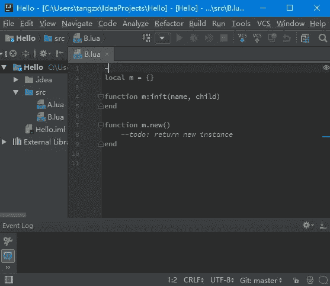
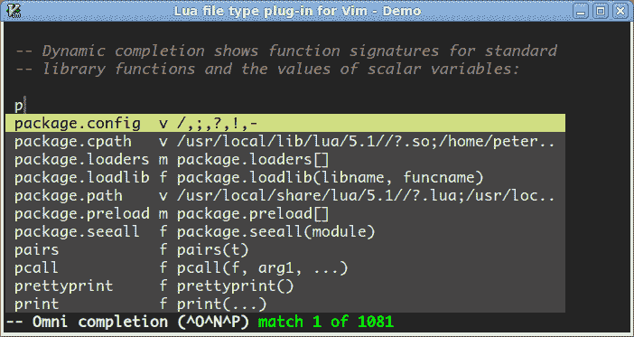
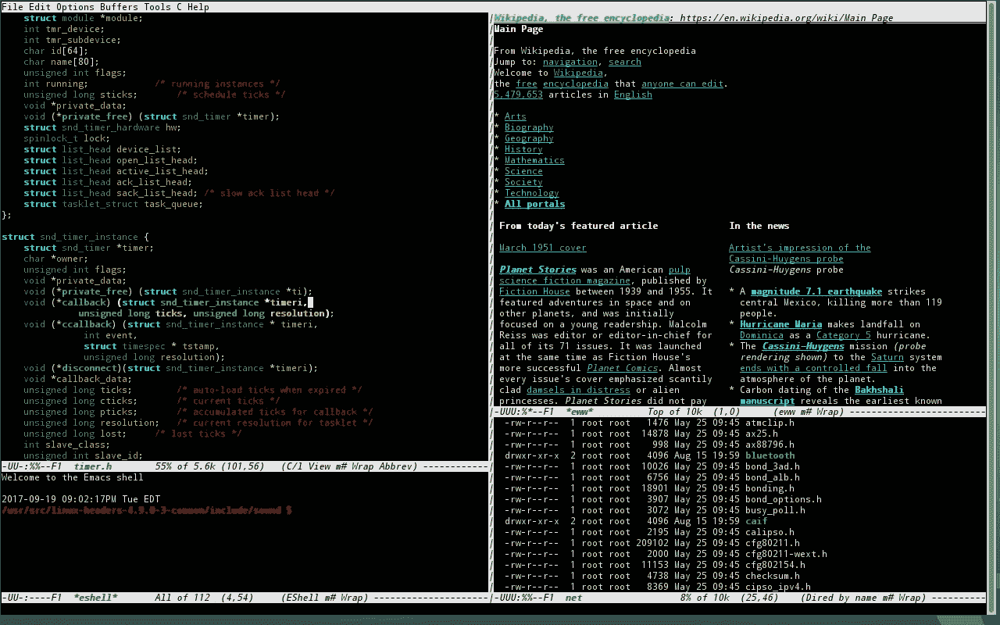
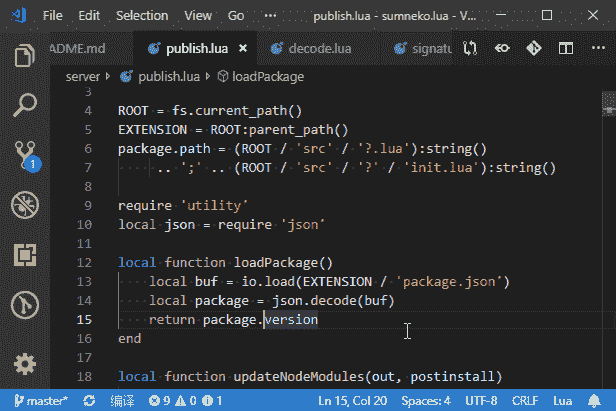
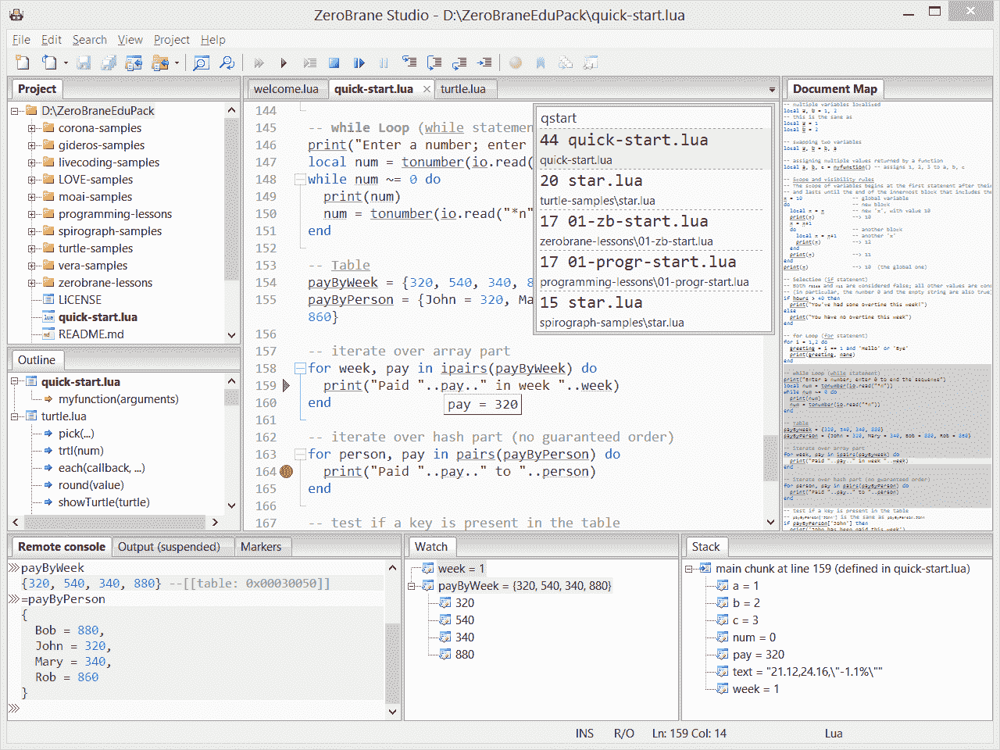
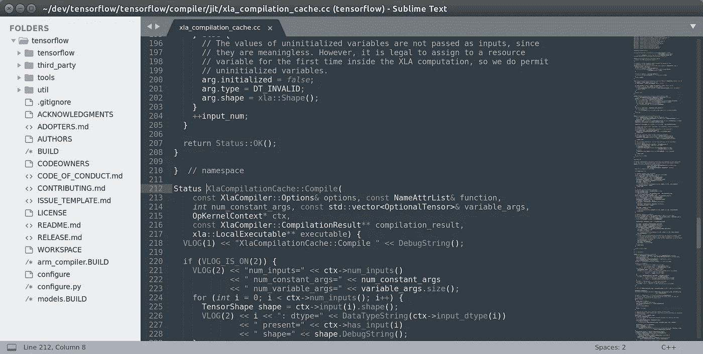
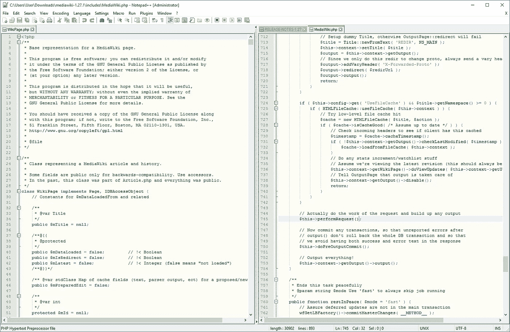
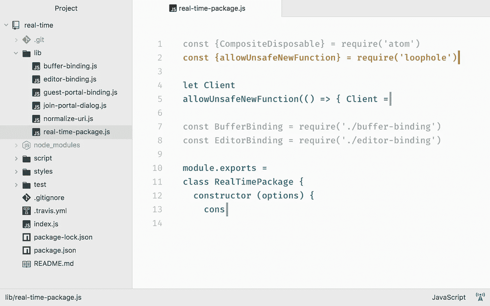

# 用 Lua 开发最好的 IDE 或者编辑器是什么？

> 原文：<https://blog.devgenius.io/what-is-the-best-ide-for-developing-and-programming-in-lua-47bff22f01b9?source=collection_archive---------0----------------------->

[Michael](https://unsplash.com/@michael75?utm_source=unsplash&utm_medium=referral&utm_content=creditCopyText) 在 [Unsplash](https://unsplash.com/s/photos/lua?utm_source=unsplash&utm_medium=referral&utm_content=creditCopyText) 上拍照；logo 由 [Lua](https://www.lua.org/images/) (免费提供)；特里梅因·埃托的文字。

当使用某种语言编程时，除了简单地开始之外，最重要的决定之一是使用编辑器或集成开发环境(IDE)。

选择不是一次性的事情，你选择并被锁定，但明智的选择真的可以减少头痛，不仅是现在，而且是未来。你选择的那个可能最终对这种语言很好，但对其他语言不好，或者对很多语言都很好，所以你必须为你学习和编程的每一种语言做出选择。

但是，如果您希望用 Lua 立即投入运行，并且希望节省时间了解什么是好的 IDE 或编辑器，那么希望本文能节省您一些时间。

在这里，我将总结一些选项，并提供进一步的细节，甚至一些来自实际 Lua 用户的互联网观点。事不宜迟，我们开始吧。

# 智能理念

IntelliJ IDEA 一直被评为 IDE-land 的最佳产品之一；首先，我建议你检查一下社区版本是否有你需要的东西，如果你想要一个功能好的(偶尔是重量级的)IDE 选项的话。

礼貌 [JetBrains Marketplace](https://plugins.jetbrains.com/plugin/9768-emmylua)

*   IntelliJ 社区版[免费](https://www.jetbrains.com/idea/download/#section=windows)
*   IntelliJ 终极版是 [*不是*免费](https://www.jetbrains.com/idea/download/#section=windows)；有一个 30 天的免费试用期，但除此之外(个人用户)每年 149 美元，第二年 119 美元，第三年 89 美元
*   [EmmyLua 插件](https://plugins.jetbrains.com/plugin/9768-emmylua)
*   语法突出显示(突出显示全局值、突出显示局部/参数值、突出显示向上值)
*   代码完成
*   关键词补全
*   基本完成
*   基于类型推断的完成
*   调试器—附加调试器(仅 Windows)和远程调试器(Mobdebug.lua)

> 当我需要最大的生产力和长期的代码质量时，我使用 IntelliJ IDEA(带有 Lua 插件)进行大型项目。

—[/u/PhilipRoman](https://www.reddit.com/user/PhilipRoman)on/[r/Lua](https://www.reddit.com/r/lua/comments/dpo4lb/best_ide_for_lua_in_your_own_opinion/f5x30kw/)

> 毫无疑问，IntelliJ 或带有 EmmyLua 插件的 Webstorm。在 Lua 开发中使用这种方法已经四年了，并且仍然定期尝试其他方法(Sublime，VS Code 等),但是还是会回到这个问题上来。

—[/u/bnlv](https://www.reddit.com/user/bnlv)on[/r/Lua](https://www.reddit.com/r/lua/comments/dpo4lb/best_ide_for_lua_in_your_own_opinion/f5x6mbt/)

> 我曾经是个了不起的人。简单的构建系统配置，许多不错的编辑功能，其中一些是 sublime 独有的。好东西。但是我从来没有得到自动补全和 linters 工作与它完美。
> 
> 现在我用的是 Rider (IntelliJ IDE ),通常是 C#用的，反正我用 Unity 也需要它。还有 EmmyLua 插件，它增加了用类型记录整个 Lua 代码的选项，所有好的东西都会自动完成，甚至可以加强类型安全。
> 
> 对于大型项目来说，这是上帝赐予的。我真的很喜欢它。

—[/u/eras io](https://www.reddit.com/user/Erasio)on[/r/love 2d](https://www.reddit.com/r/love2d/comments/fjdzp7/what_is_your_ide_of_choice_and_what_is_your_setup/fkn6p4g/)

# 精力

对于 Lua，许多用户认为你只需要选择一个文本编辑器。对于一些核心用户群，Vim 符合要求。

GitHub 上的礼遇 [vim-lua-ftplugin](https://github.com/xolox/vim-lua-ftplugin) 。

*   自由的
*   lua.vim 可用[此处](https://www.vim.org/scripts/script.php?script_id=3625)
*   GitHub [这里](https://github.com/xolox/vim-lua-ftplugin)

> 但是对于较小的自由时间项目，我使用任何文本编辑器(主要是`nano`，但也有`vim`)+`luacheck`+makefile 来自动化测试、打包、部署+ `tmux`来拥有多个窗格(每个项目一个会话，所以我可以从我停止的地方开始工作)。这些工具可以很容易地相互集成，例如你可以配置`nano`来调用`luacheck`并显示结果。
> 
> 哦，顺便说一下，我通常使用 WSL 在 Windows 上运行所有这些。

—[/u/PhilipRoman](https://www.reddit.com/user/PhilipRoman)on/[r/Lua](https://www.reddit.com/r/lua/comments/dpo4lb/best_ide_for_lua_in_your_own_opinion/f5x30kw/)

> vim/neovim 上已经有多个 lsp 的插件， [vim-lsp](https://github.com/prabirshrestha/vim-lsp) 和 [LanguageClient-Neovim](https://github.com/autozimu/LanguageClient-neovim) 。据我所知，neovim 也有一个 [PR，带有半功能 lsp(我还没用过那个)。](https://github.com/neovim/neovim/pull/6856)
> 
> 如果你用 vim，我推荐 vim-lsp，它写得最干净，我喜欢它加载函数的方式(容易延迟加载)。

— [/u/mtszyk](https://www.reddit.com/user/mtszyk) 开 [/r/Lua](https://www.reddit.com/r/lua/comments/89z80l/is_there_actually_an_ide_or_editor_with_proper/dwunxco/)

> 这可能是错误的答案，除非你真的愿意接受一个长期的、高性能的解决方案，但是必须有人提到 Vim。它把编辑文本的行为本身变成了你可以流利使用的语言。另外，它有大量的插件可以满足你的任何需求。
> 
> 但是就像我说的，这是一个长期的，高效的解决方案。你必须先熟悉 Vim，然后才能用它的无数设置和插件有效地定制它的功能。
> 
> 举例来说，这有多疯狂，[这是我的“vimrc”文件](http://goo.gl/3yn8bH)，我把所有的定制设置都放在这里(并列出我的插件，感谢一个插件让我这样列出它们，以便自动从互联网下载&安装它们)。在 vim 中导航更容易，那些框字符标题中有“折叠标记”,用于折叠文本部分。

—[上的](https://www.reddit.com/r/lua/comments/36ojjp/best_lua_ide/crfqvvf/)[/u/atim Holt](https://www.reddit.com/user/atimholt)/r/Lua

# Emacs

当然，提到 Vim 就不能不提 Emacs。

礼遇[维基](https://en.wikipedia.org/wiki/File:Emacs-linux-console.png)、[、*知识共享*](https://en.wikipedia.org/wiki/Creative_Commons)*[*Attribution-share like 4.0*](https://creativecommons.org/licenses/by-sa/4.0/)*。**

*   *自由的*
*   *GitHub pages 上的 Lua-mode:“Lua-mode 支持自动代码缩进和将行/区域/文件发送到 Lua 解释器。如果你试图发送一些代码，但没有一个正在运行，一个解释器(见变量`lua-default-application`)将被启动。您可以像使用交互式 shell 一样使用进程缓冲区(以您选择的应用程序命名)。”*
*   *[GitHub 上的 Lua 模式](https://github.com/immerrr/lua-mode)*

> *因为有一个针对 Lua 的 LSP，你应该能够使用几乎所有支持 Atom、VS Code、Emacs、(Neo)VIM 等的编辑器。它们都受到 Lua 支持的特定服务器的限制。VIM 是我的首选编辑器，但是设置和维护它需要相当多的时间。我倾向于不介意偶尔花几个小时来维护我的编辑器配置，因为我已经很好地满足了我的需求。*

*—[上的](https://www.reddit.com/r/lua/comments/89z80l/is_there_actually_an_ide_or_editor_with_proper/dwvrxtf/)[/u/losing generation](https://www.reddit.com/user/losinggeneration)/r/Lua*

> *我使用带有 [lua 模式](https://github.com/immerrr/lua-mode)和 [lsp 模式](https://github.com/immerrr/lua-mode)的 Emacs 进行导航和其他智能操作。对于 lsp 后端，我使用[艾美奖](https://github.com/EmmyLua/EmmyLua-LanguageServer)和[lve API 支持](https://github.com/EmmyLua/Emmy-love-api)。*

*—[/u/donio](https://www.reddit.com/user/donio)on[/r/love 2d](https://www.reddit.com/r/love2d/comments/fjdzp7/what_is_your_ide_of_choice_and_what_is_your_setup/fkmt3p1/)*

# *Visual Studio 代码又名 VSCode*

*VSCode 是市场上最通用和免费的 ide 之一，它的扩展游戏正变得越来越好。对于 Lua 来说，如果有合适的扩展，它不仅仅是功能性的。*

**

*由 sumneko 在 Visual Studio Marketplace 上提供的 Lua。*

*   *vscode-lua 扩展[这里](https://marketplace.visualstudio.com/items?itemName=trixnz.vscode-lua)；包含:*
*   *自动完成*
*   *转到符号*
*   *错误检查*
*   *林挺*
*   *格式化*
*   *lua-language-server [这里](https://marketplace.visualstudio.com/items?itemName=sumneko.lua)；包含:*
*   *转到定义*
*   *查找所有引用*
*   *盘旋*
*   *诊断学*
*   *重新命名*
*   *自动完成*
*   *智能感知*
*   *…以及更多*

> *我的 vscode。它有很棒的 Lua 扩展。*

*—[/u/ShenroEU](https://www.reddit.com/user/ShenroEU)on[/r/Lua](https://www.reddit.com/r/lua/comments/dpo4lb/best_ide_for_lua_in_your_own_opinion/f5zvcw6/)*

> *我正在使用 LRDB vscode 扩展—[https://github.com/satoren/vscode-lrdb](https://github.com/satoren/vscode-lrdb)*

*—[/u/arn carver](https://www.reddit.com/user/ArnCarver)on[/r/Lua](https://www.reddit.com/r/lua/comments/dpo4lb/best_ide_for_lua_in_your_own_opinion/f5xu78k/)*

> *我在用的【扩展】有:vscode-lua: intellisense 和林挺 for Lua 代码大纲:非常好的大纲扩展；书签:嗯…书签:)*

*—[/u/David drake _](https://www.reddit.com/user/DavidDrake_)on[/r/Lua](https://www.reddit.com/r/lua/comments/83tiri/lua_ideeditor/dweoo6f/)*

> *Visual Studio 代码，带有 emmylua 扩展。我实际上并没有使用 emmylua 作为建议，而是因为它是我发现的唯一一个可以正常工作的 lua 调试器。虽然这些建议是很好的补充。*

*— [/u/nikeinikei](https://www.reddit.com/user/nikeinikei) 上 [/r/love2D](https://www.reddit.com/r/love2d/comments/fjdzp7/what_is_your_ide_of_choice_and_what_is_your_setup/fknb5pj/)*

> *带扩展的 vscode:*
> 
> *sumneko.lua —用于语言服务器
> Tom blind . local-Lua-debugger-vs code—有史以来最好的调试器
> trixnz.vscode-lua —用于带 luacheck 的林挺*

*—[/u/scooby ff 666](https://www.reddit.com/user/scoobyff666)on[/r/love 2d](https://www.reddit.com/r/love2d/comments/fjdzp7/what_is_your_ide_of_choice_and_what_is_your_setup/fllsg7r/)*

# *ZeroBrane 工作室*

*由 Paul Kulchenko 撰写，ZeroBrane 被宣传为“Lua IDE，用 Lua 编写”和“简单和轻量级”。下载 是 [**免费，但是他们建议捐款。**](https://studio.zerobrane.com/support)*

**

*GitHub 上的 [ZeroBraneStudio](https://github.com/pkulchenko/ZeroBraneStudio) 提供。*

*根据 ZeroBrane Studio 的网站显示，该功能包括以下内容:*

*   *Lua IDE，用 Lua 写的；简单轻巧*
*   *语法突出显示和代码折叠*
*   ***功能和关键字的自动完成***
*   ***交互式控制台**通过本地和远程执行直接测试代码片段*
*   ***集成调试器**(支持本地和远程调试)*
*   *集成**静态分析仪***
*   *独特的**实时编码**功能([演示](http://notebook.kulchenko.com/zerobrane/live-coding-in-lua-bret-victor-style))*
*   ***Love2d** 自动完成、[调试](http://notebook.kulchenko.com/zerobrane/love2d-debugging)和[现场编码](http://notebook.kulchenko.com/zerobrane/live-coding-with-love)*
*   ***Moai** 集成、[调试](http://notebook.kulchenko.com/zerobrane/moai-debugging-with-zerobrane-studio)和[现场编码](http://notebook.kulchenko.com/zerobrane/live-coding-with-moai-and-zerobrane-studio)*
*   ***吉德罗斯移动** [调试](http://notebook.kulchenko.com/zerobrane/gideros-debugging-with-zerobrane-studio-ide)和[现场编码](http://notebook.kulchenko.com/zerobrane/gideros-live-coding-with-zerobrane-studio-ide)*
*   ***OpenResty/Nginx** Lua 脚本[调试](http://notebook.kulchenko.com/zerobrane/debugging-openresty-nginx-lua-scripts-with-zerobrane-studio)*
*   ***Adobe Lightroom** Lua 插件[调试](http://notebook.kulchenko.com/zerobrane/debugging-lightroom-plugins-zerobrane-studio-ide)*
*   *[Corona SDK](http://notebook.kulchenko.com/zerobrane/corona-on-device-debugging-with-zerobrane-studio) 和 [Gideros Mobile](http://notebook.kulchenko.com/zerobrane/gideros-on-device-debugging-with-zerobrane-studio) 的在机调试*
*   *集成的**降价格式**用于提供课程和指导*
*   *不需要安装；从任何文件夹运行*
*   *开源(麻省理工学院许可)*
*   *Windows、Mac 和 Linux*

> *我倾向于用 ZeroBrane 来学习和做各种各样的事情。虽然我用 NP++或者 sublime 是因为和 Garrysmod 合作。*
> 
> *尽管您必须在运行文件之前保存它们。*
> 
> *如果有人知道一个像文本编辑器一样工作的 IDE，不需要你保存来测试修改，请告诉我。*

*—[/u/Simon j57](https://www.reddit.com/user/SimonJ57)on[/r/Lua](https://www.reddit.com/r/lua/comments/2b4ocr/lua_ide_for_windows/cj1s239/)*

> *我倾向于使用 ZeroBrane Studio、Kate(带有文件系统浏览器、Kate 片段和终端工具视图扩展)和 GVim。Eclipse 还有 LDT，但我不确定我是否真的会推荐它(尤其是对一个新开发人员。)正如其他人所说，在大多数情况下，使用任何带有语法突出显示的编辑器都没问题。尤其是刚开始的时候，不要太得意忘形地认为你需要一个 IDE。*

*—[/u/losing generation](https://www.reddit.com/user/losinggeneration)on[/r/Lua](https://www.reddit.com/r/lua/comments/1bcuqh/program_for_programming_in_lua/c96bdky/)*

> *我真的只用过 ZeroBrane Studio，但它似乎触及了所有重要的东西:*
> 
> *-可接受的编辑器(项目视图，跳转定义)*
> 
> *-对不同 Lua 运行时(51、52、53、LuaJit、LOVE 等)的现成支持(包括调试)*
> 
> *-静态分析*
> 
> *-零设置*
> 
> *虽然很酷，但我从未真正使用过现场编码或 Markdown 注释支持。*

*—[上的](https://www.reddit.com/r/lua/comments/36ojjp/best_lua_ide/crg0m2d/)[/u/Buzzard](https://www.reddit.com/user/Buzzard)/r/Lua*

> *我不知道这是不是最好的，但我喜欢 [ZeroBrane 工作室](http://studio.zerobrane.com/)。*
> 
> *为什么？它做了我需要它做的一切，几乎没有设置/浪费时间。*

*—[/u/mechanical god](https://www.reddit.com/user/mechanicalgod)on[/r/Lua](https://www.reddit.com/r/lua/comments/36ojjp/best_lua_ide/crfpzyt/)*

> *到目前为止，我只知道一个专门为 lua 开发的编辑器/IDE，那就是 [ZeroBrane](https://studio.zerobrane.com/) 。在链接的网站上可以找到它的功能列表。除此之外，没有什么其他的了，大部分是多功能编辑器，在一定程度上也支持 lua。不过，与大多数语言一样，IDE 特性只是为了让生活变得更简单，像记事本这样的编辑器足以编写出好的 lua 代码。*

*— [DarkWiiPlayer](https://stackoverflow.com/users/4984564/darkwiiplayer) 在[堆栈溢出](https://stackoverflow.com/a/42930774)*

*你可能想试试 [ZeroBrane Studio IDE](http://studio.zerobrane.com/) ，它包括一个远程调试器，并集成了 Love2d、Moai 和其他 Lua 引擎。*

# *崇高的文本*

*Sublime Text 是一个简洁的轻量级文本编辑器，下载速度快，使用简单。*

**

*礼遇[崇高文字](https://www.sublimetext.com/blog/articles/sublime-text-3-point-0)。*

*如果您正在寻找为[勒夫](https://love2d.org/)设置的崇高场景，请点击[此处](https://love2d.org/wiki/Sublime_Text)。*

> *带有 LuaExtended 包的 Sublime 文本非常棒。*

*—[上的](https://www.reddit.com/r/lua/comments/83tiri/lua_ideeditor/dvkpm4s/)[/u/king of gamesyami](https://www.reddit.com/user/KingofGamesYami)/r/Lua*

> *我用 sublime text 3 处理几乎所有涉及代码的事情。我喜欢的主题和包装系统，我发现它真的很方便！*

*— [/u/CornichonCostaud](https://www.reddit.com/user/CornichonCostaud) 上 [/r/love2D](https://www.reddit.com/r/love2d/comments/fjdzp7/what_is_your_ide_of_choice_and_what_is_your_setup/fkmvx3g/)*

> *也使用崇高的文字。我已经设置了 SublimeLinter 和 luacheck，这样我的代码就不会腐烂。我想我已经有了一个常规的 Lua 插件(除非有一个专门针对 Love 的),用于语法突出显示等等。和一堆其他插件，因为我在日常工作中也使用 Sublime，Python 等。).*

*— [/u/botsniper](https://www.reddit.com/user/botsniper) 上 [/r/love2D](https://www.reddit.com/r/love2d/comments/fjdzp7/what_is_your_ide_of_choice_and_what_is_your_setup/)*

> *警告:偏见、观点和超过这一点的轶事…*
> 
> *从基本编辑器到成熟的 IDE，我更喜欢带有非常基本的语法突出显示和语法检查(luacheck for lua)的编辑器，只是为了捕捉那些烦人的小失误，比如忘记了“end”关键字，不得不返回并找到它。*
> 
> *ide 提供的所有其他“无用”东西起初看起来都很好，但通常是以更臃肿、运行更慢的编辑器为代价的。或者更糟——增加你对编辑器的依赖，把它当作完成基本任务的拐杖。*
> 
> *我曾经和使用 big IDE 的人一起工作过，当出现问题时，编辑器无法帮助他们，他们很无助。顺便说一句，这些人也可能会让我为他们运行几个 git 命令，让他们摆脱编辑器的 git gui 无法处理的困境。*

*—[上的](https://www.reddit.com/r/lua/comments/dpo4lb/best_ide_for_lua_in_your_own_opinion/f5zr6cg/)[/u/8 E4 f 787 a43d 3807 e9 ea 2](https://www.reddit.com/user/8E4F787A43D3807E9EA2)/r/Lua*

# *记事本++*

*Notepad++是一个不错的 Windows 文本编辑器，很多人已经很熟悉了，它是 Lua 编程的一个非常基础的解决方案；说了这么多，也不是看一个人具体的项目或者目的就能算出来的。*

**

*礼貌[维基共享](https://commons.wikimedia.org/wiki/File:Notepad%2B%2B_v6.9.2_on_Windows_10,_with_MediaWiki_1.27.1_source_code,_with_split_window_view.png)， [GNU 通用公共许可证](https://en.wikipedia.org/wiki/en:GNU_General_Public_License)。*

> *记事本++……..或者 Linux 上的标准文本编辑器。*

*—[上的](https://www.reddit.com/r/lua/comments/dpo4lb/best_ide_for_lua_in_your_own_opinion/f5xga5c/\)[/u/Tritonio](https://www.reddit.com/user/Tritonio)/r/Lua*

> *如果你使用的是 linux、notepadqq、geany 或 atom (atom 是这个小列表中最复杂的), notepad++对你来说已经足够了。*

*—[/u/ghms](https://www.reddit.com/user/ghms)on[/r/Lua](https://www.reddit.com/r/lua/comments/83tiri/lua_ideeditor/dvkhfpp/)*

> *Lua 和所有优秀的编程语言一样，不一定需要任何其他的文本编辑器，比如 Notepad++、Emacs、Vim(我用的)等等。*

*—[上的](https://www.reddit.com/r/lua/comments/1bcuqh/program_for_programming_in_lua/c95q1uc/)[/u/marekkpie](https://www.reddit.com/user/marekkpie)/r/Lua*

# *原子*

*Atom 是另一个简单的文本编辑器，就像 Sublime Text 一样，它可能符合您的喜好。*

**

*礼遇 [Atom.io](https://atom.io/) 。*

*下面的引用非常简洁地总结了它与 Lua 的合作:*

> *[Atom](http://atom.io/) 是开源的，有一些好看的 [Lua 包](https://atom.io/packages/search?q=lua)。*

*—[/u/rob loach](https://www.reddit.com/user/RobLoach)on[/r/Lua](https://www.reddit.com/r/lua/comments/36ojjp/best_lua_ide/crg3wli/)*

# *其他来源*

*我发现这个 [Lua 用户维基是一个有用的资源](http://lua-users.org/wiki/LuaIntegratedDevelopmentEnvironments)；请务必检查它的更多选项比这里列出的。*

* [## 通过我的推荐链接加入媒体

### 作为一个媒体会员，你的会员费的一部分会给你阅读的作家，你可以完全接触到每一个故事…

tremaineeto.medium.com](https://tremaineeto.medium.com/membership)*