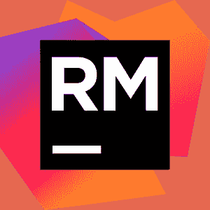
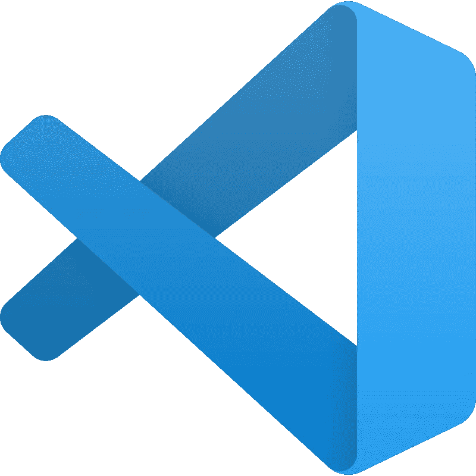

# 用 Ruby (on Rails)开发最好的 IDE 是什么？

> 原文：<https://blog.devgenius.io/what-is-the-best-ide-for-developing-in-ruby-on-rails-57eb80656e5e?source=collection_archive---------0----------------------->

[弗雷迪婚姻](https://unsplash.com/@fredmarriage)在 [Unsplash](https://unsplash.com/photos/vSchPA-YA_A) 上的原图；Tremaine Eto 的插图

Ruby 是最受欢迎的语言之一；2020 年， **42.9%** 的 Stack Overflow 年度开发人员调查受访者表示，他们“[正在使用该语言或技术进行开发，并表示有兴趣继续使用该语言或技术进行开发](https://insights.stackoverflow.com/survey/2020#technology-most-loved-dreaded-and-wanted-languages-loved)

如果你对用 Ruby 开发感兴趣，那么首先会出现的一个问题是，你可以开始使用哪个集成开发环境，或者 IDE。

在这篇文章中，我们将讨论一系列的可能性，并提供一些来自互联网的开发者的意见，这样你就可以根据真实的感受做出明智的决定。

# 只要给我一个答案！

在我看来，对于什么是最好的 Ruby IDE，没有完全正确的答案。

像 Atom 和 Sublime 这样的简单文本编辑器可以很好地工作，但是如果你想要一个除了文本自动完成和代码片段之外的更成熟的 IDE，你可能会想试试 RubyMine。唯一的(而且不是微不足道的)警告是，它不是免费的。

# RubyMine by IntellIJ

来自 [JetBrains](https://www.jetbrains.com/ruby/)

RubyMine 自称是“最智能的 Ruby 和 Rails IDE”。JetBrains 的 IntellIJ 也是一个重量级人物，一直在为多语言的最佳 IDE 进行讨论。也就是说，RubyMine 是一个非常自然的首选探索。[站点](https://www.jetbrains.com/ruby/)宣传的特性包括:

*   在这里下载
*   30 天免费试用
*   第一年 89.00 美元；第二名$ 71.00；第三次 53 美元
*   对 Ruby 和 Rails、JavaScript 和 CoffeeScript、ERB 和 HAML、CSS、Sass 等等的一流支持
*   特定于语言的语法和错误突出显示、代码格式化、代码完成和快速文档
*   智能搜索跳转到任何类、文件或符号，甚至任何 IDE 操作或工具窗口
*   基于 MVC 的项目视图和模型、类和 gem 依赖关系图
*   代码检查验证您的代码是否存在多种类型的可能错误，并通过快速修复选项提供即时改进
*   带有 Ruby、JavaScript 和 CoffeeScript 图形用户界面的调试器
*   使用 Git、SVN、Mercurial 和其他版本控制系统的用户界面

> 如果你习惯了升华，那么继续使用它。它有你需要的一切。但是，对于一个完整的 IDE 来说，RubyMine 是唯一真正的选择。大多数人使用一些基本的代码编辑器，从 vim 到 Atom、Sublime 或 VSCode。

—**/u/**[**Doug c84**](https://www.reddit.com/user/dougc84)**[**/r/ruby**](https://www.reddit.com/r/ruby/comments/cn1ev7/what_is_the_best_ide_for_ruby/ew69zyk/)**

> **我发现 RubyMine 很臃肿，比起它我更喜欢 vscode(我团队的其他人也一样)。所以，不是“唯一真实的选择”，是见仁见智。在一天结束的时候，最重要的是你喜欢用什么，什么能帮助你更有效率。**

**—[**/u/astupidnerd**](https://www.reddit.com/user/astupidnerd)**上** [**/r/ruby**](https://www.reddit.com/r/ruby/comments/cn1ev7/what_is_the_best_ide_for_ruby/ew88gbl/)**

> **比如，rubymine 做了很多开箱即用的东西，定制你的编辑器有点棘手。像源代码查找这样的事情——你完全可以用 ctags 或其他东西来做，但是这远远超出了初学者设置 vim/emacs 的能力。**

**—**/u/**[**twinkle hood**](https://www.reddit.com/user/twinklehood)**on**[**/r/ruby**](https://www.reddit.com/r/ruby/comments/cn1ev7/what_is_the_best_ide_for_ruby/ew6d4ba/)**

> **我几乎从一开始就在做 Rails。因为我是在 vi 上长大的，所以我有一个高度定制的 vim 设置。然后我发现了 Sublime，它从盒子里拿出来，看起来和工作起来就像我试图让 vim 去做的那样。我已经用了大约 10 年了。**
> 
> **很多人提到 RubyMine。我喜欢 JetBrains 的产品。IntelliJ 在我必须进行 Java 开发的那段时间里(谢天谢地，时间很短)保持了我的理智。如果你刚刚开始，RubyMine 可能会帮助你理解 Ruby/Rails 的开发工作流程。但是，当你习惯了之后，与文本编辑器和终端相比，它是一个非常笨重的工具。**
> 
> **话虽如此，我不得不深入修复一个已经过时的第三方 gem，RubyMine 的调试功能让我可以深入到堆栈中，检查发生了什么，而不需要进入 stepping with pry 的杂草中。(尽管我应该学习这些命令。)**
> 
> **总有一天，我可能会把钱花在 JetBrains 的万能账户上。我将在 Windows(工作)和 Mac(个人)上编写一个 ASP.NET 核心应用程序，我将尝试使用愤怒的骑士。**

**—[**【上**【删除】/r/ruby****](https://www.reddit.com/r/ruby/comments/cn1ev7/what_is_the_best_ide_for_ruby/ew7abuz/)**

> **Rubymine。它很贵，但是因为它是付费订阅，所以与经常崩溃的 Eclipse(Java dev)等 ide 相比，您可以获得频繁更新、支持和稳定性的好处。还有 Sublime，emacs 等。不是 IDEs，我不知道人们如何把它们用于职业发展。个人偏好，但我发现崇高的“插件”超级尴尬。如果你刚开始，一定要疯狂地使用它们。不妨用 vi。但我和那些信誓旦旦的人共事过。就个人而言，我更喜欢像 Rubymine 这样有交互式调试器的东西。**

**—**/u/**[**ferritboy**](https://www.reddit.com/user/ferritboy)**[**/r/ruby**](https://www.reddit.com/r/ruby/comments/cn1ev7/what_is_the_best_ide_for_ruby/f0qovg2/)****

> ****…我是一名领导者，从第一天开始就使用 RubyMine，在合适的 IDE 中遍历堆栈和调试代码要容易得多。但直到今天，我从未和其他使用 RubyMine 的人一起工作过，他们做得很好。****

****—[**/u/cheeeeese**](https://www.reddit.com/user/cheeeeeese)**[**/r/ruby**](https://www.reddit.com/r/ruby/comments/chmgb4/ide_suitable_for_beginners/euv7zma/)******

> ****我也会为 RubyMine 插话。它有一个内置的调试器，支持的不仅仅是 Ruby(至少在编辑方面)。这是我见过的少数几个很好地支持黄瓜的 IDEs 之一。****

****—[**/u/Jdonavan**](https://www.reddit.com/user/Jdonavan)**[**/r/ruby**](https://www.reddit.com/r/ruby/comments/chmgb4/ide_suitable_for_beginners/euvd9l6/)******

> ****…我是一名全职的 Ruby 开发人员，已经测试了许多不同的选项。RubyMine 提供了迄今为止最完整的开箱即用体验——包括 linters、跳转到函数定义、与 Rubocop 的集成(检测难看的代码)等等。****
> 
> ****唯一的问题是这要花钱。这本身并不可怕，但是很难推荐一个新手去购买 IDE。如果你发现它的价格标签太不友好——带插件的 Atom(linter+Ruby linter+rubo COP)可以完成这项工作。最起码我以前专业用过。问题是，开箱后它只提供了 RubyMine 的一小部分功能，而且还不够无缝。****

****—[**/u/ziptofaf**](https://www.reddit.com/user/ziptofaf)**[**/r/ruby**](https://www.reddit.com/r/learnprogramming/comments/bgxja3/ruby_best_ide/elosopr/)******

# ****虚拟代码****

********

****公有土地****

****VSCode 之所以受欢迎，很大程度上是因为它是免费的，但也因为它是一个跨多种语言的非常称职的编辑器。对于 Ruby 来说，这没有什么不同。****

*   ****点击此处下载 VSCode****
*   ****下载插件[这里](https://marketplace.visualstudio.com/items?itemName=rebornix.Ruby)****
*   ****自由的****
*   ****来自[插件站点](https://marketplace.visualstudio.com/items?itemName=rebornix.Ruby)，功能包括:****
*   ****自动 Ruby 环境检测，支持 rvm、rbenv、chruby 和 asdf****
*   ****通过 RuboCop、Standard 和 Reek 提供 Lint 支持****
*   ****通过 RuboCop、Standard、Rufo 和 RubyFMT 的格式支持****
*   ****语义代码折叠支持****
*   ****语义高亮支持****
*   ****基本智能感知支持****
*   ****代码自动完成****
*   ****航行****
*   ****调试工具****

> ****有趣的是，我使用 VS 代码，但是对我来说它明显比 atom 慢。对于大型 fixture 文件，我必须在 atom 中打开它们，如果我试图在 vscode 中打开它们，它会冻结。不过，这可能更多的是与扩展有关，而不是实际的编辑器。****

****—**/u/**[**Kritnc**](https://www.reddit.com/user/Kritnc)**[**/r/ruby**](https://www.reddit.com/r/ruby/comments/cn1ev7/what_is_the_best_ide_for_ruby/ewa9qa3/)******

> ****与 rubymine 相比，自动完成是相当垃圾的，你不能在 vs 代码本身中运行你的测试，不同的测试环境设置，更好的代码搜索/峰化，包括你所有的库，语法高亮更加直观，当一个字符串实际上是 html 或 sql 或什么的时候可以识别。****
> 
> ****老实说，对我来说，vs 代码的障碍是它不识别 heredocs，这意味着如果你使用撇号，文档其余部分的所有语法高亮都是[咒骂语]。有人为此大做文章..2 年前，没有做任何事情，因为开源。****
> 
> ****也就是说，如果我必须自己付钱，我不知道我是否会使用它****

****—**[**/u/pVom**](https://www.reddit.com/user/pVom)**[**/r/ruby**](https://www.reddit.com/r/ruby/comments/cn1ev7/what_is_the_best_ide_for_ruby/ew8y8m6/)********

> ****VS 代码拥有 imo 最好的特性。感觉比 Rubymine 灵敏一百万倍。Sublime 和 Atom 在感觉和功能上很相似，但是缺乏相同级别的社区活动。从 Sublime 或 Atom 到 VS 代码非常容易；后两者似乎明显受到了 Sublime 的启发。****
> 
> ****内置终端非常有价值(不需要任何扩展)。有大量的社区支持，定制 IDE 似乎比我用过的其他 IDE 更容易/更直观。我已经有了一堆插件，我甚至不再去想它们，因为它们只是我工作流程的一部分。我使用一个插件从 VS 代码内部使用 VIM 编辑器命令。****

****— [**由/r/ruby**](https://www.reddit.com/r/ruby/comments/cn1ev7/what_is_the_best_ide_for_ruby/ew827ko/) 上的【删除】****

> ****带有 Ruby 插件的 Visual Studio 代码是一个很好的起点，但是如果你认真的话，没有比 RubyMine 更好的了。****

****—**/u/**[**rainy night 65**](https://www.reddit.com/user/rainynight65)**[**/r/ruby**](https://www.reddit.com/r/ruby/comments/cn1ev7/what_is_the_best_ide_for_ruby/ew67fjt/)******

# ****崇高****

********

****来源(WP:NFCC#4)，合理使用，[维基百科](https://en.wikipedia.org/w/index.php?curid=55236299)****

****Sublime 是一个简单而强大的文本编辑器，你可以在几分钟内开始使用，对于 Ruby 来说，它对于很多用途来说已经足够好了。****

*   ****在这里下载****
*   ****自由的****
*   ****语法突出显示****
*   ****文件浏览器选项卡****
*   ****跳转到文件键盘快捷键****

> ****喜欢的话还是可以用 Sublime 的。我大部分时间都在里面做按摩。Solargraph 的 LSP 插件可以让你获得和 Ruby 一样多的自动完成功能。Terminus 也很有帮助，您可以使用它为 rake 任务打开一个快速终端，并作为 Sublime build 系统输出的处理程序，我只需按一个键就可以运行 RSpec。****
> 
> ****VSCode 稍微圆滑一点，但是 Sublime 可以匹配大多数重要的函数，而且速度快一个数量级。****
> 
> ****我没有太多的插件或专门的配置，但这里有一些片段可能会帮助你。****
> 
> ******外挂******
> 
> ****- Gitignored 文件排除程序****
> 
> ****- LSP****
> 
> ****-终点站****
> 
> ****折纸****
> 
> ****-升华者****
> 
> ****-打字稿****
> 
> ******LSP******
> 
> ****`{
> "auto_show_diagnostics_panel": true,
> "show_code_actions_bulb": true,
> "clients": {
> "lsp-tsserver": {
> "enabled": true
> },
> "ruby": {
> "enabled": true
> },
> }
> }`****
> 
> ****下面是我运行 RSpec(在 terminus 视图中打开)的快速构建任务****
> 
> ****`{
> "title": "RSpec",
> "cmd": ["bundle", "exec", "rspec"],
> "working_dir": "${project_path:${folder}}",
> "selector": "source.ruby.rspec",
> "target": "terminus_open",
> "panel_name": "RSpec",
> "auto_close": false,
> "variants": [
> {
> "name": "Current File",
> "cmd": ["bundle", "exec", "rspec", "$file"],
> }
> ]
> }`****
> 
> ****我使用 [asdf](https://github.com/asdf-vm/asdf-ruby) 来管理 Ruby 和 Node 版本，并将 solargraph 添加到我的$HOME/中。默认-gems，所以当我安装一个新版本时它总是可用的。我相信 rbenv 和 rvm 有一个相似的特性。****
> 
> ****注意，我用 Linux，有时候用 MacOS。如果你使用的是 Windows/WSL，你最好使用 VSCode 及其特殊的 WSL 插件****

****—**/u/**[**milk ohol**](https://www.reddit.com/user/milkohol)**[**/r/ruby**](https://www.reddit.com/r/ruby/comments/cn1ev7/what_is_the_best_ide_for_ruby/ew6aio3/)******

> ****我使用 SublimeText，主要是因为我已经使用了多年，它对我很有效，我不能说它是目前可用的最好的东西(当我开始使用 st 时，Atom 和 VS 代码都不存在)。我认为非常有价值的东西包括正确的语法高亮显示(ruby、html 和 css，包括 erb 和 scss)、SublimeText 上的文件浏览器选项卡和 command-p 跳转到任何文件。不知道 vim/MacVim 有没有类似的东西或者可以设置有。****

****—**[**/u/jrochkind**](https://www.reddit.com/user/jrochkind)**[**/r/ruby**](https://www.reddit.com/r/ruby/comments/7vx11m/idetools_for_first_ruby_job/dtw96f0/)********

# ****原子****

********

****来自 [Atom 博客](https://blog.atom.io/2017/09/12/announcing-atom-ide.html)****

****Atom 是另一个简单的文本编辑器，是 Sublime Text 的直接竞争对手。****

*   ****在这里下载****
*   ****在这里下载 ide-ruby****
*   ****自由的****
*   ****使用 ide-ruby，您可以(通过网站)获得:****
*   ****完成建议****
*   ****大纲视图****
*   ****跳到定义****
*   ****使用 rubocop 的林挺****

> ****Atom 非常快，也非常简单。您可以下载并开始使用。****
> 
> ****VSCode 拥有许多你期望一个完整的 IDE 所拥有的东西，以及许多可以使用的设置。如果目标是先学习 ruby，然后再考虑合适的文本编辑器，那就不值得了。****

****—[**/u/TODO _ get life**](https://www.reddit.com/user/TODO_getLife)**[**/r/ruby**](https://www.reddit.com/r/ruby/comments/chmgb4/ide_suitable_for_beginners/euv6w4e/)******

> ****我也用 atom，主要是懒得学 vscode 的快捷键。****
> 
> ****[谈到扩展]我想我只使用块突出，没有发现任何其他有用的。****

****— **/u/** [**上的**](https://www.reddit.com/user/ImAJalapeno)[**/r/红宝石**](https://www.reddit.com/r/ruby/comments/cn1ev7/what_is_the_best_ide_for_ruby/ew78mta/)****

> ****Atom 比其他所有编辑器都慢。但是直到你在一个有几十万个文件的大项目中，它才真正被注意到。****
> 
> ****VSCode 的启动和 Atom 一样简单:只安装基本插件。****

****—[**/u/dougc 84**](https://www.reddit.com/user/dougc84)**[**/r/ruby**](https://www.reddit.com/r/ruby/comments/chmgb4/ide_suitable_for_beginners/euxnkwi/)******

> ****如果您决定走 Atom 路线，本文推荐了一些值得使用的插件:****
> 
> ****[https://medium . com/@ distillerytech/moving-from-ruby mine-to-atom-5d 551 efcb 49d](https://medium.com/@distillerytech/moving-from-rubymine-to-atom-is-it-worth-the-effort-5d551efcb49d)****

****—[**/u/ziptofaf**](https://www.reddit.com/user/ziptofaf)**[**/r/ruby**](https://www.reddit.com/r/learnprogramming/comments/bgxja3/ruby_best_ide/elosopr/)******

# ****精力****

********

****GNU 通用公共许可证****

****对于那些已经习惯了 Vim 的用户(以及那些非常忠实于 Vim 的用户),不用担心:Ruby 与 Vim 配合得非常好。****

*   ****在这里下载****
*   ****vim-ruby 下载[这里](https://github.com/vim-ruby/vim-ruby)****
*   ****根据 vim-ruby [资源库](https://github.com/vim-ruby/vim-ruby)，特性包括:****
*   ****语法突出显示****
*   ****刻痕****
*   ****全能****
*   ****各种有用的工具和映射****
*   ****自由的****

> ****你最好的编辑是你最了解的人。对我来说，那就是 vim，而且是在投入时间学习它之后。****

****—**/u/**[**tobe portable**](https://www.reddit.com/user/tobeportable)**on**[**/r/ruby**](https://www.reddit.com/r/ruby/comments/cn1ev7/what_is_the_best_ide_for_ruby/ew65d1l/)****

> ****我使用 vim，但我要说的是:如果你完全从零开始使用 ruby 和 vim，你基本上是在传奇/精英模式下开始游戏，因为你将同时学习两件事。Vim 很棒，但是与纯文本编辑器相比，它的学习曲线非常高。****
> 
> ****这不是不可能的…我做到了，但我是一个惩罚的饕餮者，我有那种气质，我不一定介意无休止的沮丧，直到我找到一个解决方案(我发现这是有益的，实际上，它巩固了你的记忆)。****
> 
> ****就像你知道的那样。****

****—**/u/**[**j4yne**](https://www.reddit.com/user/j4yne)**[**/r/ruby**](https://www.reddit.com/r/ruby/comments/cn1ev7/what_is_the_best_ide_for_ruby/ew85lxa/)******

> ****Vim 在 ruby 社区相当受欢迎，有很多好的插件，所以我不确定是否有很大的改变需要。Upcase 有很好的中级内容，在切换到 rails dev 和使用 tmux/vim 时帮助了我****

****—[**【上**【删除】/r/ruby****](https://www.reddit.com/r/ruby/comments/7vx11m/idetools_for_first_ruby_job/dtvy1ev/)****

> **我认为 vim/tmux 是一个很棒的 ruby 编辑器。你可以阅读帮助文档，想深入到什么程度就深入到什么程度，但是要开始使用几个插件(比如你提到的 NERDTree)就可以了。除非你在使用 vim 时有问题，否则我建议你坚持使用它。**
> 
> **我们都很幸运有一些令人惊讶的文本编辑器可供选择。这里列出的所有人都很有能力。重要的是精通你选择的任何一个编辑器。**

**—**[**/u/azendent**](https://www.reddit.com/user/azendent)**on**[**/r/ruby**](https://www.reddit.com/r/ruby/comments/7vx11m/idetools_for_first_ruby_job/dtwhsft/)****

# ****Emacs****

********

****GNU 通用公共许可证****

****如果没有 Emacs，你根本不能提到 Vim，以免激怒 Emacs 用户。事实证明，对于当前的 Emacs 用户来说，Emacs 与 Ruby 配合得很好。****

*   ****在此下载[这里](https://www.gnu.org/software/emacs/download.html)****
*   ****这里是使用 Emacs 开始使用 Ruby 的有用资源****

> ****对我来说，它是带有 robe 的 emacs，ruby-mode，ruby test 和其他一些。你有一个运行中的 repl，它加载并了解你的整个项目，因此在这样一种动态语言中，它可以给你比静态分析器更好的工具。此外，在 repl 中测试一些代码以获得即时反馈非常容易和方便。我也试过 vim，也很满意。不过，对于 ruby mine，我真的看不出比更便宜、更轻量级的编辑器有什么好处。****

****—[**/u/FabiusII**](https://www.reddit.com/user/FabiusII)**[**/r/ruby**](https://www.reddit.com/r/ruby/comments/cn1ev7/what_is_the_best_ide_for_ruby/ew69iyd/)******

> ****如果你是认真的，安装 Emacs，花两周时间学习 eLisp。在那之后，你的余生将不再需要任何其他编辑器或 IDE。****

****—[**/u/阿尔克里欧**](https://www.reddit.com/user/aarkerio)**[**/r/红宝石**](https://www.reddit.com/r/ruby/comments/7vx11m/idetools_for_first_ruby_job/dtvuhk2/)******

****说了这么多，希望您对不同 ide 和文本编辑器的优缺点有更好的了解。祝你用 Ruby 编程好运！****

**** [## 通过我的推荐链接加入媒体

### 作为一个媒体会员，你的会员费的一部分会给你阅读的作家，你可以完全接触到每一个故事…

tremaineeto.medium.com](https://tremaineeto.medium.com/membership)****