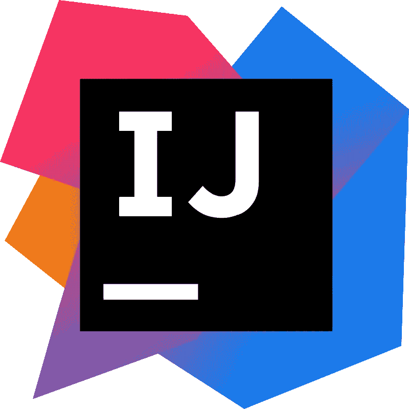
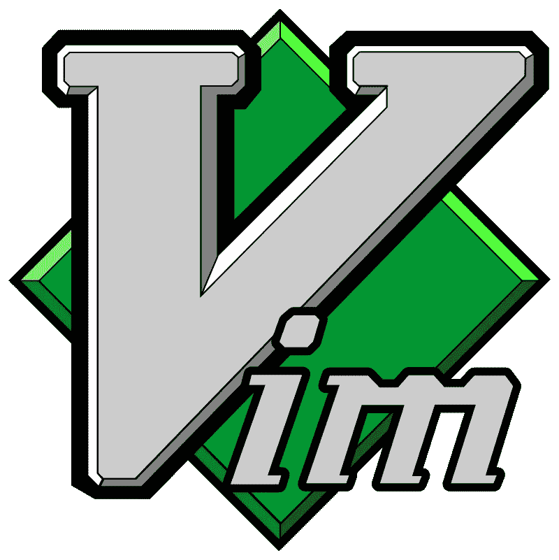

# 用 Scala 开发最好的 IDE 是什么？

> 原文：<https://blog.devgenius.io/what-is-the-best-ide-for-developing-in-scala-4620c67ef7ec?source=collection_archive---------0----------------------->

[Jesus Kiteque](https://unsplash.com/@jesuskiteque?utm_source=unsplash&utm_medium=referral&utm_content=creditCopyText) 在 [Unsplash](https://unsplash.com/s/photos/coding?utm_source=unsplash&utm_medium=referral&utm_content=creditCopyText) 上的原始照片；Scala logo [CC BY 4.0](https://creativecommons.org/licenses/by/4.0)

如果你刚刚开始使用 Scala 编程，你会遇到每个人都必须面对的问题:我应该使用哪个 IDE？在本文中，我将讨论不同的选择，以及关于什么是最佳集成开发环境的主流互联网观点。

# IntelliJ

公有土地

*   社区版是免费的

使用 Community edition，您可以获得以下内容:

*   编码帮助(突出显示、完成、格式化、重构等。)
*   导航、搜索、关于类型和隐含的信息
*   与 sbt 和其他构建工具的集成
*   测试框架支持(ScalaTest、Specs2、uTest)
*   Scala 调试器、工作表和菊石脚本

一些开发人员可能希望使用终极版。有了终极版，您可以使用分析工具；Spring、Java EE、Micronaut、Quarkus、Helidon 等支持；招摇，开放 API 规范；JavaScript、TypeScript 还有数据库工具，SQL ( [来源](https://www.jetbrains.com/idea/download/#section=windows))。

*   旗舰版免费 30 天，但之后第一年的费用是 149 美元/年；第二年 119 美元；第三年 89 美元
*   非常通用的 IDE，支持 Scala 之外的多种语言
*   通过 [Scala 插件](https://www.jetbrains.com/help/idea/discover-intellij-idea-for-scala.html#UserInterface)

根据我对本文的研究，从纯数字的角度来看，IntelliJ IDEA 无疑是 Scala 开发的最爱。看看 [/u/griningcat](https://www.reddit.com/user/griningcat) 在 [Reddit](https://www.reddit.com/r/scala/comments/aodb76/ide_for_scala/eg06jp4/) 上的这段幽默轶事:

> Intellij 是 Scala 开发者事实上的标准 IDE。事实上，当我在一次会议上遇到开发“ScalaIDE”的人时，他们也在使用 Intellij😁

更多观点请点击此处:

> Intellij 是目前为止我用过的最好的。

—/u/****on[/r/Scala](https://www.reddit.com/r/scala/comments/aodb76/ide_for_scala/eg0485o/)****

> ****IntelliJ 运行良好。然而，它确实会阻塞一些函数库，比如 cats(错误的高亮显示)。
> 我昨天做的事情:如果你使用一个小写的类型参数，就像你在一个匹配表达式中必须做的那样，那么 intellij 不会把它当作一个正确的类型。根据记忆改编:****
> 
> ****`sealed trait FunctionAndArgument
> case class FunctionAndArgumentImpl[A](function: A => String, argument: A) extends FunctionAndArgument
> def callFunction(faa: FunctionAndArgument) = faa match {
> case faai: FunctionAndArgumentImpl[a] => faai.function(faai.argument) // intellij gives an error highlight here
> }`****
> 
> ****解决方法是声明一个大写类型并再次匹配:****
> 
> ****`def callFunction(faa: FunctionAndArgument) = faa match {
> case faai: FunctionAndArgumentImpl[a] =>
> type A = a
> val FunctionAndArgumentImpl(function, argument): FunctionAndArgumentImpl[A] = faai
> function(argument)
> }`****
> 
> ****…它可以在 scalac 和 Eclipse/Scala-IDE 中工作。****
> 
> ****如果模式中的某个东西以大写字母开头，那么它就是你要匹配的常量，如果它以小写字母开头，那么它就是你要提取的值。即使对于类型参数也是如此，这是我写的代码的全部要点(类型`A`是“隐藏的”——如果你有一个`FunctionAndArgument`，你知道参数与函数采用的类型相同，但你不知道那是什么类型——然后当我们将它作为`a`进行模式匹配时，我们就可以访问那个类型)。****

****—/u/[**m50d**](https://www.reddit.com/user/m50d)on[/r/Scala](https://www.reddit.com/r/scala/comments/aodb76/ide_for_scala/eg0ymr8/)****

> ****IntelliJ 但是如果可能的话，最好在你的机器上有 16 GB 的内存。8GB 有点薄，尤其是对于一个更大的项目。****

****—/u/[**yawaramin**](https://www.reddit.com/user/yawaramin)on[/r/Scala](https://www.reddit.com/r/scala/comments/aodb76/ide_for_scala/eg288dy/)****

> ****我的理解是，就成熟的 ide 而言，IntelliJ 是目前最好的——但它也存在一些问题。错误报告的误报(错过一些，发明另一些)，明显无法解释宏，复杂情况下可怕的类型推断(scalaz 混淆了它的*地狱*)…如果你习惯于 IntelliJ for Java 开发，你也会注意到事情明显变慢了——一个常见的解释是 Scala 的一行对应于几行到几十行 Java。不管是什么原因，它远没有这么快，以至于我有时不得不等待语法高亮显示(我运行的是顶级的 macbook)。****

****—/u/[**nrin audo**](https://www.reddit.com/user/nrinaudo)**on[/r/Scala](https://www.reddit.com/r/scala/comments/2x3dhd/which_ide_do_you_use_with_scala/cowji3t/)******

> *******我使用 IntelliJ for Scala 已经快 5 年了，我对它非常满意。当然，它需要偶尔思考一下，但是 Scala 编译器也是如此。它做大量繁重的分析——当然它需要思考。*******
> 
> *******我推荐坚持使用 IntelliJ。我从未见过任何人在 Vim 或 Emacs 中做了我不能轻松做到的事情，比如用 IntelliJ &多游标做得更快。另一方面，IntelliJ 可以做很多纯文本编辑器做不到的事情——比如重构，用正确的类型注释给值赋值，非常容易地查找内容，点击查看实现，我可以再继续做 20 分钟:P 老实说，我认为如果你回到文本编辑器，你会错过的。*******
> 
> *******我认为你在演示文稿中看到人们使用文本编辑器而不是 ide(也就是 IntelliJEclipse 不是竞争对手(tbh)，是因为它们通常展示一些非常核心的类别理论/类型级编程，当你将类型系统推向极限时，IntelliJ 可能不会给你带来太多好处。你仍然可以使用它，但它可能会给你一些假阴性(“良好的红色代码”)，这可能是恼人的。在这些情况下，ENSIME 可能会做得更好。但是除非你是在库工程师的水平上进行类型级编程，否则我认为 IntelliJ 的分析器将在 99.5%的时间内覆盖你。不管怎样，这是我的看法..*******

******—/u/[**dr Fisk**](https://www.reddit.com/user/drfisk)**on[/r/Scala](https://www.reddit.com/r/scala/comments/7dqtwc/replacing_intellij_with_emacs_for_scala/dq085bk/)********

# ******Scala IDE 又名 Eclipse******

************

******徽标由 Eclipse 的 Scala IDE 提供。******

******虽然 IntelliJ IDEA 似乎是人们的冠军，但仍然有其他 IDE 存在，Scala IDE 是其中之一，可能会挑战一些人的宝座。******

*   ******自由的******
*   ******点击[下载网站](http://scala-ide.org/)******
*   ******支持混合 Scala/Java 项目******
*   ******代码完成******
*   ******语义突出显示******
*   ******定义/隐式超链接******
*   ******错误标记******
*   ******Scala 调试器******

> ******大多数人会说 IntelliJ，但我会投票支持 Scala IDE。******
> 
> ******如果您将构建委托给 SBT(在一个单独的终端会话中)并使用 IDE 进行表示编译器，那么它会工作得很好——很少出现虚假错误(我认为这在 IntelliJ？)，当他们这样做时，你可以很容易地将*重启演示编译器*绑定到一个热键，比如 *ctrl-backspace* 。******
> 
> ******混合的 Scala/Scala.js 项目相当无缝，并且 *sbt-eclipse* 将生成您的。classpath/。给你的项目文件。尽管御光术放弃了这个项目，但我们中的一小群人仍在继续。如果你喜欢 Eclipse，这是一个选择。******
> 
> ******Scala 2.13 支持是 WIP，但它会发生。******
> 
> ******否则，VS Code + Dottyy/Scala 3 似乎就是未来。******

******—/u/[**expat coder**](https://www.reddit.com/user/expatcoder)**on[/r/Scala](https://www.reddit.com/r/scala/comments/aodb76/ide_for_scala/eg0jw3r/)********

> ******不要像我一样在月蚀上浪费时间******

******—/u/[**novel mirror**](https://www.reddit.com/user/NovelMirror)**on[/r/Scala](https://www.reddit.com/r/scala/comments/aodb76/ide_for_scala/eg03g33/)********

> ******…我已经在实际项目中使用 scala-ide 和 intellij 几个月了，scala-ide 看起来更加完整、一致。******
> 
> ******也就是说，当您大量使用 Scalaz 和 Shapeless 这样的重类型库时，表示编译器真的会很困难(甚至崩溃)。******

******— /u/ [**对抗**](https://www.reddit.com/user/againstmethod) **[/r/scala](https://www.reddit.com/r/scala/comments/2x3dhd/which_ide_do_you_use_with_scala/cowohen/) 上的** 方法******

> ****我用 Eclipse。它很笨拙，但是 IntelliJ 的隐喻和用户界面从来都不符合我的想法。直到最近，IntelliJ 在我的平台 Linux 上看起来像个傻瓜。我的一些同事使用 IntelliJ 一般来说，我们报告的问题数量相同，只是问题不同。****
> 
> ****IntelliJ 使用自己的 Scala 解析器，有时会给出虚假的红色曲线。这成为我的团队的一个问题，因为我们必须避免某些有效的、非疯狂的习惯用法，只是因为 IntelliJ 不能处理它们。Eclipse 使用 scalac，所以它没有这个问题(尽管它也可以报告虚假错误)。****
> 
> ****IntelliJ 的工作流程只是我每次尝试的时候都觉得怪怪的；尽管 Eclipse 有很多缺点，但它更有意义。其他人的报告正好相反，YMMV。****
> 
> ****据我所知，IntelliJ 有更多的基本功能。Eclipse Scala 插件的一些粗糙边缘让我怀疑插件开发者是否真的使用了他们自己的工具。他们声称在邮件列表上，但如果是这样，他们的使用模式肯定与我的不同。****

****—/u/[**blarg _ industries**](https://www.reddit.com/user/blarg_industries)**on[/r/Scala](https://www.reddit.com/r/scala/comments/2x3dhd/which_ide_do_you_use_with_scala/coxw886/)******

# ******虚拟代码******

************

******公有土地******

******当谈到 ide 时，VSCode 总是不变地出现在讨论中，而对于 Scala，它实际上并没有什么不同。然而，我在网上找不到这么多关于它的积极情绪。我仍然把它包括在内，以供参考。******

*   ******[Scala (metals)插件可供下载](https://marketplace.visualstudio.com/items?itemName=scalameta.metals)******

> ******[metals]仍然不支持像自动完成这样的 ide 特性。******

******—/u/[**nilskp**](https://www.reddit.com/user/nilskp)**on[/r/Scala](https://www.reddit.com/r/scala/comments/ashl2z/good_enough_scala_language_server_for_vs_code/eh13gky/)********

> ******是的，我试过了，意识到我多么讨厌没有自动导入。所以我现在回到 IntelliJ，但很高兴看到替代品正在增长。******

******— /u/ [**二万**](https://www.reddit.com/user/erwan) 上 [/r/scala](https://www.reddit.com/r/scala/comments/ashl2z/good_enough_scala_language_server_for_vs_code/eguu7pu/)******

# ****Emacs****

********

****GNU 通用公共许可证****

****虽然它不是一个成熟的 IDE，但是如果将 Emacs 排除在讨论范围之外，那将是我的疏忽。****

*   ****可以用 [ensime](https://github.com/ensime/ensime-emacs) ，但是好像已经被弃用了****

****有了这些信息。使用其他插件可能会更好。这里有一种可能性。这里是[另一个](https://github.com/hvesalai/emacs-scala-mode)。这里有一篇来自 2020 年的关于这个话题的[好博文](https://ag91.github.io/blog/2020/10/16/my-emacs-setup-for-scala-development/)。****

*   ****也可以根据/u/[nloyola](https://www.reddit.com/user/nloyola)on[/r/Scala](https://www.reddit.com/r/scala/comments/7dqtwc/replacing_intellij_with_emacs_for_scala/dq9l6nh/)一起使用 [emacs-sbt-mode](https://github.com/ensime/emacs-sbt-mode) 和 [emacs-scala-mode](https://github.com/ensime/emacs-scala-mode) 而无需 ensime****

> ****Emacs 非常适合小型项目/脚本。许多人将它与 Ensime 结合起来，用于自动完成和其他高级 IDE 功能，但我真的不能对此发表评论——我发现它令人不愉快且笨重，并且很久没有使用它了。****

****—/u/[**nrinaudo**](https://www.reddit.com/user/nrinaudo)**on[/r/Scala](https://www.reddit.com/r/scala/comments/2x3dhd/which_ide_do_you_use_with_scala/cowji3t/)******

> ******我是 emacs 的铁杆用户，我仍然使用 IntelliJ for Scala。我试图让 emacs 为 scala 工作，但不幸的是，它无法与 intellij 相提并论。******

******—[上的/u/【删除】/r/scala](https://www.reddit.com/r/scala/comments/7dqtwc/replacing_intellij_with_emacs_for_scala/dq0ahmi/)******

> ******大约四年前，我从 IntelliJ 转到了(space)emacs；我使用 Ensime 已经有一段时间了，但每当我有一个更大的项目(就像我通常在工作中遇到的那些项目)时，它就会在一段时间后冻结，我不得不重新启动它。我没有在 1-2 年内尝试它，所以它可能会更好(我知道 2.0 终于发布了)。对于较小的项目和实验，它工作得很好。******
> 
> ******我认为你是否切换取决于你如何评价调试/代码智能工具，与你能在像 Emacs 这样的编辑器中找到的工具相比；就我个人而言，我发现我很乐意放弃调试器(在我的职业生涯中几乎没有使用过)，自动完成和所有那些模态编辑，vim 键绑定，聪明的文本编辑插件(例如，ace-jump，vim-surround，rainbow-delimiters 等)。)、更少的内存使用、满足我所有编码需求的统一环境(无论我编码的语言支持什么)、基于键盘的布局管理(以你喜欢的任何方式分割屏幕、移动缓冲区、保存配置等)。)，有史以来最好的版本控制集成(magit)以及其他一些东西。的确，我经常写的那种代码涉及到一些类型级编程，我发现 IntelliJ 有时实际上成了一个障碍，因为我不能信任它提供的错误和它推断的类型。******
> 
> ******如果你想走这条路，并且你的项目对 Ensime 来说太大了(或者你不想花时间让它为你的项目正常工作),你将需要学习没有自动完成的编码，这在开始时很难，但令人惊讶的是过一会儿就没那么难了。当你需要记住一个函数的名字或者一个对象包含什么函数时，我可以建议在键盘快捷键上放一些像 Dash for MacOS 这样的东西来快速浏览一个统一的 scaladocs 集合。在代码库中移动可以被像“在项目中搜索”和最小正则表达式这样的函数的巧妙使用所取代。重命名符号仍然可以通过正则表达式和基于文本的交互来完成，尽管这没有使用代码智能那么可靠。******
> 
> ******最后，我在这个设置中最想念的是“点类型”，即知道代码中某个标识符的类型的方法、语义重命名和自动完成。我期待 scalameta/language-server 与一些 Emacs 语言服务器客户端的结合，以获得更好的工具。尽管如此，如果你在开始时对学习曲线有一点耐心，并且有时间按照你喜欢的方式定制东西，这是一种完全可行的编码方式。******
> 
> ******不管大多数人怎么说，没有什么能阻止任何人在老式 IDE 中像在 IntelliJ 中一样高效。******

******—/u/[**Astr4c**](https://www.reddit.com/user/Astr4c)**on[/r/Scala](https://www.reddit.com/r/scala/comments/7dqtwc/replacing_intellij_with_emacs_for_scala/dq33agc/)********

# ******精力******

************

******GNU 通用公共许可证******

*   ******Derek Wyatt +贡献者为 Vim 开发的 Scala [插件](https://github.com/derekwyatt/vim-scala)******
*   ******Eric Van Dewoestine 为 Vim 开发的 Eclim [插件](http://eclim.org/vim/scala/index.html)******

> ******我使用 Vim 和 [Eclim](http://eclim.org/) ，这基本上是一个 Vim 插件，可以和一个无头 Eclipse 对话。我尝试过 Intellij 和 Eclipse/ScalaIDE，但是由于我大量使用了 vagger，它们的内存消耗对我来说经常是个问题。Eclim 的 Scala 支持包括代码完成、验证、跳转到声明和自动导入——所有这些都来自 Vim。我发现与 Derek Wyatt 的 [Scala 插件](https://github.com/derekwyatt/vim-scala)(用于语法突出显示)结合使用，它提供了我需要的一切，没有我不需要的东西。如果你有兴趣尝试一下，我在这里放了一个小小的安装文档:******
> 
> ******[https://gist.github.com/seansawyer/9e13a2d5a6887cd0f296](https://gist.github.com/seansawyer/9e13a2d5a6887cd0f296)******

******—/u/[**hateskudzu**](https://www.reddit.com/user/hateskudzu)**on[/r/Scala](https://www.reddit.com/r/scala/comments/2x3dhd/which_ide_do_you_use_with_scala/cowp0io/)********

> ******我使用 Vim 和 Conque 插件，所以我在开发时运行我的项目的 SBT 控制台。这给了我一个差版本的“自动完成”(来自 REPL)，我可以粘贴回来，第四，因为我的东西功能的方式我想要的。******
> 
> ******[http://i.imgur.com/Cu0p0YA.png](http://i.imgur.com/Cu0p0YA.png)******
> 
> ******我也有工作的 jdb 集成，所以我可以逐步通过 Vim******

******—/u/[**runt1 me**](https://www.reddit.com/user/runT1ME)**on[/r/Scala](https://www.reddit.com/r/scala/comments/2x3dhd/which_ide_do_you_use_with_scala/cowx3ga/)********

******因此，尽管 IntelliJ 获得了大量支持，但事实证明这并不是唯一的选择。我可能会先尝试 IntelliJ IDEA 社区版，然后看看它是否在某些方面有所欠缺；如果是，那么也许你可以试试 Scala IDE。如果您已经使用了 Vim 和/或 Emacs，那么您当然也可以从那里开始(尽管我们确实看到一些评论者说甚至他们也使用 IntelliJ)。******

****** [## 通过我的推荐链接加入媒体

### 作为一个媒体会员，你的会员费的一部分会给你阅读的作家，你可以完全接触到每一个故事…

tremaineeto.medium.com](https://tremaineeto.medium.com/membership)******