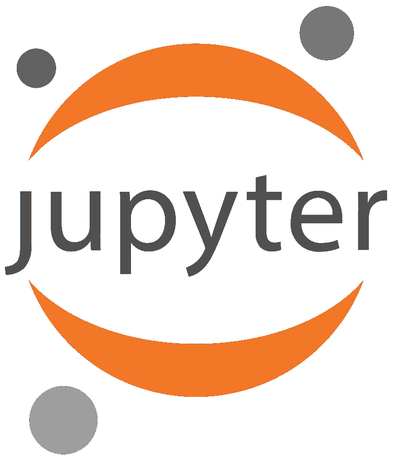

# 在 Julia 中开发最好的 IDE 是什么？

> 原文：<https://blog.devgenius.io/what-is-the-best-ide-for-developing-in-the-programming-language-julia-484c913f07bc?source=collection_archive---------0----------------------->

杰斯·贝利在 [Unsplash](https://unsplash.com/s/photos/computer?utm_source=unsplash&utm_medium=referral&utm_content=creditCopyText) 上的照片；茱莉亚标志由茱莉亚项目——【https://julialang.org】[，公共领域，](https://julialang.org)[链接](https://commons.wikimedia.org/w/index.php?curid=87405047)

根据 [Stack Overflow 2020 开发者调查](https://insights.stackoverflow.com/survey/2020#technology-most-loved-dreaded-and-wanted-languages)，今年最受欢迎的语言是 Rust、TypeScript、Python、Kotlin、Go 和… *Julia* ？

没错— [Julia](https://julialang.org/) 是一种崭露头角的语言，它在 2012 年首次出现，所以熟悉它可能是值得的。首先，您需要一个 IDE，这篇文章为您提供了可用 IDE 的概述以及围绕它们的一般互联网时代精神。

# 只是想要答案？

总的来说，我的发现表明 Julia 非常欢迎各种各样的想法，并不一定会以这种或那种方式引导你。这可以归结为用户的偏好，包括你觉得什么在你的电脑上是有效的，你以前习惯使用什么产品，等等。

你可以遵循这个总的思维流程图，然后:

你喜欢 **VSCode** 吗？先试试那个。

你使用 **Vim** 还是 **Emacs** ？试试这个。

你用**崇高**吗？试试这个。

你用的是**原子**吗？然后使用 Juno，它是基于 Atom 构建的。

以上都不是？我会尝试使用 **Juno** 或 **VSCode —** 无论如何，它们在这一点上非常相似。

# 朱诺

公共领域图片由 [∁ormullion](https://www.flickr.com/photos/153311384@N03/) 在 [Flickr](https://www.flickr.com/photos/153311384@N03/40912381892) 上发布

*   [主站点](https://junolab.org/)
*   自由的
*   “画布编程”风格:“笔记本电脑的探索能力与 IDE 的生产力”
*   基于 Atom 构建，因此共享 Atom 的许多属性
*   多个光标
*   模糊文件查找
*   Vim 按键绑定
*   预包装有 [JuliaPro](https://juliacomputing.com/products/juliapro)

> Juno 是为 Julia 开发的最成熟的 IDE。我挺喜欢的。

—[**ChrisRackauckas**](https://www.reddit.com/user/ChrisRackauckas)**[**/r/Julia**](https://www.reddit.com/r/Julia/comments/8icbvd/ide_for_julia_that_is_similar_to_rstudio/dyruud4/)**

> **要是 Atom 在老式笔记本电脑上不那么迟钝就好了。使用 Juno，我怀念崇高文本的响应能力和速度。**

**—[**4-Vektor**](https://www.reddit.com/user/4-Vektor)**[**/r/茱莉亚**](https://www.reddit.com/r/Julia/comments/8icbvd/ide_for_julia_that_is_similar_to_rstudio/dyruud4/)****

> ****我使用 Juno，但我希望有一个替代产品。Atom 是一个很棒的工具，所以我不喜欢我必须将接口专门用于一种语言。此外，在 Juno 中，没有很好的方式来与表进行交互或可视化，内联视图感觉很笨拙。朱莉娅参加 RStudio 或 Rodeo 会很棒。****

****—[**heckarstix**](https://www.reddit.com/user/heckarstix)**或**[**/r/Julia**](https://www.reddit.com/r/Julia/comments/78rr2e/what_text_editors_do_you_use/)****

> ****对于探索想法，Juno 非常棒，因为我可以使用绘图窗格进行图形输出。****

****—****[**/r/Julia**](https://www.reddit.com/r/Julia/comments/78rr2e/what_text_editors_do_you_use/)********

> ****…考虑到 Juno 上的启动时间比 VSCode 慢一点，这让我在使用几周后很恼火，而且 Juno 有点接管 Atom，使它非常以 Julia 为中心，所以如果您使用其他语言，它会成为浪费的空间。****

****——[**bionic DNA**](https://www.reddit.com/user/bionicdna)**上**[**/r/Julia**](https://www.reddit.com/r/Julia/comments/grqzaz/ide_for_julia/)****

> ****我自己从来没有得到过 Atom 的 Juno。非常糟糕。我现在所做的只是在屏幕的左窗格显示一个文本编辑器，在屏幕的右窗格显示一个 Julia 控制台。如果他们没有去掉“whos”命令，我可以只使用那个设置。****

****[**—radio nul**](https://www.reddit.com/user/radionul)**on**[**/r/Julia**](https://www.reddit.com/r/Julia/comments/grqzaz/ide_for_julia/)****

> ****我是 atom/Juno IDE 的忠实粉丝。感觉它在 sublime text 中重现了一些我最喜欢的功能，以及 Matlab 中的命令窗口。****

****—[**woobwoobwoob**](https://www.reddit.com/user/woobwoobwoob)**[**/r/Julia**](https://www.reddit.com/r/Julia/comments/ea74zj/recommended_ide/)******

> ****重要的一点是，Juno 中有一个非常好的文档和工作区面板，您可以在其中检查“会话”函数、变量、模块等的所有内容****

****——[**约瑟尔姆 17**](https://www.reddit.com/user/joseRLM17)**[**/r/朱丽亚**](https://www.reddit.com/r/Julia/comments/ea74zj/recommended_ide/)******

> ****面向 Atom 的 Juno 可能是您最好的起点。您可以尝试使用 VSCode，看看自己是否更喜欢它，但从使用 Juno 开始肯定更容易。****

****—[**MrMehawk**](https://www.reddit.com/user/MrMehawk)**on**[**/r/Julia**](https://www.reddit.com/r/Julia/comments/ea74zj/recommended_ide/)****

# ****虚拟代码****

********

****由微软—从 Visual Studio 代码版本 1.35 捕获，该版本本身可从 code.visualstudio.com 公共域[L](https://commons.wikimedia.org/w/index.php?curid=79495290)T42 下载****

****关于 VSCode 的事情是这样的:根据 DevClass 的 Julia Schmidt 的说法，Julia 的 IDE 扩展几乎与 Juno 的功能相当。微软最近收购了 GitHub，因此 Atom 项目的开发不再像以前那样优先，因为它与 VSCode 形成了自然竞争。****

****如果你着眼于未来，进入 VSCode 生态系统似乎是有意义的。****

*   ****[主站点](https://www.julia-vscode.org/)****
*   ****免费和开源****
*   ****[分机安装说明](https://github.com/julia-vscode/julia-vscode)****
*   ****语法突出显示****
*   ****片段****
*   ****[乳胶碎片](https://github.com/julia-vscode/julia-vscode/wiki/Snippets#latex)****
*   ****[朱丽亚的具体命令](https://github.com/julia-vscode/julia-vscode/wiki/Commands)****
*   ****[综合朱莉娅·REPL](https://github.com/julia-vscode/julia-vscode/wiki/REPL)****
*   ****[代码完成](https://github.com/julia-vscode/julia-vscode/wiki/IntelliSense)****
*   ****[悬停帮助](https://github.com/julia-vscode/julia-vscode/wiki/Information#hover-help)****
*   ****[棉绒](https://github.com/julia-vscode/julia-vscode/wiki/Information#linter)****
*   ****[代码导航](https://github.com/julia-vscode/julia-vscode/wiki/Navigation)****
*   ****运行测试、构建、基准测试和构建文档的任务****
*   ****实验调试器****
*   ****绘图画廊****
*   ****表格数据的网格查看器****
*   ****对 Weave.jl 的集成支持****

> ****当我试用 VSCode 时，我真的很喜欢它，但在我的慢速 Mac 上，它有点慢……:)****

****——****[**/r/Julia**](https://www.reddit.com/r/Julia/comments/78rr2e/what_text_editors_do_you_use/)********

> ****我在某处读到过 Juno 正在转向 VSCode，迫不及待地想看看结果。我不能在 Atom 上使用 WSL，而且不管出于什么原因，在 Julia 文件上启动(即使是简单的)经常很糟糕。****

****——**【删除】上**[**/r/朱丽娅**](https://www.reddit.com/r/Julia/comments/grqzaz/ide_for_julia/)****

> ****这是一个长期目标。现在，Juno 开发人员正在与 vscode-julia 扩展团队合作，以实现奇偶校验功能。****

****—[**Namensplatzhalter**](https://www.reddit.com/user/Namensplatzhalter)**[**/r/Julia**](https://www.reddit.com/r/Julia/comments/grqzaz/ide_for_julia/)******

> ****在 VSCode 中没有工作区面板(我想)，文档通常只在悬停在变量名上时出现(Juno 中也有这一功能)。事实上，JuliaPro 是基于朱诺。我知道从我写的东西来看，Juno 似乎明显比 VSCode 好，但我更喜欢 VSCode，因为它对我来说更快，我并不真正使用这些功能，而是喜欢一些真正快速的“文件处理”和终端交互。****

****—[**joser lm 17**](https://www.reddit.com/user/joseRLM17)**上**[**/r/Julia**](https://www.reddit.com/r/Julia/comments/ea74zj/recommended_ide/)****

> ****我一直在使用 VS 代码，效果很好。IDE 是相当大的程序，我喜欢能够为尽可能多的语言使用相同的 IDE 环境，所以 VS 代码是一个很好的选择。我将它用于 Python、Go、Bash、C、C++和 Julia。通常也用于编辑结构化文本文件，它有很好的 YAML 和 JSON 支持，也有 ansible、ini、xml 等插件。对于所有提到的语言，它都有林挺和符号提示，通常还有类似“跳转到函数声明”或“在项目中查找符号使用”的右击动作。****

****——[**theferrit 32**](https://www.reddit.com/user/theferrit32)**[**/r/Julia**](https://www.reddit.com/r/Julia/comments/ea74zj/recommended_ide/)******

> ****我曾经认为 Atom/Juno 是理想的 Julia IDE，直到有人让我尝试 VSCode，我对它的速度以及预编译隐藏和变量/函数位置潜水的一些简洁功能感到惊讶。另外，VSCode 中的 vim 键绑定比 Atom 中的要先进得多。****
> 
> ****也就是说，我尝试过在 Vim 中进行独立开发，但是像 VSCode 这样的工具所提供的特性集总是把我拉回来。集成调试和变量探索非常好，这些都需要在 VSCode(甚至 Juno)上进行更少的开箱即用配置，这意味着在工业和工作计算机上工作时工作量更少。****

****—[**bionic DNA**](https://www.reddit.com/user/bionicdna)**[**/r/Julia**](https://www.reddit.com/r/Julia/comments/ea74zj/recommended_ide/faqlnie/)******

> ****我确实认为 VS 代码扩展很简单。你所要做的就是安装 VS 代码，然后在 VS 代码中搜索 Julia 扩展，并从 VS 代码中安装它。在大多数情况下，扩展会自动找到您的 Julia 安装，然后它不需要安装任何东西，也就是说，它不会安装任何其他的 Julia 包或类似的东西。****
> 
> ****VS Code 本身是一个非常精简和简单的代码编辑器，特别是与成熟的 Visual Studio 没有任何关系。****

****——[**达维丹霍夫**](https://discourse.julialang.org/u/davidanthoff) **上** [**朱丽亚朗话语**](https://discourse.julialang.org/t/what-if-i-want-a-simpler-ide-for-julia/31142/17)****

# ****朱皮特****

********

****作者 Cameron oel sen—[https://github . com/jupyter/jupyter . github . io/blob/master/assets/main-logo . SVG](https://github.com/jupyter/jupyter.github.io/blob/master/assets/main-logo.svg)，BSD，[链接](https://commons.wikimedia.org/w/index.php?curid=68763478)****

*   ****[主站点](https://jupyter.org/)****
*   ****免费和开源****
*   ****[安装说明](https://jupyter.org/install)****
*   ****支持实时代码、方程式、可视化和叙述性文本****

> ****我…喜欢使用 Jupyter …如果你有 Vim 插件的话，编辑会更容易(用于在代码单元内编辑)。，因为不然编辑工具不多。****

****—****[**/r/Julia**](https://www.reddit.com/r/Julia/comments/78rr2e/what_text_editors_do_you_use/)********

> ****Jupyter 实验室。这对于快速的笔记本工作来说很棒(我已经在家庭作业中广泛使用了它)，但老实说，我不会像一些人所说的那样依靠它来开始。我对 JL 的 Julia 如何引用变量以及如何处理函数和模块感到措手不及。它与纯脚本 Julia 不同，几乎就好像它都是在函数中本地定义的，或者所有内容都是全局的，可以完全访问。如果你决定从 JL 开始，并想知道为什么你不能在没有全局声明的情况下在一个循环中使用一个变量。jl 文件。****

****—[**bio nicdna**](https://www.reddit.com/user/bionicdna)T4[**/r/Julia**](https://www.reddit.com/r/Julia/comments/ea74zj/recommended_ide/faqlnie/)****

# ****Emacs****

********

****作者:Nicolas Petton—[https://git . savanna . GNU . org/cgit/emacs . git/tree/etc/images/icons](https://git.savannah.gnu.org/cgit/emacs.git/tree/etc/images/icons)、GPLv3、 [L](https://commons.wikimedia.org/w/index.php?curid=11203815) [ink](https://commons.wikimedia.org/w/index.php?curid=11203815)****

*   ****[主要部位](https://github.com/JuliaEditorSupport/julia-emacs)****
*   ****[安装说明](https://github.com/JuliaEditorSupport/julia-emacs#installing-from-melpa)****
*   ****自由开放源码****
*   ****随着朱莉娅的发展，Emacs 拥有了所有的特权****

> ****唯一的一个，emacs。朱莉娅模式，只是，它对我来说很好。****
> 
> ****…****
> 
> ****在 emacs 中，我和 Julia 唯一的问题是 ein 对 Julia 不好，所以你仍然需要在浏览器中做笔记本。****

******—【删除】关于**[**/r/Julia**](https://www.reddit.com/r/Julia/comments/78rr2e/what_text_editors_do_you_use/)****

> ****我也在使用 emacs。我喜欢在我所有的写作中使用相同的编辑器(例如，LaTeX，programming ),还有一种非常简洁的组织模式。****

****—[**sebastock**](https://www.reddit.com/user/sebastock)**on**[**/r/Julia**](https://www.reddit.com/r/Julia/comments/78rr2e/what_text_editors_do_you_use/)****

> ****我用 Emacs 作为编辑器，用 tmux 作为 IDE。****

****——****[**/r/朱丽娅**](https://www.reddit.com/r/Julia/comments/78rr2e/what_text_editors_do_you_use/)********

> ****我本来不想建议使用 emacs，但是如果您已经熟悉了它，我肯定会推荐您在 julia 开发中使用 emacs。最简单的设置就是使用[https://github.com/tpapp/julia-repl 20](https://github.com/tpapp/julia-repl)但是我也发现一旦设置好[https://github.com/dzop/emacs-jupyter 21](https://github.com/dzop/emacs-jupyter)这也是在 emacs 中使用 julia(和其他 jupyter 兼容语言)的一个非常好的方法。****

****——[**石匠**](https://discourse.julialang.org/u/Mason)**[**朱丽亚郎话语**](https://discourse.julialang.org/t/what-if-i-want-a-simpler-ide-for-julia/31142/17)******

# ****精力****

********

****由用户:D0ktorz —在 SVG、GPL、 [L](https://commons.wikimedia.org/w/index.php?curid=1228427) [ink](https://commons.wikimedia.org/w/index.php?curid=1228427) 中返工****

*   ****[主站点](https://github.com/JuliaEditorSupport/julia-vim)****
*   ****[安装说明](https://github.com/JuliaEditorSupport/julia-vim/blob/master/INSTALL.md)****
*   ****免费和开源****
*   ****茱莉亚发展的所有好处****

> ****要在 REPL 中快速编辑文件，Vim/MacVim(通过 Julia 的`edit`功能)非常快捷简单，你不必离开终端。使用 OhMyREPL 使使用 REPL 变得非常愉快。****

****——****[**/r/茱莉亚**](https://www.reddit.com/r/Julia/comments/78rr2e/what_text_editors_do_you_use/)********

> ****我用的是 vim/nvim + Julia 插件+ vim slime + vim pandoc。我现在没有做大量的朱莉娅，但我喜欢这个设置，先生。****

****—[**usmcamp 0811**](https://www.reddit.com/user/USMCamp0811)**[**/r/Julia**](https://www.reddit.com/r/Julia/comments/grqzaz/ide_for_julia/)******

> ****老实说，我试过 Atom，但我总是回到 Vim。再加上 tmux 和 vim-slime 真的很不错。尤其是我已经住在维姆了。****
> 
> ****唯一的缺点是 Vim 中的语法突出显示不如预期的好。****

****—[**spaceLem**](https://www.reddit.com/user/spaceLem)**on**[**/r/Julia**](https://www.reddit.com/r/Julia/comments/ea74zj/recommended_ide/fap0m7x/)****

> ****如果你喜欢 emacs，想要简单而不是华而不实，我认为在 emacs 中用`julia-mode`编辑并在标准终端中运行朱莉娅·REPL 是很难的。****

****——[**【GunnarFarneback】**](https://discourse.julialang.org/u/GunnarFarneback)**[**Julia lang 话语**](https://discourse.julialang.org/t/what-if-i-want-a-simpler-ide-for-julia/31142/17)******

# ****崇高的文本****

********

****由来源(WP:NFCC#4)，合理使用，[链接](https://en.wikipedia.org/w/index.php?curid=55236299)****

*   ****[主站点](https://github.com/JuliaEditorSupport/Julia-sublime)****
*   ****[安装说明](https://github.com/JuliaEditorSupport/Julia-sublime#installation)****
*   ****自由的****
*   ****自定义颜色支持****
*   ****去任何地方****
*   ****转到定义****
*   ****多重选择****
*   ****命令选项板****
*   ****分割编辑****

> ****我在一个 xterm 中使用 sublime 的 Julia 插件和一个打开的 REPL，并运行来自另一个 xterm 的东西……最近也是笔记本。****
> 
> ****sublime 是新的 emacs))****

****—[**Starbucks resident**](https://www.reddit.com/user/starbucksresident)**[**/r/Julia**](https://www.reddit.com/r/Julia/comments/ea74zj/recommended_ide/fdnlj3j/)******

> ****我无意就各种编辑器的优点展开任何激烈的争论或毫无结果的讨论，但在我看来，需要让 Julia 用户意识到在 Julia 中使用 Sublime Text 3 进行编程的好处。****
> 
> ****只有几个注意事项:****
> 
> ****Julia 语言语法模式完美地工作。****
> 
> ****评估选择、代码行和文件的能力非常流畅，达到或超过了我在其他编辑器中的体验。****
> 
> ****编辑器中的终端可以在 Windows 上实现完全的功能，因为在编辑器中启动 cmd、Powershell、git bash 或 Linux shell (WSL)很简单。(我从未能在 Atom 或 Emacs 上正常工作。)****
> 
> ****片段的力量不能被夸大。****
> 
> ****编辑真的很快。(我最近在 VS 代码上有过一些非常糟糕的经历，每次操作都有几秒钟的延迟。Atom 一直都很慢。)****
> 
> ****用 Python 对编辑器进行编程的能力意味着使用 pycall 将编辑器与您自己的 Julia 代码集成在一起可以走得更远。****
> 
> ****编辑器与 Dragon NaturallySpeaking 语音识别的集成意味着两者之间的协同作用可以显著增强其中一个的功能。(如果你想了解更多，请给我写信。)****
> 
> ****…****
> 
> ****Sublime Text 3 很容易支持在不同版本(0.7，1.2，1.4 dev，…)下运行 Julia 的多个终端。[指令 28](https://github.com/PetrKryslUCSD/HowToUseJuliaWithSublimeText3/blob/master/How-to-use-Julia-with-Sublime-Text-3.md) 已经用“微小”变化的描述进行了更新，以适应多个 Julia 版本。****

****——****[**朱丽亚郎话语**](https://discourse.julialang.org/t/sublime-text-3-worth-a-look/17142)********

> ****我之前用过 Sublime，确实不错，但是开始落后于 Atom 和 VS 代码的快速发展。不过，他们似乎加快了速度。****

****——[**【DNF】**](https://discourse.julialang.org/u/DNF)**[**朱丽亚郎话语**](https://discourse.julialang.org/t/sublime-text-3-worth-a-look/17142)******

**** [## 通过我的推荐链接加入媒体

### 作为一个媒体会员，你的会员费的一部分会给你阅读的作家，你可以完全接触到每一个故事…

tremaineeto.medium.com](https://tremaineeto.medium.com/membership)****