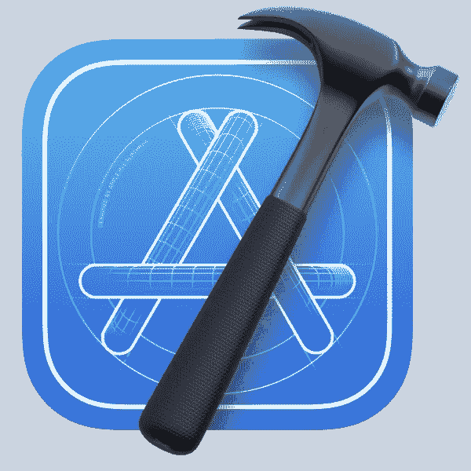
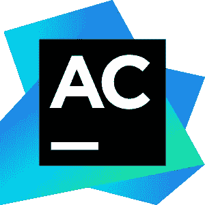
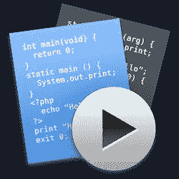

# 用 Swift 开发最好的 IDE 是什么？

> 原文：<https://blog.devgenius.io/what-is-the-best-ide-for-developing-with-swift-ios-apps-aaab27c17ab?source=collection_archive---------3----------------------->

照片由[伊戈尔的儿子](https://unsplash.com/@igorson?utm_source=unsplash&utm_medium=referral&utm_content=creditCopyText)在 [Unsplash](https://unsplash.com/s/photos/apple?utm_source=unsplash&utm_medium=referral&utm_content=creditCopyText) 上拍摄

根据 StackOverflow 的 [2019 年开发者调查，由苹果公司开发并用于 iOS、iPadOS、macOS、watchOS、tvOS 和 Linux 的 Swift 已经变得非常受欢迎，甚至已经成为第四大最受欢迎的语言。](https://insights.stackoverflow.com/survey/2019#most-loved-dreaded-and-wanted)

如果您刚刚开始使用 Swift，那么您可能会好奇可以使用什么程序来开始。本文将介绍一个集成开发环境(ide)列表，您可以用它来开发 Swift 此外，我收集了互联网上的意见和个人经验，给你一些利弊。有了这个基础，你就能形成自己的观点，并选择一个去尝试。

# XCode

XCode 图标，[公共域](https://commons.wikimedia.org/wiki/File:Xcode_Icon.png)，[苹果](https://developer.apple.com/xcode/)

*   预装在 MAC 上
*   苹果推荐
*   苹果官方支持
*   LLDB 调试控制台

> 如果你想构建 iOS 应用，特别是如果你想使用 SwiftUI，这是唯一的选择。
> 
> …
> 
> 如果你刚刚开始…我真的建议你坚持使用 Xcode。

— [/u/rhysmorgan](https://www.reddit.com/r/swift/comments/ezu6ug/is_xcode_the_best_ide_for_swift_in_mac/fgphjbm/)

> 坚持 Xcode 的最好理由是游乐场。目前，它是唯一一个有足够的特性来帮助你设计界面的 IDE。

— [/u/rfpels](https://www.reddit.com/r/swift/comments/ezu6ug/is_xcode_the_best_ide_for_swift_in_mac/fgs36bf/)

> 最后…我鄙视 xcode。我个人认为这是一个令人憎恶的 ide。这只是苹果看着开发者苦苦挣扎而发出的笑声。无论如何，他们有更大的开发市场和支出。…抱歉，这些观点只是我的经验。因为我确信会有人喜欢 xcode。

— [/u/slayerlob](https://www.reddit.com/r/programming/comments/9ysbei/swift_development_with_visual_studio_code/ea3ovas/)

> 在使用了 14 年的 eclipse 和几年的 IntelliJ 之后，我更喜欢 Xcode 而不是 AppCode。但这只是一个轶闻案例。有研究说，基本上，超链接会降低你对文本的理解，因为你在有意识地处理链接背后的东西，以及你是否应该点击它。
> 
> 再次，从视觉干扰的角度来看 UI。这并不明显，我知道很多人喜欢有很多选项的飞机驾驶舱用户界面，但艰苦的工作发生在你的脑海中，当你工作时，你从来没有过滤掉你面前的所有部件。
> 
> 这也是人们对 iPhone 等设备产生情感依恋的原因。它有一个基本的不可定制的用户界面，但是任何时候你执行一项任务都没有障碍，没有干扰，没有进程管理器，电池保护器，或者诸如此类的东西。随着时间的推移，你会不自觉地将完成工作与使用 iPhone 联系起来。
> 
> 我仍然使用 AppCode 进行代码检查和复杂的重构，但是我不喜欢使用它。Xcode 中的功能足够我编码了。真正的工作发生在我的脑海里。

— [/u/anna0000000](https://www.reddit.com/r/swift/comments/34bg2s/visual_studio_code_for_mac/cquvnbl/)

# AppCode

AppCode 图标， [JetBrains](https://www.jetbrains.com/objc/)

*   链接到[下载](https://www.jetbrains.com/objc/)
*   30 天免费试用(之后，199 美元/第一年；第二年 159 美元；119 美元/第三年及以后)
*   项目导航
*   智能完成
*   重构功能
*   单元测试
*   兼容 Xcode(所以你可能会使用 AppCode *和* XCode)

> AppCode 需要 Xcode 来做一些杂务。然而，AppCode 有一个更强大的编辑器。

— [/u/rfpels](https://www.reddit.com/r/swift/comments/ezu6ug/is_xcode_the_best_ide_for_swift_in_mac/fgs36bf/)

> AppCode 有很多很棒的快捷方式。有一个快捷方式可以显示您可以自动覆盖和添加的方法列表，一个快捷方式可以自动添加协议方法，能够一次在多个位置键入，并在给代码着色时提供更多的定制。
> 
> 我用 AppCode 写代码，用 Xcode 写故事板/xib。我通常把它们放在自己的屏幕上。
> 
> AppCode 也对学生免费一年。

— [【已删除】](https://www.reddit.com/r/swift/comments/7nyee8/do_you_use_any_other_ide_besides_xcode_for_swift/ds655ts/)

> 学雨燕。以后你可以试试 Appcode。我不太喜欢它(尽管我使用其他 Jetbrains IDE)。即使你使用它，你也永远不会摆脱 Xcode，因为 Appcode 不提供 IB 或 CoreData 编辑器。甚至项目设置都保持在最低限度(上次我检查过)。所以无论哪种方式，你都需要找到 Xcode 的方法。

— [/u/jan_olbrich](https://www.reddit.com/r/swift/comments/7qvkvg/im_just_learning_swift_and_i_heard_about_appcode/dssb3mi/)

> Xcode 烂透了，只有万不得已的时候才使用。也不要像别人建议的那样用 IB。错误的代码。
> 
> 即使是 xcode 中最快的人(文件导航、搜索等)也会比普通 appcode 用户慢 2 倍。界面和 UX 要好得多(因为它是一个真正的 IDE)

— [/u/matchbok](https://www.reddit.com/r/swift/comments/7qvkvg/im_just_learning_swift_and_i_heard_about_appcode/dssjeok/)

> 如果你习惯于 JetBrains 产品，你会喜欢使用 AppCode。它拥有你所熟悉的所有优秀功能。但是与 Xcode 相比，它在快速支持方面就显得有些粗糙了。

— [/u/ned_roberts](https://www.reddit.com/r/swift/comments/3gzmp9/anyone_have_opinions_on_appcode_with_swift/cu3b96n/)

> 在代码编辑、导航和重构方面，应用程序代码远远优于 XCode，但它也有弱点，因为来回切换到 XCode 来做应用程序代码不能做的事情是一种繁琐的体验。此外，它的内存猪，是丑陋的屁股，它不是免费的，但你可以得到一个值得一试。这肯定是唯一可行的选择，我无法想象在没有一些合适的 ide 帮助的情况下编写像 swift 这样复杂的语言。

— [/u/ldf1111](https://www.reddit.com/r/swift/comments/5lc8j9/alternative_to_xcode/dbv9ugy/)

# 克利翁

CLion 标志， [Jetbrains](https://www.jetbrains.com/clion/)

*   链接到[下载](https://www.jetbrains.com/clion/)
*   30 天免费试用(之后，199 美元/第一年；第二年 159 美元；119 美元/第三年及以后)
*   Linux 和 macOS 上的 Swift IDE
*   Swift [插件](https://plugins.jetbrains.com/plugin/8240-swift?_ga=2.160835323.796054385.1595106899-321688675.1595106899)
*   在此安装[的说明](https://www.jetbrains.com/help/clion/swift.html)
*   支持 Swift 包管理器项目
*   对服务器端 Swift 开发有用

> 你的代码是基于后端/API 还是 UI？如果是前者，你也许可以在 Linux 上做一些工作。JetBrains 的 CLion 在 Linux 上支持 swift:[https://www.jetbrains.com/help/clion/swift-support.html](https://www.jetbrains.com/help/clion/swift-support.html)

— [/u/SuperDuperTang](https://www.reddit.com/r/swift/comments/7pdk9w/help_is_it_possible_to_code_in_swift_on_a_windows/dsggqsm/)

> 我真的很喜欢 CLion，IDE 如何工作，编辑体验，后台连续的静态分析，它如何依赖 cmake(不再是 100% tho)等等。但是我不喜欢大项目中偶尔出现的性能问题，以及它使用大量内存的事实。在过去的两三年里，它变得明显更好了，我一直在工作和个人项目中积极使用 clion，但要准备好给 IDE 更多的内存，并调整 JVM 设置以获得流畅的体验。
> 
> 此外，如果你喜欢的话，他们有一个惊人的 rust 插件。
> 
> 开源开发者有 30 天的免费试用版，所以试试吧。

— [/u/sirpalee](https://www.reddit.com/r/cpp/comments/93h8zj/is_it_worth_getting_clion/e3do821/)

> AppCode 是用于应用程序开发的，它总是需要安装 XCode 事实上，它使用 XCode 项目布局和一切。
> 
> 带有 Swift 插件的 CLion 根本不需要 XCode(因此它也是跨平台的),并且它直接支持 Swift 包管理器，这是目前甚至 XCode 都不支持的。

— [/u/Tainnor](https://www.reddit.com/r/swift/comments/9yudqq/serverside_swift_in_clion/eaakjd6/)

# CodeRunner

CodeRunner 徽标， [CodeRunnerApp](https://coderunnerapp.com/)

*   链接到[下载](https://coderunnerapp.com/)
*   开箱即用的支持
*   多语言快速原型制作
*   lldb 调试
*   改进了调试时变量的显示
*   支持分层嵌套结构、对象描述
*   IDE 级代码完成
*   语法突出显示

> 如果你只是想使用这种语言，你可以使用类似 CodeRunner 的东西。

— [/u/rhysmorgan](https://www.reddit.com/r/swift/comments/ezu6ug/is_xcode_the_best_ide_for_swift_in_mac/fgphjbm/)

> 我是 [CodeRunner](http://krillapps.com/coderunner/) 的超级粉丝，Nikolai Krill 的 Mac 应用程序让你快速运行几行代码，而不需要创建一个项目，甚至不需要先保存文件。到目前为止，我主要是用它来测试 Objective-C 代码片段，但是自然地，我也想在 Swift 中使用它。

— [奥勒·贝吉曼](https://oleb.net/blog/2014/06/swift-in-coderunner/)

还有一些不太主流的；希望将来会有更多来自其他 IDE 提供商的支持。

 [## 通过我的推荐链接加入媒体

### 作为一个媒体会员，你的会员费的一部分会给你阅读的作家，你可以完全接触到每一个故事…

tremaineeto.medium.com](https://tremaineeto.medium.com/membership)