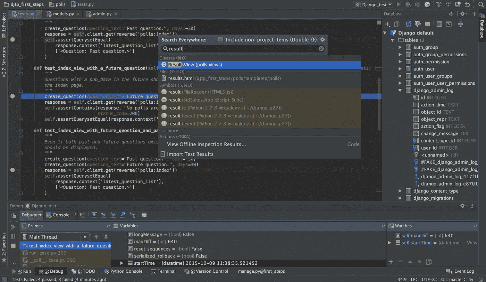
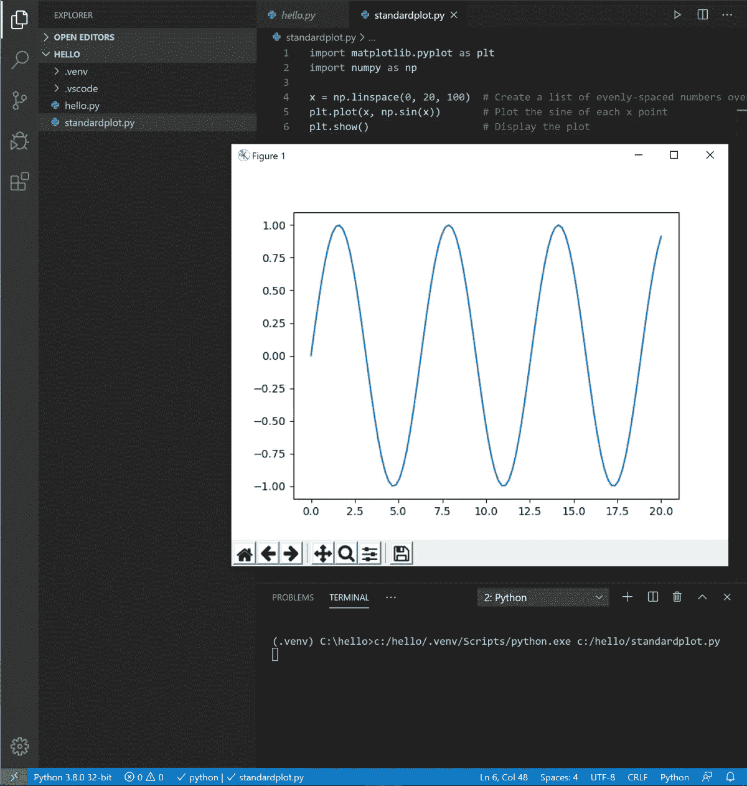
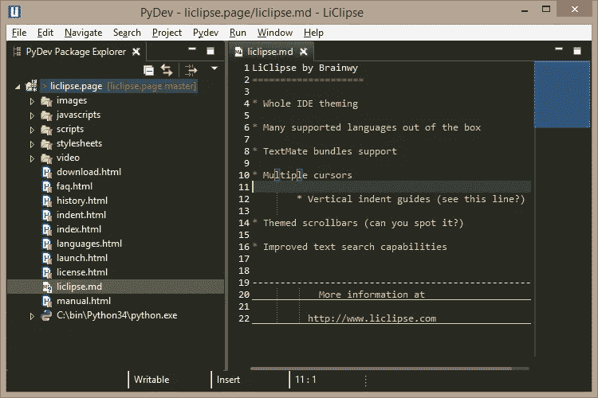
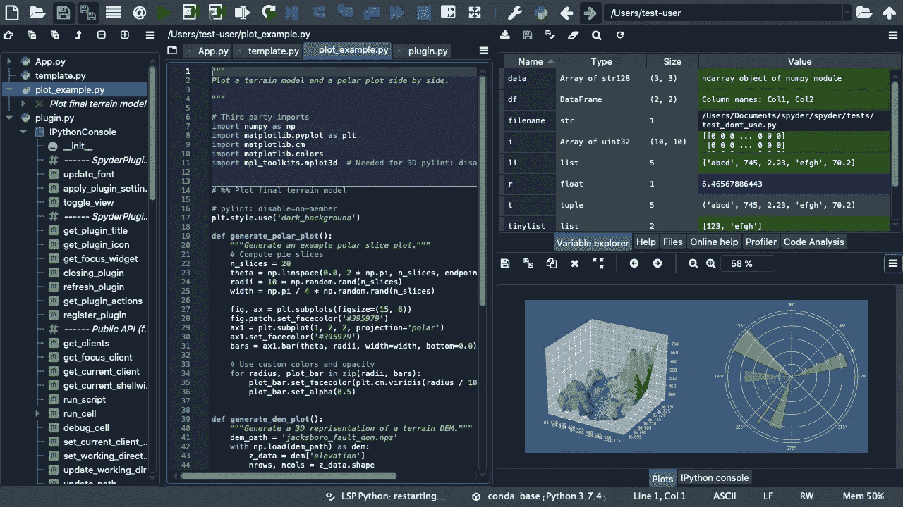
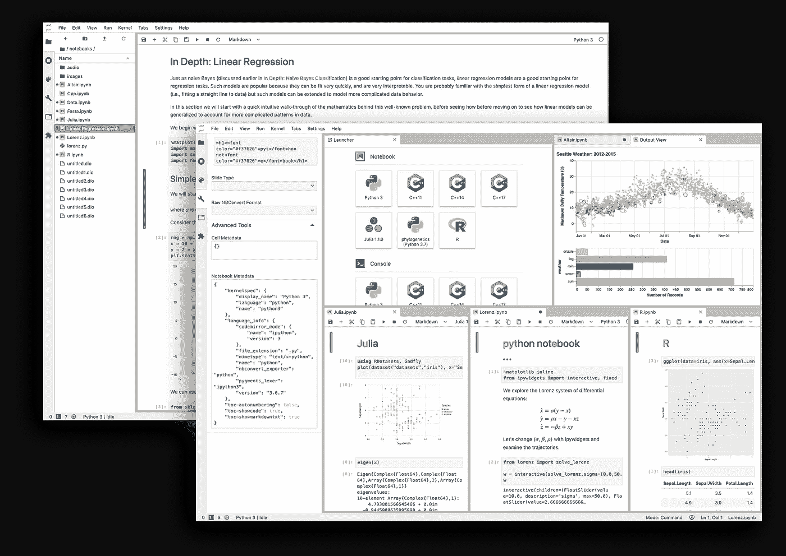
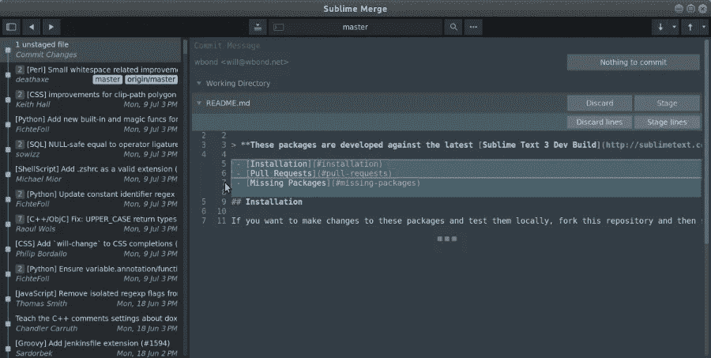
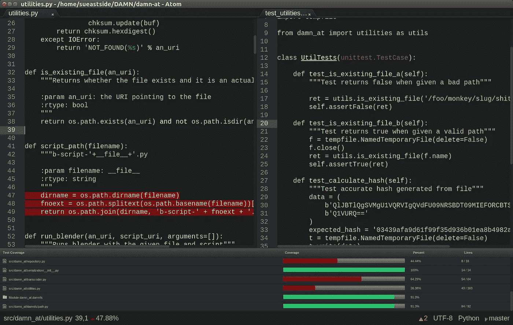
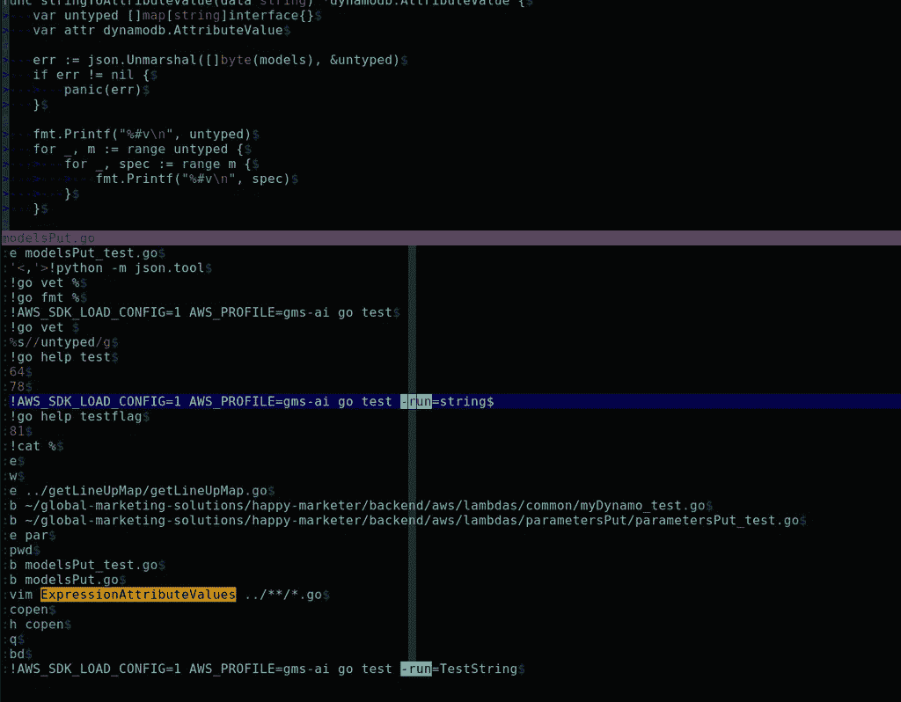
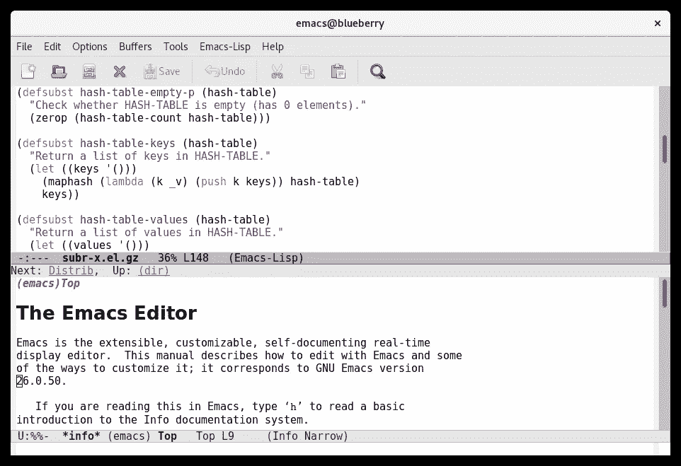
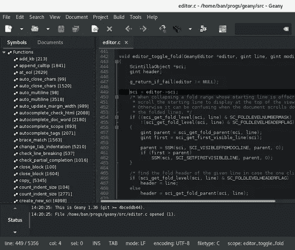

# 用 Python 开发最好的 IDE 或者文本编辑器是什么？

> 原文：<https://blog.devgenius.io/what-is-the-best-ide-or-text-editor-for-developing-in-python-6289047abab0?source=collection_archive---------1----------------------->

[大卫·克洛德](https://unsplash.com/@davidclode?utm_source=unsplash&utm_medium=referral&utm_content=creditCopyText)在 [Unsplash](https://unsplash.com/s/photos/python?utm_source=unsplash&utm_medium=referral&utm_content=creditCopyText) 上的原始照片；logo 可供 [Python](https://www.python.org/community/logos/) 使用；特里梅因·埃托的文字。

对于那些刚开始编程的人来说，根据几个来源，如 [2020 栈溢出开发者调查](https://insights.stackoverflow.com/survey/2020#technology-most-loved-dreaded-and-wanted-languages-wanted)和[统计和数据](https://www.statisticsanddata.org/most-popular-programming-languages/)，Python 是俱乐部中的领导者。

这样做的原因很多，但总的来说，这是因为它比许多其他语言更简洁、层次更低、语法更简单。事实上，您不必担心怪异的分号之类的东西，这对初学者来说是一个巨大的好处。

当开始使用任何语言时，自然会出现这样一个问题:我用什么开始呢？用于 Python 编程的软件可以是简单的文本编辑器，也可以是成熟的集成开发环境(IDE)。

在本文中，我们将深入探讨用 Python 开发的各种可用选项，包括免费的和免费的。我们将给出每种方法的一些基本的优点和缺点，我们还将从互联网上收集并包含一些来自现实生活用户的见解。事不宜迟，我们开始吧。

# 皮查姆

礼貌 [JetBrains PyCharm](https://www.jetbrains.com/pycharm/) 。

PyCharm 是 JetBrains 开发的一个 IDE，JetBrains 是你会遇到的大多数语言的领先 IDE 公司之一。

这是一个成熟的 IDE，非常适合大型项目；它不仅允许编写代码，还允许运行和调试代码，其丰富的插件库使其高度可定制。

*   社区版[免费](https://www.jetbrains.com/pycharm/download/#section=windows)
*   专业版**不是** [免费](https://www.jetbrains.com/pycharm/download/#section=windows)

**PyCharm 社区版**有以下特点，引自 JetBrains 的 [PyCharm 网站](https://www.jetbrains.com/pycharm/features/):

*   智能 Python 编辑器
*   图形调试器和测试运行程序
*   导航和重构
*   代码检查
*   VCS 支持

**PyCharm 专业版**具备上述所有功能，还包括[更多功能](https://www.jetbrains.com/pycharm/features/):

*   科学工具
*   Web 开发
*   Python web 框架
*   Python 分析器
*   远程开发能力
*   数据库和 SQL 支持

如果你看到的是专业版可以做而社区版不能做的事情，并且你不能马上意识到你可能需要的东西，那么我建议你先试试社区版。我认为这是一个可靠的策略，因为你可以看到它是否足够好，或者你是否发现有所欠缺。

如果最终缺少某些东西，你可以查看专业版是否支持它，或者你甚至可以尝试一个[的 30 天免费试用](https://www.jetbrains.com/pycharm/download/#section=windows)，看看你是否能找到你需要的东西。

> 所以，假设你一般不擅长计算机，你不太了解 Python，你的工作主要围绕着建立网站。那么像 PyCharm 这样的东西会很适合你。这是因为它做了很多手握，有很多默认和助手预安装和预配置。或许甚至可以识别流行的 web 框架。

—[/u/crab bone](https://www.reddit.com/user/crabbone)on[/r/python](https://www.reddit.com/r/Python/comments/8qp0ro/what_is_the_best_ide_to_use_for_python/e0l5dry/)

> **PyCharm:** Pycharm 可能是专业开发者最好的全能 Python IDE **。**
> 
> 它有一个干净的，用户友好的界面，是非常可定制的，并提供了一堆功能，支持开发人员提高他们的生产力。
> 
> 它适用于 Windows、Linux 和 macOS，并且是免费的(社区版)。
> 
> PyCharm 使大型多文件项目易于管理，并与版本控制无缝集成。

— [专家在](https://www.quora.com/profile/XpertSpeak) [Quora](https://qr.ae/pNmsbp) 上发言

> PyCharm 很优秀。我想有人可能会说它体积庞大，但它有很多功能，否则你可能需要使用另一个程序。有哪些散装的让你不想用？

—[/u/reed jessen](https://www.reddit.com/user/ReedJessen)on[/r/learn python](https://www.reddit.com/r/learnpython/comments/49wb9w/best_ideeditor_for_python/d0vf9gb/)

> 它是一个真正的 IDE，而不是一个有几个插件的编辑器。它可以与 Django，谷歌应用引擎，Web2Py，金字塔，Flask，Twitter，Bootstrap 的项目。除了我上面提到的常见功能，它还有许多其他功能，您需要在更复杂的项目中使用，例如调试、非常强大的代码重构、深度代码检查、远程解释器、通过 FTP/sftp/将项目部署到远程服务器等。、版本控制(非常好的 Git/SVN/etc 集成、本地/远程回购)、bash 和 python 终端等。
> 更多的功能可以通过插件获得，比如附加文件格式(。例如 gitignore 和 bash)、与 JIRA 的集成等。
> 
> 我在一个大项目上工作；有时在我的工作场所，有时远程。我在本地提交更改，推送至我们的私有 Stash 安装，并通过几次点击将代码部署到服务器。
> 在一次点击(Cmd+S)中，我保存文件，并通过 SFTP 将所有更改部署到我的服务器上。
> 在另一次点击(Cmd+K)中，我提交+推送。
> 有免费版的 PyCharm。商业版做了大多数用户不需要的额外事情(虽然我有一个。)

— [大卫·马纳泽](https://www.quora.com/profile/David-Managadze)在 [Quora](https://qr.ae/pNmsuV) 上

> JetBrains 的 PyCharm 是 Python 开发的首选 IDE。免费版还过得去，但是专业版太棒了。我写 Python 代码已经十多年了，还记得 PyCharm 出现之前的日子。这是一场斗争。您可以为 Eclipse/Aptana 使用 PyDev 插件，但是它远不如 PyCharm 那样无缝，而且非常容易出问题和出错。
> 
> PyCharm 拥有出色的代码补全功能、强大的重构工具、VCS、部署和其他你希望在 IDE 中看到的特性。我也喜欢它处理调试的方式。它实际上是我最喜欢的任何语言的 IDE。除此之外，您可以查看调用层次结构、生成测试、使用临时文件和许多其他东西。它功能丰富。它还保留了本地版本历史，我发现这对于快速“取消”我还没有签入的东西非常有用。或者只是查看我删除的旧代码。它有一个直观的用户界面。

— [希斯·李·福涅尔](https://www.quora.com/profile/Heath-Lee-Fournier)上 [Quora](https://qr.ae/pNmsgY)

# Visual Studio 代码(VSCode)

礼貌 [Visual Studio 代码](https://code.visualstudio.com/docs/python/python-tutorial)。

Visual Studio Code，或称 VSCode，是一个很好的免费解决方案，相对来说是轻量级的，设置起来也很简单。它干净简单的美学以及广阔的 Visual Studio 市场使它成为 Python 的可靠选择。

*   自由的
*   在这里下载
*   Python 扩展下载[这里](https://marketplace.visualstudio.com/items?itemName=ms-python.python)
*   入门教程[此处](https://code.visualstudio.com/docs/python/python-tutorial)

引用自 Visual Studio 市场的功能有:

*   智能感知:通过自动完成、代码导航、语法检查等功能编辑您的代码
*   [林挺](https://code.visualstudio.com/docs/python/linting):使用 Pylint、Flake8 等工具获得额外的代码分析
*   [代码格式](https://code.visualstudio.com/docs/python/editing#_formatting):用黑色、autopep 或 yapf 格式化您的代码
*   [调试](https://code.visualstudio.com/docs/python/debugging):调试您的 Python 脚本、web 应用、远程或多线程进程
*   [测试](https://code.visualstudio.com/docs/python/unit-testing):使用 unittest、pytest 或 nose 通过测试浏览器运行和调试测试
*   [Jupyter 笔记本](https://code.visualstudio.com/docs/python/jupyter-support):创建和编辑 Jupyter 笔记本，添加和运行代码单元，渲染绘图，通过变量浏览器可视化变量，使用数据查看器可视化数据帧，等等
*   [环境](https://code.visualstudio.com/docs/python/environments):自动激活并在 virtualenv、venv、pipenv、conda 和 pyenv 环境之间切换
*   重构:用变量提取、方法提取和导入排序来重构你的 Python 代码

> 设置 VScode 来调试和运行代码并不有趣，pycharm 实际上是为 python 项目设计的，界面非常流畅和用户友好。VScode 只是一个难题…

—[上的](https://www.reddit.com/r/Python/comments/i3rmq4/top_5_best_ides_for_python_free/g0f8jwa/)[/u/vurv 78](https://www.reddit.com/user/Vurv78)/r/python

> 对我个人来说，vim 很适合编写简短的 python 脚本，但是当我编写更大更复杂的程序时，我会使用 VSCode

— [/u/ForestRanger99](https://www.reddit.com/user/ForestRanger99) 上 [/r/python](https://www.reddit.com/r/Python/comments/i3rmq4/top_5_best_ides_for_python_free/g0ekl22/)

> 如果你正在学习另一种编码语言，并且现在已经有很多其他的编码需要做，那么就使用 VSCode。它只是工作，即使它是建立在电子上的。

—[/u/to kazama](https://www.reddit.com/user/Tokazama)on[/r/learn python](https://www.reddit.com/r/learnpython/comments/8ohdhc/recommend_a_python_ide/e03i8ml/)

> VSCode 也很受好评。它基本上只是一个更好(更快、更稳定)的 Atom 版本，但仍然存在基于电子的问题(内存使用率高、启动慢)。

—[/u/Tunisia 3507](https://www.reddit.com/user/tunisia3507)on[/r/learn python](https://www.reddit.com/r/learnpython/comments/8ohdhc/recommend_a_python_ide/e03b9kd/)

> 如果你不花钱，VSCode 是很难打败的。Python 的扩展中包含了林挺，这很好。如果你正在为一个 Django 项目付费，我听说 PyCharm 有很多有用的工具。就我个人而言，我使用 VSCode 来构建 Django 应用程序，到目前为止，它非常棒，不会使用其他任何东西。我用 Notepad++做任何“附加编辑”。Sublime 的免费版本也很棒，但是缺少 VSCode 的集成终端，并且经常弹出窗口要求您购买付费版本，这让您很恼火。每个 IDE 都有权衡。

—[/u/Milo persic](https://www.reddit.com/user/milopersic)on[/r/python](https://www.reddit.com/r/Python/comments/duekq4/hey_whats_your_favorite_ide/f74y9x3/)

> 我学习 Python 才几个星期，并且马上开始学习可视化代码。除了能够直接在 VS 代码中运行你的代码，它还有一个很棒的调试功能。我发现在学习过程中，逐句通过代码的能力是非常宝贵的。

—[/u/rke lf](https://www.reddit.com/user/rkelf)on[/r/python](https://www.reddit.com/r/learnpython/comments/aq1k9i/sublime_text_for_python/egdaxxl/)

# Eclipse (PyDev，Liclipse)

礼貌用语。

对于已经习惯了 Eclipse 的用户来说，这可能是一个值得追求的选择。

## PyDev

*   自由的
*   PyDev 下载[这里](https://marketplace.eclipse.org/content/pydev-python-ide-eclipse)

引用自 [PyDev 网站](https://www.pydev.org/)的特征是:

*   [姜戈整合](https://www.pydev.org/manual_adv_django.html)
*   [代码完成](https://www.pydev.org/manual_adv_complctx.html)
*   [自动导入代码完成](https://www.pydev.org/manual_adv_complnoctx.html)
*   [类型提示](https://www.pydev.org/manual_adv_type_hints.html)
*   [代码分析](https://www.pydev.org/manual_adv_code_analysis.html)
*   [转到定义](https://www.pydev.org/manual_adv_gotodef.html)
*   [重构](https://www.pydev.org/manual_adv_refactoring.html)
*   [调试器](https://www.pydev.org/manual_adv_debugger.html)
*   [远程调试器](https://www.pydev.org/manual_adv_remote_debugger.html)
*   [在调试器中查找推荐人](https://www.pydev.org/manual_adv_debugger_find_referrers.html)
*   [代币浏览器](https://www.pydev.org/manual_adv_open_decl_quick.html)
*   [互动控制台](https://www.pydev.org/manual_adv_interactive_console.html)
*   [单元测试集成](https://www.pydev.org/manual_adv_pyunit.html)
*   [代码覆盖率](https://www.pydev.org/manual_adv_coverage.html)
*   [皮林特集成](https://www.pydev.org/manual_adv_pylint.html)
*   查找引用(Ctrl+Shift+G)

PyDev 网站还建议您在 LiClipse 的捆绑包中利用 PyDev:

> 使用 PyDev 的推荐方法捆绑在 [LiClipse](http://www.liclipse.com/) 中，它提供了 PyDev 内置以及对其他语言的支持，如 Django 模板、樱井真子、RST、C++、CoffeScript、Dart、HTML、JavaScript、CSS 等等(此外，通过许可 LiClipse，您可以直接支持 PyDev 的开发)。

— [PyDev](https://www.pydev.org/)

有关 LiClipse 的信息，请继续阅读。

## 利普塞

*   自由的
*   点击此处下载

LiClipse 具有 PyDev 的特征，根据其网站,[还包括以下内容:](https://www.liclipse.com/)

*   所有 Eclipse 编辑器的可用性改进包括:
*   [多个光标](https://www.liclipse.com/multi_edition_video.html)
*   垂直缩进参考线
*   主题滚动条
*   改进的[文本搜索功能](https://www.liclipse.com/search.html)(基于 Lucene 索引的搜索、对外部文件夹的支持、开放编辑器和结果页面上的额外过滤)
*   [RST、Markdown 和 HTML 编辑器的 HTML 预览](https://www.liclipse.com/preview.html)

> 我个人觉得 Liclipse(基本就是 Eclipse + PyDev)还是蛮不错的。因为是 Eclipse，所以可以扩展到其他语言(webdev 的 HTML + CSS)。调试器相当不错。学习 Eclipse 及其特性也很有用，因为它通常是最好的开源 IDE。

—[/u/leosussan](https://www.reddit.com/user/leosussan)on[/r/learn python](https://www.reddit.com/r/learnpython/comments/4pav6a/in_your_opinion_what_is_the_best_free_python_ide/d4jjzga/)

> Eclipse 是另一个非常通用的开发环境。它可以处理各种编程语言，Python 定制也适用于它。但是当我试图把它安装在我的旧电脑上时，它太重了，无法运行。已经是很久以前的事了，我不记得是磁盘空间不足还是内存不足。我现在有了一台更新更强大的电脑，但还没有重新使用 Eclipse。由于我不仅仅在 Python 中工作，这可能是我的损失。

— [R .德鲁·戴维斯](https://www.quora.com/profile/R-Drew-Davis)在 [Quora](https://qr.ae/pNms5f) 上

# Spyder

Spyder Docs 提供。

根据一个人的 Python 编程目的，Spyder 可能是一个可靠的选择，因为它专注于科学编程。无论是数据科学还是机器学习，Spyder 可能都符合要求。

*   自由的
*   主网站[此处](https://www.spyder-ide.org/)
*   安装指南[此处](https://docs.spyder-ide.org/current/installation.html)

根据其[文档](https://docs.spyder-ide.org/current/editor.html?highlight=features)，Spyder 的功能包括:

*   语法高亮(`pygments`)
*   实时代码和风格分析(`pyflakes`和`pycodestyle`)
*   按需完成、呼叫提示和直接定义功能(`rope`和`jedi`)
*   一个函数/类浏览器，水平和垂直分割
*   更加

> **Spyder:** Spyder 是 Python 中用于科学编程的开源跨平台集成开发环境(IDE) **。**
> 
> Spyder 是机器学习或数据科学入门的首选开发环境。
> 
> 它适用于 Window、Linux 和 macOS，是一个非常轻量级软件
> 
> 由于 Spyder 是为数据科学家打造的，所以它支持所有数据科学领域的库，如 SciPY、Numpy、Pandas 等。

— [专家在](https://www.quora.com/profile/XpertSpeak) [Quora](https://qr.ae/pNmsbp) 上发言

> 我最喜欢的 IDE 是 Spyder。它像 Matlab 一样清晰，但在 RAM 上非常轻便，并且打开速度很快。我一开始尝试了 Pycharm，但是它在 RAM 上太重了，我的笔记本电脑在运行复杂代码时崩溃了多次。Spyder 的界面类似于 Matlab。我可以在控制台中选择并执行部分代码，而无需复制粘贴。与 Pycharm 不同，它以一种非常有效的方式列出了所有变量，易于在变量浏览器中查看。它的界面上没有太多的按钮，使它更简单和友好。此外，输入模块或函数后，建议列表会立即显示出来，而 Pycharm 在这方面会延迟一点。另外，CTRL+单击一个函数，它会直接打开与该函数相关的源代码。对我来说，这是一个重要的特性，因为我的工作经常需要我修改源代码。
> 
> 关于图形绘制，Spyder 有这个功能可以直接在控制台中绘制图形，这是我在其他产品中没有见过的。有时这对我很方便，因为我的工作需要经常绘制图表。

— [Sonaljit Mukherjee](https://www.quora.com/profile/Sonaljit-Mukherjee) 上 [Quora](https://qr.ae/pNmsOt)

# Jupyter 笔记本

礼貌[朱庇特笔记本](https://jupyter.org/)。

Jupyter Notebook 是在浏览器中学习 Python 的一种方式，它通常作为学校课程的一部分提供。它可能值得修补，但是对于任何广泛的 Python 编程来说，尝试其他东西可能会更好。

*   自由的
*   安装说明[此处](https://jupyter.org/install)
*   立即在你的浏览器中尝试 Jupyter】这里

> Jupyter Notebook:Jupyter Notebook 是迄今为止学习 python**的最佳 IDE **，广泛用于教育目的。****
> 
> 它是开源的，在网络浏览器中运行，因此是一个非常轻量级的应用程序。
> 
> Jupyter 是 Julia、Python 和 R 的缩写，它们都是用于数据科学的语言。除了这三种语言，Jupyter notebook 还支持 **markdown** 、 **HTML、**和 **LaTeX。**
> 
> 它是学习和可视化数据科学概念的优秀工具。

— [专家发言](https://www.quora.com/profile/XpertSpeak)上 [Quora](https://qr.ae/pNmsbp)

# 崇高的文本

礼貌[崇高文字](https://www.sublimetext.com/)。

Sublime Text 是一个漂亮而简单的文本编辑器，它比 Notepad 更好，因为它内置了大量方便编码的功能。对于 Python 脚本来说，这已经足够了。

*   自由的
*   在这里下载

根据其[位置](http://GOTO ANYTHING)特征有:

*   去任何地方
*   转到定义
*   多重选择
*   命令选项板
*   强大的 API 和软件包系统
*   定制任何东西
*   分割编辑
*   即时项目切换
*   跨平台
*   更多

> 如果这是您第一次尝试编程，请使用 Sublimetext。它很快，使用起来感觉很自然，并且有一个无限期的免费试用期

—[/u/Tokazama](https://www.reddit.com/user/Tokazama)on[/r/learn python](https://www.reddit.com/r/learnpython/comments/8ohdhc/recommend_a_python_ide/e03i8ml/)

> 就我个人而言，我只是使用 Sublime 作为文本/代码编辑器，然后通过输入`python file.py`或`./file.py`通过终端实际运行文件。
> 
> 你也可以通过按 Cmd+B(工具>构建)在 Sublime 的命令行弹出菜单中运行你的文件。

— [/u/frozenpandaman](https://www.reddit.com/user/frozenpandaman) 上 [/r/learnpython](https://www.reddit.com/r/learnpython/comments/aq1k9i/sublime_text_for_python/egcscqp/)

# 原子

Atom 通过 python-coverage 提供。

Atom 是 Sublime Text 的竞争对手，因为它是一个特色的轻量级文本编辑器。许多来自其他用途的用户可能对它很熟悉，它可以与 Python 一起使用。

*   自由的
*   下载[这里](https://atom.io/)

根据其[位置](https://atom.io/)，功能包括:

*   跨平台编辑
*   内置软件包管理器
*   智能自动完成
*   文件系统浏览器
*   多个窗格
*   查找和替换
*   包装
*   主题

> 我目前正在使用 Atom(编辑器),似乎很喜欢它。普通 Python 用户似乎不喜欢它，但我不是那么普通，我通常不得不在同一天使用多种语言。
> 
> Atom 肯定有点笨重，但 UI 设计得很好，不会妨碍您。
> 
> 这三个插件似乎真的很有帮助:
> 
> Atom 美化+ autopep8:用于格式化别人的 Python 代码
> 
> Atom linter + pylint:对我来说，几乎就像一个 Python“最佳实践”导师！甚至警告一些愚蠢的语法可能会导致运行时的意外行为
> 
> python 的 Autocomplete:像广告中说的那样工作

—[/u/fuel fraction](https://www.reddit.com/user/fuelfraction)on[/r/learn python](https://www.reddit.com/r/learnpython/comments/49wb9w/best_ideeditor_for_python/d1iqlvc/)

# 精力

由 Vitaly Zdanevich 提供—自己的作品，CC0，[https://commons.wikimedia.org/w/index.php?curid=88978582](https://commons.wikimedia.org/w/index.php?curid=88978582)。

这一节主要是为现有的 Vim 用户准备的，但是如果有人致力于学习 Vim 以使他们的一些过程更有效，这是值得一试的。

*   自由的
*   来自 [RealPython](https://realpython.com/vim-and-python-a-match-made-in-heaven/) 的设置有用信息

> 如果你有时间并且你真的致力于一些核心编程，那么就使用 Vim。

—[/u/to kazama](https://www.reddit.com/user/Tokazama)on[/r/learn python](https://www.reddit.com/r/learnpython/comments/8ohdhc/recommend_a_python_ide/e03i8ml/)

> 假设你精通这门语言，你主要从事内部产品的系统/基础设施工作，那么 PyCharm 会成为你的障碍，但是像 Vim 这样的东西会工作得很好。因为 PyCharm 中预先配置的内容几乎总是错误的，它会误导您，因为它没有为可用的库提供自动补全，而为不存在的库提供自动补全。它通常太慢，不能通过 SSH 编辑文件，甚至不能突出显示你和 Python 一起使用的半打其他语言的语法。

—[/u/克拉波恩](https://www.reddit.com/user/crabbone)上 [/r/python](https://www.reddit.com/r/Python/comments/8qp0ro/what_is_the_best_ide_to_use_for_python/e0l5dry/)

> 它附近没有任何东西。它有一些常见的东西，比如代码着色(识别大量代码和数据格式，甚至像 ASN.1 这样罕见的格式)、代码折叠等。我最喜欢的功能:搜索一切(非常快速的模糊搜索菜单，使图形菜单过时)和多个光标。此外，它有大量用 Python 编写的插件；您可以添加许多功能，如代码检查(PEPs)、代码自动完成(Jedi，clang)、diffs、vi 模式等等。它是半项目感知的:你可以在其中加载目录，它将允许处理所有这些文件。和它一起工作非常愉快。

— [大卫·马纳泽](https://www.quora.com/profile/David-Managadze)在 [Quora](https://qr.ae/pNmsuV) 上

> 我使用 vi 已经几十年了，所以基于 vim 的 IDE 对我很有吸引力。我要提醒你的是，vim 的学习曲线相当陡峭，所以，如果你还不知道，你可能不会满意我的选择。我还要提醒你，根据我的经验，在输入或编辑 python 代码时，普通的 vim(没有特定于 Python 的设置，也没有附加组件)太容易出错(例如，将空格和制表符混在一起)。

— [R .德鲁·戴维斯](https://www.quora.com/profile/R-Drew-Davis)在 [Quora](https://qr.ae/pNms5f) 上

# Emacs

礼遇 [GNU Emacs](https://www.gnu.org/software/emacs/) 。

不能一提 Vim 就不提 Emacs。

*   自由的
*   可以参考 EmacsWiki 的 Emacs 中的 [Python 编程](https://www.emacswiki.org/emacs/PythonProgrammingInEmacs)

> Emacs 或 Vim 提供的是一个比你需要编辑文本的其他地方更好的人机工程学。如果你不能利用这方面的优势，那么 Emacs 将是一个硬推销。

—[上的](https://www.reddit.com/r/Python/comments/a6xq41/whats_the_best_ide_to_use_in_python/ec147a8/)[/u/克拉波恩](https://www.reddit.com/user/crabbone)/r/python

# 吉亚尼

礼貌 [Geany](https://www.geany.org/) 。

*   自由的
*   下载[这里](https://www.geany.org/download/)

根据其站点，功能包括:

*   又快又小
*   伟大的社区
*   易于定制
*   支持多种文件类型
*   许多插件

> Geany 是 StarchPress 的书推荐给我的，我也试过其他的，但我倾向于坚持我开始做的。我当然会向任何刚开始的人推荐 Geany，因为它很简单，不会让人不知所措。

—[/u/whowwhatwhenwhere](https://www.reddit.com/user/WhoWhyWhatWhenWhere)on[/r/python](https://www.reddit.com/r/Python/comments/cm79je/geany_as_a_simple_fast_light_weight_python/ew1bu1v/)

> 我是 Geany 的粉丝——轻量级、跨平台、免费。

—[/u/wy NAND 1004](https://www.reddit.com/user/wynand1004)on[/r/learn python](https://www.reddit.com/r/learnpython/comments/hxjh3l/how_is_geany_for_python/fz6ohem/)

> 是的，我用了几分钟 Geany，一点也不喜欢。它不应该在轻量级 IDE IMHO 的谷歌搜索列表上。没听说过尼奥维姆。它是一个成熟的编辑器吗？
> 
> 我想我在寻找更多的开箱即用的功能，这样我就不会在设置上花太多时间，但我很快就明白了我的愚蠢。我正在寻找一个重型 IDE 的功能，但不愿意花费时间/数据来下载和设置相同的功能。

—[/u/that girl again 01](https://www.reddit.com/user/Thatgirlagain01)on[/r/learn python](https://www.reddit.com/r/learnpython/comments/hxjh3l/how_is_geany_for_python/fz6kdi0/)

 [## 通过我的推荐链接加入媒体

### 作为一个媒体会员，你的会员费的一部分会给你阅读的作家，你可以完全接触到每一个故事…

tremaineeto.medium.com](https://tremaineeto.medium.com/membership)