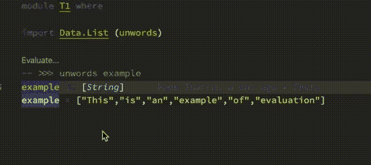
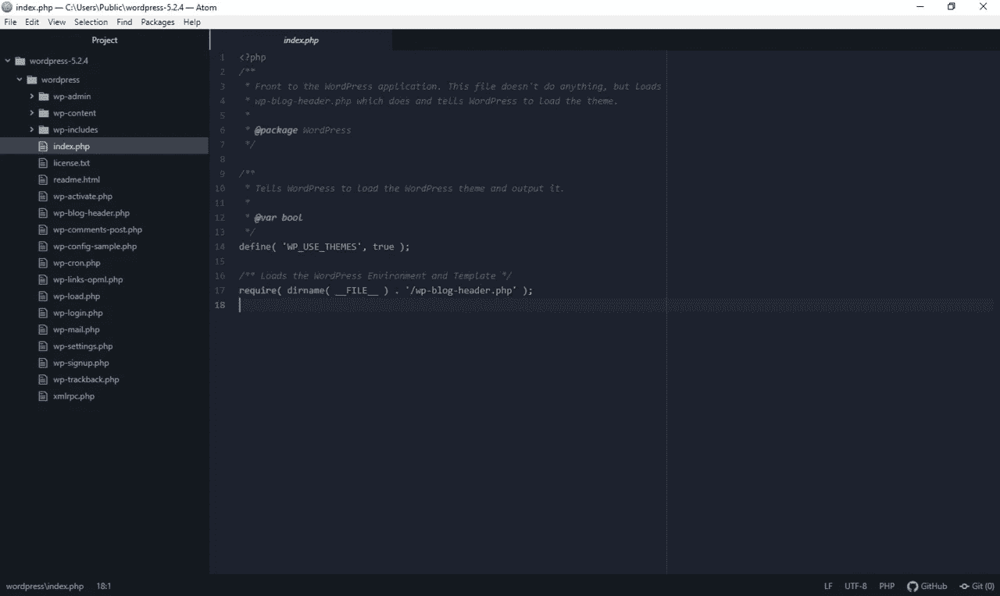

# 用 Haskell 开发最好的 IDE 设置是什么？

> 原文：<https://blog.devgenius.io/what-is-the-best-ide-setup-for-developing-in-haskell-468066f31ff?source=collection_archive---------1----------------------->

由 [ThisisEngineering RAEng](https://unsplash.com/@thisisengineering?utm_source=unsplash&utm_medium=referral&utm_content=creditCopyText) 在 [Unsplash](https://unsplash.com/s/photos/coding?utm_source=unsplash&utm_medium=referral&utm_content=creditCopyText) 拍摄的照片

Haskell 是一种纯函数式编程语言，具有声明性的静态类型代码。对于处理大量数据的高效应用程序来说，这是一个添加到工具箱中的很好的工具，因此它对于数据操作来说特别有用。一般来说，它在学术界用于编程语言的研究，也是一种可以用来自动化数学证明研究的语言；行业应用也有。

无论您是初学者还是经验丰富的老手，看看其他开发人员如何在不同类型的设置中使用这种语言总是一个很好的练习。

本文将介绍各种 Haskell IDE 设置，并在互联网上对每种设置发表意见；希望到最后，您会对现有的选项有一个更好的了解，从而决定什么是最适合您的 ide 设置。

# 虚拟代码

代码评估支持。通过 VSCode Haskell、 [GitHub](https://github.com/haskell/vscode-haskell) 开源

## [哈斯克尔扩展](https://github.com/haskell/vscode-haskell)

*   警告，通过 GHC 进行错误诊断
*   悬停时的类型信息
*   悬停时的类型文档
*   跳转到定义支持
*   文档符号支持
*   能够突出显示文档中的引用
*   代码完成
*   使用 Brittany、Floskell、Ormolu 或时尚 Haskell 进行格式化
*   [多根工作空间](https://code.visualstudio.com/docs/editor/multi-root-workspaces)支持
*   用 Haskell 语言服务器进行代码评估
*   "如果你使用的是 Visual Studio 代码， [Haskell 扩展](https://marketplace.visualstudio.com/items?itemName=haskell.haskell)会自动为你下载并安装`haskell-language-server`" [Haskell 语言服务器 GitHub](https://github.com/haskell/haskell-language-server)

## [Haskero 扩展](https://marketplace.visualstudio.com/items?itemName=Vans.haskero)

悬停时的标识符类型定义。VSCode Haskero， [Visual Studio Marketplace](https://marketplace.visualstudio.com/items?itemName=Vans.haskero) 。

*   代码突出显示
*   代码片段(依赖于 [Haskell 语法高亮](https://marketplace.visualstudio.com/items?itemName=justusadam.language-haskell))
*   编译错误
*   编译警告
*   插入类型签名，黄色灯泡帮助
*   转到定义支持
*   查找所有参考支持
*   代码完成
*   重命名标识符支持
*   切换阴谋集团的目标支持

## [Haskell IDE 引擎](https://github.com/haskell/haskell-ide-engine)

代码操作和快速修复。开源，Haskell IDE 引擎， [GitHub](https://github.com/haskell/haskell-ide-engine) 。

*   平原 GHC，阴谋集团，堆栈项目都支持
*   编译信息缓存以提高速度
*   使用 LSP
*   hlint 诊断公司
*   GHC 警告和错误
*   使用 apply-refact 进行代码操作和快速修复
*   光标悬停时键入信息和文档(使用 haddock)
*   跳转到定义支持
*   列出支持的所有顶级定义
*   代码完成
*   代码格式
*   打字错误快速修复

> 我个人偏好是 Visual Studio 代码和 Haskero。对我来说效果很好。

—****在/r/haskell****

> **我秒 VS 代码。不过，我用的是`dramforever.vscode-ghc-simple`插件。有一段时间我在这个和 Haskero 之间切换，但是在过去的几个月里我一直使用`dramforever.vscode-ghc-simple`没有问题。**

**—[**/r/haskell**上的 runeks](https://www.reddit.com/user/runeks)**

> ****我同意。我曾经使用 Emacs 和 Haskell，但是现在我发现 VS 代码是一个更好的选择。我仍然保留了一个很好的 Emacs 配置，以便通过 SSH 在远程服务器上使用，但是对于本地，我现在真的很喜欢我的 VS 代码设置。****

****[**—MWatson**](https://www.reddit.com/user/MWatson)**on/r/haskell******

> ****我使用的 Visual Studio 代码带有 [Haskell IDE 引擎](https://github.com/haskell/haskell-ide-engine)及其相应的[扩展](https://marketplace.visualstudio.com/items?itemName=alanz.vscode-hie-server)。它工作得很好，尽管设置它并不简单，因为它们不提供二进制文件。尽管最近他们已经提高了构建的可靠性。我也不是 Haskell 超级用户，我仍然只是在学习和试验它，所以 YMMV 可能。****

****—[**/r/haskell**上的阿克西拉普](https://www.reddit.com/user/akcilap)****

> ******使用 HIE 的 Vs 代码。由于 nix 支持(GHCJS)不佳，我放弃了 spacemacs + intero，并很高兴地发现这种体验远远优于其他选择。******
> 
> ******通过 git 和 make build-all 安装需要一点时间来编译，但在那之后，从市场上安装扩展，一切都为我工作(OS X)。******

******—[**01l 101 L10 l 10 l 10**](https://www.reddit.com/user/01l101l10l10l10)**on/r/haskell********

> ****不知道它是否适合 hie 的 I 部分，但我最稳定和有效的工作流程是在我屏幕的左 2/3 部分使用 VS 代码，只有一些语法高亮显示，当它不阻塞时使用 HIE，在右 1/3 部分我使用 GHCID。我教过的大多数来自其他语言的人嘲笑 ghcid 方法，但是给他们一个月的时间，他们开始喜欢它，而不是编辑器中的红色曲线。****

****—[**/r/haskell**上的 captjakk](https://www.reddit.com/user/captjakk)****

> ******现在，我建议使用 [Visual Studio 代码](https://code.visualstudio.com/)并设置 Haskell 相关的扩展，如语法高亮器、linter、 [Haskell 语言服务器](https://marketplace.visualstudio.com/items?itemName=alanz.vscode-hie-server&source=post_page---------------------------)和调试器。你可以从这篇文章中得到帮助。******

******—[**zarinfam**](https://www.reddit.com/user/zarinfam)**on/r/haskell********

# ****智能理念****

********

****由 JetBrainsScreenshot:Soontobegone—自拍；衍生作品，CC BY-SA 4.0，[维基媒体](https://commons.wikimedia.org/w/index.php?curid=90004920)****

## ****[Haskell 插件](https://github.com/rikvdkleij/intellij-haskell)****

*   ****没有集成调试****
*   ****自动完成****
*   ****建议****
*   ****完整的功能列表[在这里](https://github.com/rikvdkleij/intellij-haskell#features)****

> ****我对 Haskell 很陌生，但我真的很喜欢这个设置。我用 IntelliJ 做其他事情，所以感觉很自然。****

****— [**乔伊·吉布森**](https://www.reddit.com/user/joeyGibson)**on/r/哈斯克尔******

> ****我组里的每个人都这么称呼哈斯克尔。最新的测试版(44)带来了许多不错的功能和改进。第一次启动可能会很慢，因为它安装了 intero，stylistic 等，但对于它带来的所有功能和漂亮的 UI 来说，它的价格很低。****

****—[**sir 4 ur0n**](https://www.reddit.com/user/Sir4ur0n)**on/r/haskell******

> ****IDEA + Intellij-Haskell。前者提供了最佳的 IDE 体验，后者增加了 Haskell 支持。****

****— [**在/r/哈斯克尔**上开发 7](https://www.reddit.com/user/develop7)****

# ******原子******

************

******由 GitHub 提供—附票:2019102510008114，麻省理工学院，[维基媒体](https://commons.wikimedia.org/w/index.php?curid=83383583)******

*   ******[atom-haskell 软件包](https://atom.io/packages/atom-haskell)******
*   ******提供语法突出显示******
*   ******自动完成******
*   ******转到声明******

> ******我一直在和 atom 一起使用 HIE。******
> 
> ******我只能用 Nix tho 正确地设置它。******

******—[**AesaKamar**](https://www.reddit.com/user/AesaKamar)**on/r/haskell********

# ****宇宙飞船****

********

****由[http://spacemacs.org/](http://spacemacs.org/)——[http://spacemacs.org/](http://spacemacs.org/)，CC BY-SA 4.0，[维基媒体](https://commons.wikimedia.org/w/index.php?curid=55181158)****

*   ****[哈斯克尔层](https://develop.spacemacs.org/layers/+lang/haskell/README.html)****
*   ****本质上只是 Emacs，但带有配置文件，因为它是基于 Emacs 构建的****
*   ****haskell 源代码的语法高亮显示****
*   ****cabal 文件的语法高亮显示****

> ****我用过带 Haskell Layer (intero 后端)的 Spacemacs。也用 Haskero 试过 VSCode。根据我的经验，这两种方式都相当好，尽管第一印象我更喜欢 Spacemacs 中 Haskell 层的工作方式(不过公平地说，我最近没有做足够多的 Haskell 来形成一个超级有价值的观点，所以要有所保留)。****

****—[**HKei**](https://www.reddit.com/user/HKei)**on/r/haskell******

> ****取决于你想要什么。Spacemacs 是一种简单的体验，它应该基本上是可行的。如果您喜欢自己动手修改和编写配置，可以使用普通的 Emacs。就我个人而言，我再也不想这么做了。无论如何，你应该可以从这两者中获得相同的体验。****
> 
> ****对于 Spacemacs，以下是您需要的:****
> 
> ****`stack install apply-refact hlint stylish-haskell hasktags hoogle cabal-install happy intero hindent ghc-mod`****
> 
> ****比严格要求的要多一点，但你会得到保障。对于`.spacemacs`,你需要以下几层:****
> 
> ****`auto-completion
> haskell
> syntax-checking
> yaml`****
> 
> ****默认自动补全使用`ghci`，但`ghc-mod`和`intero`也可用。如果您想使用 intero:****
> 
> ****`(haskell :variables
> haskell-completion-backend 'intero)`****
> 
> ****默认情况下，intero 会禁用 lints。如果您仍然想在 intero 中使用它们，您需要将它添加到 dotspacemacs/user-config 中:****
> 
> ****`(with-eval-after-load 'intero
> (flycheck-add-next-checker 'intero '(warning . haskell-hlint)))`****
> 
> ****详见完整的 [haskell 层文档](https://github.com/syl20bnr/spacemacs/tree/master/layers/%2Blang/haskell)。****

****——****/r/哈斯克尔********

# ****Emacs****

********

****Emacs 开发团队——Ferk(截屏用户)、GPL、 [Wikimedia](https://commons.wikimedia.org/w/index.php?curid=6412319)****

## ****[但丁](https://github.com/jyp/dante)****

*   ****交互式 Haskell 的 Emacs 模式****
*   ****Flycheck 类型检查和更多功能在此列出****

> ****到目前为止，对我来说最好的是 Nix+Cabal+HIE+direnv 和 Emacs。我得到了大量的类型信息、即时反馈和良好的完成。不过，我还没有非常彻底地使用过重构机制，所以我不能说。****

****— [**虚无安迪**](https://www.reddit.com/user/NihilistDandy) **on /r/haskell******

> ****我用 Emacs + Dante +结构化的 Haskell 模式来处理 company、flycheck 和 attrap，我对此很满意。如果你愿意投入到 Emacs 和 nix 的学习曲线中(不是一个要求，但是 Dante 与其他 ide 相比对它有很好的支持，并且 nix 有它自己的好处)或者已经投入了，那么它是非常令人满意的。****

****—[**/r/haskell 上的 robreim**](https://www.reddit.com/user/robreim)****

> ******我在一个单独的窗口中使用 Emacs 和 ghcid，就这样。******

******—[**mrkkrp**](https://www.reddit.com/user/mrkkrp)**on/r/haskell********

> ****对于我来说，`emacs`和`dante`。这是特性和健壮性之间的最佳折衷。(c.f. `ghcid`更健壮，`ghc-mod`更有特色)。****
> 
> ****[https://github.com/jyp/dante](https://github.com/jyp/dante)****

****—[**—**](https://www.reddit.com/user/spirosboosalis)**on/r/haskell******

> ****我最喜欢的是 Emacs 中的 dante，它是 Intero 的一个分支，很好地支持多个构建系统。它还有一个很好的特性，可以让我交互式地评估注释中的表达式，所以我不必切换到单独的 GHCI 缓冲区。****

****—[**/r/haskell**上的 davidchristiansen](https://www.reddit.com/user/davidchristiansen)****

# ******精力******

## ******[自定义 Haskell vimscripts](https://github.com/neovimhaskell/haskell-vim)******

************

******开源，[Neovimhaskell/haskell-vim](http://haskell-vim)。******

*   ******更多关键词覆盖******
*   ******更多上下文突出显示******
*   ******更智能的缩进******
*   ******更好的阴谋支持******

> ******在 Vim 方面，我发现 hdevtools + ale 是最稳定和响应最快的，但是:******
> 
> ******它仍然是易碎的******
> 
> ******它不是一个 ide！******

******—[**wrkbt**](https://www.reddit.com/user/wrkbt)**on/r/haskell********

> ****我最喜欢的是不去尝试任何类似 IDE 的东西。相反，只需使用一个简单但功能强大的文本编辑器(一个相当普通的 vim 设置是我选择的武器)，结合一个合适的反馈循环在一个副手窗口中运行。****
> 
> ****这可能看起来很原始，但有几个不明显的优势对我来说非常重要:它快速、可预测、可靠、可扩展，可以跨所有语言、框架和堆栈工作。很少有移动部件，它们都是“用户可维护的”和松散耦合的。****
> 
> ****我对所有的语言和情况都使用这种方法，尽管 IME 认为它对像 Haskell 这样的语言特别有效，在 Haskell 中，许多通常用 IDE 工具解决的问题都在语言本身中解决了。您可以经常使用 Haskell 的抽象能力来实现同样的事情，而不是搭建强制性的样板文件；或者采用类型错误驱动的重构(不要求助于花哨的重构工具，您只需大胆地进行血腥的更改，然后修复所有编译器错误，直到它再次工作)。****

****—[**/r/哈斯克尔**上的 tdammers](https://www.reddit.com/user/tdammers)****

# ******SublimeText******

************

******来源(WP:NFCC#4)，合理使用，[维基百科](https://en.wikipedia.org/w/index.php?curid=55236299)******

## ******[SublimeHaskell 插件](https://packagecontrol.io/packages/SublimeHaskell)******

*   ******秘密建筑******
*   ******错误和警告突出显示******
*   ******智能完成******
*   ******ghc-mod 集成******
*   ******堆栈支持******
*   ******增强型完成******
*   ******带有符号信息以及错误、警告和提示详细信息的弹出窗口******

> ******在这一点上，SublimeText 看起来几乎是可行的。缺点似乎是手动安装过程，以及在用户体验中完全缺乏指导。恐怕目前我也不能向客户推荐这个。******

******— **克里斯完成** [**FP 完成**](https://www.fpcomplete.com/blog/mainstream-ides-haskell/)******

> ****我使用 SublimeHaskell 插件，它与 Cabal 项目集成(保存文件触发重新加载)，标记代码中的错误，并添加一个颜色方案，看起来像 Hackage 的源代码浏览器。****
> 
> ****我对它非常满意，我很少再用 vim 做任何事情了。(特别是因为你可以使用 Sublime 的 CLI，subl，并将其设置为你的$EDITOR)****

****—****on/r/haskell********

# ****某人巨大的大脑****

********

****[Robina Weermeijer](https://unsplash.com/@averey?utm_source=unsplash&utm_medium=referral&utm_content=creditCopyText) 在 [Unsplash](https://unsplash.com/s/photos/brain?utm_source=unsplash&utm_medium=referral&utm_content=creditCopyText) 上拍摄的照片****

> ****我的经验是，大多数 ide 都不足以支持有效的 Haskell 编程。相反，我用我巨大的大脑的力量想象完整的代码库，作为一个纯能量的生物，直接操纵存储上的比特，使其成为正确的编译形式，甚至使 GHC 变得不必要。****

****—[**/r/哈斯克尔**上的彼得布 12](https://www.reddit.com/user/peterb12)****

****** [## 通过我的推荐链接加入媒体

### 作为一个媒体会员，你的会员费的一部分会给你阅读的作家，你可以完全接触到每一个故事…

tremaineeto.medium.com](https://tremaineeto.medium.com/membership)******