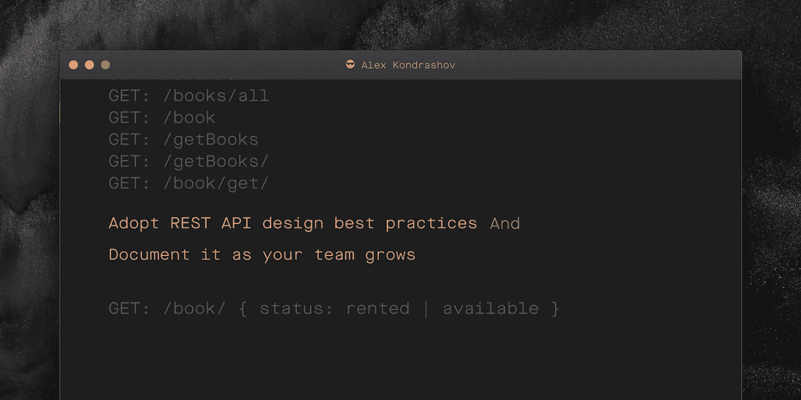

# 按照这个简单的步骤改进您的 API 设计

> 原文：<https://blog.devgenius.io/what-is-the-best-name-for-your-rest-api-get-endpoint-878ace7606cd?source=collection_archive---------3----------------------->



最近，我的部门经历了从 5 名到 25 名软件工程师的转变。这带来了许多挑战，包括跨不同团队构建一致的 REST API。为了改进它，我们已经建立了一个 REST 资源命名指南。

## REST 资源命名指南

命名指南是一套关于如何为端点选择一个好名字的规则。随着开发的进行，它将包含越来越多的规则。理想情况下，每条规则都要在公司内部讨论。它可以托管在 Confluence、GitHub wiki 甚至你的源代码中。

## 出发点

[表述性状态转移(REST)](https://en.wikipedia.org/wiki/Representational_state_transfer) 是一种用于创建 Web 服务的软件架构风格。作为这种风格的一部分，您的应用程序有一个*状态* ( *资源)*。要改变应用程序的状态，您需要公开某些动作(*端点*)。端点应该利用 *HTTP 动词* : GET、POST、PATCH 等。

## Web 应用程序示例

书店是一个允许通过 REST API 管理图书馆的 web 应用程序。在本文中，我们将添加一个 GET 端点来允许我们读取图书列表。我们将从集思广益讨论端点的所有可能名称开始，然后我们将细化该列表，直到只剩下一个名称。

## 头脑风暴所有可能的名字

让我们集思广益，为 GET 端点选择所有可能的名称。它将用于归还书店的所有书籍。这是我想到的一系列可能的名字:

```
GET: /books/
GET: /book/
GET: /book/all/
GET: /books/all/
GET: /books
GET: /book/all
GET: /books/all
GET: /book
GET: /getBooks
GET: /getBooks/
GET: /book/get/
```

它们都是合法的名字，但并不是所有的名字都符合 REST 范式。

## 末尾的斜线和复数与单数名词

首先引起我注意的是端点末尾的斜线的不确定性。让我们确定一下，我们将在端点的末尾使用斜线。此时，我们可以在 REST 资源命名指南中添加第一条规则:

> **1。**所有 REST 端点的末尾都应该有一个斜杠

该规则将端点的可能数量限制为:

```
GET: /books/
GET: /book/
GET: /book/all/
GET: /books/all/
GET: /getBooks/
GET: /book/get/
```

我们要解决的下一个问题是，我们在 REST API 中需要单数还是复数形式的名词。让我们假设我们选择单数作为名词的主要形式。我们可以在 REST 资源命名指南中添加一条规则:

> 2.所有 REST 端点都应该有单数形式的名词

我们现在只剩下:

```
GET: /book/
GET: /book/all/
GET: /book/get/
```

## 不要在端点名称中指定动词

根据 REST 标准，我们的 API 设计应该通过 HTTP 方法来表达:GET、POST、PATCH 等。这意味着我们很少在端点名称中使用动词。顺着这个思路，我们可以说 **GET: /book/get/** 不是一个好名字，因为它的名字里有一个动词。

我们现在只剩下两个名字:

```
GET: /book/
GET: /book/all/
```

定义一本书的地位是很有用的。让我们假设在我们的书店可以租到一本书。在这种情况下，它的状态是*已借*，否则这本书就是*可用。*

```
public enum Status {
   RENTED, *AVAILABLE*;
}
```

将图书的状态作为请求参数传递是有意义的，而不是为图书的每个状态添加新的端点。如果未提供状态，端点将返回所有书籍。因此 **GET: /book/all/** 不是一个好名字。

综上所述——我们有赢家！

```
GET: /book/?status=rented|available// status is a query string parameter
```

到目前为止，我们的 REST 资源命名指南由两条规则组成:

> 1.所有 REST 端点的末尾都应该有一个斜杠
> 
> 2.所有 REST 端点都应该有单数名词

## **结论**

我们在本文中讨论了在您的团队中添加 REST 资源命名指南。该指南帮助我公司的其他开发人员选择正确的命名，并随着团队的成长消除了设计 REST API 时的不确定性。