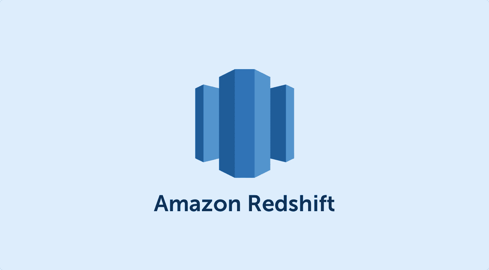

# 将 MySQL 数据 ETL 到 AWS 红移

> 原文：<https://blog.devgenius.io/what-is-the-best-way-to-automate-replication-of-rds-mysql-schema-to-aws-redshift-b8386a6854a7?source=collection_archive---------21----------------------->



我们将使用 Rails 框架和一个 Java 服务来完成这项任务。Ruby on Rails 是一个服务器端的 web 应用框架，在麻省理工学院的许可下用 Ruby 编写。

现在，在我解释如何自动化 DDL(数据定义语言)语句之前，让我解释一下数据流。

数据管道是这样的:

> ***MySQL - >卡夫卡- > AWS S3 - > AWS 红移。***

所以让我们一步一步地打破它:

*   **MySQL - >卡夫卡**

我们将使用一个 Java 服务来读取 MySQL 二进制日志并将数据推入 Kafka。[这个由 Stanley Shyiko 开发的](https://github.com/shyiko/mysql-binlog-connector-java)开源 Java 库派上了用场。

**我们为什么用卡夫卡？**

Kafka 的众多用途之一是**流处理。**卡夫卡在 RDS 和我们的 OLAP(在线分析处理系统)即红移之间充当缓冲。

*   **卡夫卡- >奥斯 S3**

Ruby 有很多卡夫卡的客户。但是在这个例子中，我们将使用 ruby-kafka 客户端。为此，您必须使用以下命令安装 ruby-kafka gem:

```
gem install ruby-kafka
```

**在这里阅读更多:** [**ETL MySQL-AWS 红移**](https://www.aureolls.com/etl-mysql-data-to-aws-redshift/)