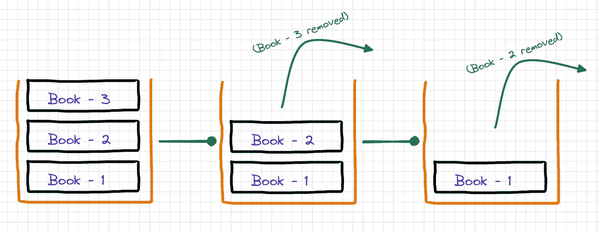
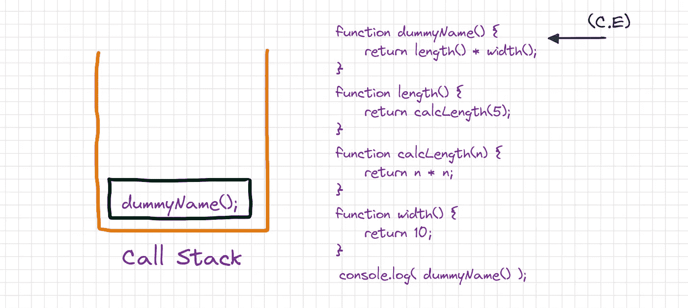
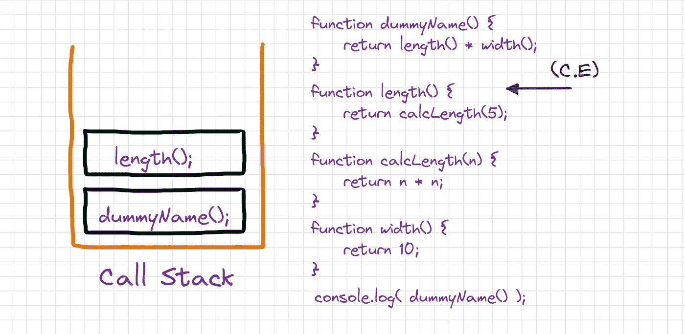
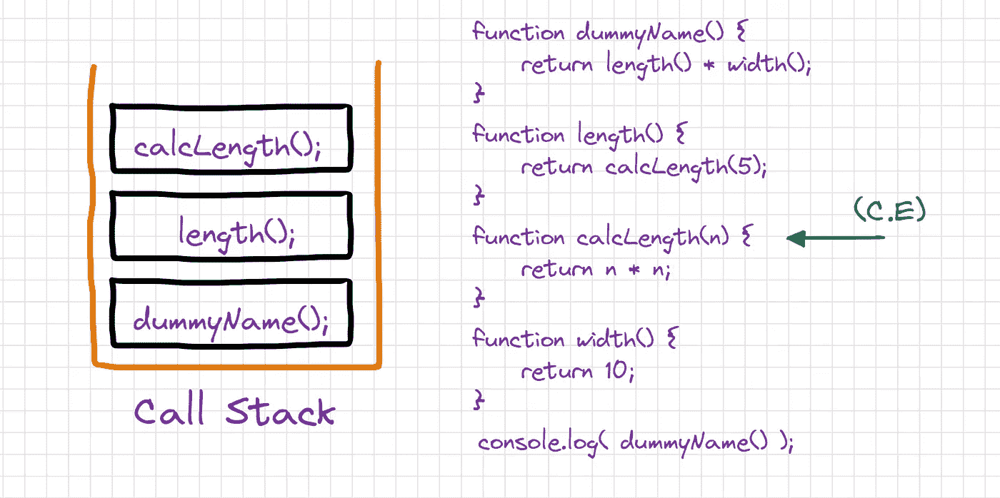
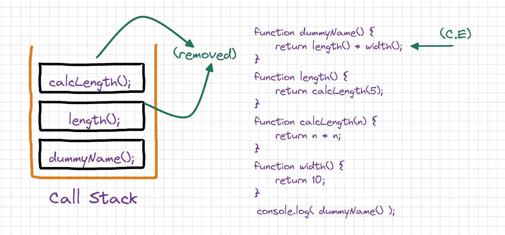
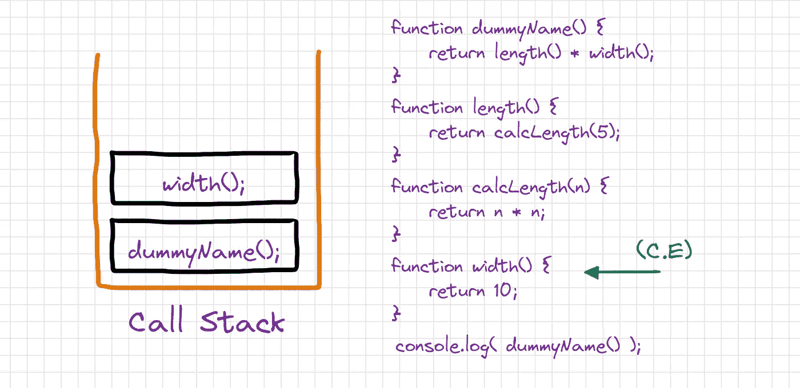
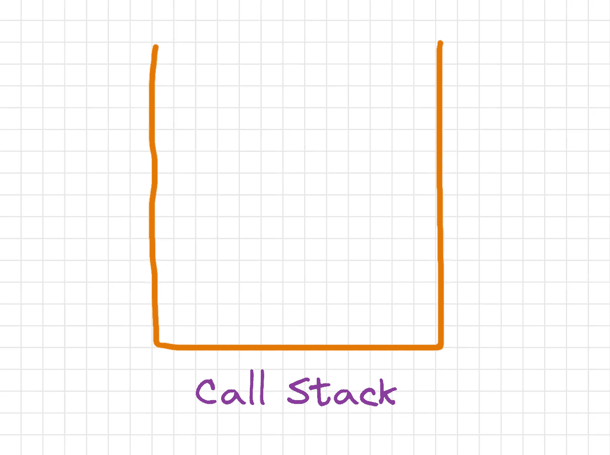

# 什么是调用栈？

> 原文：<https://blog.devgenius.io/what-is-the-call-stack-3be239f9520c?source=collection_archive---------18----------------------->

你有没有想过解释器是如何管理一个脚本中如此多的函数调用的，比如当我们递归解决一个问题时，或者在异步 javascript 的执行过程中，这个问题的答案是**调用栈**。

理解调用栈是如何工作的对于理解递归是如何发生的或者理解异步 javascript 是如何工作的以及更多的概念是至关重要的。

## 调用堆栈:基本

堆栈是一种线性数据结构，它遵循特定的操作执行顺序。顺序可能是**后进先出**(后进先出)或者**费罗**(先进后出)。在堆栈中，首先插入的值只能被提取，最后，当堆栈被清空时，这就像一堆书，一本书放在另一本书上，如果你想拿最下面的书，你首先需要移除最上面的书



调用堆栈是一种解释器跟踪其在调用多个函数的代码中的位置的机制，以了解当前正在运行什么函数以及从该函数中调用了什么函数等。这种堆栈也称为**执行堆栈**、**程序堆栈**、**控制堆栈**、**运行时堆栈**或**机器堆栈**，通常简称为“**堆栈**”。

## 调用堆栈:工作

现在让我们来谈谈在调用堆栈中实际发生了什么，函数如何进出堆栈，函数在堆栈中停留了多长时间，以及其他许多事情。我们将检查这个代码示例，看看函数调用是如何发生的。

```
function dummyName(){
   return length()*width();
}
function length() {
   return calcLength(5);
}
function calcLength(n){
   return n*n;
}
function width() {
   return 10;
}
console.log(dummyName());
```

这里我们有四个函数，分别是 duny name、length、calcLength 和 width，我们调用 duny name 函数，它最终调用其余的函数。当代码执行开始时，最初调用栈将是空的，因为解释器将解析代码，而在执行最后一行时，dumyName 函数将被调用，同时它将被推送到调用栈。



现在 dumyName 函数将开始执行，在这个函数中，我们返回两个函数调用结果的乘积，即长度和宽度。让我们仔细看看这里会发生什么，首先，length 函数将被调用并被推送到 dumyName 函数上方的调用堆栈中，dumyName 函数尚未从调用堆栈中移除，当一个函数的执行完成时，它将从调用堆栈中移除。



现在，length 函数将开始执行，返回 calcLength 的另一个函数调用的结果，现在同样的事情，calcLength 将被推到其他两个函数顶部的调用堆栈中，代码执行也将转移到这个函数。



calcLength 将开始执行并返回返回值，一旦返回值，它将从调用堆栈中删除，因为函数的执行已经完成，代码执行也将转到 Length 函数的返回语句，该语句正在等待 calcLength 函数完成执行，现在 length 函数也将返回值并从调用堆栈中弹出。



duny name 函数仍在调用堆栈中，在执行 length 函数后，代码执行将返回到 duny name 函数的 return 语句。dumyName 函数的 return 语句的执行是从左到右的，这就是为什么首先调用 length 函数，现在将调用 width 函数，并在调用堆栈中推送函数。



返回`10`后，width 函数将从调用栈中移除，之后，length 和 width 函数的结果将相乘并返回控制台日志语句，dumyName 函数也将从调用栈中移除，调用栈最终将再次清空。



## 注意事项:

*   栈是一种 **FILO** (先进后出)的数据结构。
*   一个函数会一直留在调用堆栈中，直到它执行完毕。
*   dumyName 函数的执行是从左到右**，首先调用 length 函数，直到 length 函数执行完毕才调用 width 函数，然后将两个函数的结果相乘再返回。**
*   **当当前函数完成时，解释器将它从堆栈中取出，并从上次代码清单中停止的地方继续执行。**
*   **如果堆栈占用的空间比分配的多，就会抛出**“堆栈溢出”**错误。**

**总之，我们从一个空的调用栈开始。每当我们调用一个函数时，它会自动添加到调用堆栈中。一旦函数执行完所有代码，它就会自动从调用堆栈中移除。最终，**堆栈再次为空**。**