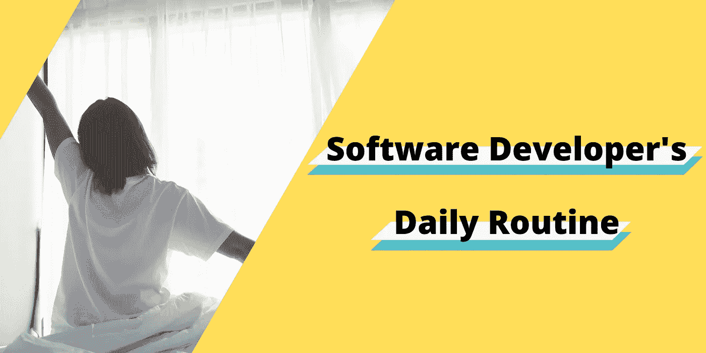
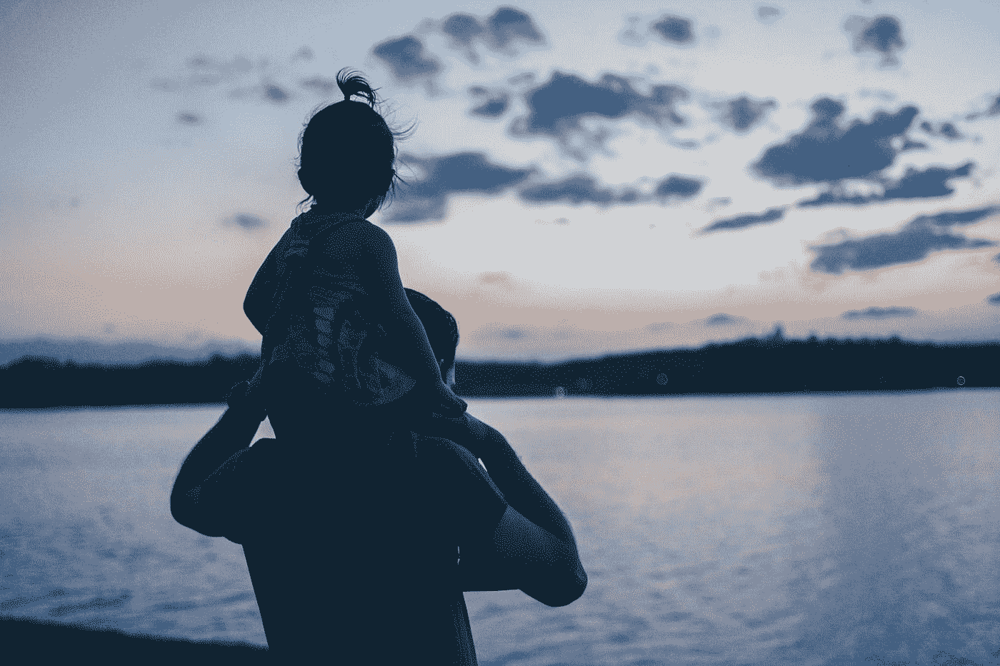
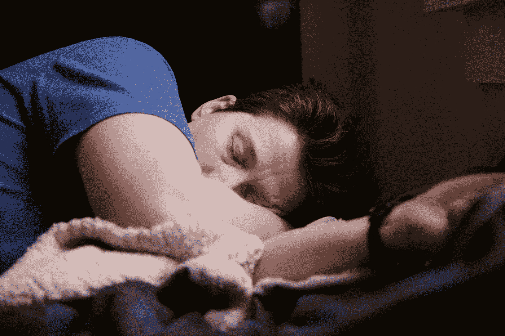

# 一个远程软件开发人员的日常是怎样的？

> 原文：<https://blog.devgenius.io/what-is-the-daily-routine-of-a-remote-software-developer-8cac7debed1b?source=collection_archive---------0----------------------->

我相信你们大多数人都看过 Youtube 上的视频，标题是 ***【软件开发人员的一天】*** 之类的。这篇文章和那些视频相似吗？是的，它是，但是用书面的方式而不是视频来展示。

作为一名远程软件开发人员、一名丈夫和一名父亲，我正在写我的日常生活*。*

由于马来西亚的疫情越来越严重，我的公司允许我们在家工作(WFH)，我也没有让我的儿子去幼儿园。所以，我必须去 WFH，同时还要照顾我的儿子。

## 早上 6:30

我每天都在这个时候醒来，即使是休息日也是如此。当我还是学生的时候，我每天早上 5 点醒来。清晨醒来，感觉可以做更多的事情，让大脑做好工作准备。

我锻炼大约 7 分钟。为什么在早上？早上锻炼可以增强你的能量，如果孩子还没有醒来，可以减少他们对你的干扰，有助于减肥等。…

出汗后，我刷牙，冲个冷水澡，唤醒身心准备工作。

## 上午 7 点 15 分

这时候，我痴迷于 Blippi 的儿子可能在房间里叫我“爸爸，爸爸”,想让我带他出去玩 Blippi！ Blippi 就是生活。最终，我接受了。

在开始一天的工作之前，我会用大约 30 分钟的时间，用概念来思考我的**日常重点、工作的工作和个人的工作**。如果你想知道什么是概念以及如何使用它，请查看我写的另一篇文章！

 [## 作为软件开发人员，你能用概念做什么？

### 你可以使用预算跟踪器、记录每日工作日志、习惯跟踪器等概念..作为一名软件开发者

blog.oysterlee.dev](https://blog.oysterlee.dev/what-can-you-do-with-notion-as-software-developer-6592efab7129) 

## 上午 8 点

给自己准备一片面包，一杯咖啡，给儿子准备一瓶配方奶。现在，对我来说这意味着一天的开始。

> “选择一份你热爱的工作，你这辈子就一天都不用工作了。”——孔子

尽管我的工作应该在上午 9 点开始，但我大部分时间都在加班，因为我不是为了工作而工作。我为我的事业和激情而工作。

我的公司没有每天或每周单口相声的固定时间。然而，有时我的部门主管(HoD)可以随时打电话给我，进行一对一的同步。他认为，如果不相关，团队同步只是浪费另一个参与者的时间。感谢我的 HoD！敬礼！

## **晚上 12 点**

午餐时间到了！我的午餐可以是外卖，从早上开始由妻子带走，如果妻子休息，就由她准备，或者我自己准备。午饭后，我会休息一会儿，哄儿子睡觉。他睡着后，我会回去工作。

## **下午 1 点 30 分**

工作了一整天，该吃晚饭了。有时我们的晚餐可以在我妻子下班回来后由她准备，或者我们出去吃外卖。如果她做饭，我会在她回家前为她准备好食材。

你知道最具挑战性的部分不是我们自己准备菜肴；现在是 ***“今晚做什么吃？”*** 或 ***“今晚吃什么。”***

照片由 [Brittani Burns](https://unsplash.com/@brittaniburns?utm_source=medium&utm_medium=referral) 在 [Unsplash](https://unsplash.com?utm_source=medium&utm_medium=referral) 上拍摄

## 晚上 8 点

家庭时光！网飞要么和妻子在一起，要么和儿子一起玩。你可能会想，既然我是 WFH，难道我的儿子没有来分散我的注意力吗？答案是否定的。此外，我的工作站在客厅，所以我可以很容易地看着我的儿子。

他看 Youtube，独自玩他的玩具！因为不能和他一起玩，为他感到孤独，我感到内疚。我很感激他在我工作的时候没有让我分心，所以家庭时间是唯一能补偿他的时间。

## 晚上 9 点

放松肌肉和精神的热水澡。热水淋浴也能提供更好的睡眠质量。

之后就是睡觉时间了！儿子总是要我在床上陪他，直到他睡着。

[Shane](https://unsplash.com/@theyshane?utm_source=medium&utm_medium=referral) 在 [Unsplash](https://unsplash.com?utm_source=medium&utm_medium=referral) 上拍摄的照片

## 晚上 10 点

他睡着后，我会继续我个人的工作，冲浪中等，或者完成睡前未完成的任务。

通常情况下，如果一切顺利，我会在晚上 11:30 睡觉。所以我可能一天睡 7 个小时。

即使在休息日，我的日常工作也是一样的。我工作，但我工作是为了我的私人物品。

你可能想知道我是否在工作时间玩社交媒体，做其他事情。答案是肯定的，我有，当然，不会太久。我给自己定了一个每日目标，每天编码 4 小时，不包括 Stackoverflow 和 Googling。

我有一个糟糕的日常生活，这导致我的健康状况恶化。以前我每个月都会生病一次。很显然，我换成现在的这个之后，身体越来越好了！还有，我每天喝 8 杯白开水！