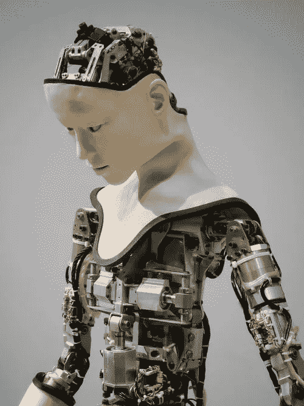
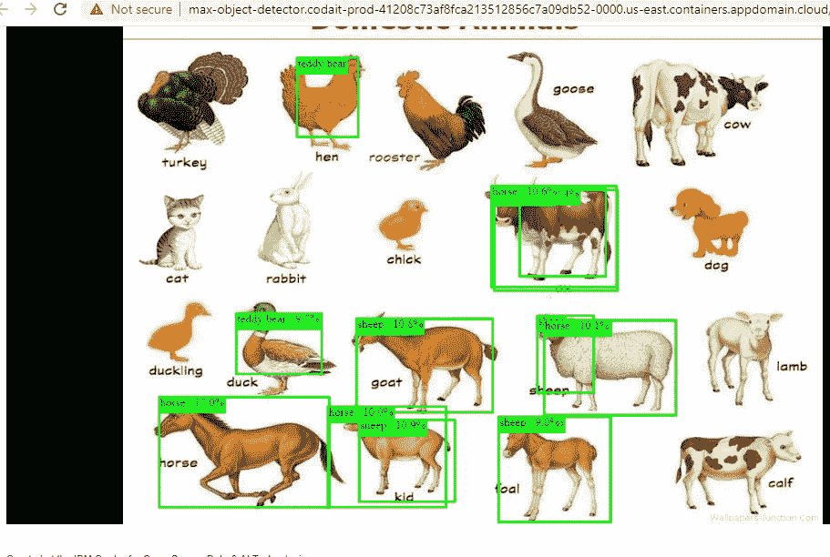

# AI、机器学习、深度学习有什么区别？

> 原文：<https://blog.devgenius.io/what-is-the-difference-between-ai-machine-learning-and-deep-learning-921c62248ae4?source=collection_archive---------30----------------------->

照片由 Franck V .在 Unsplash 上拍摄

AI: **人工智能**试图让计算机变得智能，以模仿认知功能(我们的大脑是如何工作的)。人工智能是一个更大的范围，包括计算机视觉、语言处理、语音识别等..

*对我来说，我认为这是一个目标，一个利用技术进步模仿人类行为来提高生产率的目标。*

ML:机器学习是计算机科学的一个子领域，它赋予“计算机学习的能力，而不需要明确的编程。

没有编程，机器怎么工作？

从实际意义上说，它们只不过具有通过识别模式来做出决定的能力，而不需要再次被编程。这叫做人工智能，我已经在上面解释过了。

人工智能也是人工智能的一个分支，它使用统计和数学方法来教计算机如何通过查看大量的例子来解决问题

*例子:谷歌在 Gmail 中使用机器学习对你的邮件进行分类；脸书使用机器学习向你推荐提要*

**DP:深度学习**是机器学习的一个非常特殊的领域，计算机可以自己学习并做出智能决策。与大多数机器学习算法相比，深度学习涉及更深层次的自动化。换句话说，深度学习是 ML 的一场革命。

“深度神经网络由多层相互连接的节点组成，每一层都使用一种越来越复杂的深度学习算法来提取和识别数据中的特征和模式。然后，他们计算物体或信息能够以一种或多种方式被分类或识别的可能性或置信度。”据 IBM 称。

*人们通常把 ML 和 AI 互换使用，这是不应该的。* ***AI*** *是大局*和 **ML** 和 **DP** 是分支

让我补充一下，所有这些变革都是通过分析大量数据实现的，就像任何系统一样，如果输入是错误的，那么输出也将是错误的。此后，世界各地对数据科学家的需求激增，我在之前的文章中解释了谁是数据科学家，你可以在这里查看

如果你想了解更多关于这些术语及其在现实生活场景中的应用，我将为你推荐这门免费课程:[https://cognitive class . ai/courses/machine-learning-with-python/](https://cognitiveclass.ai/courses/machine-learning-with-python/)

它是免费的，您将获得 IBM 徽章来展示您的知识。

*如果你喜欢我的文章，请不要忘记喜欢和关注，鼓励我与你一起写更多。*

我已经尝试了 IBM 对象检测器，并发现以下有趣的结果。我将很快分享教程…

