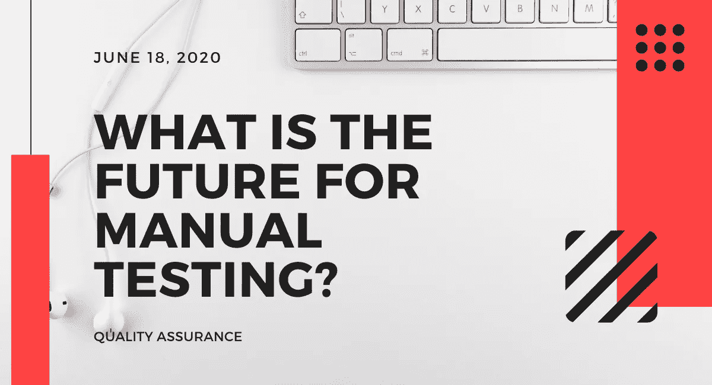
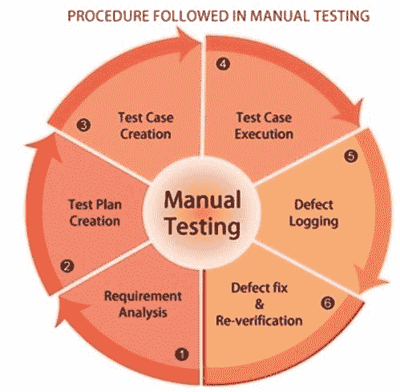
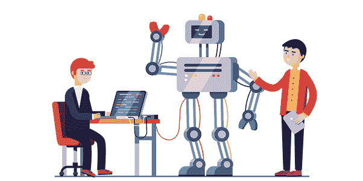

# 手工测试的未来是什么？

> 原文：<https://blog.devgenius.io/what-is-the-future-for-manual-testing-eaf5d1653ee5?source=collection_archive---------23----------------------->

T[手动测试](https://qaandsoftwareblog.blogspot.com/2020/06/what-is-future-for-manual-testing.html)被认为是初步测试阶段，通过执行需求规格分析记录的逐步评估，通常评估所开发的应用程序的行为。手动测试的主要目标是确保应用程序非常好地工作，没有任何类型的错误和功能缺陷，并且符合需求规范文档。

好吧，手工测试的未来在功能和需求方面越来越接近软件开发。手工测试的改进和操作发展证明手工测试人员有必要提高他们的技能和日常工作方式。

坚持手工测试过程的测试人员应该用新的技术和自动化测试框架更新他们的技能，在开发/特殊测试工具、领导素质、逻辑思维和过程分析方面。现在你脑海中可能出现的疑问是测试人员应该做的是:

*   **提高他们的技能，更加了解编程的关键概念以及开发是如何进行的。**
*   **了解代码如何工作。**
*   **详细了解业务部门如何提高投资回报率。**
*   **沉溺于管理活动的能力。**

这些是使他们达到测试分析师水平的关键步骤，实际上就像主题专家[SME]的职责一样。因此，手动测试总是伴随着所有新的自动化测试工具的引入而存在，并且随着其所有的基本概念被开发并在每个软件开发/ Web 应用程序开发过程中进行必要的改变而使用，它将会持续很久。自动化测试和[手动测试](https://qaandsoftwareblog.blogspot.com/2020/06/what-is-future-for-manual-testing.html)将在未来很长一段时间内互为补充。

总之，没有绝对的东西可以替代手工测试。对于执行测试活动，如负载测试、回归测试和性能测试，自动化已经变得至关重要。没有手动测试，测试过程将是不完整的，并且如果我们不太关心手动测试过程，可能会出现功能问题。

手动测试比测试自动化更可靠，并且当手动测试过程成型时，使用诸如推理、归纳推理和人类直觉之类的技能。自动化并不能完全取代这些因素。

**关注我:**

**T3【领英】T5-[https://www.linkedin.com/in/shormistha-chatterjee/](https://www.linkedin.com/in/shormistha-chatterjee/)**

***博主****-*[*https://shormistha4.blogspot.com/*](https://shormistha4.blogspot.com/)*[*https://qaandsoftwareblog.blogspot.com/*](https://qaandsoftwareblog.blogspot.com/)*

****Dzone****-*[*https://dzone.com/users/3854036/shormistha.html*](https://dzone.com/users/3854036/shormistha.html)*

****【Bloglovin】***-[*https://www.bloglovin.com/@shormistha*](https://www.bloglovin.com/@shormistha)*