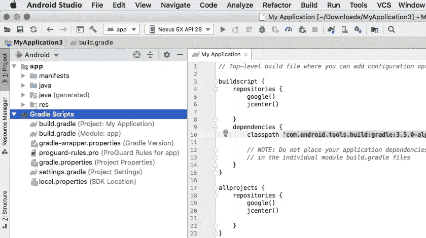

# Android 项目中的 Gradle Scripts 文件夹是什么？build.gradle(模块:app)和 build.gradle(项目:app)有什么区别？深入浅出的解释。

> 原文：<https://blog.devgenius.io/what-is-the-gradle-scripts-folder-in-an-android-project-c4b019ea95e0?source=collection_archive---------5----------------------->

## Gradle Scripts 是 Android 项目中的一个文件夹，包含项目的构建配置文件。这些文件用于指定项目的构建配置，包括依赖项、构建工具以及构建和运行应用程序所需的其他设置。



来源:谷歌

Gradle Scripts 文件夹中有几个重要的构建配置文件:

*   `build.gradle` (Module: app)用于指定项目内特定模块的构建配置，如依赖项、构建工具以及构建和运行 app 所需的其他设置。
*   `build.gradle` (Project: app)用于指定整个项目的全局构建配置，包括可以找到依赖项的存储库以及要使用的 Android 构建工具的版本。
*   `settings.gradle`用于为构建过程指定项目范围的设置，包括哪些模块应该包含在项目中，以及它们应该如何组织。
*   `gradle-wrapper.properties`用于指定构建过程使用的 Gradle 版本。这有助于确保从事该项目的所有开发人员使用相同版本的 Gradle，这有助于防止版本不匹配导致的构建问题。

这些构建配置文件一起用于指定 Android 项目的构建过程。它们是项目的重要组成部分，应该随着项目的变化而不断更新。

> ***下面我们逐一深入考察一下。***

# build.gradle(模块:应用程序)

`build.gradle`(模块:app)是一个 Android 应用的构建配置文件。**用于指定应用的各种构建配置，包括要使用的 Android 构建工具的版本、应用的依赖关系以及其他设置。**

T`build.gradle`文件位于 Android 项目的 app 模块中，用于配置该特定模块的构建过程。该文件由一系列块组成，这些块用于配置构建过程的不同方面，例如要使用的构建工具、应用程序的依赖项以及其他设置。

下面是一个`build.gradle`(模块:app)文件的例子:

```
apply plugin: 'com.android.application'

android {
    compileSdkVersion 29
    buildToolsVersion "29.0.3"

    defaultConfig {
        applicationId "com.example.myapp"
        minSdkVersion 15
        targetSdkVersion 29
        versionCode 1
        versionName "1.0"

        testInstrumentationRunner "androidx.test.runner.AndroidJUnitRunner"
    }

    buildTypes {
        release {
            minifyEnabled false
            proguardFiles getDefaultProguardFile('proguard-android-optimize.txt'), 'proguard-rules.pro'
        }
    }
}

dependencies {
    implementation fileTree(dir: 'libs', include: ['*.jar'])
    implementation 'androidx.appcompat:appcompat:1.1.0'
    implementation 'androidx.constraintlayout:constraintlayout:1.1.3'
    testImplementation 'junit:junit:4.12'
    androidTestImplementation 'androidx.test.ext:junit:1.1.1'
    androidTestImplementation 'androidx.test.espresso:espresso-core:3.2.0'
}
```

顶部的`apply plugin: 'com.android.application'`行指定这个构建文件是用于一个 Android 应用程序的。`android`块包含 Android 构建工具的各种配置，例如要使用的`compileSdkVersion`和`buildToolsVersion`。

T he `defaultConfig`块指定了各种配置的默认值，比如`applicationId`(应用的包名)`minSdkVersion`(运行应用所需的最低 Android 版本)，以及`targetSdkVersion`(应用所针对的 Android 版本)。

`buildTypes`块为不同类型的构建指定了构建配置，例如`release`构建。在这个例子中，`release`构建将`minifyEnabled`设置为`false`，这意味着代码不会被缩小(收缩并优化以供发布)。

最后，`dependencies`块指定了应用程序的依赖项，比如应用程序需要构建和运行的库和其他外部依赖项。在本例中，应用程序依赖于 Android 支持库和约束布局库。

以下是关于 Android 项目中的 `**build.gradle**` **(模块:app)文件的一些附加细节:**

*   `build.gradle`文件用于指定 Android 应用的构建配置，包括依赖项、构建工具和其他设置。
*   `build.gradle`文件位于 Android 项目的 app 模块中，用于配置该特定模块的构建过程。
*   `build.gradle`文件由一系列用于配置构建过程不同方面的块组成。例如，**`**android**`**块用于配置 Android 构建工具，** `**defaultConfig**` **块用于指定各种配置的默认值，** `**buildTypes**` **块用于指定不同类型构建的构建配置。****
*   **`dependencies`块用于指定应用程序的依赖项，比如应用程序需要构建和运行的库和其他外部依赖项。**依赖项可以指定为** `**implementation**` **依赖项，包含在最终的 APK 中，也可以指定为** `**testImplementation**` **依赖项，仅用于测试，不包含在最终的 APK 中。****
*   **`build.gradle`文件也可以用来指定可以作为构建过程的一部分运行的定制任务。例如，您可以创建一个任务，在每次构建之前自动增加应用程序的版本代码。**

**这都是关于`build.gradle`(模块:app)的。**

# **build.gradle(项目:应用程序)**

**`build.gradle` (Project: app)是一个 Android 项目的构建配置文件。**用于指定项目的全局构建配置，包括要使用的 Android 构建工具的版本、可以找到依赖项的存储库以及其他设置。****

****`**build.gradle**`**文件位于 Android 项目的根目录下，用于配置整个项目**的构建过程。它由一系列块组成，这些块用于配置构建过程的不同方面，例如要使用的构建工具、可以找到依赖项的存储库以及其他设置。****

****下面是一个`build.gradle`文件的例子:****

```
**buildscript {
    repositories {
        google()
        jcenter()
    }
    dependencies {
        classpath 'com.android.application'
    }
}

allprojects {
    repositories {
        google()
        jcenter()
    }
}

task clean(type: Delete) {
    delete rootProject.buildDir
}**
```

****`buildscript`块指定了可以找到构建工具和其他依赖项的存储库，以及构建过程所需的依赖项。在这个例子中，构建工具来自 Google 的 Maven 仓库和 JCenter。****

****`allprojects`块指定了可以找到项目中所有项目的依赖关系的存储库。在这个例子中，依赖项来自 Google 的 Maven 仓库和 JCenter。****

****F 最后，`clean`任务是一个定制任务，可以运行它来删除项目的构建目录。如果您想要开始一个没有以前构建的文件的全新构建，这可能会很有用。****

******需要注意的是，** `**build.gradle**` **(项目:app)文件与** `**build.gradle**` **(模块:app)文件是分开的，后者用于指定项目中特定模块的构建配置。**`build.gradle`(Project:app)文件用于指定整个项目的全局构建配置，而`build.gradle` (Module: app)文件用于指定特定模块的构建配置。****

****H **这里有一些关于 Android 项目中** `**build.gradle**` **(Project: app)文件的附加细节:******

*   ****`build.gradle` (Project: app)文件用于指定 Android 项目的全局构建配置，包括可以找到依赖项的存储库和要使用的 Android 构建工具的版本。****
*   ****`build.gradle` (Project: app)文件位于 Android 项目的根目录中，用于配置整个项目的构建过程。****
*   ****`buildscript`块用于指定可以找到构建工具和其他依赖项的存储库，以及构建过程所需的依赖项。`allprojects`块用于指定存储库，在那里可以找到项目中所有项目的依赖关系。****
*   ****`build.gradle` (Project: app)文件也可以用来定义可以作为构建过程的一部分运行的定制任务。例如，您可以在构建应用程序之前创建一个任务来自动生成代码或执行一些其他操作。****

****希望这有帮助！****

# ****local.properties (SDK 位置)****

****`local.properties`是 Android 项目中的一个配置文件，它指定了 Android SDK 在本地开发机器上的位置。Android 构建工具使用它来查找构建和运行 Android 应用程序所需的必要的构建工具和库。****

****T`local.properties`文件位于 Android 项目的根目录中，包含一行指定 Android SDK 在本地开发机器上的位置的代码。下面是一个`local.properties`文件的例子:****

```
**sdk.dir=/Users/username/Library/Android/sdk**
```

****在这个例子中，`sdk.dir`属性指定 Android SDK 在本地开发机器上的位置为`/Users/username/Library/Android/sdk`。这允许 Android 构建工具找到构建和运行 Android 应用程序所需的必要的构建工具和库。****

****需要注意的是，`local.properties`文件是特定于本地开发机器的，不应该被签入版本控制。相反，每个从事该项目的开发人员应该创建他们自己的`local.properties`文件，该文件包含他们自己的本地 Android SDK 的路径。这确保了构建工具可以在每个开发人员的机器上找到必要的依赖项。****

****这都是关于`local.properties`的。****

# ****gradle.properties(项目属性)****

****`gradle.properties`是 Android 项目中的一个配置文件，它为构建过程指定了项目范围的属性。它用于指定要使用的 Gradle 构建工具的版本，以及可用于定制构建过程的其他属性。****

****`gradle.properties`文件位于 Android 项目的根目录中，由一系列用于指定项目范围属性的键值对组成。下面是一个`gradle.properties`文件的例子:****

```
**# Specify the version of the Gradle build tools to use
org.gradle.jvmargs=-Xmx1536m

# Custom property for the build process
myCustomProperty=foo**
```

****在这个例子中，`org.gradle.jvmargs`属性指定了要使用的 Gradle 构建工具的版本，`myCustomProperty`属性是一个定制属性，可以用来定制构建过程。****

****`gradle.properties`文件可用于指定各种各样的属性，这些属性可用于定制构建过程。例如，您可以使用它来指定要使用的 Android 构建工具的版本、Android SDK 的位置或构建过程使用的其他属性。****

****重要的是要注意到`gradle.properties`文件是特定于项目的，应该和项目的其余源代码一起被检入版本控制。这确保了构建过程在参与项目的所有开发人员之间是一致的。****

****这都是为了`gradle.properties`。****

# ****settings.gradle(项目设置)****

****`settings.gradle`是 Android 项目中的一个配置文件，它为构建过程指定了项目范围的设置。它用于指定项目中应该包含哪些模块，以及应该如何组织它们。****

****T`settings.gradle`文件位于 Android 项目的根目录中，由一系列语句组成，这些语句用于指定项目中要包含的模块以及它们应该如何组织。下面是一个`settings.gradle`文件的例子:****

```
**include ':app'
include ':library'

project(':library').projectDir = new File('library')**
```

****在这个例子中，`include`语句指定`app`和`library`模块应该包含在项目中。`project`语句用于指定`library`模块的位置，该模块位于名为`library`的子目录中。****

****`settings.gradle`文件是 Android 项目构建过程中的一个重要部分，因为它告诉构建工具项目中要包含哪些模块，以及它们应该如何组织。随着项目的变化，保持`settings.gradle`文件的更新是很重要的，可以根据需要添加或删除模块。****

****这都是关于`settings.gradle`的。****

# ****Gradle-wrapper . properties(Gradle 版本)****

****`gradle-wrapper.properties`是 Android 项目中的一个配置文件，它指定了用于构建过程的 Gradle 版本。它用于确保参与项目的所有开发人员使用相同版本的 Gradle，这有助于防止版本不匹配导致的构建问题。****

****`gradle-wrapper.properties`文件位于 Android 项目的`gradle/wrapper`目录中，由一系列键值对组成，用于指定要使用的 Gradle 版本。下面是一个`gradle-wrapper.properties`文件的例子:****

```
**# Specify the version of Gradle to use
distributionUrl=https\://services.gradle.org/distributions/gradle-6.7.1-all.zip**
```

****在这个例子中，`distributionUrl`属性指定了用于构建过程的 Gradle 发行版的 URL。这确保了项目中的所有开发人员都使用相同版本的 Gradle，这有助于防止版本不匹配导致的构建问题。****

****`gradle-wrapper.properties`文件很重要，因为它允许开发人员指定用于构建过程的 Gradle 版本，而不必手动安装 Gradle。相反，构建工具将根据需要下载指定版本的 Gradle，确保所有开发人员使用相同的版本。****

********

****来源:谷歌****

****这是一个 Android 项目中的 Gradle Scripts 文件夹。
我希望你喜欢它！****

****谢谢大家！****