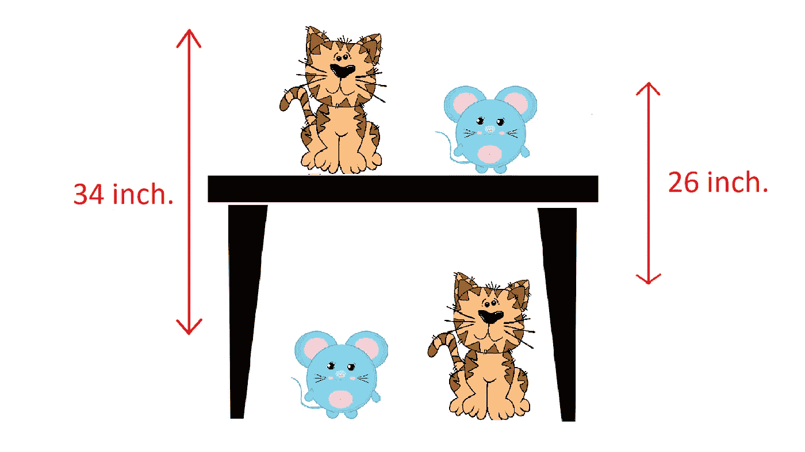
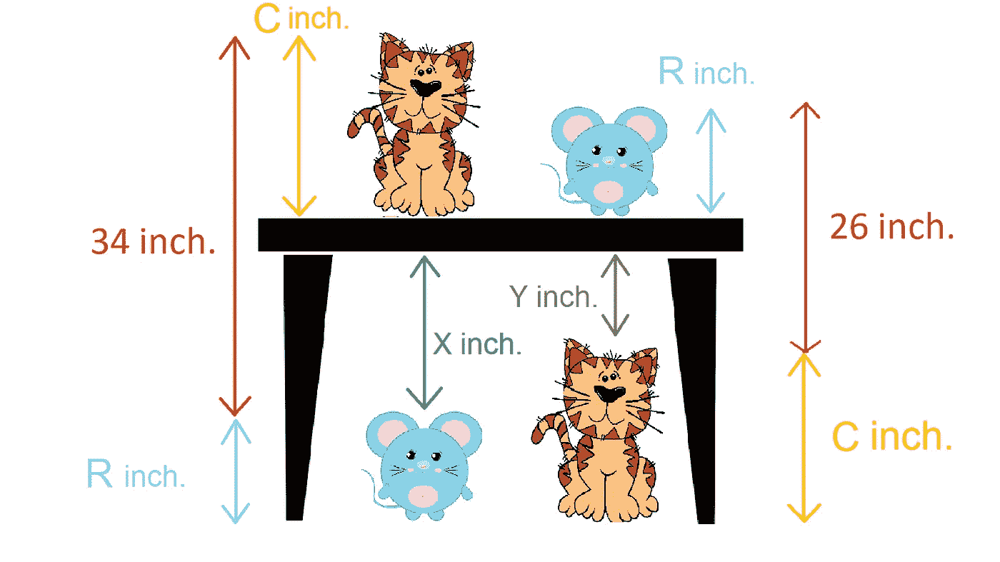
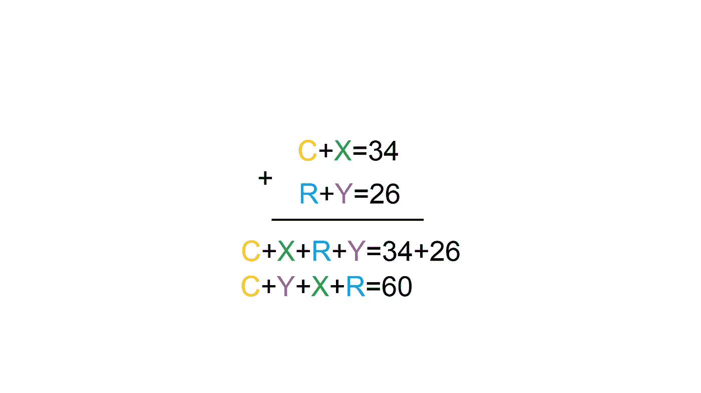
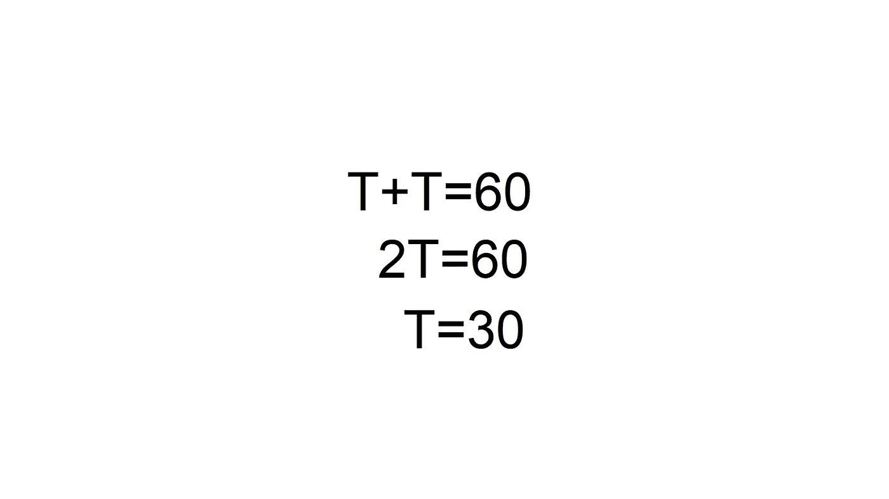

# 这张桌子有多高？

> 原文：<https://blog.devgenius.io/what-is-the-height-of-the-table-75ce5cdd11a3?source=collection_archive---------8----------------------->

朋友们，我是普里塔姆。

这里有一个问题，在两种情况下都有一只猫和一只老鼠，但在第一种情况下，这个高度是 34 厘米，在第二种情况下，这个高度是 26 厘米。

现在我们必须找到桌子的高度。

解决方案

假设猫的高度是 c 厘米，老鼠的高度是 r 厘米。这部分的高度是 x 厘米和 y 厘米。

从第一个例子来看，桌子 T 的高度是 x+r。

从第二个例子开始，桌子的高度是 c+y。

从第一种情况来看，如果你试图写出这个等式，那么它将是 C+X=34，而对于第二种情况，它将是 R+Y= 26，

将这两个方程相加，我们得到 C+X+R+Y=34+26

它意味着 C+Y+X+R=60

它等于 T+T=60，因为我们已经知道了桌子的高度。

因此 2T=60

意思是 T=30

因此，桌子的高度为 30 厘米。

你可以看到解决方案是多么简单；我们刚刚把这两个方程相加，就得到了桌子的高度。

今天就到这里吧，伙计们，如果你们喜欢这个故事，那就喜欢吧。如果你想给我一些问题，那你最好来。你也可以在社交媒体上关注我。

领英:[https://www.linkedin.com/in/pritam-chakraborty-a5a345153](https://www.linkedin.com/in/pritam-chakraborty-a5a345153)

你也可以看看我的 YouTube 频道。

 [## 整齐地

### 向您介绍 trikily YouTube 频道。在这里，您可以看到解决任何棘手问题的各种方法，并且您可以…

www.youtube.com](https://www.youtube.com/channel/UCU5Yut-RmqhUTpuFM3by3_w/about?disable_polymer=1) 

下一个故事再见。