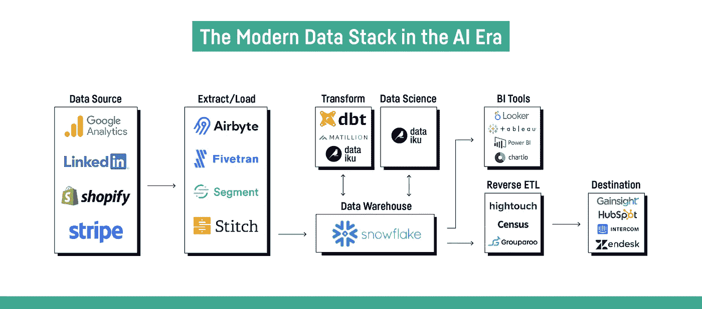
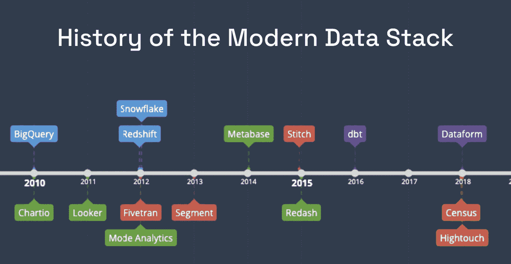
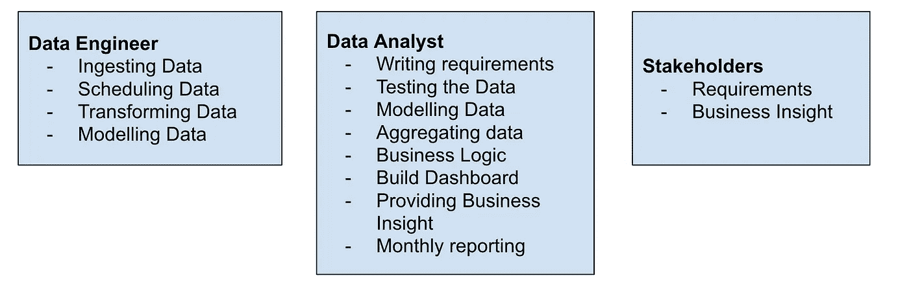
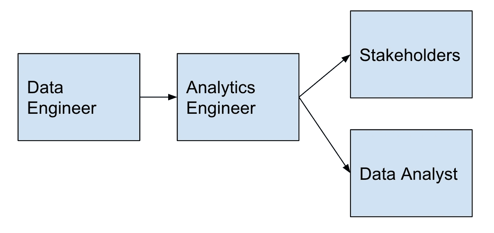

# 什么是现代数据堆栈？

> 原文：<https://blog.devgenius.io/what-is-the-modern-data-stack-e27b729ef615?source=collection_archive---------3----------------------->

在我过去十年从事分析工作和处理数据的职业生涯中，我看到越来越多的组织了解数据的重要性，并接受收集和存储数据来做出经营业务的决策。因此，组织正在收集更多的数据，这为分析和报告以及将数据用于机器学习应用程序提供了机会。

我使用的技术使我能够帮助组织构建数据产品，包括接收数据、转换数据、将数据存储到数据仓库以及输入到 BI 工具或机器学习模型中。我为这些数据产品构建的工具本质上被称为现代数据堆栈(MDS)。

我将解释什么是现代数据堆栈，MDS 的组成部分是什么，MDS 对数据专业意味着什么，MDS 是如何出现的，转换工具如何改变游戏，为什么转换和建模数据不起作用，以及建模数据如何变得更容易。

# 数据社区的上升机遇

现代数据堆栈是一套工具，用于从简单的数据集成到存储、转换数据。目标是分析业务数据以发现新的机会领域并提高效率。现代数据栈的主要目的是使团队能够相应地扩展，并立即跟上产品的速度。

现代数据堆栈的组件

现代数据堆栈为组织提供了工具选择的灵活性。

## 这些是现代数据堆栈的主要组件:

*   **数据源** —可以是从您的业务(销售、客户、产品)或来自您的网站、应用程序、社交媒体支付的应用程序中捕获的数据，这可以连接到 API。
*   **提取和加载** —这一层帮助安排数据存储到您的数据仓库中。这可能是尚未准备好用于报告的源数据。
*   **数据仓库** —这是存储源数据的地方，也是准备好/接近准备好进行分析的转换数据的地方
*   **转换** —这是一个受控的环境，它有转换指令，连接多个数据源，并为分析和报告做准备。transformation 元素还可以支持其他功能，这些功能允许检查数据质量、可视化、数据建模方式(Dag)以及确定数据在数据仓库中的构建方式。这里有一个关于如何使用 dbt 构建数据的链接。这也可以链接到 Git 这样的版本控制环境。
*   **BI 工具** —这是可以生成报告和仪表板的可视化层。根据 BI 工具，您可以在数据中执行轻量级业务逻辑。还有警报和报告调度功能。

在过去的 10 年中，这些是从它们首次推出时的下图中的流行工具。

现代数据堆栈的时间表

*   蓝色:数据仓库
*   红色:摄取数据
*   紫色:数据的转换
*   绿色:商务智能工具(前层)

# 作为一个数据职业，MDS 意味着什么？

好处是您拥有快速支持业务、自动化工作流、快速故障排除的工具和能力，以及解决两个主要问题的能力— **数据混乱和数据面包线**。

数据冲突是指团队拥有相同的 KPI，但他们计算 KPI 的方式不同，从而导致不同的结果。数据面包线是利益相关者等待数据团队为他们解答问题的时候，这时您可以通过支持自助 BI 工具来解决问题。

> 想象一下，在一个组织中，数据会在需要的时候送到需要的人手中。

许多中型和更成熟的组织已经利用了数据仓库的优势，并且已经从本地服务器迁移到数据仓库。然而，我发现他们可能由于遗留问题等原因而没有迁移到现代数据技术，并且由于容量和技术能力的原因，他们可能不会将此作为优先事项。

另一方面，现代数据堆栈使初创企业能够快速建立数据能力，并为他们提供适合他们的工具选择。由于团队需求的性质以及职责的完全定义，您可能会使用不同的工具。

有新的工具，这意味着需要开发新的技术技能，承担更多的责任，为几年前不存在的新工作提供新的最佳实践和机会，如数据工程师和最近的分析工程师，以及产品分析师和营销分析师。

## **现代数据栈是如何出现的？**

由于硬件的进步和云计算的可用性，MDS 变得越来越受欢迎，云计算的存储成本变得更低，提供并行计算，并且与传统的本地数据策略相比更加安全。云计算还允许组织根据自己的需求扩大和缩小规模。

各种各样的开源技术和开发为收集各种各样的大量数据创造了更多的机会。

# 为什么旧的数据转换和建模方式不起作用了？

当业务部门要求产生新的报告要求时，如新业务收入流或新产品功能的新 KPI 测量。

为了说明这一点，我们举了一个简单的例子，它涉及三方，包括数据工程师、数据分析师和利益相关者。请注意，每个组织的工作流程可能不同。

建立报告要求所需的三方和任务

数据分析师需要编写利益相关者的需求，并将它们提交给数据工程师，以便将它们添加到他们的待办事项列表中并进行优先级排序，并向数据分析师提供可用数据，从而为利益相关者构建仪表板。这种模式的问题是它可能会很长，而且很混乱！

在我的经历中，最大的挑战是不清楚谁的责任是用所需的业务逻辑和数据聚合来建模数据。应该是数据工程师还是数据分析师？

我有过这样的经历，数据工程师假设数据分析师可以在 BI 层中对数据建模，以满足涉众的需求。这可能会实现所需的输出，但是在 BI 工具中可能会有性能问题。数据工程师常常不理解为数据分析师在 BI 工具中建模数据的技术压力。例如，每次都必须删除并完全重建数据，然后加载并执行聚合！

更不用说转换和业务逻辑是否存储在由 data analyst 管理的 BI 工具中—这使得代码难以理解，并且不是所有 BI 工具都支持版本控制。这增加了可维护性、可扩展性和未来开发的复杂性。

如果数据建模的责任在于数据工程师，那么这个过程需要就数据分析师到底在做什么进行大量的沟通，并与数据工程师确认需求是否被理解。这一过程更有意义，可能是比上述更好的解决方案，但是当添加了范围变更，并且没有进行适当的沟通时，可能会导致更加复杂和难以理解。此外，当数据工程师的角色应该专注于其他关键领域时，数据转换会占用他们的能力。

# 转型工具已经改变了游戏规则！

传统上，数据工程师在仓库中经历 ETL 过程(提取、转换、加载)。使用现代数据堆栈，数据存储在其源数据仓库中，然后转换并再次存储在数据仓库中。记住现在存储数据更便宜了！

我将要谈到的转换工具是 dbt(数据构建工具)。dbt 执行`ELT`中的`T`(提取、加载、转换)过程——它不提取或加载数据，但是它非常擅长转换已经加载到您的仓库中的数据。

转换数据的新方式在数据行业创造了一个新的角色，称为分析工程师，他们可以通过简单地编写 select 语句来转换仓库中的数据。数据工程师的价值在于使用收集的数据，并将数据连接到其他来源，为数据消费者构建数据产品提供更有价值的见解。

这是存储的`SQL`代码，它将业务需求转化为数据需求。这个工具为传统的数据分析师提供了强大的力量，因为他们可以编写`SQL`并且他们知道业务需求。这为数据工程师腾出了更多的带宽，让他们可以从事其他任务和项目。

dbt 还提供了像软件工程师编写代码一样编写文档的能力，并适应最佳实践。对于分析工程师来说，设置数据质量和完整性测试，并为适用于业务规则的单一真实来源制定集中的数据策略也很重要。有了这一切，我们可以拥有一个自助服务和报告的环境。

数据需求协同工作的典型工作流

# 建模数据有什么不同并且可能更容易？

旧的数据建模方法越来越不适用，例如 Kimball 技术。像星型模式这样的旧建模技术使得维护代码变得更加困难。

在现代数据栈中使用长而宽的表是可以接受的，相比之下，星型模式——five tran 的文章讨论了优势和性能。

# **关键要点**

由于现代数据堆栈的巨大优势，数据团队正在庆祝，以下是这些优势的总结:

*   减少数据混乱和数据面包线！
*   更新的工作方式和更快的部署！
*   更可控的开发环境——CI/CD、Git 版本控制、数据更新和就绪时间表

我希望你喜欢我的演讲，也希望你对现代数据堆栈有所了解。在未来的讲座中，我们将讨论适应数据空间新环境的挑战，我将与您分享我的资源！

# 资源

[https://www.getdbt.com/what-is-analytics-engineering/](https://www.getdbt.com/what-is-analytics-engineering/)