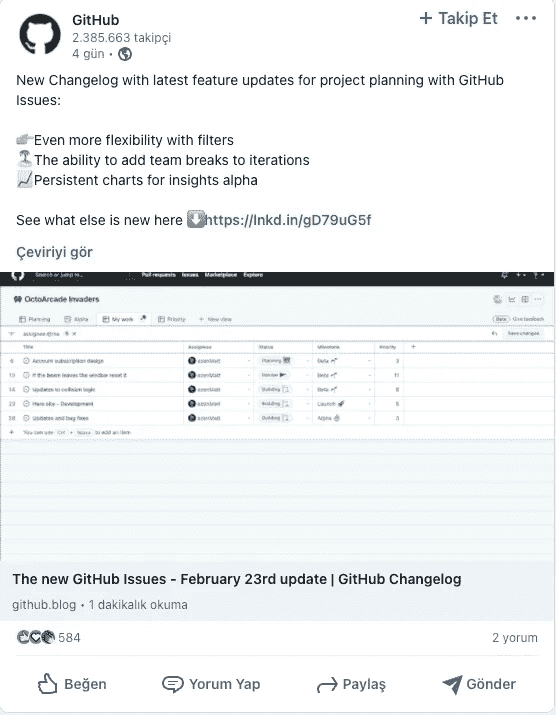
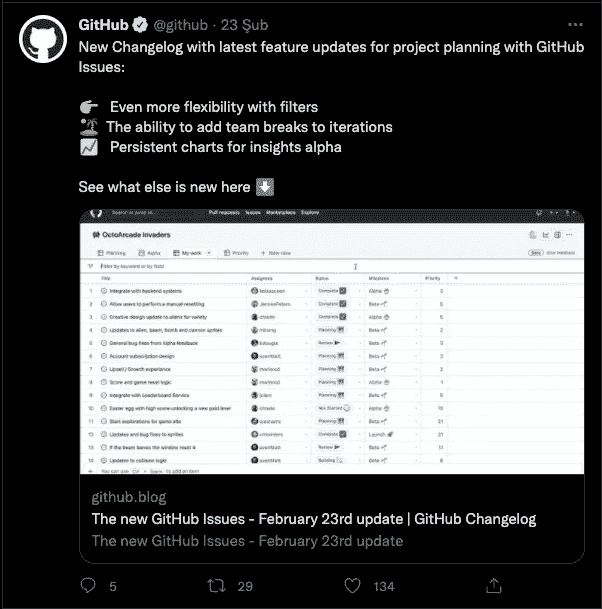
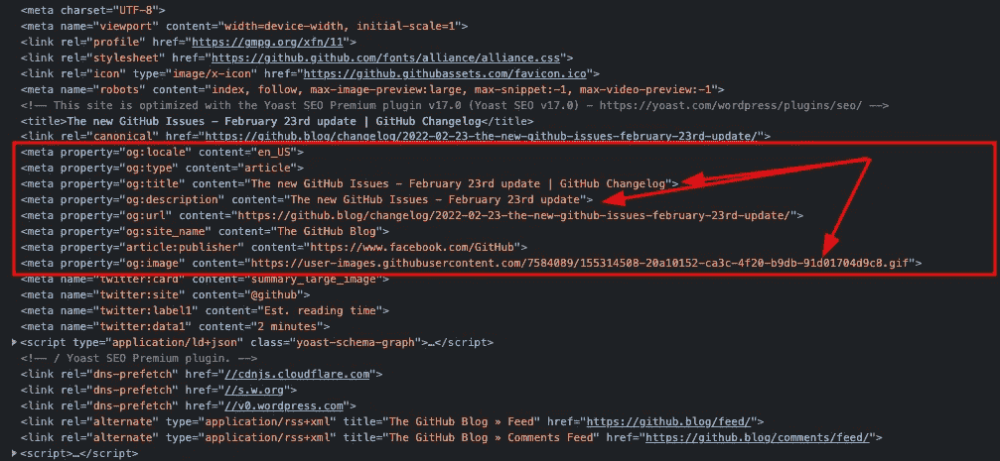
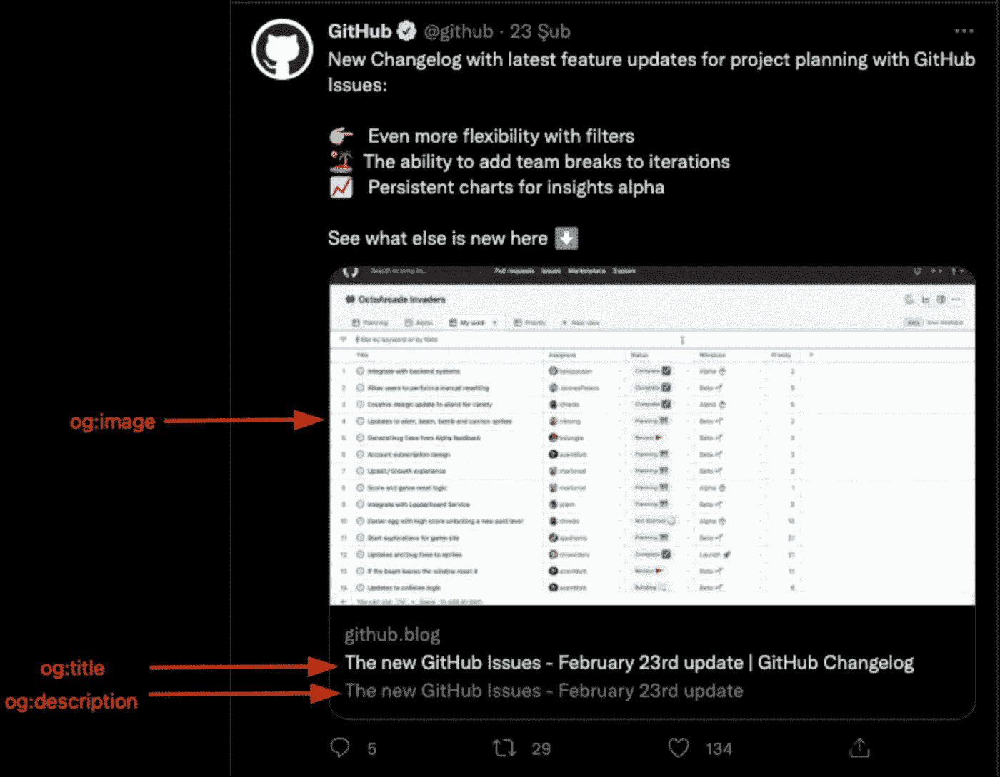
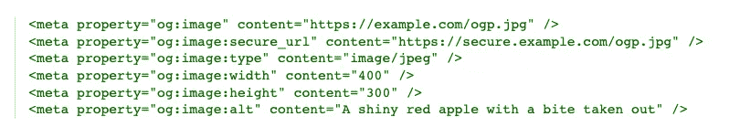
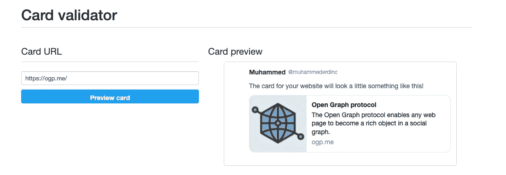

# 什么是开放图协议？

> 原文：<https://blog.devgenius.io/what-is-the-open-graph-protocol-dc03cedef3aa?source=collection_archive---------15----------------------->

[Open Graph Protocol](https://ogp.me/) 是脸书创建的一个协议，用于标准化网页上的 [SEO](https://en.wikipedia.org/wiki/Search_engine_optimization) 元数据，该元数据控制 URL 在社交媒体上共享时的显示方式。元数据标准化消除了跨站点元数据不匹配。今天，除了脸书，开放图协议也被其他社交媒体网站使用，如 LinkedIn 和 Twitter。打开图形标签位于网页的<头>部分。

LinkedIn 上分享的这个 URL 的预览中的标题和图像来自于 Open Graph 标签。

社交媒体对于你的内容接触到更多人非常重要。用户更有可能看到和点击与优化的开放图形标签共享的内容。这意味着你的网站会有更多的社交媒体流量。以下是使用开放图形标签创建的预览的优点:

*   他们让内容在社交媒体流上更引人注目。
*   内容的预览。
*   他们帮助脸书了解内容是什么，这将有助于你通过搜索增加你的品牌知名度。

在 Twitter 上分享的这个 URL 的预览中的图像、标题和描述信息来自于 Open Graph 标签。

当我们查看 Twitter 和 LinkedIn 上共享的[站点](https://github.blog/changelog/2022-02-23-the-new-github-issues-february-23rd-update/)的部分时，我们可以看到开放图元标签。

上面示例帖子中的站点元标签

每个页面所需的四个基本开放图形标签是:og:标题，og:类型，og:图像和 og:url。让我们快速看一下一些元标签及其描述:

*   **"og:title":** 它将代表你的页面的标题。往往与网页的<标题>标签相同。
*   " **og:type"** :代表网站的类型。在上面的例子中，这被表示为“文章”。
*   " **og:image"** :代表您的页面的图像的 URL。
*   " **og:url"** :指你页面的当前 url。
*   " **og:description"** :指对你的内容的简要描述。通常与< meta type="description "相同。
*   " **og:audio"** :代表你的内容的音频文件的 URL。
*   " **og:video"** :代表你的内容的视频 URL。

用开放图形标签创建的 twitter 卡片剖析

## 图像的附加元标签

一些元标签可能有附加的元标签。例如，让我们看一下 og:image 标签。通常，使用 og:image 标记就足够了，但是在某些情况下，内容的预览可能不像您想要的那样。你可能需要额外的元标签。例如，您可能想要调整图像的高度和宽度。下面你可以看到 og:image 的一些元标签和描述。

*   **“og:image:URL”**:同 og:image。指示图像的 URL。
*   **"og:image:secure_url"** :网页需要 [HTTPS](https://en.wikipedia.org/wiki/HTTPS) 时使用的备用 url。
*   **"og:image:type"** :表示图像的[媒体类型](https://en.wikipedia.org/wiki/Media_type)信息。
*   " **og:image:width"** :以像素为单位表示图像的宽度。
*   " **og:image:height"** :以像素表示图像的高度。
*   " **og: image:alt"** :对图像内容的描述(不是标题)。如果页面指定了 og:image，它应该指定`og:image:alt`。

og:图像元标签的使用(来源链接: [ogp](https://ogp.me/#structured) )

## 测试开放图形标签

添加 Open Graph meta 标签后，您可以测试您的内容在社交媒体网站上的显示效果。这将使调试你的元标签更加容易。

Twitter 卡验证器

以下是脸书和推特的测试链接:

*   https://developers.facebook.com/tools/debug/
*   推特:【https://cards-dev.twitter.com/validator 

## 参考资料:

*   [https://ogp.me/](https://ogp.me/)
*   [https://en.wikipedia.org/wiki/Social_graph](https://en.wikipedia.org/wiki/Social_graph)
*   [https://en . Wikipedia . org/wiki/脸书 _ 平台#Open_Graph_protocol](https://en.wikipedia.org/wiki/Facebook_Platform#Open_Graph_protocol)
*   https://www . freecodecamp . org/news/what-is-Open-graph-and-how-I-can-use-it-for-my-website/#:~:text = Open % 20 graph % 20 is % 20 an % 20 internet，the % 20 duration % 20 of % 20a % 20 video。
*   [https://en . Wikipedia . org/wiki/Social _ graph #/media/File:Sna _ large . png](https://en.wikipedia.org/wiki/Social_graph#/media/File:Sna_large.png)
*   https://ogp.me/#structured
*   【https://developers.facebook.com/tools/debug/ 
*   [https://cards-dev.twitter.com/validator](https://cards-dev.twitter.com/validator)
*   [https://en.wikipedia.org/wiki/Media_type](https://en.wikipedia.org/wiki/Media_type)
*   [https://developer . Twitter . com/en/docs/Twitter-for-websites/cards/overview/markup](https://developer.twitter.com/en/docs/twitter-for-websites/cards/overview/markup)