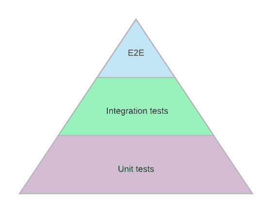
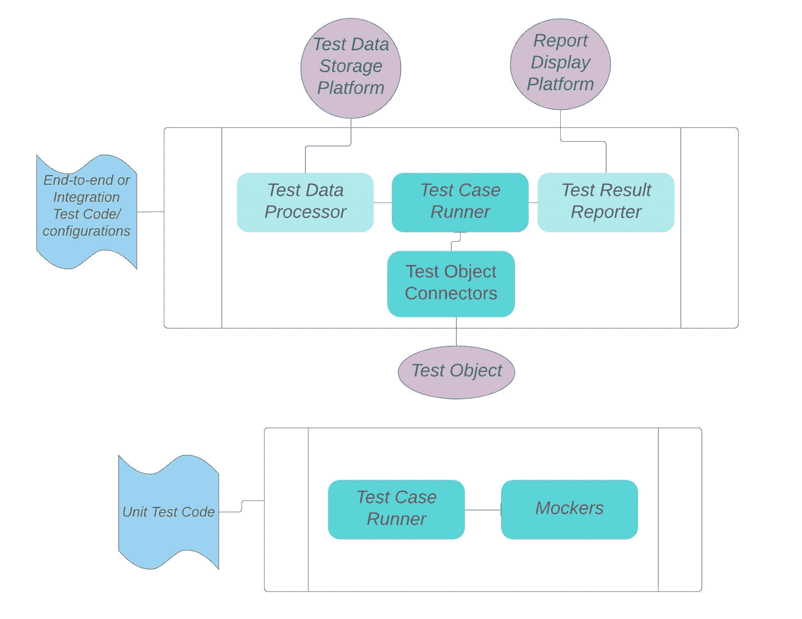

# 测试金字塔模型有什么问题？

> 原文：<https://blog.devgenius.io/what-is-the-problem-of-testing-pyramid-model-7fe7612a02e8?source=collection_archive---------15----------------------->

根据测试粒度对测试用例进行分组的一种流行方法是测试金字塔模型。

但是当试图将其他测试类别映射到这个模型中时，事情变得有点混乱。

一些 QA 工程师在 E2E 级别考虑 UI 自动化，在集成级别考虑 API 测试。

其他人会认为 UI 测试位于 E2E 和集成级别，而 API 测试位于集成和单元级别。当他们彼此交谈时，有时他们实际上是通过混淆这些概念来指代不同的事物。

谁是对的？

如果我们回到定义，事情就简单明了了。都可以是正确答案。这取决于您的系统的实际架构和您的团队正在工作的部分。

单元测试是在方法层面上工作的测试用例，集成测试是在服务层面上执行的，端到端测试是从头到尾检查工作流。

对于全栈团队，UI 自动化通常是端到端的测试，因为它通常涉及一组作为工作流的计划好的动作，并且请求从浏览器传播到 web 服务、其他后端中间件、后端服务和数据库；API 测试扮演着集成测试的角色，因为它实际上是前端调用后端的方式，以及一些后端服务如何相互通信。

对于一个将团队分为前端和后端的组织，或者一些团队只提供 API 服务作为面向客户端的应用程序，API 测试现在变成了端到端的测试。如果团队正在处理数据转换工作或者管理数据管道，那么数据质量检查测试用例就是这个团队的端到端测试。或者来自不同团队的 QA 可以一起定义和编写端到端的测试套件，覆盖来自不同团队的应用程序或服务。

在单元测试级别，我们也有 UI 测试和 API 测试，但是这些测试用例使用模拟技术，而不是实际与浏览器对话、进行 HTTP 调用或连接真实的数据库。如果一个测试用例拥有与当前代码库之外的另一个组件对话的方法，那么它就是一个非单元测试，意味着它是一个集成测试或者端到端测试。

下面是由单元测试框架组成的不同组件与由端到端/集成测试自动化框架组成的组件的对比图。

通常在一个团队中，开发人员处理单元测试，QA 处理其余的，为测试自动化框架和自动化脚本编写代码，执行手工测试，等等。但还是那句话，取决于团队规模和产品的复杂程度。例如，在一个小规模的团队中，一个 QA 工程师负责所有类型的测试，或者根本没有 QA 角色，开发人员或产品负责人负责所有的测试。在一个中等规模的团队或大公司中，有不同头衔的不同类型的 QA，例如测试中的软件开发工程师(SET)，测试工程师(TE)，或软件质量工程师，质量保证分析师，他们关注不同类型的测试。

在《谷歌如何测试软件》一书中，谷歌对测试的分组方式是基于规模的。Google 使用小型、中型和大型测试的语言，强调范围胜于形式。尺寸是一个更明确的概念来度量粒度，但是这样，它失去了将测试用例直观地链接回物理测试对象的能力。

显然，没有一种完美的模式适合所有情况。在众多对测试用例进行分类的方法中，测试金字塔是一个很好的简单的模型，用于说明测试策略，只要团队将其拥有的测试用例清楚地映射到这三层中。