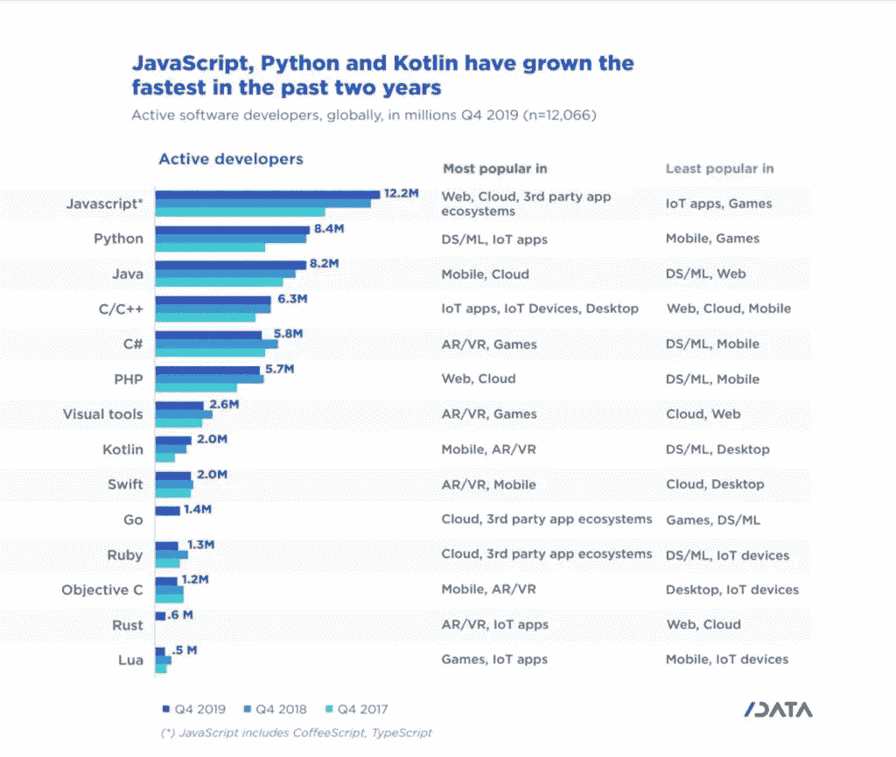
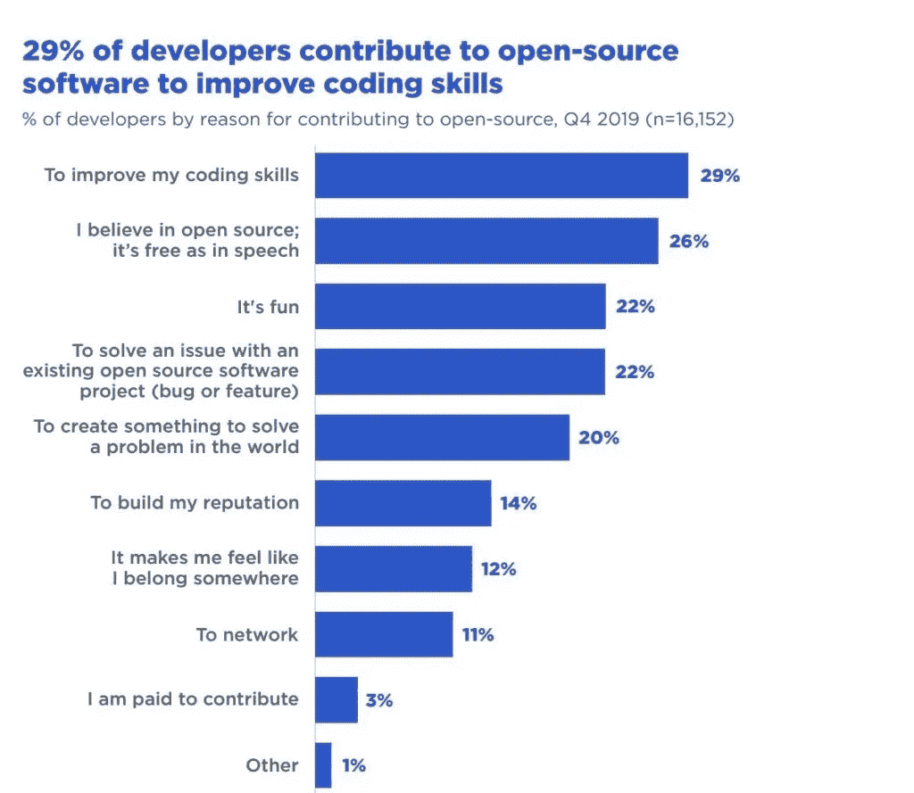
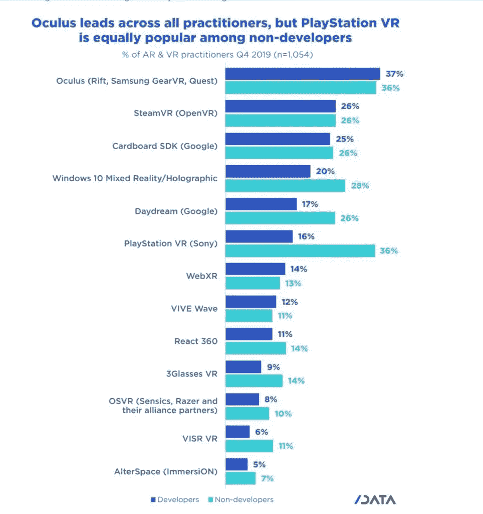

# 2020 年开发者的状态是怎样的？

> 原文：<https://blog.devgenius.io/what-is-the-state-of-the-developer-in-2020-e9efd6770ff?source=collection_archive---------35----------------------->

SlashData 和 Data Developer Economics 收集数据以洞察 2020 年软件开发人员的主要趋势:在本文中，我回顾了今年的发现

每年 SlashData 和 Data Developer Economics [都会对](https://www.slashdata.co/free-resources/state-developer-nation-18th-edition?section=subscribe)开发者进行调查，以洞察关键趋势。上个月，他们发布了最新的开发者状态，覆盖了 159 个国家的 17，000 多名 2020 年软件开发者。这份研究报告深入探讨了 Q1 2020 年及以后的主要开发商趋势。该报告关注六大主题，展示了这些数据如何帮助深入了解开发人员社区:

1.  编程语言社区
2.  为开源软件做贡献
3.  DevOps 参与者和采用
4.  机器学习开发者在哪里运行他们的代码？
5.  增强和虚拟现实:增强现实(AR)和虚拟现实(VR)
6.  新兴技术

让我们来看看一些最有趣的调查结果。

# 编程语言社区

编程语言的选择对开发人员来说至关重要，因为他们希望保持他们的技能是最新的，是适销对路的。语言是争论的热门话题，也是一些最强大的开发者社区的核心。它们对工具制造商也很重要，因为他们希望确保提供最有用的 SDK。

[到目前为止，JavaScript](https://www.codemotion.com/magazine/tag/javascript/) 仍然是最受欢迎的编程语言，全球有超过 1200 万开发者在使用它。JavaScript 社区也是发展最快的社区之一。在 2017 年第四季度至 2019 年第四季度期间，3M 开发人员加入了该社区，这是所有语言中绝对数量增长最快的。不仅新开发人员认为它是一种有吸引力的入门级语言，而且现有的开发人员也正在将它添加到他们的技能组合中。因此，现在有超过一半的开发人员使用 JavaScript 来开发网络应用程序、[云](https://www.codemotion.com/magazine/dev-hub/cloud-manager/)服务或第三方生态系统的扩展。

另外两种快速持续发展的语言是 Python 和 Java。这两项加起来在过去两年增加了近 400 万开发人员。

就百分比而言，增长最快的语言社区是 Kotlin。过去两年，它的规模几乎翻了一番，从 2017 年第四季度的 110 万名开发者增加到 2019 年第四季度的 2M。鉴于谷歌已经将 Kotlin 作为其 Android 开发的首选语言，我们只能期待这种增长将继续下去，Kotlin 将成为移动开发的核心语言。

C#是 AR/VR (Hololens)和游戏开发者生态系统中的一种重要语言，但它在桌面开发中似乎正在失去优势——可能是因为基于 web 技术的跨平台工具的出现。PHP 的整体采用率可能没有显著下降，但我们的数据显示，这种语言正在逐渐失去 web 开发人员的青睐(尽管它仍然是仅次于 JavaScript 的第二大最广泛采用的语言)。

# 2020 年的软件开发者:为开源做贡献

开源软件是开发者世界的核心部分。不仅每一类开发人员工具都有开源的选择，而且一些领域完全被开源产品所主导。此外，开源社区的协作本质体现了共享代码、知识和最佳实践的广泛价值观，这是开发人员文化的核心。

五分之三的开发者为开源软件做贡献。开源贡献者比非贡献者更有可能参与多个开发领域。然而，开源贡献者更有可能参与新兴行业，如机器学习/ [AI](https://www.codemotion.com/magazine/tag/artificial-intelligence/) 和 AR/VR，这些领域的创新大多由开源工具驱动。

开发人员最有动力为开源项目做出贡献，以提高编码技能(29%)并相信开源的好处(26%)。更重要的是，22%的开发人员为开源软件做贡献，因为这很有趣，或者是为了解决现有开源软件项目的问题，比如修复 bug 或创建新功能。

另一方面，44%的开源贡献者期望公司支持和贡献开源社区。对于致力于解决问题的开发人员来说，这个比例增加到 55%。许多投稿人(44%)希望获得关于如何在公司产品或服务上使用开源软件的完整文档。这对于那些通过工作获得报酬的开发者来说尤其重要(53%)。

# DevOps 参与者和开发人员的采用

DevOps 重新定义了软件开发过程，将行业推向一个迭代过程，使软件更具弹性和灵活性。虽然 DevOps 的采用是软件开发发展中的一个重要篇章，并获得了巨大的吸引力，但它仍然不是典型的 2020 年软件开发人员构建协议的一部分。

虽然 DevOps 在技术上是一种文化，而不是一套工具，但 CI/CD 是运营和开发人员之间协作流程的核心。然而，调查发现，大多数开发人员并没有使用这些工具，而且使用率也没有增长。虽然许多公司在各种研究中表明他们正在采用 DevOps，但研究数据表明，这种文化转变在组织中并不普遍。CI/CD 工具的使用是否让尽可能多的开发者接触到了，或者是否存在一定的市场壁垒？研究人员注意到，58%使用 CI/CD 工具的开发人员为软件开发人员超过 10 人的公司工作，用户更可能是有经验的开发人员。

# 2020 年机器学习开发者在哪里运行他们的代码？

机器学习(ML)为我们日常使用的越来越多的应用和服务提供了动力。对于一些组织和数据科学家来说，这不再仅仅是产生商业见解或训练预测模型。事实上，重点已经从纯模型开发转移到现实世界的生产场景，这些场景涉及推理性能、缩放、负载平衡、训练时间、可再现性和可见性等问题。这些都需要计算能力，这在过去一直是机器学习开发者的巨大障碍。

做 ML/AI 研究的开发者比其他 ML 开发者(54%)更有可能在自己的电脑上本地运行代码(60%)；主要是因为他们倾向于处理较小的数据集。

然而，参与数据摄取的 ML 开发人员更有可能在私有云和本地服务器上运行他们的代码，而参与模型部署的开发人员则更多地使用公共云来部署他们的机器学习解决方案。

31%参与机器学习工作流程所有阶段(端到端)的开发人员在自托管解决方案上运行代码，相比之下，26%的开发人员没有这样做。他们也更有可能在公共云和混合云上运行他们的代码。相比之下，参与数据可视化或数据探索的开发人员倾向于在本地环境中运行他们的代码(分别为 62%和 60%)，甚至比参与数据科学工作流程其他阶段的 ML 开发人员更倾向于这样做(54%)。

# 增强现实和虚拟现实

单独考虑，增强现实和虚拟现实仍然是我们研究的最小的软件部门(其他是移动、桌面、网络、游戏、后端、工业物联网、消费电子、数据科学和机器学习)。

只有 0.4%的人只涉及 AR 或 VR，其余的人涉及至少一个其他发展领域。在 9%参与 AR 或 VR 的人中，几乎一半(46%)同时参与 AR 和 VR。这表明在这些部门工作所需的技能有很大的重叠。

大多数参与 AR 或 VR 的人都是业余爱好者，而且不仅仅是 AR & VR。与不参与 AR 或 VR 的人相比，这些人更有可能是其他所有领域的爱好者。他们是技术爱好者，喜欢在专业职责之外进行实验，目前正在尝试 AR & VR，可能是为了融入 AR。

当谈到 AR 时， [Unity Mobile AR，](https://www.codemotion.com/magazine/dev-hub/gamedev/evolving-unity-the-data-oriented-tech-stack/) AR Core 和 AR Kit 是为创建 AR 产品的人提供的软件工具包的领导者，但所有这些工具都更受开发人员的青睐。这表明，在增强现实软件市场中，有一种工具可以让非开发者更容易地实现他们的创造性愿景。

AR 和 VR 从业者主要专注于创造娱乐和服务产品。然而，77%的 AR/VR 开发者正在构建服务类别的产品(如商业物流产品)。

最受 ar 和 VR 从业者欢迎的类别是游戏&玩具，52%的开发者和 44%的非开发者从事该类别的产品。其他娱乐产品(如动作和动画)的情况有些不同，65%的非开发人员从事这一类别的应用程序，只有 47%的开发人员在这里工作。这表明开发者正在使用他们的编码经验在 AR 和 VR 中实验和创建游戏，而非开发者则受到其他用例的启发。

# 2020 年软件开发人员的新兴技术

DevOps 和 Fog/Edge computing 的采用率和参与度同比增幅最大。开发人员对 DevOps 的参与度最高，59%的开发人员对其感兴趣、了解或从事开发工作。这并不令人惊讶，因为在过去的一年中，随着公司继续在他们的开发过程中采用持续集成和持续交付，该学科已经获得了巨大的牵引力。

研究发现，在许多技术领域，人们的兴趣和参与度都高于实际采用率，这两者之间存在显著差异。这一点在进入壁垒高、商业相关性仍需多年才能实现的技术中尤为明显。例如，目前有 13%的开发人员在使用计算机视觉，还有 25%的人在学习它。8%的参与开发人员正在积极使用机器人技术，只有 5%的参与开发人员正在研究自动驾驶汽车，只有 4%的人在研究[量子计算](https://www.codemotion.com/magazine/dev-hub/big-data-analyst/ibm-think-digital-2020-quantum-computing-is-a-game-changer-for-enterprise/)。

该研究还指出，相对较高比例(35%)的参与开发人员正在学习或研究加密货币，然而，只有 41%的开发人员参与加密货币的事实表明，加密疲劳开始出现，而对[区块链开发](https://www.codemotion.com/magazine/dev-hub/blockchain-dev/)的兴趣仍然存在。

*在*[*SlashData*](https://www.slashdata.co/free-resources/state-developer-nation-18th-edition?section=subscribe)*阅读完整报告。*

*本文原载于*[*Codemotion*](https://www.codemotion.com/magazine/dev-hub/backend-dev/what-is-the-state-of-the-developer-in-2020/)*杂志*