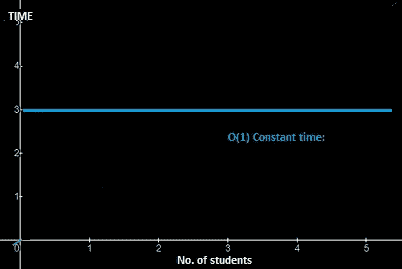
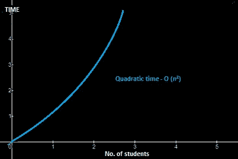

# 什么是时间复杂度？用简单的方式来理解。

> 原文：<https://blog.devgenius.io/what-is-time-complexity-understand-it-by-simple-way-69a29b5d7d1f?source=collection_archive---------6----------------------->

许多程序员在理解时间复杂性的概念时感到困惑，但在本文中，我们将用一种非常简单的方式来解释它。

有各种各样的时间复杂度类型，让我们用课堂例子逐一理解。

[疾控中心](https://unsplash.com/@cdc?utm_source=medium&utm_medium=referral)在 [Unsplash](https://unsplash.com?utm_source=medium&utm_medium=referral) 拍摄的照片

# O(n) —线性时间:

假设在一个教室里，有 **3** 个学生，你要找到我们的名字是“**亚历克斯**，在这种情况下你要告诉每个学生“你叫什么名字？”每个人都会给你答复。假设从 1 个学生那里获取姓名，将使用 1 个**秒**，因此对于 **3 个**学生，时间将为 **3 秒**。

假设这个教室有 **n** 个学生，那么所用的时间是 **n** 秒。

这里你需要一个接一个地联系学生，所以时间会一秒一秒地计算。

以下是一些例子:

*   遍历数组
*   遍历链表
*   线性搜索
*   删除链表中的特定元素(未排序)
*   比较两个字符串

# O(1) —常数时间:

让我们用同一个教室的例子来理解，假设在教室里，老师告诉所有的学生，无论何时任何客人(校长)来到我们的教室，每个学生都必须站起来说“早上好，先生”。

现在，在这种情况下，假设每个学生都站起来，一次说“早上好，先生”，那么所用的时间将是常数。假设 3 秒。

在这里，不管有多少学生，总时间只有 3 秒左右。

**O(3) = O(1)**

在这里，每个学生都在同时表演动作。所以总时间只有 3 秒。

以下是一些例子:

*   访问数组索引(int a = ARR[5])；)
*   在链表中插入节点
*   在堆栈上推送和弹出
*   从队列中插入和删除
*   找出数组中存储的树中节点的父节点或左/右子节点
*   跳转到双向链表中的下一个/上一个元素

# **二次时间— O (n ):**

现在，同上，我们以教室为例，假设有一个新年，老师告诉每个学生，每个学生都必须互相问候“新年快乐”，

现在第一个学生站起来，一个接一个地和其他学生打招呼，然后他坐在他的座位上，另一个学生站起来，开始和其他学生打招呼，如此类推

在这种情况下，假设有 3 个学生，那么当一个学生和另一个学生打招呼时，假设他会用 1 秒钟，那么一个学生会和另外两个学生打招呼，所以一个学生用的总时间是 2 秒。

现在每个学生所用的总时间是(3) = 9。当然，在这里，在现实生活中，学生不是这样和自己打招呼的，2+2+2 = 6，但仍然接近(3) = 9。

假设这个教室有 **n** 个学生，那么所用的时间是( **n)** 秒。

在这里，每个学生都和其他学生打招呼，所以时间将被计算在内。

以下是一些例子:

*   冒泡排序
*   插入排序
*   选择排序
*   遍历一个简单的 2D 数组

# **对数时间— O (log n):**

在课堂上，假设一个学生问老师一些与电相关的科学问题，老师知道答案，但他对此没有充分的信心，所以在那天，老师会去图书馆找到与问题相关的书籍。在这里，老师不会一本书一本书地找，相反，老师会使用分而治之的方法。

假设有 **100** 本书，前 **50** 是社会书籍，其他 **50** 是科学书籍，那么老师会直接跳到 50 本科学书籍，跳过前 50 本社会书籍。现在 50 本书中，前 25 本是生物学相关的书，接下来的 25 本是物理学相关的书。在这里，老师将再次使用划分技术，跳过前 25 本书，跳到下 25 本物理相关的书，以此类推。所以在这里你可以看到，与线性或二次搜索相比，时间不会消耗。

另一个例子，假设你想在字典中找到特定的单词。如你所知，这本书里的每个单词都是按字母顺序排列的。如果你在寻找一个词，那么至少有两种方法:

1.  打开中间的书，检查上面的第一个单词。
2.  如果你要找的单词按字母顺序更重要，那么向右看。否则，看左半部。
3.  再次将余数分成两半，重复第 2 步，直到找到要查找的单词。

基本上，它*在每个步骤中减少输入数据*的大小。

假设这个图书馆有 **n** 本书，那么搜索某本书所花费的时间是 **O(log n)** 秒。

在这里，您可以看到基于不断增加的数据，时间并没有按比例增加。

以下是一些例子:

*   二进位检索
*   在二叉查找树中寻找最大/最小的数字
*   基于线性函数的某些分治算法

感谢你阅读这篇文章，❤

如果我做错了什么？让我在评论中。我很想进步。

拍手声👏如果这篇文章对你有帮助。