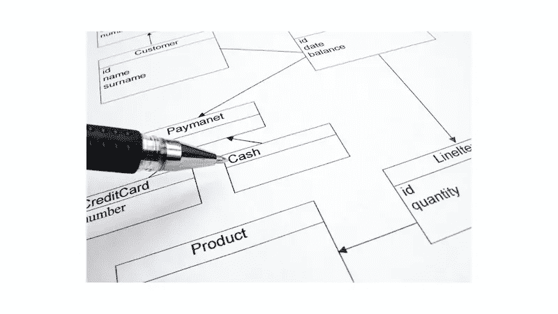
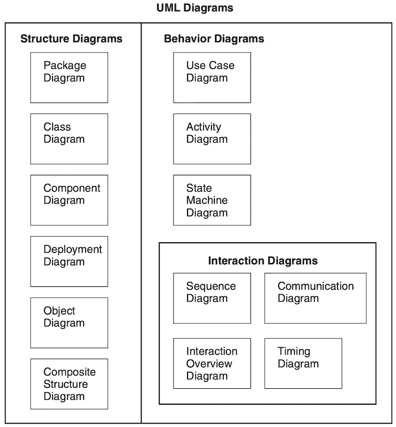

# UML(统一建模语言)在说什么？

> 原文：<https://blog.devgenius.io/what-is-uml-unified-modeling-language-talking-about-f497e1558826?source=collection_archive---------5----------------------->

# 你在开玩笑吗？

嗯，当我决定写一些关于 UML(统一建模语言)的东西时，我是认真的。我想有些人可能会觉得谈论相关的话题很奇怪，因为这对那些制作软件的人来说是基本的。

然而，我们应该在任何学术理论面前保持谦逊，因为即使现在我也不能自信地宣布我已经彻底弄明白了。在过去的几年里，我试图用它来理解设计模式，研究系统特性，甚至开发产品。

几个月来，我一直在研究圣经。虽然我还没看完。有很多章节涉及了很多关于如何描述系统特征以及如何以适当的方式描述系统元素行为的细节。

在进入 DDD(领域驱动设计)之前，我强烈建议你探索一下它的内容，因为它是许多发展中的工程语用学的原型。

# 协调工程师之间的语言

当我还是学生的时候，我的数学老师曾经提到过，数学是人类之间的一种通用语言，因为它总是提供基本的符号/公式来帮助你描绘自然的原理；你不需要学习其他人类语言来传达它对其他人的意义。

类似地，在软件工程中，当与领域专家交流时，我们经常必须确保我们在同一页上。因此，要实现这一目标，不可避免地需要一种通用语言。我曾在[的帖子](/the-4-sources-leading-to-inherently-complex-software-ab46dc2cec41)中说过，导致软件复杂化的原因之一是表征系统行为，不管是动态的还是静态的。

UML(统一模型语言)是开发人员在谈论元素的行为和协作时在同一条线上合作的基本工件。它旨在提供一个通用规范来描述元素如何协同工作，以及如何组织它们来提供功能。

一般来说，当我们采用设计方法时，我们会考虑 3 个方面。

*   **符号**

符号是一种用来表达模型特征的语言。它可以用简单的地理符号来表示，如虚线、箭头、圆圈等。，以指示一些系统属性。

*   **流程**

过程通常是旨在有序地构建系统模型的活动。实际上，软件开发不是一个优化的过程，而是一个进化的过程。所以我们应该遵循一定的开发模式来完成事情。

*   **语用学**

对象分析与设计旨在解决现实世界中的实际问题。业务场景是最终应该实现的最终目标。因此，我们不仅关心如何对系统建模，还关注开发阶段的人员协作和人员。

# 图表分类法

直观上，我们倾向于将系统属性分为两组:动态集群和静态集群。前者侧重于元素之间的相互作用，而后者侧重于元素的组织。从参考文献来看，在接下来的旅程中，我们会遇到两种主要的模式。

*   **结构图**

在进入真正的开发工作之前，我们倾向于建立需要考虑的对象类型的原型，以及它们的内部属性。更重要的是它们如何组织在一起以实现高内聚和松耦合的设计。

*   **行为图表**

正如我之前提到的， [OOAD](https://www.amazon.com/Object-Oriented-Analysis-Design-Applications-3rd/dp/020189551X) 的最终目的是满足业务领域的需求。我们关心最终会交付什么样的功能。因此，元素如何协同工作以提供必要的功能成为我们工作的关键部分。

# 模型分类

最初，我们只是将模型分成 2 组进行简单的分类。其实这两组还有更多细节我没透露。当我写这篇文章的时候，我正在研究包图的内容。我开始发现这个领域还有很多我不知道的东西。尽管这并没有影响我如何制作软件，但它为我打开了一扇门，让我以更开阔的视野审视软件工程方法。

引自 [OOAD](https://www.amazon.com/Object-Oriented-Analysis-Design-Applications-3rd/dp/020189551X)

上面的图表是在书中引用的，我敢说我在我的开发生涯中只使用过其中的一些，而且我没有很好地使用它们。每一个都代表一个基本的分析单元，其中一些包含业务场景。你应该做的是提取它们的概念，并对真正的问题域建模。

# 蔻驰杂音

依我拙见，面向对象的分析和设计有助于你从不同的角度审视对象之间的交互。此外，您将能够获得关于对象如何被组织以及如何一起工作以公开所需的属性和功能的概述。

当我回顾我学习设计模式的时候，有一些图表在我的大脑中弹出。但是现在我知道我不了解他们的每一个细节。因此，我需要采取行动来拆卸它们并重新组装。我想这个系列可能会持续一段时间，通过一个副业项目来实现它的精神。

—

如果你认可我与你分享的价值，请做如下:
1。**鼓掌**文章
2。**订阅**我最新内容
3。**在其他平台关注**我了解更多信息
-IG:[@ ur _ Agile _ coach](https://www.instagram.com/ur_agile_coach/)
-播客(中文):[敏捷火箭](https://player.soundon.fm/p/7f7dc3df-d738-405c-8cf9-02157a92ec61)
- Youtube: [你的敏捷蔻驰](https://www.youtube.com/channel/UCzD0wQmD1n4MuTKk-JocACA)
- LinkedIn: [吴宗祥](https://www.linkedin.com/in/tsung-hsiang-wu-8542409b/)

如果您需要咨询或其他形式的合作，请发送邮件至:【urscrummaster@gmail.com】