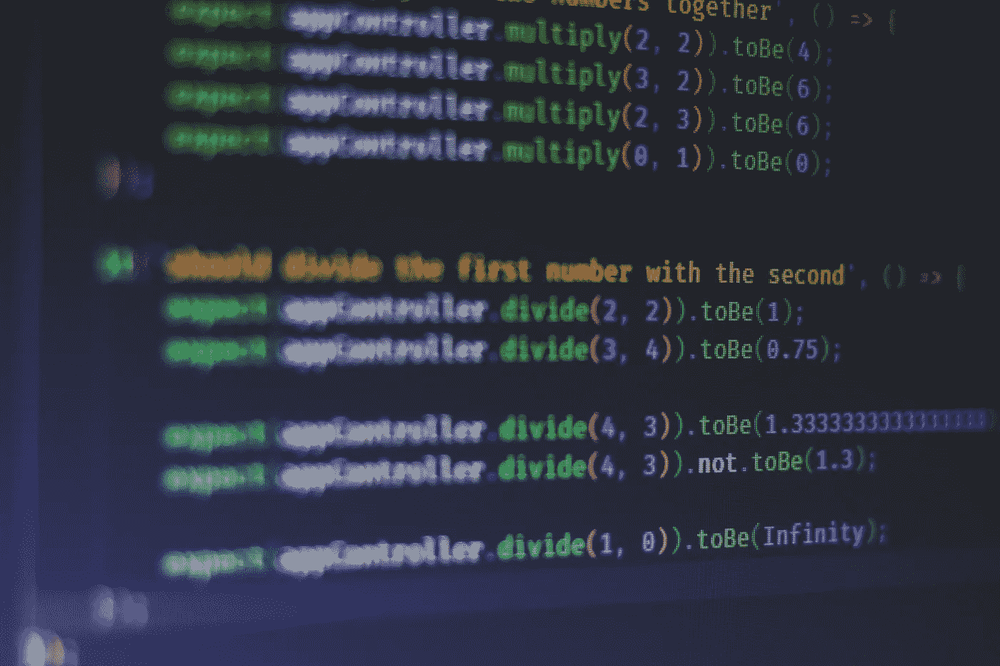

# 什么是单元测试？

> 原文：<https://blog.devgenius.io/what-is-unit-testing-4925e77ea455?source=collection_archive---------41----------------------->

## 理解自动化软件开发测试的最小方面



费伦茨·阿尔马西在 [Unsplash](https://unsplash.com/s/photos/javascript?utm_source=unsplash&utm_medium=referral&utm_content=creditCopyText) 上的照片

**单元是指你软件中的一段代码**。

这段代码可以有不同的行数，可以用任何编程语言编写。通俗地说，用不同的输入值运行一段代码，然后断言每次运行的输出，这叫做**单元测试**。

大多数编程语言都支持模块化，使用模块化将代码分成块。在 Javascript 中，这些分离的块被称为模块。这些模块可以使用*导入* / *导出*(从 ES6)或*要求* / *模块创建。*

(*对于这篇文章，我将参考 Javascript* 来谈论“单元测试”)

在 Javascript 中，单元测试是通过从测试中调用导出的(公共)方法/属性来完成的。未导出的方法/属性不能直接测试。

## 为什么要进行单元测试？

想象一下，将软件交给客户，它已经在 4 个不同的环境中通过了多轮手动测试。假设在生产环境中出现了一个小问题，开发团队只需要花几分钟就可以解决，但是要花 10 天才能将修复升级到生产环境中。这是一个问题，因为无论你要修复什么 bug，除非它们一起发布，否则每个 bug 都需要 10 天的人工测试。如果产品的功能增加，手工测试的工作量也会增加。为了解决这个问题，自动化测试被引入。

单元测试提供了自动化，减少了手工测试的工作量和发布时间。这有助于向客户快速发布特性/缺陷。单元测试是衡量软件质量和增加客户信任度的标准之一。

自动化测试可以是单元测试、集成测试、端到端测试、UI 测试或完整性测试。但是单元测试占据了测试金字塔的大部分份额，因为它们易于编写、运行和测量。他们在运行中花费最少的时间，这就是为什么最具成本效益。由于软件中的所有模块都是相互依赖的，单元测试提供了第一层防御来捕捉开发和发布阶段出现的回归/错误。

## 改进单元测试的技巧

单元测试根据给定的输入检查函数的流程，并返回输出。对于无状态函数，每个唯一的输入值将产生一个特定的输出，但对于有状态函数，情况可能并非如此。有状态函数很难测试，因为每次运行都会操作数据库中的记录，更新缓存或触发计时器。

单元测试的先决条件是模拟所有的依赖关系，并孤立地测试特定的功能/模块。

*   针对多个输入值进行测试
*   针对不同类型的输入值进行测试
*   断言是否调用了模仿/依赖
*   断言调用模拟/依赖项的次数
*   针对预期输出进行断言

## 测试生命周期中的阶段

***设置*** :

*   在运行测试之前设置配置(beforeAll)
*   在运行每个测试之前设置配置(每个测试之前)

***执行***

*   运行单元测试

**拆机 **

*   每次试运行后清理/完成工作
*   所有试运行后清理/完成工作(毕竟)

## 单元测试的组件

*   测试创作(茉莉、Jest、摩卡)
*   Mocks (Sinon，Jasmine，Jest)
*   断言和匹配器(柴，茉莉，笑话)
*   试跑者(茉莉、杰斯特、摩卡)
*   覆盖报告(伊斯坦布尔、Wallaby、纽约市)

在某些情况下，专门的库/包支持特定的组件，而其他时候一个库就足以执行所有的操作。

## 例子

有趣的部分来了，在下面的例子中，我假设了一个简单的函数，它将两个数字相加，如果参数值中的任何一个是 *null* 、 *undefined* 或 *falsy* ，就会抛出错误。

```
// sum.jsmodule.exports = function sumTwoNumbers(a, b) {
  if (a && b) {
    return +(a + b)
  }throw new Error('Either A or B not defined, null or false')
}
```

对于上述功能，这不是测试用例的穷举集。

```
// test.jsconst sum = require('sum')describe('Sum of two numbers', () => {
  test('when A and B are numbers', () => {
    expect(sum(2, 3)).toBe(5)
  }) test('when A and B are strings', () => {
    expect(sum('2', '3')).toBe(23)
  }) test('when A and B are boolean true', () => {
    expect(sum(true, true)).toBe(2)
  }) test('when A is a number and B is boolean true', () => {
    expect(sum(2, true)).toBe(3)
  }) test('when A is a string and B is a number', () => {
    expect(sum('4', 3)).toBe(43)
  }) test('when A is a number and B is empty array', () => {
    expect(sum(2, [])).toBe(2)
  }) test('when A is a string and B is empty array', () => {
    expect(sum('2', [])).toBe(2)
  }) test('when A is a number and B is empty object', () => {
    expect(sum(2, {})).toBe(NaN)
  }) test('when A is a string and B is empty object', () => {
    expect(sum('2', {})).toBe(NaN)
  }) test('when A is a string and B is boolean true', () => {
    expect(sum('2', true)).toBe(NaN)
  }) test('when A and B are boolean false', () => {
    expect(sum(false, false)).toThrow('Either A or B not defined, null or false')
  }) test('when A and B are null', () => {
    expect(sum(null, null)).toThrow('Either A or B not defined, null or false')
  }) test('when A and B are undefined', () => {
    expect(sum(undefined, undefined)).toThrow('Either A or B not defined, null or false')
  }) test('when A and B are not passed', () => {
    expect(sum()).toThrow('Either A or B not defined, null or false')
  }) test('when A is a number and B is not passed', () => {
    expect(sum(2)).toThrow('Either A or B not defined, null or false')
  })
})
```

## 结论

> "质量是免费的，但只对那些愿意花大价钱购买的人开放."—德马科和李斯特

在软件开发中，产品质量至关重要，单元测试在其中扮演着重要角色。为了交付更高质量的产品，目标是 100%的测试覆盖率，实现并维护它们。