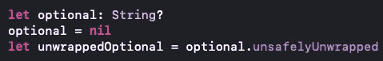

# 什么是不安全的 Swift 代码？

> 原文：<https://blog.devgenius.io/what-is-unsafe-swift-code-aa7d1a94c57a?source=collection_archive---------2----------------------->

## 崩溃你的应用是安全的路线

## 强制解包是安全的！

## 强制解包可选的是安全的代码！

你可能会认为，当你强行打开一个可选的。你告诉编译器，“我知道我在做什么，这个值不是零。**我保证。”**如果为零，你的应用就会崩溃。你可能不知道的是*实际上是*一种打开期权的安全方式。

但是，Kenny，如果我强行打开一个可选的，并且它包含一个空值，我的应用程序就会崩溃。这意味着它不安全！”

嗯，你是对的，但你也错了

根据 Swift 标准图书管理员 Karoy Lorentey 在他的 WWDC 2020 演讲[不安全 Swift](https://developer.apple.com/videos/play/wwdc2020/10648/) 中的说法，当执行不安全代码并遇到意外值(例如意外的零值)时，不能保证您的应用会崩溃。

不安全代码在运行时会发生什么是不可预测的。你可能有 99%的机会崩溃，但在某些情况下，垃圾可能会被解释，允许你的应用程序继续运行，但在你背后做着谁知道的事情。混乱的内存产生*奇怪的*结果。

**相反，安全代码并不意味着你的应用不会崩溃**

Lorentey 继续说，“安全 API 的目标不是防止崩溃——恰恰相反。”如果一个安全的 API 从它设计接收的指令之外接收指令，*那么*你的应用就会崩溃。

> 这是因为“我们的代码破坏了一个关键的契约，我们需要去修复它。继续执行死刑是不负责任的。”—罗伦泰

**为什么我们有时不得不编写不安全的代码**

由于系统不必管理内存空间，不安全的代码通常性能更高。不过，很多时候，我们只需要与使用指针的 C 或 Objective-C API 进行互操作。

**性能**

有时候，对于我们试图执行的操作来说，对一个空值执行检查太耗时了，导致 UI 的响应速度变慢或者其他意外的行为。

在这些情况下，我们可能会指定`.unsafelyUnwrapped`过度小心地展开(guard-let，if-let，！= nil)，甚至强制展开。强制解包*是否*提供检查以查看值是否为零。但是它是安全的*，因为*它在*的时候会让你的应用崩溃。这让你确切地知道你的应用程序在哪个点崩溃，而不是你的应用程序稍后崩溃，或者一些意想不到的事情发生。*

`!`操作符不仅仅是`.unsafelyUnwrapped`的简称。

这两个例子几乎相同，但是！是安全的选择。。当遇到意外的零值时，unsafelyUnwrapped 不一定会导致崩溃。

## 如何区分安全 API 和不安全 API

不安全的 API 是不安全的，因为 Swift 不管理它们所在的内存空间。相反，我们作为开发人员必须手动管理内存。API 给了我们需要的工具，但是信任是留给我们在任何给定的时间做正确的事情——这本质上是不安全的。但是我们如何识别这种不安全的代码呢？

**值得庆幸的是，不安全的原料药被明确标注出来**

Swift 不知道 ptr 已经被解除分配——它看起来和有效指针一样

当你“在野外”遇到一个不安全的 API 时，你会知道，因为它会被标记为`**Unsafe**`。

在上面的例子中，我们为一个整数分配内存空间，初始化它，释放它，然后尝试设置一个新值。当我们试图改变它时,`ptr`被释放，但这并不意味着应用程序会崩溃。一旦内存被释放，其他东西可以使用它的空间。所以你现在要做的是在内存中设置一些空间值为 23。这对你的应用会有什么影响？谁知道呢。也许它是一个不同的整数，你只是改变了它的值。也许它是一个复杂操作的一部分，你只是插入了一些奇怪的指令，过一段时间后会突然出现，看起来是由其他原因引起的。

# 包裹

总之，当我们编写导致应用程序崩溃的代码时，我们通常是在编写安全的代码——我们只需要修复它。当我们的应用程序在做我们不理解或没有预料到的事情时，我们可能遇到了不安全的 API。这就是为什么我只在绝对必要的时候才使用不安全的 API。

我们中的许多人已经花费了比调试代码更多的时间。我总是很乐意让内存为我管理！

附言

不要误解我——我并不提倡在你的应用中使用强制解包选项。我很少在产品代码中强制展开选项。也就是说，我*确实*在早期开发(pre-PR)中强制展开选项。如果我忘记设置一个值，我希望应用程序崩溃，这样我就知道我需要修复一些东西。

我们都同意崩溃不是一个好的用户体验。我想我们都同意，看不到任何东西，或者一些占位符值代替重要数据，也不是一个好的用户体验。小心翼翼地打开选项不应该成为一个占位符，用来小心翼翼地确保您已经考虑了值可能为零的边缘情况。在开发中也不应该避免强制展开。