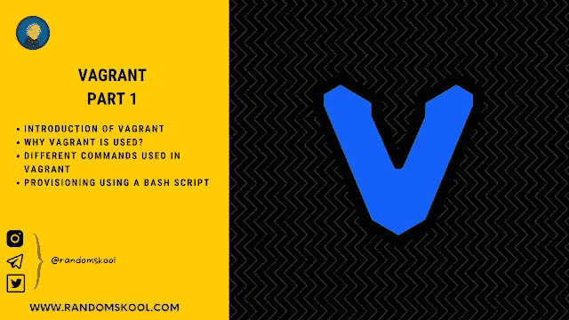
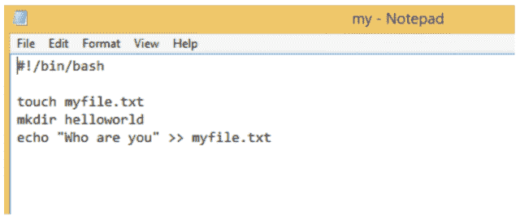
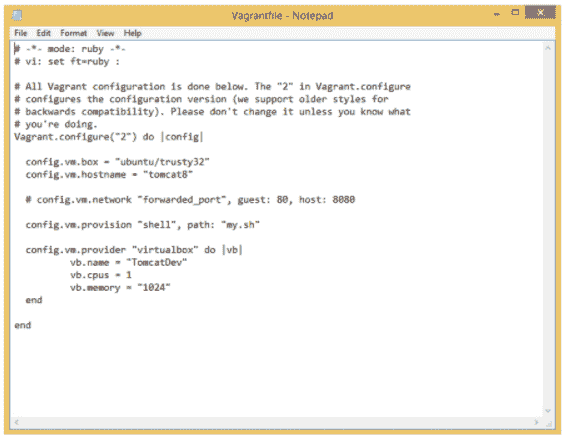

# 什么是流浪？为什么流浪在 DevOps 的世界里很重要？第 1 部分|初学者|漫游命令

> 原文：<https://blog.devgenius.io/what-is-vagrant-why-vagrant-is-important-in-devops-world-part-1-beginner-vagrant-commands-e2dffcb3ef58?source=collection_archive---------9----------------------->

大家好，

在本[教程](https://www.randomskool.com/2021/01/what-is-vagrant-why-vagrant-is.html)中，我们都将学习《T2》中三个不同部分的完整流浪。

*   *简介* [*流浪儿*](https://www.randomskool.com/2021/01/what-is-vagrant-why-vagrant-is.html)
*   *为什么用流浪汉？*
*   [*不同的命令*](https://www.randomskool.com/2021/01/what-is-vagrant-why-vagrant-is.html) *用于流浪*
*   *示例—* [*使用简单的 bash 脚本*](https://www.randomskool.com/2021/01/what-is-vagrant-why-vagrant-is.html) 进行供应

# 流浪汉介绍-

一个流浪者是一个工具，用于建立和管理一个单一的工作流程中的虚拟机环境。

vagger 用于通过以下方式设置一个或多个虚拟机:

*   [*【导入预先制作的图像(称为“框”)*](https://www.randomskool.com/2021/01/what-is-vagrant-why-vagrant-is.html)
*   [*设置虚拟机特定设置(IP 地址、主机名、端口转发、内存等。)*](https://www.randomskool.com/2021/01/what-is-vagrant-why-vagrant-is.html)
*   [*运行 Ansible 和 SaltStack 等配置软件。*](https://www.randomskool.com/2021/01/what-is-vagrant-why-vagrant-is.html)

# 为什么用流浪汉？

vanguard 允许我们非常容易地在团队成员之间共享设置，允许非常容易地旋转工作环境。

假设，[使用 vagger 的一个原因是在将这些更改推送到其他环境之前，在本地测试您的部署如何工作](https://www.randomskool.com/2021/01/what-is-vagrant-why-vagrant-is.html)，即供应。

# 流浪者中使用的不同命令

***快速启动的流浪命令-***

1.**游民 init [name [url]]** —通过创建初始游民文件，将当前目录初始化为游民环境。

示例:流浪者初始化哈希公司/precise32

2.**向上迁移** —该命令根据迁移文件创建并配置客户机器。

3.**空载状态** —命令告知机器的状态。

4.**流浪 ssh** — SSH 进入运行中的流浪机器。

[***随机字节***](https://www.randomskool.com/2021/01/what-is-vagrant-why-vagrant-is.html)***——*** *默认情况下，一个流浪者在 Guest VM 中创建一个共享文件夹作为/流浪者 a 到本地项目文件夹。*

*例— SSH 进入 Guest VM 一张 CD/vagger>>创建一个文件 touch random . txt>>logout>>相同的文件会呈现到本地的项目文件夹中。*

5.**漫游挂起** —休眠/注销虚拟机(以漫游方式启动虚拟机)

6.**漫游停止** —关闭虚拟机(以漫游方式启动虚拟机)

*为了下载其他盒子-*

7.**流浪毁灭** —删除虚拟机

8.**漫游重新加载** —重启虚拟机(漫游停止+漫游启动)。

1.  搜索您想要下载的任何操作系统。
2.  *复制框 URL*
3.  ***【流浪者盒子添加{Title} {URL}*** *—添加一个给定地址的盒子给流浪者。*

9.**流浪框列表** —列出所有已安装的虚拟机镜像。

10.**流浪者盒子移除{盒子标题名称}** —删除 VM 盒子。

*(保留虚拟机中的配置更改)*

11.流浪包--输出{title}。方框

*并使用“流浪者初始化自定义-centos”创建一个新的流浪者文件*

***例*** 。*流浪包—输出自定义 centos.box*

12.**游民箱添加 Custom-Centos-7 Custom-Centos . box**
*更改现有游民文件“config.vm.box”中的条目或删除现有游民文件*

13.**虚拟机更新** —用于将当前的虚拟机操作系统映像更新到最新版本(在销毁虚拟机之前)

# 使用简单的 Bash 脚本提供 VMBox

为了使用配置管理工具(如 *Ansible、SaltStack 或 shell 脚本* — [***)供应虚拟机，我们可以使用浮动供应。***](https://www.randomskool.com/2021/01/what-is-vagrant-why-vagrant-is.html)

1.在流浪者文件所在的同一文件夹中创建一个简单的脚本。

2.创建名为“my.sh”的脚本

3.在流浪者文件中调整和删除不需要的配置-

4.**运行浮动配置** —该命令是快速测试任何配置程序的好方法，对于 shell 脚本、Ansible 剧本和 SaltStack 的增量开发尤其有用(为了查看任何浮动文件的配置更改，需要销毁并重新启动它)

## 跟随我们一起去 instagram.com/randomskool 的

## 加入我们的电报频道和群组:)

电报组:【https://t.me/randomskoolQnA
电报频道:[https://t.me/randomskool](https://t.me/randomskool)

*最初发表于*[*https://www.randomskool.com*](https://www.randomskool.com/2021/01/what-is-vagrant-why-vagrant-is.html)*。*