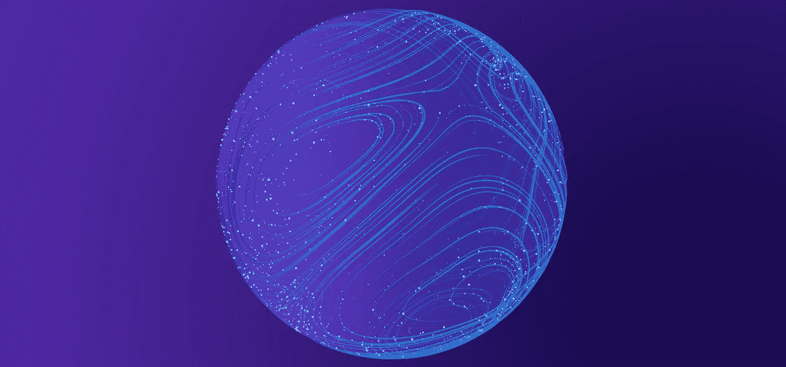

# 什么是 Web 3.0？

> 原文：<https://blog.devgenius.io/what-is-web-3-0-2be70e587bed?source=collection_archive---------5----------------------->

## 互联网的未来

你听说过 Web 3.0 这个术语吗？你知道我们现在都在用什么版本的网络吗？我们将在本文中讨论所有这些内容。

# 什么是 Web 1.0？

Web 1.0，也称为静态 Web，是 20 世纪 90 年代第一个也是最可靠的。互联网基本上是一堆静态页面，这意味着无论你何时加载它们，它们只会显示一些内容，仅此而已。有人称之为只读。没有任何登录或与帖子互动或查看分析。早期互联网的大部分甚至没有通过广告盈利。它就像一个大的维基百科，所有的超链接都在一起。当然，随着时间的推移，我们慢慢做出了改进，比如 Flash 和 JavaScript 增加了许多新功能。然而，在此期间，互联网的用户是消费者。他们去网上消费信息。

# 什么是 Web 2.0？

接下来是 Web 2.0，从 2004 年到现在。在此期间，网络发展了很多，但最大的变化之一是互联网的交互性。这意味着我们不仅从网页上获取信息，而且当我们浏览脸书、YouTube 和进行谷歌搜索时，网页也开始从我们这里获取信息。这些集中的公司开始收集关于我们的数据，这样他们可以为我们提供更好的内容，这反过来会让我们在他们的网站上停留更长时间。这对他们来说意味着更多的钱，但最终他们意识到他们可以打包收集我们的所有数据，卖给广告商。Web 2.0 是定向广告和用户缺乏隐私的时代。公平地说，我们也愿意为了像脸书、推特这样的酷应用放弃这种隐私。

在 Web 2.0 中，我和你都可以查看 facebook.com，并看到两个不同的新闻源，因为页面取决于谁在查看它，这是 Web 3.0 中的一个重要差异，我们将在本文稍后讨论。你的 feed 上的内容是该公司根据你知道你给了他们喜欢的信息和你看了多少视频来分类数据，但如果你看他们给你看的广告，那就是他们根据你不知道你给他们的信息来分类数据。当你昨晚去吃披萨的时候，他们知道，当你每天早上 8 点把你的孩子送到学校的时候，除了周六，他们知道。不管是什么情况，他们是如何预测的，不管我们愿不愿意，一个集中的公司控制着所有这些数据，这是很可怕的

# **Web 3.0？**

**Web 3.0 或去中心化 web** 是互联网的下一次发展。有些人认为 Web 3.0 是所有现代技术的汇聚点，未来新的不可思议的技术将从这里发散出来。其他人虽然认为 web3 只是一个制造加密骗局的最新术语，但是 Web 3.0 到底是什么？

Web 3.0 基本上是互联网的一个愿景，一切都是分散的，由小合同和密码监管，而不是目前的现状，即一切都由谷歌、脸书和亚马逊控制。在分散式应用程序或 d APPS 中，用户拥有他们所有的数据，而不是电子邮件密码身份。用户通过一个区块链钱包地址来识别，该地址通常与一个像 [MetaMask](https://en.wikipedia.org/wiki/MetaMask) 这样的浏览器插件相连，而应用程序本身是以小合同形式存在于区块链上的代码。这个想法非常酷，因为它让人们真正控制自己的互联网份额，而不是使用像大型科技公司或政府这样由中央象牙塔中介的服务。另一方面，有很多方法可以批评 Web 3.0。用目前的工具链很难开发出高质量的应用程序，这对大多数主流企业没有任何实际好处。大多数代币由硅谷内部人士所有，所以它根本不是真正的去中心化，你真的不需要加密货币来构建一个去中心化的应用程序。如果加密价格因为任何原因崩溃，我认为很多对 Web 3.0 的兴奋将会消失。我可以继续说下去，但我最喜欢的一句话是

> **“悲观主义者听起来很聪明。乐观者赚钱。”**

去中心化的互联网不是一件容易的事情，对于愿意解决这个领域问题的开发者来说，这是一个巨大的机会。成功的很大一部分是时机。脸书、谷歌和亚马逊都在正确的时间处于正确的位置，利用了 Web 1.0 和 Web 2.0。我认为你应该对 Web 3.0 持怀疑态度，但如果它真的成为主流，你会很高兴你很早就进入了。

# Web 3.0 的示例

[勇者](https://brave.com/) ***浏览器*** 就是一个例子。这是一个分散的网络浏览器，不收集用户数据的货币化目的。相反，浏览器允许用户从平台的广告中赚钱。广告买家使用 Brave 平台来锁定用户，但在广告投放前必须征得同意。如果用户选择加入广告，他们会为此付费。这与互联网商业化的货币化模式相反。在这种模式下，平台通过向用户提供广告来赚钱。有了 Brave，用户就有机会从浏览器名为 BAT 的原生令牌中的广告中获利。广告客户也可以通过在有机参与上而不是在用户可能完全忽略的活动上花费来省钱。

Web3 的另一个例子是虚拟世界 ***【元宇宙】*** 。在这个世界里，用户可以使用虚拟角色进行互动。它就像真实世界一样，但价值是由数字资产创造的。在元宇宙，[***【NFT】***](https://en.wikipedia.org/wiki/Non-fungible_token#:~:text=A%20non%2Dfungible%20token%20(NFT,to%20a%20certificate%20of%20authenticity).)在生态系统中发挥着巨大的作用。这允许用户在元宇宙拥有虚拟财产，并与其他用户进行交易或出售。交易将使用平台自己的本地令牌，如分散土地上的 MANA。虚拟世界将成为交易有价值的数字资产的地方，这些资产可能代表艺术、音乐和收藏品。这些都是基于运行在区块链之上的智能合约。

我希望上面的文章能帮助你理解围绕这个话题的所有混乱。现在，让我们在这里结束它。

**感谢您阅读我的帖子。如果你喜欢这篇文章，请广而告之。要获得我的新故事的更新，请关注我的******和** [**推特**](https://twitter.com/fixslyr) **。****

***更多内容尽在*[*blog . dev genius . io*](http://blog.devgenius.io)*。***