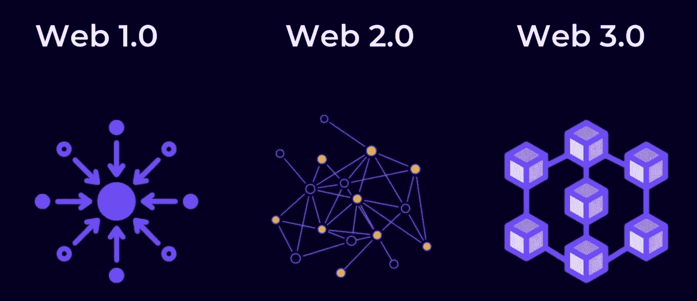

# 什么是 web3，我们是如何走到这一步的，作为一名开发人员，你如何才能尽早进入？

> 原文：<https://blog.devgenius.io/what-is-web3-how-did-we-get-here-how-can-you-get-in-early-as-a-developer-db82b59bc7f6?source=collection_archive---------9----------------------->

# Web3 &我们是如何来到这里的

Web3 是以区块链技术为中心的新的**万维网**的一个发展中的想法，还有一些其他的概念，如去中心化、智能合同、游戏赚钱、代币、dApps 等等。这个名字可以追溯到 2014 年，当时它是由以太坊的联合创始人加文·伍德(Gavin Wood)创造的。不谈论我们最初是如何走到这一步的是没有意义的。所以，让我们快速回到过去。

这一切都开始于 1969 年，在冷战期间，美国军方启动了 ARPnet(高级研究项目)，通过创建一个地理上分离的计算机网络，通过一种称为 NCP(网络控制协议)的技术进行交换，来保护军事设施之间的信息流动。五台主要的联网计算机是加州大学洛杉矶分校、斯坦福研究所、加州大学圣巴巴拉分校和犹他大学。

最初的五种主要连接方式催生了 TCP/IP(传输控制协议和互联网协议)、电子邮件、远程登录、局域网。1986 年，一件令人瞩目的事情发生了，它催生了 web1。其中一个局域网继续发展，形成了一个名为 NSFnet(国家科学基金会网络)的网络。NSFnet 是第一个将五台国家超级计算机连接在一起的。这一新的突破迫使各大大学用 NSFnet 取代 ARPnet，最终在 1990 年 ARPnet 被完全关闭。

Web1 周期性地出现在 1991-2004 年间，大多数网站都是静态网页，大多数用户基本上都是消费者。

Web2.0 始于 2004 年左右，带来了许多变化，如动态 Web 界面和应用程序，互联网作为一个整体的概念是一个内容创建平台，但最重要的是，它是高度集中的，因为一切都由服务提供商或内容创建平台所有者(如脸书、twitter、谷歌等)控制。

# 作为开发者如何入门 web3？

直入主题吧，在开始使用 web3 之前，这里有一些你需要知道的基本知识。

# **了解区块链**

为了完全融入 web3，第一步是理解区块链是如何运作的。这是一项令人难以置信的技术，如果你还不了解它，需要一些时间来研究它。这是一个值得一看的好地方:

 [## 加密货币的详细再介绍。

### 这是一个完整的重新介绍你需要知道的关于加密货币的一切，从基础到高级，所有…

medium.com](https://medium.com/@EasternFace/a-detailed-re-introduction-to-crypto-currency-3fbc22ae6a2c) 

# **了解智能合约**

我总是说，如果没有智能合同，区块链会非常无聊。智能合同是帮助我们在没有任何第三方参与的情况下在区块链有效开展活动的协议。

智能合约几乎可以做任何事情，从可替代和不可替代的令牌到下一个去中心化应用的后端。然而，它们不同于您通常编写的代码。它们会构成你未来工作的一个很好的部分，所以最好好好理解它们。一个很好的开场白，让您快速了解智能合同:

 [## 加密货币的详细再介绍。

### 这是一个完整的重新介绍你需要知道的关于加密货币的一切，从基础到高级，所有…

medium.com](https://medium.com/@EasternFace/a-detailed-re-introduction-to-crypto-currency-3fbc22ae6a2c) 

# **了解区块链接口**

分散式应用程序由两个主要部分组成。它们是:在区块链执行的前端和智能合约。为了让您的前端与区块链对话，您需要与它进行交互。

这就是图书馆的用武之地。最流行的是有两种流行的选择来与实现以太坊 API 的区块链接口:

ethers.js

Web3.js

尽最大努力学好其中任何一门或两门，因为你肯定会需要它。从现在开始，这是你最重要的工具之一。

# **学扎实**

因为有大量的区块链可以用它们独特的方式构建和部署契约，所以 solidity 是目前最受欢迎的智能契约实现语言。它在以太坊上服务得很好，因为它托管在以太坊虚拟机上，它还帮助你在其他链上开发智能合约。

# **建立你的投资组合**

吸引你的技能的唯一方法是建立一个投资组合。你可以通过从事个人项目、为开源项目做贡献来做到这一点，前面的任务很有挑战性，需要大量的准备。所以你需要真正投入到投资组合开发中。

# 以下是您的项目应该包含的一些内容:

前端

精明的合同

坚固性代码

代码文档

本地测试网络设置

持续集成等。

# 一些需要熟悉的 web3 术语

**Alpha**有价值的或内幕的信息，通常是关于数字资产的价值，如加密货币和 NFTs 投资回报高于市场或其他基准所提供回报的一种衡量标准。

**Altcoin 或 Alts**最初用于指代任何不是比特币的加密货币，现在 Altcoin 可能指代任何市值相对较小的新加密货币。

**猿**大量投资于加密货币的人，或这样做的行为。

**Block Explorer**一款浏览区块链信息的工具，比如交易、钱包地址、市值、杂凑率等。

**网桥**一种协议，允许独立的区块链彼此交互，从而在系统之间传输数据、令牌和其他信息。

**Buidl** 意为“构建”，这是一个常见的故意拼写错误，在密码圈内用于指代术语 HODL

**CEX(集中式交易所)**由集中式企业或实体管理的加密货币交易所。

**CeFi(集中财务)**参与加密的集中业务。

**硬币**一种建立在其本土区块链的加密货币，旨在用作该生态系统内的价值储存手段和交换媒介。

**冷钱包**用于存储加密货币的离线设备。冷钱包可以是硬件设备，也可以只是包含用户私钥的纸片。因为冷钱包没有连接到互联网，所以它们通常是一种更安全的存储加密货币的方法。

有关更多术语定义，请参考:

 [## Web3 词汇表|不可阻挡的域名

### 让你的加密货币支付简单，并建立分散的网站。今天购买您的 NFT 域名！

unstoppabledomains.com](https://unstoppabledomains.com/blog/the-web3-glossary) 

# 为什么选择 web3？

让我首先说明，负责互联网内容管理的大型科技公司多年来一直在欺骗我们，对我们的在线权利进行无限制的控制，尤其是侵犯隐私，而政府却鲜为人知。我们在互联网上的数据、时间、内容和所有活动都值这么多钱。科技巨头们发现了这一点，这催生了价值数十亿美元的广告业。然而，这些内容的原创者，也就是使用这些互联网服务的你我，却几乎一无所有。

Web3 旨在通过整合区块链、智能合约和用于区块链治理的本地令牌来阻止所有这些。这意味着，互联网上的每个用户都可以轻松地将他们的在线活动货币化，并实际获得他们的价值，隐私将是最重要的活动，因为区块链使用加密技术来保护数据等。更好的时光在这里，因为你的天赋、技能或手艺实际上可以真正定价，因为它实际上值得由你来设定。

# 结论:

以下是美国部门报告*新兴数字经济*中的一段话:

“互联网的普及速度让之前的所有技术都黯然失色。收音机在 5000 万人收听之前已经存在了 38 年；电视用了 13 年才达到这个标准。第一台个人电脑问世 16 年后，有 5000 万人在使用它。一旦向公众开放，互联网在四年内就跨过了那条线。”这份报告是 50 多年前做的，充满热情。现在比较一下当时和现在的事物和发展速度，你会注意到，就在你认为它不会变得更好的时候，一些更酷的东西突然出现了。现在对 web3 开发人员的需求空前高涨，花点时间做好准备，尽快投入到实际行动中去。

我会不断更新这篇文章，因为我一直在研究，我会给你带来 web3 开发教程，不仅是在开发，图形设计，以及我承诺的其他教程。所以请和我一起度过这些美好的时光。