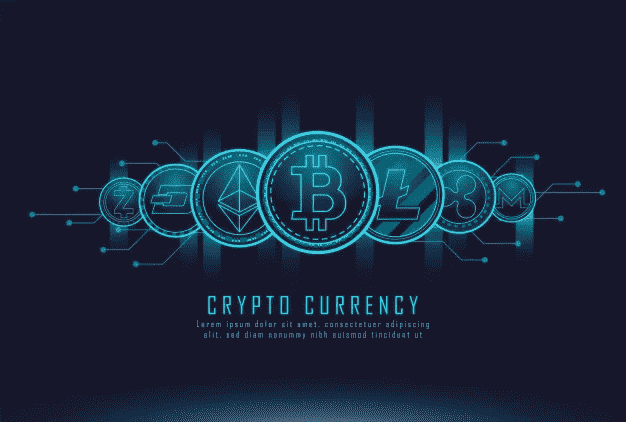

# 作为一个新的加密投资者是什么样子的

> 原文：<https://blog.devgenius.io/what-it-looks-like-to-be-a-fresh-crypto-investor-182e1cef76eb?source=collection_archive---------12----------------------->

***做了今天的午夜。以下是细节。***

即使我对投资的基本原则有了一定的了解，现在轮到我去做了，这样我就能获得可观的回报。更重要的是，它可以让我更适合其他投资。以下是细节。

起初，当谈到每月投资一定数额的钱时，我犹豫不决。但在我投资比特币之前，我爸激励了我几个月。今天，我投资了比特币，学到了一些最重要的经验。而且，我不得不多次尝试在金融中购买比特币。因此，我们不能用借记卡购买比特币。

## 关于安全课程:

**1-创建一个强密码，永远不要把它保存到你的电脑里**

这是我学到的第一堂安全课。尤其是在开立投资账户时。首先，我必须创建至少 12 位数的密码，包括各种字符。然后，我不得不把这个密码保存在除了我的电脑以外的地方。然后，我意识到我应该采取额外的安全措施。

**2-编写进入网站的 URL**

这是针对网络钓鱼攻击应该执行的另一个安全功能。但是我牺牲了便利来换取安全，因为我必须再次进入才能访问我的帐户。因此，它帮助我学习密码，并提高我的安全水平，而投资。

## 第一课之后，我意识到了额外的安全措施:

**3-要求短信认证**

另一个重要的工具，以确保您的帐户的安全。SMS 身份验证可以作为一种额外的安全措施来保证您投资的安全性。当我将密码更改为更安全的密码时，我看到了一个通知并采取了必要的措施。

**4-360°保护的附加安全措施**

它们包括防止网络钓鱼和其他可能接管您帐户的攻击。但是，币安保护了我，并提供了额外的措施来保证我账户的安全。因为是午夜，我变得筋疲力尽，所以除了短信认证，我没有采取额外的安全措施。尽管如此，我还是会尽我所能采取一切安全措施来防范接下来的攻击。

**这不是一堂安全课，但在投资任何类型的资产之前都要做足功课**

它不仅仅包括投资。这是关于一切应该如何进行的重要一课。即使有额外的安全措施。但就是不要在未雨绸缪的同时阻止自己前进。所以，这是一个很好的提醒，让我做自己的功课。

**记录您的投资交易**

因为我确实与许多货币进行交易，所以我必须为我的每一项投资保留交易日志。这很简单，当我必须写下投资于我的当地货币的钱，比特币的数量，以及等值的美元。更重要的是，我不得不每天关注比特币。而且，我还得在其他话题上努力，尽可能让自己的回报最大化。此外，我将进一步投资各种工具。所以，从小就有纪律是个好办法。

你曾经投资过一项资产吗？如果你有，请在下面的评论区分享你的想法。