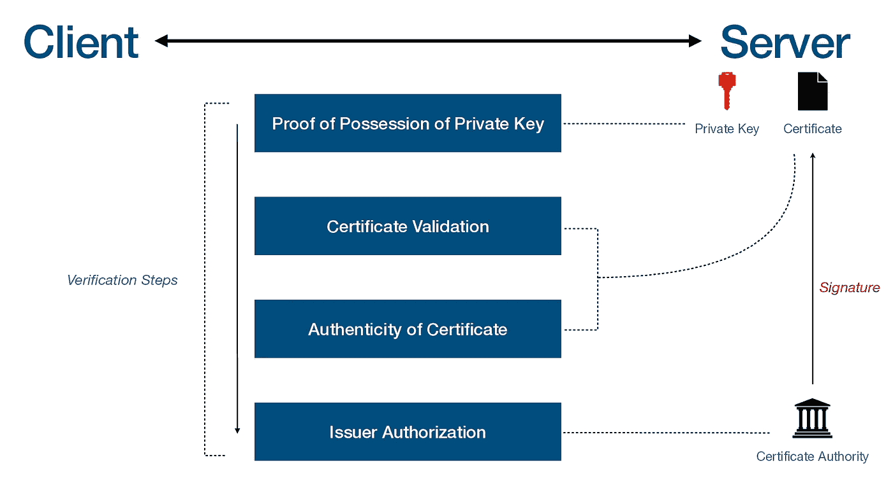
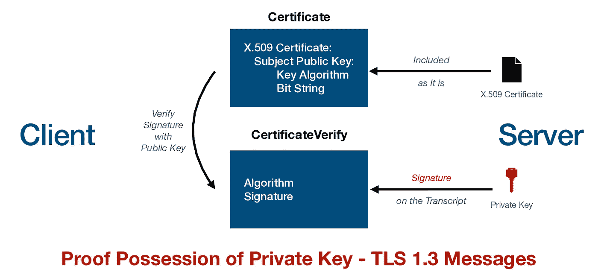
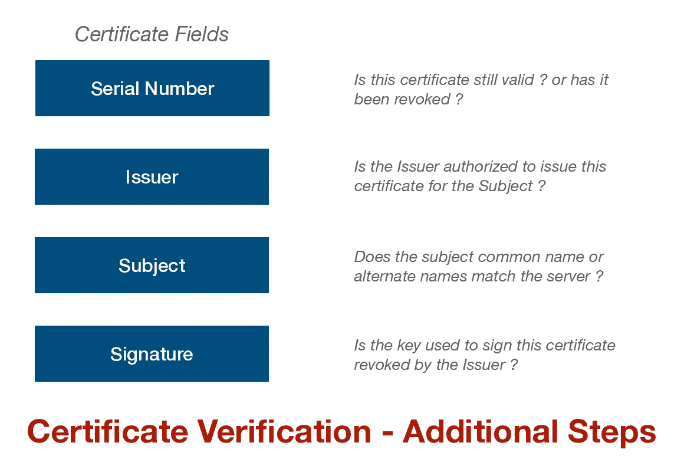
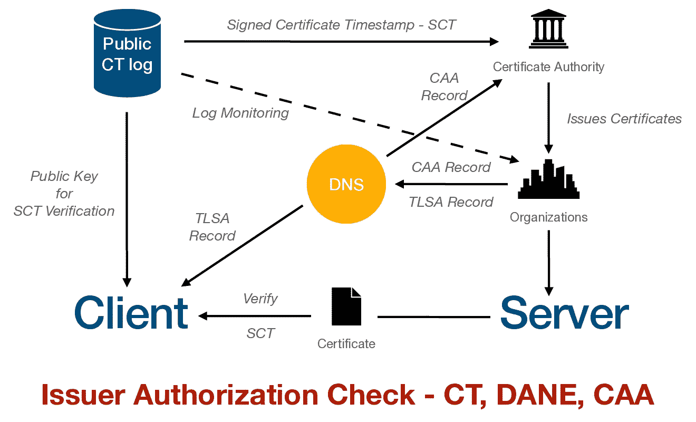
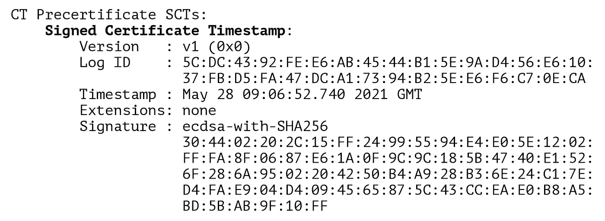

# TLS 解释—发行人授权、证书透明度、DANE、CAA

> 原文：<https://blog.devgenius.io/what-it-takes-for-tls-clients-to-establish-trust-with-a-server-d5436bcfb9bd?source=collection_archive---------2----------------------->

## [第 0 根安全网络](https://www.0snet.com)

## 由公共 CA 颁发的 TLS 证书的真实性不再足够


由[马里奥·卡鲁索](https://unsplash.com/@giggiulena?utm_source=medium&utm_medium=referral)在 [Unsplash](https://unsplash.com?utm_source=medium&utm_medium=referral) 上拍摄

在 **TLS —传输层安全性**中，客户端与服务器建立连接并协商 TLS 会话，以确保通信的机密性。但是，如果服务器未经验证，这种机密性就无法得到保证。

而人们可以决定使用 TLS 来确保连接被加密。需要注意的是，TLS 客户端完成的大部分工作是对等验证和密钥交换。一旦建立了信任并交换了密钥，加密(虽然重要)就是 TLS 的一小部分。

TLS 客户端会进行多层验证。这包括拥有私钥的证明、证书的真实性和有效性、对发布机构的授权。



为了建立 TLS 会话，服务器需要一个私钥和一个包含相应公钥的 X.509 证书。这些证书通常由 TLS 客户端(如 Web 浏览器)认可的证书颁发机构(CA)签署。

> 客户可以接受任何权威机构签发的证书

# 私人密钥

在初始握手期间，TLS 协议通过要求服务器用其私钥签署密钥交换参数(TLS 1.2) /副本(TLS 1.3)来规定拥有私钥的证明。在进一步处理之前，客户端使用证书中的主题公钥验证该签名。



至此，私钥的占有成立。并且，相应地，如果客户端信任主题公钥与服务器相关联，则它可以继续，而无需任何其他验证。这种方法被称为*公钥锁定*。

只要私钥是安全的，它就提供了一种建立信任的强大形式。然而，与服务器相关联的主体公钥的分发可能是复杂的，并且成为复杂攻击的目标。 [**HPKP**](https://en.wikipedia.org/wiki/HTTP_Public_Key_Pinning) 就是这样一种分发主体公钥的尝试。

# 证书

在用主体公钥验证服务器的签名之后，客户机验证证书中的所有其他字段和扩展。这包括开始日期、到期日期、密钥用法、基本约束等，以及通用名称和主题别名(SAN)。

X.509 公钥基础设施的更详细的细节——验证证书的 PKIX 是复杂的，例如它可能要求一些扩展存在、被理解([关键](https://datatracker.ietf.org/doc/html/rfc5280#page-136))甚至不存在([毒药](https://datatracker.ietf.org/doc/html/rfc6962#section-3.1))。

> 如果包含意外值的扩展被标记为**关键**，则实现必须拒绝包含未识别扩展的证书或 CRL。

## 真实性

如果证书有效，客户端需要检查其真实性。这是由客户端基于信任链独立完成的，即。，建立到可信根证书的路径，并验证路径中的证书。我们的文章 [*提供了这方面的概述，让我们加密变化影响 OpenSSL 1.0.x 和 CentOS7*](https://medium.com/@0snet/lets-encrypt-change-affects-openssl-1-0-x-and-centos-7-49bd66016af3) 。

在证书被认为是真实的之前，还需要处理几个实际问题，尤其是对于被吊销的证书。为了确保服务器提供的证书没有被 CA 撤销，客户端需要使用[*status _ request*](https://datatracker.ietf.org/doc/html/rfc6066#section-8)TLS 扩展从服务器获得 **OCSP** 响应，或者直接连接 CA 获得状态。



中间证书也可能被撤销，这可以由客户端使用证书中的 [**权限信息访问-AIA**](https://datatracker.ietf.org/doc/html/rfc5280#section-4.2.2.1)扩展来检查。一些客户端选择缓存或[预加载](https://blog.mozilla.org/security/2020/11/13/preloading-intermediate-ca-certificates-into-firefox/)可信的中间证书，以避免 **AIA** 检查。

# 批准

即使证书是真实有效的，客户端仍然需要检查 CA 是否有权颁发证书。这对于大型企业来说尤其是一个问题，因为客户可以维护一个它信任的证书授权机构的大列表，并且由任何授权机构颁发的证书都可以被客户接受。

> 信任锚的选择是一个策略问题:它可以是分层 PKI 中的顶级 CA、颁发验证者自己的证书的 CA 或网络 PKI 中的任何其他 CA。

发行者授权的问题目前以三种不同的方式处理，所有发行的证书的可审计日志，使用 DNS 基础设施直接向客户端分发密钥，以及 ca 是否被授权的信息。



## 证书透明度— CT

该方法新引入了公共日志的[操作者，](https://letsencrypt.org/docs/ct-logs/)[接受来自任意 CA 的证书](https://datatracker.ietf.org/doc/html/rfc6962#section-4.1)。这些证书被附加到日志中，并由操作员提供签名。这个签名由 CA 以**签名的证书时间戳— SCT** 的形式包含在最终证书中。



对应于日志签名密钥的公钥可包含在 TLS 客户端中。当遇到证书中的 SCT 时，TLS 客户端应该检查其可信日志的密钥并验证签名。这确保了被接受的证书是可信公共日志的一部分。此外，监控服务可以定期检查公共日志，查找任何 CA 未经授权的证书颁发。

这里的关键是 TLS 客户端执行 SCT 验证。主要的网络浏览器，如[谷歌 Chrome](https://certificate.transparency.dev/logs/) 和[苹果 Safari](https://support.apple.com/en-us/HT209255) 都有自己的 CT 日志程序，可以识别某些公共日志的签名。此外，它们还要求 SCT 验证成功，否则将无法建立与服务器的 TLS 连接。

从某种意义上来说，这似乎赋予了域名所有者权力，并可能将授权的责任推给他们，因为他们可以监控公共日志中的任何错误发布。此外，TLS 客户端需要维护可信公共日志的密钥，并对证书进行额外的验证。

## 基于 DNS 的命名实体认证— DANE

**DANE** 使用 **DNSSEC** 基础设施来分发公钥和 TLS 验证模式。因此，对于使用 DANE 验证证书的客户端，它应该能够支持 DNSSEC，域应该启用 DNSSEC，并且没有中间盒应该过滤掉 DNSSEC 记录。

就像 DNS A 记录如何用于将域名解析为 IP 一样，TLSA 记录提供了客户端应该期望的 TLS 证书信息。TLSA 记录的一个例子如下:

```
_443._tcp.www.example.com. IN TLSA (
      0 0 1 d2abde240d7cd3ee6b4b28c54df034b9
            7983a1d16e8a410e4561cb106618e971 )
```

前 3 个数字**“0 0 1”**指定 TLS 客户端的操作模式，而在本例中，剩余的文本是 DER 格式的预期证书的阿沙-256 散列。

## DNS 证书颁发机构授权— CAA

CAA 是证书颁发机构验证他们是否有权为特定域颁发证书的解决方案。所有公共认证机构在发布前都必须进行认证机构记录验证。TLS 客户在 CAA 中没有角色。

一个**的 CAA 记录“0 issue CA1 . example . net”**授权域名【ca1.example.net】的持有者颁发证书*。*而**的记录“0 发行；”声明任何 CA 都不应该为该域颁发任何证书。**

# 最后

与 TLS 服务器建立信任变得越来越复杂。客户必须经过多层验证，并独立确定他们是否在与目标方通信。

DANE 是一个很有前途的解决方案，但可能会受限于 DNSSEC 基础设施接入可靠的环境。目前，CT 公共日志是发行者授权的最佳解决方案，只有时间才能证明是否需要额外的验证来建立信任。

# 参考

1.  **PKIX** ，[https://datatracker.ietf.org/doc/html/rfc5280](https://datatracker.ietf.org/doc/html/rfc5280)
2.  **证书透明度**，[https://datatracker.ietf.org/doc/html/rfc6962](https://datatracker.ietf.org/doc/html/rfc6962)
3.  **民航局**，[https://datatracker.ietf.org/doc/html/rfc8659#section-4.2](https://datatracker.ietf.org/doc/html/rfc8659#section-4.2)
4.  **戴恩**，[https://datatracker.ietf.org/doc/html/rfc6698#page-7](https://datatracker.ietf.org/doc/html/rfc6698#page-7)

*在第 0 根，我们提供解决方案* [*第 0 根安全网络— 0SNet*](https://www.0snet.com/) *使用 TLS 客户端证书保护组织的内部 web 应用。看看我们的产品吧，它很容易部署，并且可以在*[*AWS*](https://0snet.info/#install.aws)*[*GCP*](https://0snet.info/#install.gcp)*和*[*Azure*](https://0snet.info/#install.azu)*上找到。**