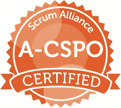

# 作为产品负责人，我学到了什么

> 原文：<https://blog.devgenius.io/what-ive-learned-as-a-product-owner-3f7719abb0a8?source=collection_archive---------24----------------------->

我已经在爱尔兰阿斯隆的爱立信公司做了 11 个月的产品负责人。

2020 年 5 月，我完成了认证 Scrum 产品负责人课程，现在我是 Scrum 联盟的认证产品负责人。耶！

在整个课程中，我发现自己对老师的话点头附和。有时会想:“是的，我也遇到过这种情况”，其他人会说“是的，我知道软件行业会发生这种情况”，其他人更喜欢说“是的，我已经感觉到了”，最满意的点头是“是的，我知道团队/开发人员会发生这种情况”。这让我一直在想，“我不是唯一一个……”

另一方面，在我的公司，有一个新的 PO，我被要求与她分享我的经验，所以我们有一个 30 分钟的电话。在那次聊天中，我意识到我到现在为止已经走过了一些路。

所以，我觉得今天是一个很好的日子，来给那些与新 PO 分享的和我在课程中点头的想法/经历一些形状。我们开始吧！

# 1.沟通是关键

沟通是一个永无止境的学习过程，需要向开发人员解释其他团队的观点，向经理解释功能，向利益相关者解释改进，以及在团队的日常任务中。

这些问题帮助我构建了我的对话(甚至邮件):

*   我的信息是什么？
*   我想让他们明白什么？
*   我的要求是什么？
*   什么时候？在哪里？为什么？

回答这些问题就像变魔术一样清晰、准确、简洁。

# 2.专注于愿景/路线图

很多时候，我发现自己被拖进会议和一些小任务中，这些小任务可能不是花几分钟，而是几个小时。软件行业是快节奏的，如果你不集中精力，很容易偏离方向。

我喜欢在办公桌上放上便利贴，当我迷失方向的时候，它会提醒我注意大局并重新聚焦。我还经常回顾主要需求和 EPICs 状态，以保持事情朝着正确的方向发展。

# 3.为团队服务

这是我的最爱之一，我喜欢把自己想象成开发者的助手。我真的很喜欢帮助他们找到他们需要的信息，联系他们需要交谈的人，开始与新同事的对话，把他们介绍给其他团队，等等。我在一家跨国公司的大型产品部门工作，这意味着流程。我的团队也需要支持来找到/理解这些流程。

# 4.成为人类

关于这一点，我可以写很多，但我将直奔主题。

接受我的错误:我是人，我会错过一些信息，但最终还是接受它，面对它，解决它，并确保它不再发生。

*尊重和欣赏他人的工作:*我利用一切机会感谢我的团队所做的工作，感谢他们从日程中抽出时间与我交谈，我喜欢单独完成，这很重要。

*理智对待团队*:开发人员对其他团队成员或其他团队甚至组织感到愤怒。我学会了感同身受，认识到他们的感受。这并不容易，但必须有诚实的空间，并从那里建立信任。

*成为蝙蝠侠而不是超人:*我不是女超人，我没有超能力，我不知道所有的事情，我不能做所有的事情，但我有工具/技能/纪律/远见/来自他人(社区)的帮助，这是我成功所需要的。

# 5.传递价值

顾客对产品有什么看法？—这应该是任何开发工作的头号驱动因素。我从很多渠道了解到这一点，我必须知道客户对我的产品有什么看法。企业可能会忘记这一点，但我，作为一个采购订单应该有它作为第一优先事项:了解客户的痛点，并解决它们。

# 6.练习，练习，练习

这都是关于实践的，你不会第一次就得到东西，第二次不会，甚至第三次也不会，但这就是 Scrum 关于迭代和学习、检查和适应的内容。我对所有发帖人的建议是:

*   练习给我们写信
*   练习创建幻灯片
*   练习向不同的目标群体解释
*   练习演讲
*   练习，练习，练习

有一天你会注意到它变得越来越容易，你变得越来越快。相信我，这需要几个月！

# 在一天结束的时候…

我为自己感到骄傲，为我的学习和进步感到骄傲。

*   容易吗？不会吧！
*   累吗？是的，它是。(什么不是？)
*   有回报吗？是的。
*   我会再做一次吗？绝对的。我学到了很多东西，而且我不是一个人完成的，所以感谢我的团队为这次旅程所做的一切！:)

月亮

我们聊聊吧！

【http://cynthiaalarcon.com/】T4|[领英](https://www.linkedin.com/in/cynthialarcon/)