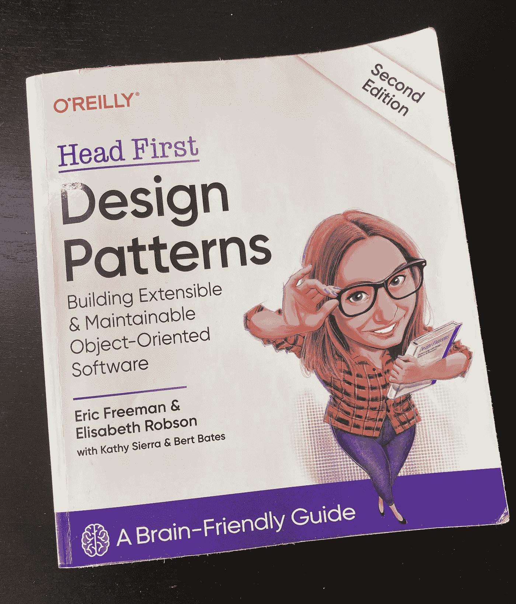

# 我从设计模式书中学到了什么

> 原文：<https://blog.devgenius.io/what-ive-learned-from-design-patterns-book-daniil-slobodeniuk-ea61bd2cd609?source=collection_archive---------5----------------------->

S o，那是三个辉煌的、充满欢乐的月份🤯在此期间，我几乎每天都在琢磨**设计模式**的书[奥赖利媒体](https://medium.com/u/fbfa235a954c?source=post_page-----ea61bd2cd609--------------------------------):[https://www . oreilly . com/library/view/head-first-design/9781492077992/](https://www.oreilly.com/library/view/head-first-design/9781492077992/)

在这篇文章中，我想对我所学到的东西做一个概述，不仅仅是在技术技能方面，还包括学习方法方面👨‍🏫。

此外，我会放下许多有用的材料，在那里你可以学到更多关于 general✨.的设计模式和编程

结构🔩：

*   介绍
*   技术部分
*   哲学部分
*   我所有文章的链接
*   额外部分
*   结尾部分

# 我们开始吧👊

## 介绍

**设计模式—** 一种工具，它允许你将预先开发的模式应用到重复出现的问题中，不仅可以简化当前的开发过程*,还可以简化未来的开发过程。*

实际上，模式非常受欢迎，因为它们有助于对代码进行修改——工程师可以更轻松地进行调整，而不会涉足意大利面条式的代码或劣质设计，后者不允许在不改变 other🛠.的情况下修改一个部分

究竟是谁开创了整个模式潮流？`=>`所谓的 **GoF** 伙计们🤟🏽

按照惯例，这些模式被称为 **GoF 模式——四人帮**。4 位学者，他们有智慧识别出反复出现的问题，并以我们今天所知的清晰形式将它们打包。

> 参观有类别**图案**和清晰解释的网站:[https://circle.visual-paradigm.com/catalog/](https://circle.visual-paradigm.com/catalog/)
> 
> 模式是解决一个重复出现的问题的工具，不仅可以缓解当前的问题，还可以缓解未来的发展

接下来，有 3 类模式。实际上，What❓Yeah 所有的模式都可以归类于:

*   *创建:*分离用户和系统之间的逻辑
*   *结构:*允许我们的设计融入到更大的系统中
*   *行为:*所有关于系统中类/对象之间的关系和交互

您可以在上面提供的链接中了解更多信息🔝

## 技术 part🧑🏼‍💻

在这里，我想讨论一下我学到了哪些技术&我在 realm➰.编程中做了哪些改进

1.  显然， **OO 设计知识**激增。这本书最终帮助我打开了 **SOLID** 的大门，看到了各种*设计原则*:

*   识别变化并封装
*   程序到一个*接口*，而不是到*实现*
*   争取*松耦合设计*
*   开闭原理
*   从属倒置原则
*   最少知识原则
*   好莱坞原则
*   单一责任原则

哇，真多啊，yeah⁉️冷静下来，当然没有人会在代码中立刻把它们全部抽筋，也没有人会一直一起使用它们。甚至更多——他们中的一些人可能会妨碍其他人工作，这是完全正常的！👋🏼写软件总是在*速度&深谋远虑*、*复杂度&难度*等等之间权衡。你需要意识到它们，看看这段特殊的代码是否可以用一种或另一种 way🧑来编写🏼‍💻

2.充当了一个**强大 Java** 世界的窥视者🏋🏻。曾经是皮托尼斯塔🐍有了一些使用 Kotlin 的经验，我已经知道了许多编程的概念，尤其是关于 JVM 的概念。此外，*静态类型语言*并不像一枚重磅炸弹。然而，在学习模式的过程中，我在网上找到了这个&:

*   Java 里的`static`是什么？
*   `abstract class` & `interface`有什么区别？

如果你想看看核心 Java 探索的笔记和我的代码，那么一定要访问我的 repo👀：

 [## GitHub-SleeplessChallenger/Java learning:Repo 我放 Java 代码和注释的地方

### 包:从根到特定的文件夹从域名逆序。越靠左，越应该导入细节…

github.com](https://github.com/SleeplessChallenger/JavaLearning) 

3.显然，这让我学会了**设计模式**🎨。但是，更重要的是，它帮助我建立了一种**模式友好的心态**。嗯？🤨

让我解释一下，我记得花了几个小时试图弄清楚我们的**策略模式**(书中的第一个)。在那一刻，我想:“哦，孩子，我要花一辈子才能把这本书写完”。事实上，对一些人来说，三个月对于一本书来说就像是永恒😵。但是*每一个下一个图案*并不是就**图案**本身而言更容易理解，而是从*对*以及*周围一切如何运作*的总体理解🤸‍♂️.

也就是说，这里我们有**与这个类的层次结构有**的关系，这里我们有**是-一个**加上这个 OO 原则。

唷，我想就这些了😪。现在，让我反复思考一些崇高的东西，并宣扬一些我和你可以通过学习获得的非技术性的东西，而不是直接通过**模式**。

## 哲学部分

所以，你可能会问我:“在这个胡言乱语的部分，你到底要告诉我什么？”。耐心点，让我在斥责我之前开始…😮‍💨

1.  真的，**耐心点**。是啊，是啊，每篇文章都会大谈耐心之类的😶‍🌫️.但实际上，我花了 3 个月的时间从书中吸取了 11 个模式(准确地说是 13 个，因为 2 个章节一次包含 2 个)加上:

*   科特林的一切
*   在白板上画一个设计
*   **写一篇文章**

掌握任何领域的新概念都需要时间和耐心。我记得我是如何从头开始学习编程的(是的，我是完全自学的**，没有任何训练营或昂贵的课程**)。所有的事情都会缓慢而稳定地出现在你的脑海里。

> 有句谚语说:“缓慢而稳定的人赢得比赛”

不，我并不是想建议你每天花 5 分钟时间，然后困惑为什么你什么也学不到。我更想说的是:“有时候你可以鞭策自己，最终实现你的想法。在其他时候，你可以让自己休息一下，或者换一个工作。

整洁的 to…➜

2.好好休息😴

至少有时，至少在周末，至少在晚上，至少每两周…

哦，男孩🤫就我而言，不断将自己推向极限并努力变得更好，并不是告诉你这些的理想人选。但是我观察到(借助**观察者模式**🤔🤭)休息一下:去公园散步或者比平时多睡会提高你的工作效率，另外，昨天无法解决的事情突然变得容易处理了🤙。

不小心累了或者抓不住新概念也不要怪自己。我们是人类，这是 normal🖐.

3.你学得越多，就越容易在同一领域吸收新的东西🙌🏽。

嗯，不是直接**更容易**，而是以一种更微妙的方式。让我说清楚 example🖖🏽:学习 **Kotlin** 比学习 **Python** 容易多了，因为我已经知道了*一般概念*和基本的 *OOP* 。但是 **Kotlin** 是静态类型和编译`=>`的新挑战。接下来， **Java** 更容易学，因为我有一些静态类型语言 Kotlin 的经验，并且知道 JVM 的一些古怪之处。但我从更深入的方法中了解到:

*   `interface`
*   重载方法
*   覆盖方法，`static`变量等
*   JVM 一般是如何工作的，以及其他许多事情…

所以，*要说清楚的是*，每一次新的学习努力在某些方面都会变得更容易，你肯定会感觉到这一点🌝

哇，你现在觉得提升了吗？🧚🏽‍♂️

## 链接到我的所有 articles🪢

在这一部分，我将放弃我写的所有关于**设计模式**的文章。请务必阅读它们，因为我在那里发现了很多信息🎯：

*   策略模式:[https://medium . com/toward sdev/strategy-pattern-for-independent-algorithms-kot Lin-70 ed 24 c 7 BD 8 b](/towardsdev/strategy-pattern-for-independent-algorithms-kotlin-70ed24c7bd8b)
*   观察者模式:[https://medium . com/toward sdev/observer-pattern-for-loose-coupling-kot Lin-f5ab 804609 bb](/towardsdev/observer-pattern-for-loose-coupling-kotlin-f5ab804609bb)
*   装饰模式:[https://medium . com/toward sdev/decorator-decorator-pattern-for-object-composition-kot Lin-7 CEC 92 cbaf 7b](/towardsdev/decorator-decorator-pattern-for-object-composition-kotlin-7cec92cbaf7b)
*   工厂模式:[https://medium . com/dev-genius/factory-patternS-to-hide-instantiation-kot Lin-D5 f 01 cf 01921](/dev-genius/factory-patterns-to-hide-instantiation-kotlin-d5f01cf01921)
*   单例模式:[https://medium . com/dev-genius/singleton-pattern-for-one-of-a-class-objects-Java-a63c 774 d9d 4](/dev-genius/singleton-pattern-for-one-of-a-kind-objects-java-a63c774d9d4)
*   命令模式:[https://medium . com/dev-genius/command-pattern-for-encapsulated-invocation-kot Lin-4338 EB 23 D2 ca](/dev-genius/command-pattern-for-encapsulated-invocation-kotlin-4338eb23d2ca)
*   适配器和外观模式:[https://medium . com/dev-genius/adapter-Facade-pattern-for-perfect-adapting-kot Lin-ccbc 8 f 8 cfcd 6](/dev-genius/adapter-facade-pattern-for-perfect-adapting-kotlin-ccbc8f8cfcd6)
*   模板模式:[https://medium . com/dev-genius/template-pattern-for-encapsulating-algorithms-kot Lin-3d ed 81377 fc 5](/dev-genius/template-pattern-for-encapsulating-algorithms-kotlin-3ded81377fc5)
*   迭代器&复合模式:[https://medium . com/dev-genius/iterator-Composite-patterns-for-managing-collection-kot Lin-FDA 036 ffda 9 f](/dev-genius/iterator-composite-patterns-for-managing-collection-kotlin-fda036ffda9f)
*   状态模式:https://media . com/dev-genius/state-pattern-for-changing-internal-process-kot Lin-72 bd4 ef 92 b2e

## 额外部分🌊

如果你仔细阅读了上面的所有内容，你会发现书中有 13 种模式被分解了，但在最初的 **GoF 手册**中有 23 种。🙋🏻‍♂️

1.  在**设计模式[至【O’Reilly Media】的](https://medium.com/u/fbfa235a954c?source=post_page-----ea61bd2cd609--------------------------------)**附录中，提到了 9 个**更多模式**。虽然没有详细介绍，但我们大致了解了它们的工作原理。我将对它们进行命名，并提供一些有用的资源:

*   桥梁
*   建设者
*   责任链
*   特轻量级
*   纪念物:[https://www.journaldev.com/1734/memento-design-pattern-java](https://www.journaldev.com/1734/memento-design-pattern-java)
*   访问者:a)https://www.geeksforgeeks.org/visitor-design-pattern/[b)https://dzone.com/articles/design-patterns-visitor](https://www.geeksforgeeks.org/visitor-design-pattern/)
*   调解人:[https://www.geeksforgeeks.org/mediator-design-pattern/](https://www.geeksforgeeks.org/mediator-design-pattern/)
*   口译员:[https://www.baeldung.com/java-interpreter-pattern](https://www.baeldung.com/java-interpreter-pattern)
*   原型

在研究了书中的所有 13 种模式之后，我可以证明，现在要掌握它们要容易得多🤟(回想第三点来自**哲学部分**一节)。

**桥型代码为**:

 [## KotlinDesignPatterns/src/main/kotlin/BridgePattern at main…

### Kotlin +中型文章中的设计模式。通过以下方式为无睡眠 challenger/KotlinDesignPatterns 开发做出贡献…

github.com](https://github.com/SleeplessChallenger/KotlinDesignPatterns/tree/main/src/main/kotlin/BridgePattern) 

> 请访问以下链接以了解有关模式的更多信息:[https://circle.visual-paradigm.com/catalog/](https://circle.visual-paradigm.com/catalog/)

2.探索**反模式**。他们是那些将试图脱轨你和隐藏未来发展的巨大问题😓

## Outro🥳

这是一段美好的旅程，三个月的磨砺让我成倍地成长💥。这本书帮助我为未来的工程生涯打下了坚实的基础，我总是推荐人们去阅读，至少*尝试*去大致了解**的模式世界**和**巧妙的 OO 设计**。

**记住** ☝️:学习&预演核心概念，如**模式**、**数据结构**等等，因为技术会出现和消失，但基础知识是 eternity➿.的不，我不是要告诉你*混淆技术*，而是要记住你不应该是一只猴子🐒它可以用框架做一些事情，但是没有任何核心概念的底层想法。

**欢迎发表评论，找到我/给我写信……**😁

*   领英:[www.linkedin.com/in/sleeplesschallenger](http://www.linkedin.com/in/sleeplesschallenger)
*   GitHub:[https://github.com/SleeplessChallenger](https://github.com/SleeplessChallenger)
*   leet code:[https://leetcode.com/SleeplessChallenger/](https://leetcode.com/SleeplessChallenger/)
*   电报:@无眠挑战者