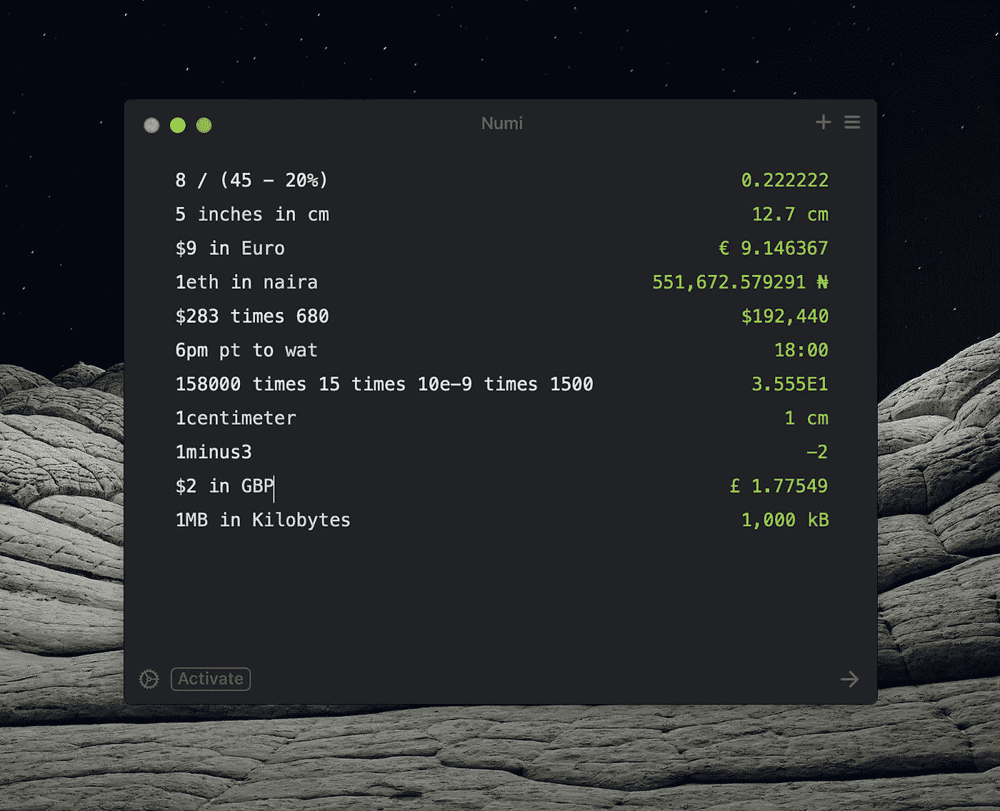
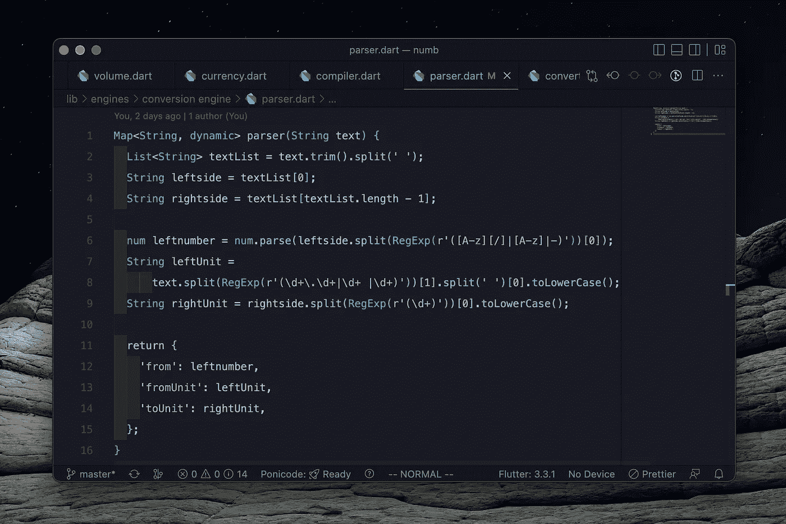
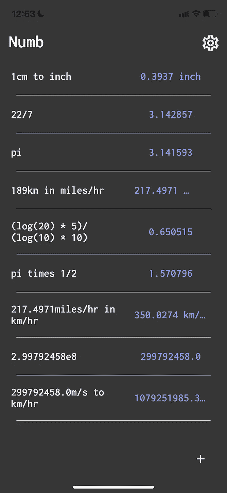
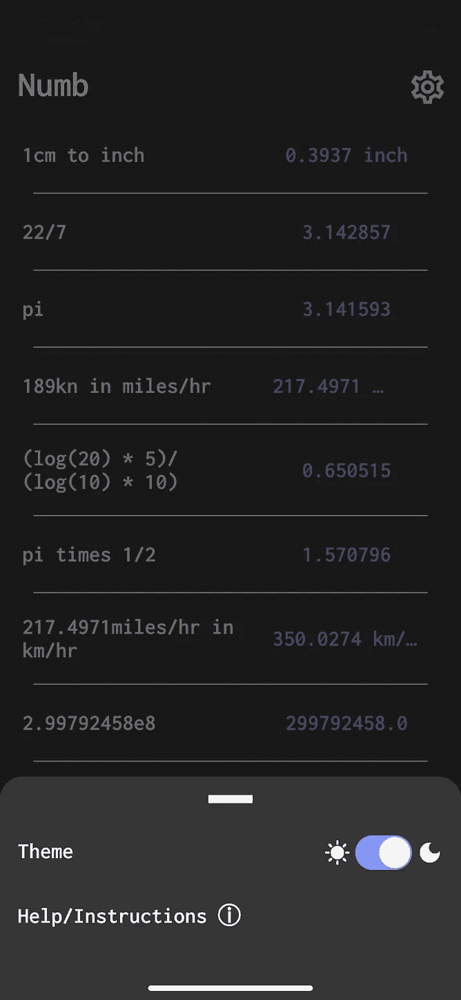
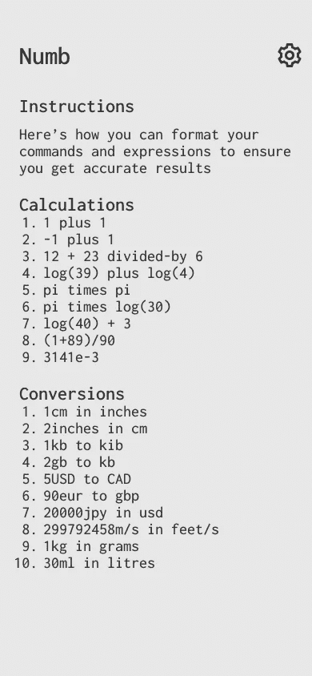

# 在开发我的第二个 Flutter 应用程序时，我学到了什么:麻木

> 原文：<https://blog.devgenius.io/what-ive-learnt-working-on-numb-22806e3f9038?source=collection_archive---------4----------------------->

## 我在开发第二个应用程序时获得的技能和经验

嗨，我是迈克尔。在过去的几个星期里，从 9 月初开始，到今天 9 月 23 日，我一直在开发一个叫做 Numb 的应用程序。你可以说这款应用是手机版的 Numi 克隆。对于那些不知道 Numi 是什么的人来说，它是 MacOS 上的一个计算器应用程序。你可能会对自己说“好吧…计算器应用有什么特别的？”Numi 不仅仅是一个普通的计算器应用程序。它允许你做转换，分配变量和许多其他事情。这里有一张它的快速照片

看起来很酷吧？我是从一位名叫松山拓也的开发人员那里了解到这一点的，对你们中的一些人来说，这个名字可能听起来耳熟。

Numb 将会是一个移动版本，以这种方式开发一个计算器将会把普通的初学者计算器开发项目变成一个更广泛的跨越项目，挑战初学者和有经验的开发人员。

## TL；速度三角形定位法(dead reckoning)

1.  我选择让**麻木**是为了让**挑战**自己，让**在移动** **应用开发**中发展我的**技能** **，特别是因为我现在能够为 iOS 和 Android 开发。**
2.  我选择 **Flutter** 来构建它，因为它使得开发**更快**，**更容易**并且比其他跨平台框架更**高效**。
3.  我更好地理解了 **Regex** 和**用例**以及**在我们认为理所当然的许多软件中的重要性**
4.  **号**将**开源**直到我对**是货币化**(订阅模式)**出售**还是**使其免费**得出结论。

# 为什么要做一个所有东西的计算器应用？

我选择麻木是因为我认为这是一种挑战我的技能、经验和对一些概念的感知的方式。

在我开发之旅的早期，我跳过了基本的计算器应用程序，许多开发人员将它作为我们的第一、第二或第三个项目。现在它回来咬我的屁股😂。

一天下午，当我在考虑一个在我的简历中会很好看的项目时，我开始考虑我每天或至少每两天使用一次的应用程序，我突然想到我最近经常使用 Numi。所以我做了一些调查，发现手机上没有这样的应用程序，我只能找到一个概念上类似的，但其他都没有。它和一个基本的计算器没什么不同。那时我决定做一个可以放在口袋里随身携带的。

我认为这是一个机会，不仅为我自己，也为许多人，他们正在寻找一个快速的计算器应用程序，没有所有的麻烦，不得不倾斜和寻找操作数，并希望语法是正确的。

# 为什么我选择了颤动而不是反应原生

在过去的 2 年里，我断断续续地涉足了《颤振与反应》。随着我的第一个应用程序( [Twitwall](https://play.google.com/store/apps/details?id=com.essiet.twitwall) )于 2021 年 2 月发布，我从大量需要我自己解决的挑战和情况中获得了经验。我的第一个应用 [Twitwall](https://play.google.com/store/apps/details?id=com.essiet.twitwall) 是用 Flutter 构建的，在第一次遇到 Flutter 之后，我于 2020 年 12 月开始开发它。这将成为促使我从反应原生切换到颤动的驱动因素。

在过去几年使用 React Native 的时候，我注意到社区似乎从来没有就任何事情达成共识。当谷歌搜索如何做某事或如何实现特定库/特性的快速指南时，我遇到的东西要么过时，要么完全错误，要么是针对 Expo/React Native 的特定版本。例如，我记得在 react native 中寻找一种快速实现可忽略列表项的方法，因为它在之前的更新中已经从 React Native 中删除了。幸运的是，我遇到了很多关于如何做到这一点的指南、教程和文章，但它们都是以迂回的方式进行的——我在我的[之前的一篇文章](https://devshogun.medium.com/flutter-vs-react-native-a-cross-platform-framework-vs-react-ported-for-mobile-5f1f256f7306)中提到了这一点。

我最初用 React Native 开始麻木，我已经到了开发计算和转换引擎的地步。然而，我脑袋后面的东西说我应该先开发一点前端，所以我做了，但没有按计划进行。我不得不利用大量的库，这些库分别与存储、数据库交互并允许主题化。而这些是我选择的包: [MMKV](https://github.com/mrousavy/react-native-mmkv) 用于存储； [React Native SQLite 存储](https://www.npmjs.com/package/react-native-sqlite-storage)为数据库；[用于主题化的 NativeBase](https://docs.nativebase.io/?utm_source=HomePage&utm_medium=Hero_Fold&utm_campaign=NativeBase_3) 。

单独安装这些是一件痛苦的事情，尤其是数据库🤦‍♂️，我不得不安装第三方库才能让它工作。在所有的安装和时间浪费之后，我仍然选择坚持使用 React Native，最后一根稻草是在我实现了我对 UI 的一些设计之后，它们看起来一点也不正确——Native base 看起来一点也不像 Native，尤其是它们的底部模态表。

就在那时，我决定从长远来看，我会选择 Flutter。随着性能的提高、原生感觉和小部件目录，我很快意识到我做出了正确的选择。安装数据库( [SQFlite](https://pub.dev/packages/sqflite) )和存储包( [Get_Storage](https://pub.dev/packages/get_storage) )花了我不到两分钟的时间。你可能想知道“主题库怎么样？”事实上，有了 Flutter 和 Dart，你可以利用 ChangeNotifier 类，很容易地自己实现主题化。我最近也就此写了一篇文章:

 [## 快速简单的方式添加主题到任何颤振应用程序

### 使用 ChangeNotifier 类使主题化变得简单

blog.devgenius.io](/quick-and-simple-way-to-add-theming-to-any-flutter-app-826c16a53e19) 

有了所有的排序，我决定在移动到前端方面之前处理引擎。现在我承认实现正则表达式、逻辑和结构非常困难，特别是因为我从 Dart 整体上休息了这么长时间，但我在大约一周内很快就摆脱了这个问题。对发动机进行了几次测试后，我对它的速度感到震惊。从分解、过滤、编译和计算，结果是即时的。

移动到前端实现我想出的设计是相当容易的，当它来到前端时，不需要任何外部库。

总的来说，我选择了 Flutter，因为它更快、更容易，而且在小部件方面几乎没有开销。

# 我对正则表达式的看法是如何改变的

在我开发之旅的早期，我看到 regex 是一个前端开发人员很少使用的工具，天哪，我错了😂。

在过去的几个星期里，光是做这个项目，我就发现自己经常使用 leetcode。为了确保我为引擎实现适当优化的算法，我到处练习一些 [leetcode](https://leetcode.com/problemset/algorithms/) 算法问题，大约一天两个。但是，我发现自己在编程时使用了更多的声明性方法，除非绝对必要，否则我尽量不去重新发明轮子。然而，在这个项目中，在制造引擎的时候，我不得不做很多必要的编程，特别是因为我不得不处理很多边缘情况。

正则表达式是引擎的骨干，你可能会认为它是一些训练有素的人工智能模型，可以识别单词和数字，但不，它只是一个很好的旧正则表达式。可以说 regex 是后端开发人员拥有的最强大的工具之一。

看看基本的解析算法

Regex 节省了我在引擎上工作的大量时间，特别是因为我不必检查输入中的每个字符。

# 开源，销售还是赚钱？这是一个问题

作为一名仍在努力进入市场并获得一份体面工作的开发人员，我不认为我能够做一些花费了我这么多时间的开源和长期免费的东西。过去几天我一直在考虑这个问题，因为我是开源软件的倡导者。

我曾考虑过采用 Numi 的盈利模式，并将免费版应用限制为只有一半的功能，没有云同步。

我也考虑过把这个应用程序卖给任何愿意以足够好的价格购买它的公司或个人，因为它可以很容易地建立起来，具有很高的实用性。

在一天结束时，钱让灯亮着，让食物摆在桌子上，而不是宣传或你对社区有多少贡献。

然而，我后来决定让它开源，直到我能够找到一个买家或实现货币化模式。

如果你有兴趣购买这款应用，支持它的开发或帮助营销，以使它获得成功，你可以通过 [Twitter](https://twitter.com/devshogun) 、 [Reddit](https://www.reddit.com/user/Shogun-2077) 联系我，或给我的公共电子邮件(emsaa2002@gmail.com)发邮件。

# 快速浏览目前的屏幕

从左到右:主屏幕，主题和导航模式，以及帮助/说明屏幕

我希望你喜欢这篇文章，我希望它至少在一个方面帮助了你。在接下来的几周里，我不会发布任何文章，因为我将专注于帮助编写新的 Solidjs 文档，并试图将其纳入研究员计划，但我会在 10 月底带着更新回来。

我希望你读这篇文章的时候很开心，我希望你有一个更美好的一天，再见。

## **在线关注我，获取更多更新**

*   推特:[迈克尔。e(@ dev 幕府)/ Twitter](https://twitter.com/devshogun)
*   Reddit:[dev 幕府将军(u/幕府将军-2077)——Reddit](https://www.reddit.com/user/Shogun-2077)
*   中号:[迈克尔·埃西特——中号](https://devshogun.medium.com/)
*   开发者社区: [Michael Essiet👩‍💻👨‍💻](https://dev.to/devshogun)