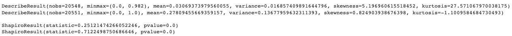

# 是什么让一首歌在 Spotify 上流行？

> 原文：<https://blog.devgenius.io/what-makes-a-song-popular-on-spotify-1b3eb43f608e?source=collection_archive---------0----------------------->

我父亲是作曲的，他很想知道流行歌曲是否具有一些典型的特征。让我们看看能否使用常见的数据科学工具找到答案。我的直觉是，更短、更有声音、更有活力的歌曲在普通人群中更受欢迎。当你收听收音机或查看本月热门歌曲时，你会最常听到这类歌曲。有可能从统计学上证明这一点吗？*此外，你的音乐品味是否更符合大众口味，还是你已经形成了自己独特的品味？*

Spotify 上的流行歌曲有哪些属性？

我将用于分析的数据集可以在这里[下载](https://www.kaggle.com/akiboy96/spotify-dataset)，而列描述可以在 Spotify 的开发者[页面](https://developer.spotify.com/documentation/web-api/reference/#/operations/get-audio-features)找到。用于执行分析的 Jupyter 笔记本可以在 GitHub [这里](https://github.com/JakobLS/spotify-song-popularity)获得其全部内容。

# 初始数据探索

加载数据，解码`mode`和`popularity`列以便于理解，并删除我们不感兴趣的两列。最后，显示一些统计数据来初步验证数据是否正常。

描述性统计。

所有列似乎都有合理的范围。最长持续时间(`duration_ms`)在`4.17e6`非常高，但转换成更容易理解的东西，它实际上不超过 70 分钟(大约 4000 秒)——完全在一首歌长度的合理范围内。许多歌曲属性在`[0,1]`(如`danceability`、`energy`、`instrumentalness`)范围内归一化。

显示大多数歌曲来自哪个年代，按流行度和模式分类。

按流行度、年代和模式显示歌曲。数据集中的大多数歌曲来自 60 年代和 70 年代。

这些数据包含了 60 年代和 70 年代的大部分歌曲。大调调式比小调调式更频繁。

通过计算每个特征与流行度之间的[皮尔逊相关系数](https://en.wikipedia.org/wiki/Pearson_correlation_coefficient)来看看哪些属性与流行歌曲最相关。这可以显示在相关矩阵中。

## 皮尔逊相关矩阵

为了便于解释相关矩阵，我将重新排列列的顺序，使 popularity 出现在第一个位置。一些列也需要转换成数字。下面是生成的矩阵。

皮尔逊相关矩阵相对歌曲流行度。

当考虑流行和不流行的歌曲时，与歌曲流行度最相关的属性是:

*   `Instrumentalness` (-0.41)
*   `Danceability` (0.35)
*   `Loudness` (0.29)
*   `Valence` (0.25)和`Acousticness` (-0.25)
*   `Energy` (0.20)

属性如`decade`、`duration`、`tempo`、`liveness`和`speechiness`只有很小的影响。

我们还可以使用 A/B 测试来确认这一点。我们不会涵盖所有内容，而是将重点放在每组中的一些内容上；高度和次要相关。出于本文的目的，我们选择在高度相关的属性中测试`instrumentalness`、`danceability`和`energy`，在低相关的特性中测试`duration`和`speechiness`。

由于我们将根据流行和不流行的歌曲进行分析，我们将把数据分成这两组。

流行和不流行的歌曲数据分裂。

每组大约有 20，000 首歌曲，这个数据集对于假设检验来说足够大了。

# 器乐曲

`Instrumentalness`与歌曲知名度高度*负相关*。这意味着受欢迎的歌曲通常具有较低的`instrumentalness`。这很直观，因为你在流行电台听到的大多数歌曲都不是器乐。让我们用 A/B 测试来统计一下。

使用直方图按受欢迎程度绘制`instrumentalness`。然后计算偏度和峰度，检验正态性。

受欢迎的工具性。

偏度、峰度和工具性的正态性检验。

对于流行歌曲，偏度和峰度都高于阈值 3，这表示非正态性。目视检查证实了这一点。虽然冷门歌曲有可接受的值，但我们选择 Kruskal-Wallis 检验来检验零假设。

## 陈述无效假设和替代假设

*   *无效*假设是，平均而言，流行歌曲和不受欢迎歌曲在`Instrumentalness`没有*或*显著差异。
*   另一种假设是，平均而言，流行歌曲和不受欢迎歌曲之间有显著的差异。

## 测试无效假设并可视化结果。

检验零假设。

这导致 t 统计值为 7265.83，p 值为 0.0。由于 p 值较低，我们甚至可以为置信区间选择 99%的置信水平。高 t 统计值表明两组之间有很大差异。让我们通过在函数中包装相应的逻辑来计算置信区间。

计算置信区间。

这将产生以下输出:

在 99%置信水平下仪器性能的置信区间。

*我们拒绝 null* 。两组之间的平均值有显著差异。在 99%的置信度下，流行歌曲比冷门歌曲的 `instrumentalness`低 0.24 到 0.25 分*。*

光看数字很难想象这种手段上的差异。下图使这一点更加清晰。

流行歌曲和非流行歌曲在工具性上的区别。

视觉上的差异很明显，平均值约为 0.03 和 0.28。一般来说，冷门歌曲比流行歌曲更具器乐性(大约多 8 倍)。

# 可跳舞性

通过前面的相关矩阵，我们看到，`danceability`与歌曲人气正相关。这意味着流行歌曲往往更适合跳舞。根据主流电台最常播放的歌曲，这是有道理的。

与之前类似，使用直方图按流行度显示`danceability`。

直方图上显示的可跳舞性分布。

通过目测，这两种分布似乎都接近正态分布。让我们计算一些统计数据，并用夏皮罗-维尔克检验法来检验正态性。尽管对于大于 5000 的样本，p 值可能不准确，但测试统计应该是准确的，并帮助我们提供一些指示，说明下一步的方向。

可跳舞性的正态性测试结果。

偏度和峰度都远低于正态性的阈值 3，而检验统计量非常接近 1。太好了！我们可以用一个独立的 t 检验。

## 陈述无效假设和替代假设

*   *无效*假设是在`Danceability`中，流行歌曲和非流行歌曲之间平均没有*显著差异。*
*   另一个假设是，平均而言，流行歌曲和非流行歌曲在`Danceability`有*和*显著差异。

## 测试无效假设并可视化结果

我们得到的 t 统计值为 74.76，p 值为 0.0。由于 p 值如此之低，在计算置信区间时，我们可以采用 99%的置信水平。

在 99%置信水平下可跳舞性的置信区间。

*我们拒绝 null* 。在 99%的置信度下，流行歌曲比不受欢迎的歌曲平均高出 0.12 到 0.13 分。这相当于相差 25%左右。

流行歌曲和非流行歌曲在可跳性上的差异。

我们可以直观地看到，流行歌曲的平均`danceability`明显高于冷门歌曲(0.48)。注意小的置信区间(通过你几乎看不见的点的垂直线)——它们是大样本量的结果，允许我们更精确地计算差异。

# 活力

`energy`水平在流行歌曲中有较高的正相关性。这意味着流行歌曲一般比不流行的歌曲有更高的水平。在直方图上按受欢迎程度绘制`energy`级别的分布会产生以下图形:

直方图上显示的能级分布。

计算偏度、峰度和检验正态性的结果如下。

测试能量水平是否正常。

目测似乎表明，最有活力的歌曲是不受欢迎的(`energy`水平在 1 或接近 1)。流行歌曲仍然集中在较高的一端，最有活力的歌曲得分在 0.5 和 0.8 左右。流行歌曲的等级是相当正态分布的，而冷门歌曲似乎不是这样。

虽然偏度和峰度表明这两种分布都是正态分布，但冷门歌曲的视觉效果并不令人信服。因此，为了安全起见，我们将使用 Kruskal-Wallis 非参数检验。样本容量具有足够大的裕度。

## 陈述无效假设和替代假设

*   *无效*假设是流行歌曲和非流行歌曲在`Energy`水平上平均没有*显著差异。*
*   另一种假设是，平均而言，流行歌曲和非流行歌曲在水平上有显著差异。

## 测试无效假设并可视化结果。

我们得到 904.27 的 t 统计量和 1.16e-198 的非常小的 p 值。置信区间显示如下:

99%置信水平下能量水平的置信区间。

我们拒绝空值。99%的置信度下，流行歌曲平均比冷门歌曲高 0.08 到 0.1 *个* `energy`级单位。相差 17%左右。

流行歌曲和非流行歌曲在能量水平上的差异。

上面的点图直观地显示了流行歌曲的平均`energy`水平(0.62)如何显著地*高于不流行歌曲的平均*(0.53)。

# 持续时间

`Duration`在我们最初的分析中与歌曲流行度有很低的负相关。

从绘制分布图开始。在数据集中的大约 40k 首歌曲中，只有 134 首长于 1000 秒。这导致了非常长的右尾巴(最长的歌曲大约 70 分钟，或超过 4000 秒)。将 x 轴限制为 1000 秒，将更容易解读剧情。t 检验将适用于所有歌曲。

使用直方图显示持续时间分布。x 轴限制为 1000 秒，以便于解释。

正态性测试持续时间。

偏斜度、峰度和目测都表明这两种分布都不是正态分布。

## 陈述无效假设和替代假设

*   *无效*假设是，平均而言，流行歌曲和非流行歌曲在`Duration`没有*显著差异。*
*   另一种假设是，平均来说，在 T4，流行歌曲和不受欢迎的歌曲之间有显著的差异。

## 测试无效假设并可视化结果

我们使用 Kruskal-Wallis 检验来检验空值，并得到 18.98 的 t 统计量和 1.32e-05 的 p 值。

99%置信水平持续时间的置信区间。

我们拒绝无效的 T21。流行歌曲和不流行歌曲在 T5 方面有很大的区别。在 99%的置信度下，流行歌曲平均比冷门歌曲短 15 到 21 秒。

这不算多，但我还是觉得比较合理，平均来说，流行歌曲至少比冷门歌曲稍微短一点。主流媒体平台上播放的歌曲很少有很长的。下面我们来直观的展示一下这种差异。

流行歌曲和非流行歌曲的时长差异。

我们最初使用相关矩阵发现了歌曲持续时间的弱负相关。A/B 测试通过确认存在差异来验证这些结果。然而，这种差异很小，在 8%左右。

# 语音

最后，我们将在`Speechiness`上运行 A/B 测试。`Speechiness`在我们的初步分析中具有非常弱的负相关性。如前所述，绘制分布图以获得数据的总体感觉。

使用直方图显示速度分布。

测试语音的正常性。

流行和不流行的歌曲没有明显的视觉差异。他们都很少说话。在数据收集过程中，有声读物和播客等富含语音的内容似乎被排除在数据集之外。

通过目测，没有一个分布看起来是正常的。偏斜度和峰度也表明了这一点。因此，我们将使用克鲁斯卡尔-沃利斯来检验零假设。

## 陈述无效假设和替代假设

*   *零*假设是，平均而言，流行歌曲和不受欢迎歌曲之间的`Speechiness`没有*显著差异。*
*   另一个假设是，平均来说，流行歌曲和不流行歌曲在 T3 上有显著的差异。

## 测试无效假设并可视化结果

我们最终得到的 t 统计值为 697.39，p 值为 1.10e-153。

99%置信水平下的语音置信区间。

*我们拒绝 null* 。在 99%的置信度下，流行歌曲比不受欢迎的歌曲平均要低 0.005 到 0.009*`speechiness`分。虽然差别很大，但也很小，大约在 10%左右。*

**

*流行歌曲和非流行歌曲的语音差异。请注意，y 轴不是从左边的零开始，这表明实际存在的差异较大。*

*左图使用默认设置和截断的 y 轴，表明两种分布之间有很大差异。右边的图，y 轴从 0 开始，不会这样捉弄我们。在描绘两组之间的差异时，注意像这样的小细节是很重要的。统计测试显示了一个微小的差异——这也应该反映在视觉效果上。*

# *结论*

*我们已经确定了流行歌曲和非流行歌曲之间的几个不同属性。两组之间的*工具性*、*舞蹈性*和*能量*水平差异显著，具有较高的确定性和较大的差异性。*持续时间*和*语音*的差异在统计上是显著的，但相当小。*

> **器乐性*在流行歌曲中明显低于冷门歌曲，而*可舞性*和*能量*则明显高于冷门歌曲，确定性较高且差异较大。*

*关于数据集有几个注意事项。我们不知道它是在什么样的假设下收集的，也不知道它是否能代表一般的歌曲。它包含的流行歌曲和不流行歌曲的数量大致相同(20k)，但可以合理地假设市场上的不流行歌曲比流行歌曲多。我们不知道到底是什么把一首歌定义为流行。也许这个定义太宽松或太严格了。数据集只包含 Spotify 上的歌曲，尽管 Spotify 是市场上的领导者，但它可能不代表其他平台和社会上的流行歌曲。*

*然而，根据我们使用的数据，如果你觉得你正在听的大多数歌曲更适合跳舞，有很高的 T2 能量，而且通常不是 T4 乐器，那么你的音乐很有可能会在其他人中流行。另一方面，如果你不知道自己在听这种音乐，你可能会有更独特的品味。🙂*

# *有反馈或者想联系？*

*我欢迎任何形式的反馈。在下面留下评论或在 [LinkedIn](https://www.linkedin.com/in/jakob-salomonsson-my-profile/) 或我的[个人网站](https://www.jakobsalomonsson.com/)与我联系。*