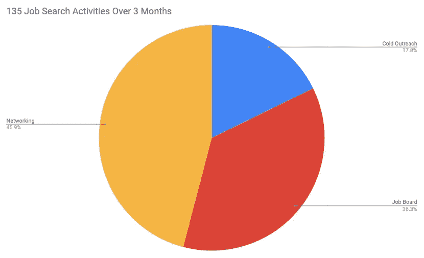
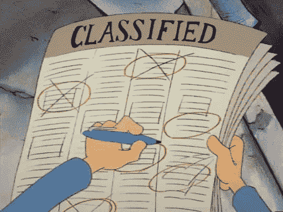
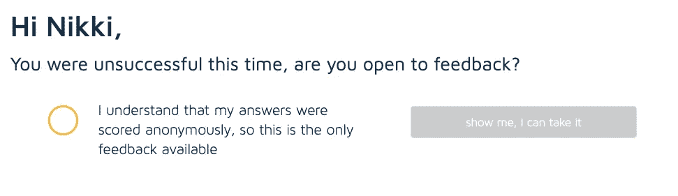
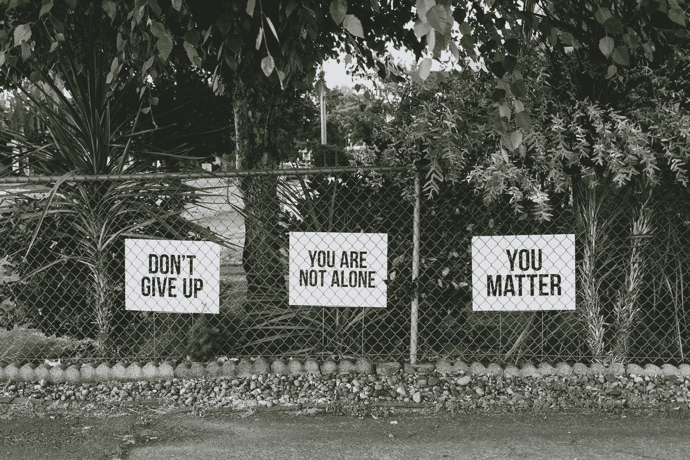

# 我在软件工程训练营结束后 3 个月的求职过程是什么样的

> 原文：<https://blog.devgenius.io/what-my-post-software-engineering-bootcamp-3-month-job-search-looked-like-d037d474093d?source=collection_archive---------1----------------------->

这是给那些对后软件工程训练营求职感兴趣的人准备的。

TL；博士——工作论坛糟透了，把你的时间花在社交上吧。

如果你喜欢:

我稍后会谈到这一点…

# 要约

4 月 8 日，先锋公司给了我一个开发人员的职位。那是因为我去参加了先锋集团举办的一个墨尔本编程妇女聚会。在活动期间，先锋公司的员工反复建议，如果有人有兴趣在那里工作，可以与他们联系。我做到了，剩下的就是历史了。

但是我是怎么知道这个聚会的？嗯，我的朋友，[格雷琴·斯科特](https://twitter.com/scott_gretchen)是组织者之一，我是怎么认识格雷琴的？我是由[劳拉·萨默斯](https://twitter.com/summerscope)介绍的，她是我通过[艾丽·沃森](https://twitter.com/LoveAndMaths)认识的，我是在 [One Roof](https://oneroofwomen.com/) 认识她的，那是南岸的一个合作空间，我在那里工作了一年多。

先锋>女性编码>格雷琴·斯科特>劳拉·萨默斯>艾丽·沃森>一个屋檐下

# 开始

我在 2019 年 12 月 20 日的墨尔本大会上完成了为期 12 周的软件工程沉浸式学习。这不是直接找新工作的理想时机，但是休息是受欢迎的。在开始训练营之前，我被告知通常需要 3-6 个月才能找到工作。

由于一月份学校放假时间长，而且现在是夏天，澳大利亚以封闭著称，所以那个月我没有得到太多的关注。

三月中旬，我们去了疫情。

但我会谈谈在一切崩溃之前我是如何度过的。因为 3 月 16 日之后我没有精力做任何事情。

**社交** —参加聚会、喝咖啡、参加技术委员会会议、会议等。

**冷接触** — Linkedin 接触，给我不认识但很专业的人发邮件，给我喜欢的公司发邮件，尽管他们没有职位空缺

**工作公告板** —自我说明

[天线](https://unsplash.com/@antenna?utm_source=medium&utm_medium=referral)在 [Unsplash](https://unsplash.com?utm_source=medium&utm_medium=referral) 上拍照

# 建立工作关系网

我花在社交上的 46%的时间中，可能有一半是去参加聚会。尽管我看起来是个外向的人，但我不是。大群体榨干我。但是我发现技术社区非常包容和友好。随着时间的推移，我也开始在其他聚会上看到类似的面孔，这让我感觉更舒服。这些是我参加的聚会:

*   [Ruby 和 Rails 墨尔本](https://www.meetup.com/en-AU/Ruby-On-Rails-Oceania-Melbourne/)
*   [编码墨尔本的女人](https://www.meetup.com/en-AU/Women-Who-Code-Melbourne/)
*   [DevOpsGirls](https://www.meetup.com/en-AU/DevOpsGirls/)
*   构建一些节点机器人
*   [MelbJS](http://melbjs.com/)
*   [顶尖科技女性](https://www.meetup.com/en-AU/Tech-Leading-Ladies/)
*   [原型和爆米花](https://www.meetup.com/en-AU/Prototypes-and-Popcorn/)

我还参加了 [Ruby Conf](https://rubyconf.org.au/2020) ，感谢 [Lookahead](https://www.lookahead.com.au/) 的 [Steve Gilles](https://twitter.com/stevelikesyou) 给了 [RailsGirls](http://railsgirls.com/melbourne) (如此慷慨)和 [Sharon Vaughan](https://www.linkedin.com/in/sharon-vaughan/) 建议我去的一张免费门票，以及一个周末 [SexTech 黑客马拉松](https://www.eventbrite.com.au/e/melbourne-sextech-hackathon-tickets-86647487969)。

[Webaroo](https://unsplash.com/@webaroo?utm_source=medium&utm_medium=referral) 在 [Unsplash](https://unsplash.com?utm_source=medium&utm_medium=referral) 上拍摄的照片

# 冷外联

总的来说，当我联系他们时，他们真的很积极。我建立了很多很好的关系，这些关系后来变成了人际关系网。虽然，这并没有最终导致一份工作邀请，但它几乎已经成为了一份工作邀请。

这是我在 LinkedIn 上发给某人的一条经过编辑的消息:

> 嗨******！我在推特上关注你，喜欢你说的话。我参加过很多********的活动，每个人的周到给我留下了深刻的印象。
> 
> 我最近在大会上完成了沉浸式软件工程，我正在寻找我的第一个角色。我一直在查看招聘页面，没有看到任何初级软件开发人员的职位空缺，我很好奇你是否曾经招聘过这种职位？
> 
> 如果能降落在像*********这样的地方，我会感到很神奇，在那里我可以很好地运用我的工程技能，并向不可思议的人学习。据我所知，接受大三学生需要做很多工作，但从某种意义上来说，你也可以帮助塑造他们，这也是有益的。很想听听你的想法！
> 
> 干杯！

这个*不是我反复使用的*模板消息。每次我都会根据我对这家公司的了解程度、我在那里认识的人以及我为什么感兴趣，精心制作一条新的信息。所有这些都是真实的。我并没有要求喝咖啡，但有时我会。这个女人最后建议我去她办公室聊聊，她真是太慷慨了。

# 求职公告板

工作板 suuuuuuuccckkk。你花几个小时通读每一条招聘信息，说服自己合格，研究公司，寻找可能在那里工作的潜在 linkedin 联系人，写一封求职信，回答任何额外的问题…要获得模板拒绝电子邮件回复，请:

> 你好 <firstname><lastname>，</lastname></firstname>
> 
> 我们有很多非常合格的申请人。等等等等

我听说过一些公司一直在发布招聘信息，即使他们没有空缺，只是为了保持他们的渠道新鲜。

我唯一一次收到有益的反馈是来自 99designs，因为他们使用了一个叫做[应用](https://www.beapplied.com/)的平台，一个盲人招聘软件(我喜欢):

# 最后

如果我再次找工作，用不同的方式度过我的时间，我可能会把人际关系网/冷接触/求职板分成 75/15/10 份。

我知道现在很难做到，是的，是的，网上有很多东西，但这不一样。因此，在这种环境下，我仍然会尽可能多地参加在线活动，比如 [MusesJS](https://musescodejs.org/) 举办了一场令人难以置信的全天活动，每个人都在热烈讨论分组讨论室、演讲者和出色的导师。但我可能会关注冷外联，阅读像[的](https://learntocodewith.me/blog/)[本指南](https://learntocodewith.me/posts/pandemic-job-search /)和我一起学习编码这样的文章，它们有助于指出目前正在*蓬勃发展的*行业。

丹·梅耶斯在 [Unsplash](https://unsplash.com?utm_source=medium&utm_medium=referral) 上的照片

我更关注找工作的后勤方面，而不是心理、精神和情感方面，这是一个🎢。

祝你找工作一切顺利，有任何问题随时打电话给我。你可以通过[推特](https://twitter.com/nikkiricks)、 [linkedin](https://www.linkedin.com/in/nikki-ricks/) 或 [github](https://github.com/nikkiricks) 联系我。

如果你对我每周的训练营感兴趣，看看这篇[文章](https://medium.com/@nikki.ricks/a-recap-of-my-software-engineering-immersive-experience-at-general-assembly-in-12-tweets-d750fa95c766)。