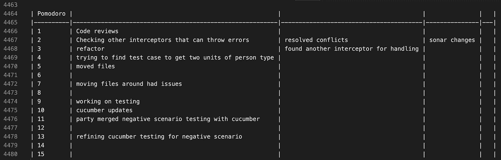

# 没人告诉你的简单体面的个人日记

> 原文：<https://blog.devgenius.io/what-no-one-tells-you-about-simple-decent-personal-journal-4a9de184696a?source=collection_archive---------6----------------------->

## 为什么你应该有一个稳定的个人发展日志

[绿色变色龙](https://unsplash.com/@craftedbygc?utm_source=medium&utm_medium=referral)在 [Unsplash](https://unsplash.com?utm_source=medium&utm_medium=referral) 上的照片

有没有做过某件事却不记得是什么了？希望**你能倒转时间**对吗？

我经常遇到这种事。你偶然发现一张和以前相似的新票。但是**你记不住**。

为了避免这种情况发生，记录你的每一天。不说[计时](https://clockify.me/)或[收割](https://www.getharvest.com/)。自己的，简单稳定的，**个人日志**。

# 为什么你应该使用个人日记？

您正在处理一个日历组件。**遇到日期格式的问题**。似乎您已经遇到了**类似的问题**。你回到你的日记，寻找它。找到相关代码，应用，**问题**解决。

> 看到你在那里做了什么吗？

**问题已解决**，无需编写代码。重复使用以前的解决方案。不需要无数个小时的检查。

将所有内容保存在一个文件中。写下你在那里做的一切。更容易搜索，更容易观看。

所以你现在有了另一个问题。客户模型上缺少标志。你知道最近出现了类似的事情。你有这个问题的脚本。

你很聪明。你把这个脚本放进你的日志，知道它会再次出现。

> 看到你在那里做了什么吗？

你不仅可以用日记来写日常琐事。把它作为你自己的**代码库**。利用这个建议，今天就开始写日记吧。

# 如何拥有一份稳定的期刊？

我注意到 VS 代码的日志扩展。保持简单。一个降价文件应该可以完成这项工作。

你可以用西红柿计时器来记录你的时间。查看[番茄工作法](https://en.wikipedia.org/wiki/Pomodoro_Technique)了解更多信息。我用来追踪时间的网站是[番茄计时器](https://tomato-timer.com/)。

我的日志由每日票和时间段组成。每个时间段代表 25 分钟的工作。时间表下面是我用过的代码片段或脚本或者有意义的链接。

我的日记

# 如何用番茄红素提高注意力？

当你**追踪时间**时，你有完成事情的需求。它会推动你**到达最后期限**。要遵循的基本步骤如下:

> 决定任务。
> 
> 设置番茄定时器(25 分钟)。
> 
> 努力完成任务。
> 
> 当计时器响起时结束工作，并在一张纸上打上勾号。
> 
> *如果您的复选标记少于四个，*休息一会儿(3-5 分钟)，然后返回步骤 2；*否则*继续步骤 6。
> 
> *吃了四个番茄后，*休息更长时间(15-30 分钟)，将你的对勾计数重置为零，然后转到第 1 步。—维基百科

使用番茄工作法**帮了大忙**。我提供的是手头任务的一个更加**集中**和**集中的视图**。

# 我在使用时间追踪软件时学到了什么？

时间追踪软件导航性差。你不能搜索你需要的东西。我知道每日报告是令人愉快的，是企业可以接受的。擅长创建适当的发票，但对陷入困境的开发人员来说就不那么好了。

如果你检查了前面的几点，你就会明白为什么你自己的日记是最好的方法。制作你自己定制的健壮日志会有很大帮助。

使用许多这样的工具似乎让我失去了控制。不可怕，但也不伟大。

## 感谢阅读！