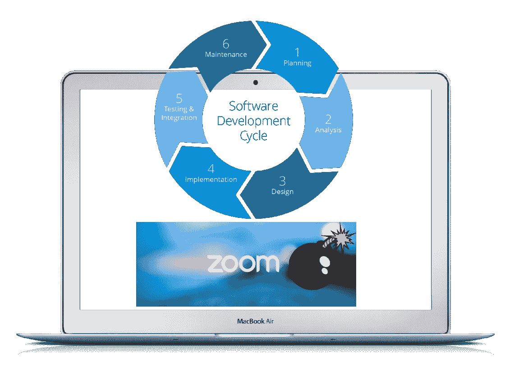

# 组织可以从 Zoom 的恢复安全计划中学到什么

> 原文：<https://blog.devgenius.io/what-organizations-can-learn-from-zooms-comeback-security-plan-9bb1ff888520?source=collection_archive---------29----------------------->

*这篇文章讲述了组织可以从 Zoom 的 90 天安全之旅中学到什么，并强调了对您的软件开发人员、软件设计人员&架构师、产品经理、项目经理、开发人员和安全团队的宝贵经验。首席执行官&首席信息安全官将学习有用的策略来更好地保护他们的组织，并了解如何将安全性作为一项功能嵌入到他们的产品中。*

自从其视频通话服务面临攻击以来，Zoom 一直处于《福布斯》上周报道所称的[【史诗般的安全之旅】](https://www.forbes.com/sites/kateoflahertyuk/2020/07/02/zoom-security-100-new-features-later-can-you-trust-zoom-yet/#4f0b84c1336e)，其中包括视频服务提供商使用的一个著名的“ZoomBombing”，在新冠肺炎疫情期间的社交距离和在家工作措施后爆炸。

CEO 埃里克·袁(Eric Yuan)后来公开承认，他们的公司应该在关注安全和隐私方面做得更多，这受到了许多公司和行业领袖的称赞，他们中的许多人站出来公开表示支持 Zoom CEO 及其安全团队。

2020 年 4 月 1 日，zoom 领导层承诺以 90 天的功能冻结来优先考虑安全和隐私，在此期间，Zoom 将专注于安全，并推出了一项将安全嵌入 Zoom DNA 的计划，但我们现在拥有的是 100 项新功能。现在，您可能想知道这 100 项新功能如何转化为安全性。让我们更深入一点，因为 zoom 在这方面做了一些漂亮的事情，所有现代组织都可以从中学习——尤其是像脸书和谷歌这样的公司。

例如，他们修改了“一键式”访问模式的加入会议流程(消费者喜欢！)转变为“等待批准”的访问模式。这种设计上的变化象征着功能如何转化为安全性，同时仍然保持访问的便捷性。

**让我们进一步回顾一下 zoom 在这 90 天里做了些什么，以及您的组织可以从中学到什么。**

**1。** Zoom 为所有付费和免费用户添加了[端到端加密](https://blog.zoom.us/end-to-end-encryption-update/)。这是 zoom security 受到严厉批评的一个方面，因为它的[误导性营销](https://theintercept.com/2020/03/31/zoom-meeting-encryption/)暗示其通信是端到端加密的，而技术上不是，因为视频会议数据和信息在技术上可以被公司内部人员访问，而不是加密的，这就是问题出现的地方。

吸取的教训:对网络安全术语“端到端加密”的滥用可能会给你带来麻烦。在展示误导性广告后，Zoom 现在向免费用户提供付费服务。

建议组织实施更好的安全控制，以防止访问客户数据，并不惜一切代价避免误导营销。

**2** 。Zoom UI 现在让[能够看到您的数据中心位置](https://blog.zoom.us/data-routing-control-is-here/)。zoom 在这方面提供的清晰性是如此可爱。当一个应用程序在竞争国家存储数据时，政府和监管机构可能会感到担忧。Zoom 支持按地理位置定制数据路由。此外，您通常的“敏捷方法”在理想情况下不会优先考虑安全性，除非它是设计的一部分，并且是领导层议程上的优先事项。

***“这里的预测是*** *地缘政治性质的问题将导致各国政府努力在万维网上划定界限。对于跨国公司的成功来说，能够证明遵守当地法律并允许控制其公民的个人/业务数据的存储位置至关重要* ***。”*** Zoom 的数据中心位置和可见性是朝着这个方向迈出的第一步。

**3** 。此外，Zoom 现在采用了安全行业中通常所说的“[左移方法](https://www.synopsys.com/blogs/software-security/shift-left-application-security-tools/)”。这意味着 zoom 已经从设计阶段开始实施业务流程安全服务，通过技术机制将安全测试贯穿于软件开发的构建、部署、测试和生产阶段。

吸取的教训:这很容易，照做就是了。没有更好的替代方案，任何希望在未来的互联网业务中取得成功的组织都必须从头开始实施安全的设计理念。

**4。Zoom 还报告了针对各种用户角色对其功能进行的全面安全审查。**

**经验教训:**公司在这里可以学到的是，“如果你创造性地思考安全性，它就是一项功能。”例如，Zoom 中的等候室功能为会议组织者角色在应用程序中增加了一层安全性和可见性。这是我最喜欢的缩放变化，因为在我看来，它代表了一些有价值的东西。这个特性将决定*好与坏*的工作分配给“实际上”拥有上下文的人——会议协调者。这个功能是你的个人 ZoomBombing 防火墙的排序。

**5。Zoom 成立了自己的 [CISO 委员会，由来自不同行业的 36 名 ciso](https://www.bleepingcomputer.com/news/security/zoom-creates-council-of-cisos-to-solve-security-privacy-issues/)组成。诸如报告用户、密码和等候室等功能源于与这些行业领导者富有成效的讨论。Zoom 还听取了这些领导人对地缘政治关键问题的建议，如数据中心的选择和加密。**

**经验教训:**虽然大多数公司可能没有足够的运气从行业领导者那里获得如此多的支持，或者可能因为各种原因负担不起 CISO 委员会的费用，但是，从 Zoom 的 CISO 委员会一起做的事情中学习，并在您的组织中实施，这是简单而免费的，这就是本文所要讲述的内容。

**6。** Zoom 与几家安全服务提供商合作，对他们的整个平台和服务进行 whitehat 安全评估。

Zoom 决定通过雇佣一名漏洞和漏洞奖励主管来加强其漏洞奖励计划——这是他们早就应该做的一项举措，但晚做总比不做好。

**经验教训**:拥有一个漏洞奖励计划并管理您的漏洞是任何公司走向成熟安全态势的最基本和必要的步骤。

**7。**Eric Yuan 的博文最重要的更新之一是承诺提交一份关于用户数据/内容/记录在何处以及如何存储和传输的透明报告。尽管这份报告被推迟了，但许多人急切地等待这份透明度报告，以证明他们对这项服务的信任，这项服务已经成为他们工作和个人生活的重要组成部分。对于 zoom 来说，以一种易于理解的方式提供这些信息以建立用户信任是至关重要的。

**吸取的教训** —赢回信任可能是一项具有挑战性的工作，如果没有适当的透明度措施，许多公司可能无法生存。一个这样的例子是——[印度禁止了抖音](https://edition.cnn.com/2020/06/30/tech/tiktok-india-ban-intl-hnk/index.html)，因为担心中国政府要求获得印度用户的数据。据 CNN 报道，[美国也在考虑禁止一些中国应用](https://www.cnn.com/2020/07/07/tech/us-tiktok-ban/index.html)

像 zoom 这样的应用可能会面临禁令，或者至少会面临用户的不信任，因为用户担心 Zoom 的呼叫可能是通过中国的数据中心进行的，或者可能是中国政府要求的。

应对这些问题的一个受欢迎的举措是提供 Zoom service 所使用的数据中心位置的可见性。这对于建立可信度和与用户建立信任大有帮助。

**8。**我在缩放更新中注意到的一些其他令人兴奋的趋势是

1.  Zoom 为管理员提供了更多的控制权，以选择谁可以访问、下载和删除会议数据，如录音。
2.  Zoom 允许管理员执行更严格的/自定义的密码规则
3.  更好的帐户管理和单个组织下多个帐户的联系人同步。

**经验教训** —允许您的管理员用户更好地控制访问机制和更安全的默认设置，这是一个双赢的局面。这种方法将所有权转移给了最终用户，而您的产品仍然带有默认的安全配置，从而消除了所有可能归咎于公司配置错误的责任。这是一个巧妙的设计技巧，可以将许多公司从灾难中拯救出来——提供“默认安全”软件。

现代公司如果想在当今竞争激烈的商业世界中取得成功，就必须尽可能认真对待安全意识和培训。安全性是全球商业组织的重中之重；然而，对大多数人来说，扩展安全性是困难的。如果您通过教育和培训让员工参与进来，保护您的组织是一项更容易扩展的工作。

**好的:**

这样做的好处是，一家公司在另一个转折点的推动下取得了辉煌的成功，它公开承认了自己的错误，并决定负责一项具体的安全改进计划。如果 zoom 没有走这条路线，你可能不会看到像等候室这样闪亮的新安全功能。Zoom 现在肯定“更安全”了。

**坏消息:**

坏消息是安全和隐私是正在进行的努力；zoom 最近的尝试只是很好的第一步，还有很长的路要走。

**丑陋:**

真相和透明度是整个磨难中丑陋的一面。

然而，Zoom 似乎是整个事件中的赢家，因为他们[宣布了新的](https://techcrunch.com/2020/07/07/zoom-announces-new-hardware-as-a-service-offering-to-run-on-servicenow/)和更深层次的整合，例如——它最近与 ServiceNow 平台的合作。

对于您的软件开发人员、软件设计人员和架构师、产品经理、项目经理、开发人员和安全团队来说，组织可以从 zoom 的旅程中获得一些有价值的经验。此外，首席执行官 Eric Yuan 的积极参与是行业领导者所需投资水平的象征。

我希望每一个花时间阅读这篇文章的人都会发现它是有用的和信息丰富的。请在下面留下你的评论