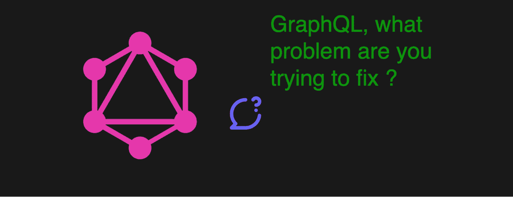
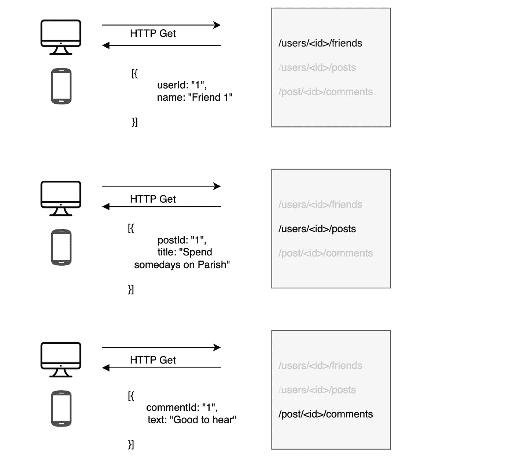
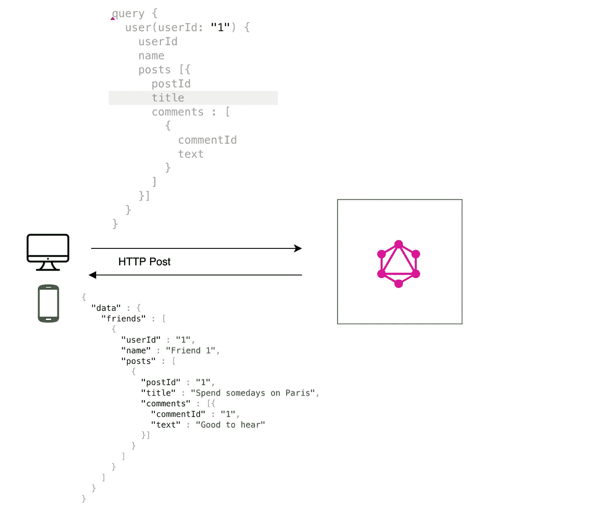

# GraphQL 在解决什么问题

> 原文：<https://blog.devgenius.io/what-problem-graphql-is-solving-74312c7bdccb?source=collection_archive---------14----------------------->

# 问题陈述

现在，days 后端 REST APIs 拥有不同类型的消费者，如网站、移动应用、物联网设备等。我们从后端 API 返回的数据量在大多数情况下对消费者来说是冗余的，如移动应用程序、物联网设备。REST API 中的问题是，我们不能为不同的消费者发送不同大小的响应，或者消费者没有权力询问他们在响应中需要什么确切的字段。

# 问题解决方案

GraphQL(由脸书开发)是一种用于 API 的查询语言。GraphQL 为 API 中的数据提供了一个完整的、可理解的描述，让客户能够准确地要求他们所需要的东西，让 API 的发展变得更加容易。

在当今的微服务世界中，frontend 试图调用不同服务的不同端点。假设我们有一个显示“你朋友的最后一篇文章”的需求。前端通常调用下面的 REST APIs 从后端获取完整的数据

*   调用 GetFriends API 来查找朋友的 userId
*   为每个朋友的 userId 调用 GetPosts API

所以前端很重。GraphQL 可以组合并发送所有调用单个端点的数据。也让我们说，明天额外的要求来了，我们需要显示“在网站上只对每个职位的评论”。GraphQL 将在同一端点上提供评论，只有网站消费者会要求评论。

在 GraphQL 中

> 我们已经在我们的 YT*“graph QL 系列”*中发布了这个，请在这里查看[。](https://www.youtube.com/watch?v=JT9YE8jkKpk)

# GraphQL 是否矫枉过正？

是的，GraphQL 对于我们没有太多数据的小应用程序来说是一个大杀器。只有当我们有更多的数据，特别是来自不同服务的数据时，GraphQL 才会大放异彩。所以选择 GraphQL 时要明智。

从 [GraphQL 官方文档](https://graphql.org/)学习 GraphQL 基础知识。

想学 GraphQL？

# 下一步是什么

我有一个愿望，创造一系列 GraphQL 的内容，当然，如果你启发我:D。请订阅和评论这样做！下面是一些关于下一步的想法

*   设计和开发一个 GraphQL 服务
*   认证和授权 GraphQL 服务
*   谈远程模式
*   文件上传 GraphQL API
*   开发一个带有模式拼接的 GraphQL 网关服务
*   部署和发布 GraphQL 模式

> *坚持学习！*