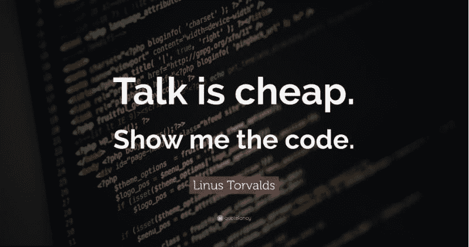

# 除了编码，程序员实际上还做什么？

> 原文：<https://blog.devgenius.io/what-programmers-actually-do-other-than-coding-f357b0364b58?source=collection_archive---------41----------------------->

每当我们听到“程序员”这个词时，我们首先想到的是一个在高档办公室工作的人，穿着帽衫疯狂地在一些奇怪的屏幕上打字，一边喝着咖啡一边听音乐。

当人们知道我们每天编写几行代码时，工作看起来很容易，尽管大部分时间都花在这些行中包含什么以及在哪里包含这些行上。

***如果程序员！= '编码'然后***

***Task = "围绕编码的一切"***

***结束若***

除了编码，程序员还会做以下事情:

*   启动会议(了解需求概况)
*   JAD 会议(与团队的联合应用程序设计会议)
*   每日状态(给出你今天做了什么和明天要做什么的每日状态)
*   回顾会议(在 15 天的冲刺中，什么做对了，什么做错了，什么需要改进)
*   创建 LLD(为需求创建底层设计，为开发人员充当圣经)
*   风险分析(识别设计中涉及的风险以及如何降低风险)
*   评估计划(给出评估并计划在 sprint 中完成的各种任务)
*   明确陈述假设(写下编码时要考虑的假设)
*   识别需求中的差距(识别在需求分析阶段出现的任何差距)
*   与在岸和离岸团队通话(与在岸/离岸团队解决各种问题和顾虑)
*   多轮代码审查(审查代码)
*   展示和讲述(向最终用户演示)
*   培训新生(帮助新生涉足软件行业)
*   咖啡时间(非常需要)
*   思考为什么代码不工作(可能是因为。, !等等。)
*   编写注释(使代码可读)
*   合并→解决冲突→提交代码
*   单元测试
*   理解代码失败的用例
*   填写时间表(钱很重要)
*   帮助队友(因为程序员是团队成员)
*   KT 会议(与团队一起召开知识传授会议，以创造公平的竞争环境并传授知识)
*   调试(对程序员来说最重要的部分)
*   邮件，邮件，更多的邮件

哼！这是程序员在工作中每天都在做的事情。

# 发布者

*原载于*[*https://www.linkedin.com*](https://www.linkedin.com/pulse/what-do-programmers-actually-office-other-than-coding-krunal-sampat/)*。*