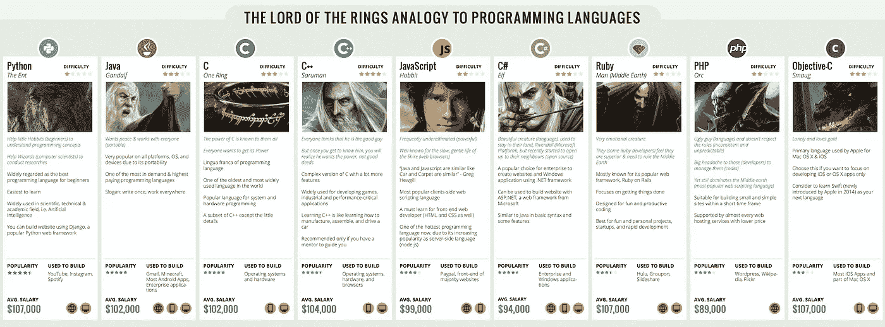

# 应该先学什么编程语言…？

> 原文：<https://blog.devgenius.io/what-programming-language-should-you-learn-first-5dfff770fc39?source=collection_archive---------4----------------------->

## 这不是你想的那样

蒂姆·莫斯霍尔德在 [Unsplash](https://unsplash.com?utm_source=medium&utm_medium=referral) 上的照片

这是一个我经常被问到的问题。应该先学哪个编程？

在这篇文章中，我将分享我的想法，为什么只有一种语言可以统治一切。

# Java Script 语言

不，这不是 JavaScript。

[许多其他作者](https://medium.com/search?q=programming%20language%20learn%20first)推荐从 JavaScript 开始，我同意这是一个极好的选择。

它一直是栈溢出最流行的语言。它在 GitHub 上接收[最多的拉请求。](https://madnight.github.io/githut/#/pull_requests/2021/2)

如果这些东西对你很重要，那么现在就停止阅读，开始学习 JavaScript。

Udemy 有一个由 Brad Traversy 设计的奇妙课程。

# 你的第一语言

我将解释为什么你的第一门编程语言应该是 c。

经 [Carl Cheo](http://carlcheo.com/) 许可使用

根据 Carl Cheo 半开玩笑的语言选择器[中的](http://carlcheo.com/wp-content/uploads/2014/12/which-programming-language-should-i-learn-first-infographic.png)，C 是统治所有语言的*一环。*

c 是用来编写操作系统和系统驱动程序的语言。

任何与音频、图像、视频或网络相关的严肃软件都有可能在技术栈的某个点上使用 C。

这就是为什么我认为 C 是一门伟大的第一语言…

## c 教你计算机如何工作

在 C 语言中，你是在没有辅助轮的情况下骑行的。在 C 语言中犯错误和破坏东西是很容易的。让你的程序崩溃是小事一桩。

这使得 C 语言成为一种很好的学习语言。c 会强迫 T21 访问原始内存和数据结构吗？是的，您可以在其他语言中做到这一点，但是它通常被抽象层保护或隐藏起来。

学习 C 语言会让你成为更好的程序员，因为你需要真正理解幕后发生的事情。

## c 很简单

尽管很难使用，但 C 语言实际上非常简单易学。与许多其他语言相比，语法和规则是最少的。

c 只有 [32 个语言关键字](https://en.wikipedia.org/wiki/C_(programming_language)#Reserved_words)和少数运算符。它不支持现代语言特性，如类、动态类型和多态。

关于学习 C 语言的[经典著作](https://www.goodreads.com/book/show/515601.The_C_Programming_Language)只有 288 页长。

这是一件好事，因为学习者可以专注于*如何实际编程*，而不是被无数的语言特性和范例分心。

## c 是编程语言的拉丁语

如果你懂 C，它给你学习其他编程语言打下了坚实的基础。

我们在 JavaScript、Swift、C#、Go 和 Rust 等语言中发现的许多常见习惯用法都可以追溯到 C。

## 时间的考验

c 语言于 1972 年首次推出，近 50 年后，它仍在强劲发展。

它和 C++一起在 PYPL 语言流行指数中排名第五，在 TIOBE 指数中排名第一。

# 最后的想法

实际上，我认为你先学什么语言并不重要。每个程序员都应该*学习不止一门语言*，往往你先学的语言并不会成为你的主要语言。

c 是最好的起点。无论你的主要语言是什么，在某个时候学习一些 C 语言都是有益的。