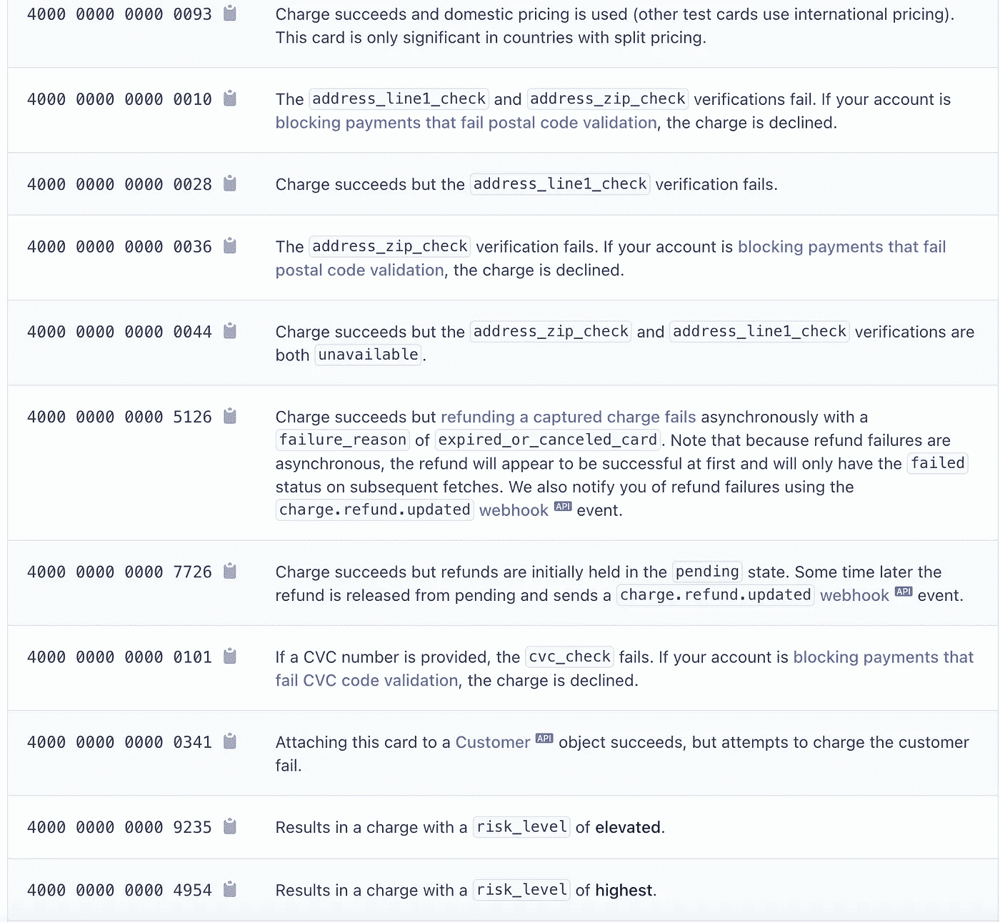

# 我可以使用哪些测试卡来测试条带集成？

> 原文：<https://blog.devgenius.io/what-test-cards-can-i-use-to-test-stripe-integration-1252f46b050f?source=collection_archive---------8----------------------->

## 如果你只用一个，你就错过了。

由[艾弗里·埃文斯](https://unsplash.com/@averye457?utm_source=medium&utm_medium=referral)在 [Unsplash](https://unsplash.com?utm_source=medium&utm_medium=referral) 上拍摄的照片

如果您从事具有支付功能的产品的软件开发，那么您很有可能不得不与 Stripe 集成进行斗争。

使用 Stripe 的测试模式，您可以使用他们预先确定的卡号来验证您的系统适用于:

*   有效付款
*   国际支付
*   无效支付-资金不足、卡号不正确、卡号正确但地址不正确等。
*   Cartes Bancaires(法国付款)
*   3D 卡片

# 重要提示:

这些卡只能在条带设置为测试模式的环境中工作。**如果在生产环境中启用了测试模式，那么任何人都可以使用条纹测试卡进行欺诈性购买。**

(如果您使用 Stripe，这可能是一个很好的机会来仔细检查您的生产环境是否已切换到测试模式。数量惊人的网站为他们的生产环境打开了测试模式。)

# Stripe 提供哪些类型的测试卡？

我要对你说实话。从现在开始，我的信息来自于 [Stripe 的文档](https://stripe.com/docs/testing#payment-intents-api)。我将在这里以一种更容易理解的方式展示这些信息，但是如果您更愿意阅读原始文档，链接就在那里。

**Stripe 将其测试卡分为以下几类:**

*   基本测试卡(14 种不同品牌的卡)
*   国际测试卡(卡适用于美洲、欧洲、中东、非洲和亚太地区)
*   监管(或 3D 安全)测试卡
*   用于测试特定响应(资金不足、PIN 错误、账单地址错误等)的卡。)
*   Cartes Bancaires 测试卡(通用法国支付方式)
*   争论
*   直接借记

大多数条纹测试卡只检查卡号。不检查邮政编码和 CVC，所以它们可以是任何值。

## 好的，这是很多信息。哪些测试卡最有用？

以下是我最常用的一些测试卡:

*   是我的有效支付卡，因为它很容易记忆。(真的，到现在都是肌肉记忆。)是 Visa 卡。
*   `5555555555554444`是我的二级有效购物卡。它和 4242 唯一的区别就是这张卡是万事达卡而不是威士卡。
*   `4000002500003155`是 3D 安全测试卡。第一次使用时需要认证，但是如果卡被保存到帐户，则不需要进一步认证。
*   `4000000000000002`将始终提供一个`card_declined`代码。
*   `4000000000000069`允许您测试过期的卡。
*   `4000000000000127`将因错误的 CVC 而失败。
*   `4000000000000036`将因邮政编码错误而失败。

# 为什么我需要比 4242 卡更多的测试卡？

“42 张牌”是一种常用的简写形式。指条纹测试卡`4242424242424242`。它可以成为开发团队的默认设置，因为它很容易记住。

但是为了确保你的财务整合工作正常，你需要知道的不仅仅是一个人是否能成功购买。

*   如果用户试图用资金不足的卡购物，您的系统会显示正确的信息吗？
*   你测试过国际支付吗？(我没有。)
*   API 错误是否得到适当的处理？
*   用户的卡过期了怎么办？

请查看下面的[条带文档](https://stripe.com/docs/testing#cards-responses)中的“测试特定响应和错误”部分。每一个不同的测试卡都应该给你一个新的测试用例。

Stripe 的测试卡文档截图。

## 你是测试呆子吗？

然后查看[软件测试管道。这是一份新的出版物，关注所有与测试相关的事情。我们目前正在寻找新的作家。](https://medium.com/software-testing-pipeline/welcome-to-the-software-testing-pipeline-baaabc0fcf82)

 [## 欢迎来到软件测试管道

### 一个新的软件测试出版物。

medium.com](https://medium.com/software-testing-pipeline/welcome-to-the-software-testing-pipeline-baaabc0fcf82) 

不是中等会员？[今天加入。](https://haleyrymel.medium.com/membership)