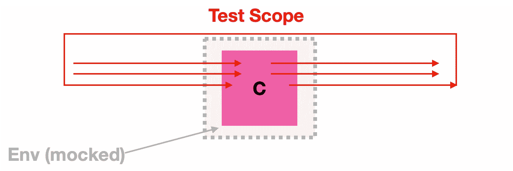

# 超越单元测试——以下是如何决定编写哪个更高级别的测试以及何时编写

> 原文：<https://blog.devgenius.io/what-test-is-this-the-language-of-tests-is-overloaded-and-it-can-be-hard-to-know-which-is-which-e2c0d86c9739?source=collection_archive---------9----------------------->

## 单元测试并不擅长检测集成单元之间的不一致性，或者检查整个系统的构建。了解使用哪种类型的高级测试以及何时使用。

作为一名建筑师，我可以和不同团队中的聪明人一起工作。但是我继续看到一个反复出现的问题，对相同的测试概念有不同的含义。当同一个词有多种含义时，会使测试周围的语言负担过重，令人困惑。

> 嘿，你为什么把 UnitTest 放在我们的组件测试文件夹里？

## 本文是帮助您在几乎任何情况下选择正确测试的指南。

一览表

请阅读下文，了解上表的详细说明。

# 我们的示例系统

让我们想象一下，我们有一个由 A、B、C 和 d 四个“东西”组成的系统。这些东西可以是微型服务，也可以是整体中的组件。

服务 A B C D

# 单元测试

**目标**

测试单个成分单元是否适合使用

单元测试图(来源:作者)

**定义特征**

*   测试方法、功能等
*   [白粉虱](https://en.wikipedia.org/wiki/White-box_testing)
*   最容易编写，运行最快，完全自动化

**ProTip**

*   测试应由行为正确的独立先知指导。使用你自己以外的真理来源，抵制“发明”测试用例。

# 集成测试

**目标**

检测集成软件单元之间的不一致性

整合测试(来源:作者)

**定义特征**

*   测试软件的组合单元作为集合
*   [黑盒](https://en.wikipedia.org/wiki/Black-box_testing)
*   聚合(在这种情况下是 B 和 C)是在现实场景中执行的
*   相对于单元测试而言，编写起来更具挑战性，不是所有事情都可以自动化

**ProTip**

*   需求指南测试

# 功能测试

**目标**

测试系统部件是否满足其预期行为。

功能测试(来源:作者)

**定义特征**

*   测试功能软件的整个切片(不同于集成测试)
*   可能与依赖项交互(不同于集成测试)
*   在现实场景中执行
*   黑盒
*   比集成测试更难写，包括大量的手动场景

**ProTip**

*   以业务需求为指导的测试

# **系统(又名 E2E)测试**

**目标**

检查系统是否符合其规格和用途

系统测试图(来源:作者)

**定义特征**

*   该系统在真实世界**现场使用**的情况下执行
*   用依赖关系测试整个集成系统
*   黑盒(系统做什么)
*   最难自动化，并且相对于其他要执行的测试，需要最多的手工工作

# 自动化分级

# 结束语:我们为什么要测试？

正如 Gerald M. Weinberg 在他的[“完美软件”](https://www.amazon.com/Perfect-Software-Other-Illusions-Testing/dp/0932633692)中写的那样——作为人类，我们不是完美的思考者。但是我们仍然需要对软件做出决定。这些决定可能会有风险。
测试可以提供信息，降低决策时的风险。

弗拉迪