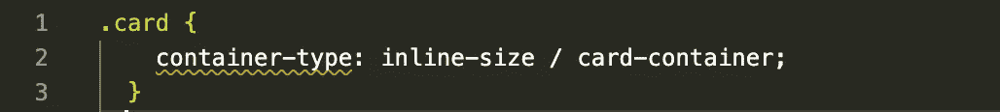

# 容器查询到底是什么？

> 原文：<https://blog.devgenius.io/what-the-heck-is-container-queries-30fcf66f6d6a?source=collection_archive---------12----------------------->

随着时间的推移，CSS 在许多方面都发生了变化。想想看，在浮动的帮助下管理内容，然后在媒体查询的帮助下以堆叠的方式显示内容，在媒体查询中，必须编写大量的 css 来管理整个页面元素，这在内容丰富时变得很麻烦。

根据视窗大小管理媒体查询，元素必须放在屏幕上。尽管如此，许多网站仍然根据其布局的视口大小(宽度/高度)来管理元素。

现在，考虑这样一种情况，在这种情况下，你不必完全依赖于视窗大小，而是可以信任你所在的父元素。把立场风格想成“相对”类比。

这就是容器查询所做的。

根据 MDN 定义，CSS 容器查询…

> **CSS 包容提供了一种方法来隔离页面的各个部分，并向浏览器声明这些部分在样式和布局方面独立于页面的其余部分。**

问:什么是 CSS 遏制？

CSS 包含通过将页面的子树(子部分)与页面的其余部分隔离开来，来提高页面性能。这样做，如果浏览器明白页面的一部分是独立的，就可以更好的优化。

它还指示元素是否应该显示所有内容，以及是否在屏幕外也显示内容。

现在让我们把注意力集中在容器查询上。

如果你正在做一个响应式设计，我们经常使用**媒体查询**来改变基于**视窗**的页面布局。我们将常见的 HTML 元素分组为可重用的组件，这些组件根据页面中的可用空间具有特定的布局。

当涉及到**容器查询**时，它允许我们查看容器大小，并根据它们的**容器**而不是视口的大小对内容应用样式。

让我们试着深入探讨细节。

基本的容器查询编写如下。

**集装箱类型**有 3 种。

1.  ***尺寸——查询将基于*** [***的内联和块***](https://developer.mozilla.org/en-US/docs/Web/CSS/CSS_Logical_Properties/Basic_concepts#block_and_inline_dimensions) ***容器的尺寸。它适用于容器的布局、样式和大小。***
2.  ***inline-size —查询将基于***[***inline***](https://developer.mozilla.org/en-US/docs/Web/CSS/CSS_Logical_Properties/Basic_concepts#block_and_inline_dimensions)***容器的尺寸。它适用于元素的布局、样式和内联大小包含。***
3.  ***正常-该元素不是任何容器大小查询的查询容器，但仍是容器样式查询的查询容器。***

通常，在大多数情况下，我们使用内嵌大小的容器类型。

***CSS 容器单位。***

1.  ***cqw —查询容器宽度的 1%。***
2.  ***cqh —查询容器高度的 1%。***
3.  ***cqi —查询容器内联大小的 1%。***
4.  ***cqb —查询容器块大小的 1%。***
5.  ***cqmin——cqi/cqb 中的较小值。***
6.  ***CQ max——cqi/cqb 中的较大值。***

在本文中，我们将关注使用容器查询和 flexbox 的响应式设计。

最初，我们将尝试使用 flexbox 的设计。

最终设计将如下。

让我们看看在上面的例子中我们在做什么。

让我们试着看看这个设计的 HTML 代码。

我们有一个容器类型为“inline-size”的 card 类和一个将应用 css 设计的容器名。

让我们看看如何基于容器大小而不是视口来改变主容器的方向。

主容器的默认 css 如下。

现在，让我们看看如果使用容器查询，我们如何改变方向。

继续，现在让我们看看放在卡片容器中的内容。

这是我们卡片内容样式的默认 css。随着本文的深入，在容器查询的帮助下，这种情况将会改变。

在此之前，让我们看看卡容器是什么样子的。如果你熟悉 flexbox，这是有意义的。

默认情况下，we 以 0.5 雷姆的间隔堆叠一个在另一个下面的元素；

这是我们的卡看起来像上面的容器 css。

现在，如果我们看到卡片内容“Lorem Ipsum”描述和“你喜欢吗？”按钮在水平方向(x 轴)。

现在，让我们尝试使用容器查询来适应这个内容显示。

如果屏幕尺寸小于 850px，这就是卡片式的朝向。

假设，如果页面上有多个 HMTL 元素，我们仍然可以关注页面的特定部分，并根据卡片容器改变方向。这是容器查询最好的部分。我们并不关心整个页面。

这也是事实，在一个普通的 HTML 页面上，并不是每个部分都是必需的，我们可以专注于页面的特定部分。

我希望，现在它是有意义的，你如何利用容器查询和使用它。

**注意:容器查询的用例可以用于元素的任何定位。**

***容器的回退查询。***

*如果浏览器还不支持容器查询，可以使用* `[*grid*](https://developer.mozilla.org/en-US/docs/Web/CSS/grid)` *和* `[*flex*](https://developer.mozilla.org/en-US/docs/Web/CSS/flex)` *为该页面使用的卡片组件创建类似的效果。下面的例子使用一个* `[*grid-template-columns*](https://developer.mozilla.org/en-US/docs/Web/CSS/grid-template-columns)` *声明为卡片组件创建一个两列布局。*

最后，附上链接来玩玩。

[https://codesandbox.io/s/sweet-fog-vojyrn](https://codesandbox.io/s/sweet-fog-vojyrn)

我希望，你喜欢读这篇文章。

请关注我的相关文章，它可能会对您的 web 开发之旅有所帮助。